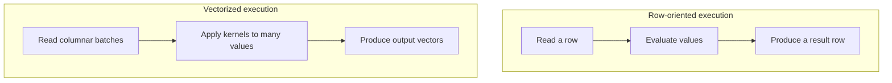
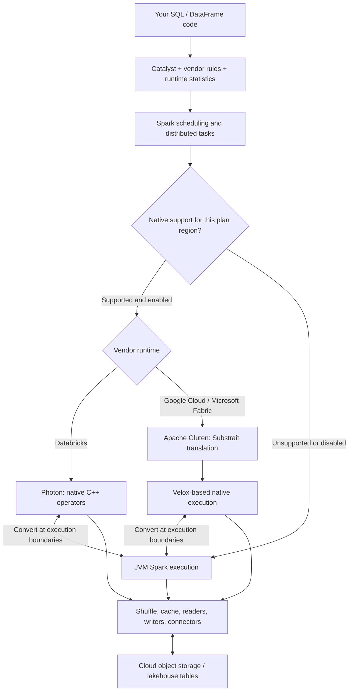

## Spark’s Limitations and How Vendors Fix Them

You download Apache Spark from the official website, run a job, and discover that it does not perform like Spark on Databricks, Google Cloud, or Microsoft Fabric.

Do not get me wrong.

Open-source Spark is a robust distributed processing framework. The difference is that cloud vendors do not simply install Spark on a cluster and expose it to users. They add optimized runtimes, native execution engines, smarter query optimizers, faster storage connectors, caching layers, automatic tuning, and years of production engineering.

In other words, the API may still look like Spark, but the machinery underneath can be substantially different.

This article explains Spark’s performance ceiling, what vendors place on top of it, and when those optimizations actually help.

> **Note:** This article is not sponsored by or affiliated with any organization. Vendor benchmark results are included to explain architecture, not to declare a universal winner.

## JVM

Spark’s driver and executors run as JVM processes. That decision gave Spark one of its greatest advantages: portability.

Java and Scala source code is normally compiled into JVM bytecode rather than directly into the machine code of one CPU and operating-system combination. A JVM implementation for each platform can then load the same bytecode and execute it.

At runtime, frequently executed code becomes *hot*. The Just-In-Time compiler, or JIT, compiles that hot bytecode into native machine code and can optimize it using runtime information. This means JVM execution is not simply an interpreter translating every instruction forever.

The JVM also manages memory automatically. Conceptually, a thread’s stack contains method frames, local state, and references, while objects are generally allocated on the heap. The real implementation is more nuanced because JIT optimizations such as escape analysis may eliminate allocations or keep values outside the heap.

When objects are no longer reachable, the garbage collector reclaims their memory. This protects developers from many manual-memory-management bugs, but garbage collection consumes CPU and can introduce pauses.

Spark’s documentation highlights the cost of object-heavy processing. Java objects can consume 2–5 times the space of their raw fields because of object headers, references, boxed primitives, strings, and collection wrappers. It also notes that garbage-collection cost grows primarily with the number of Java objects, not just the number of bytes in the heap.[^1]

For data processing, that distinction matters. A partition containing millions of tiny records may become millions of heap objects. The executor must allocate them, follow pointers through them, and eventually trace and collect them.

> This resembles automatic memory management in Python only at a high level. CPython mainly uses reference counting plus a cyclic collector, whereas modern JVMs use tracing collectors with different generations, barriers, and pause/concurrency strategies.

## Spark Already Fights Back

It would be misleading to say that open-source Spark naively represents every SQL value as a normal Java object. Spark has spent years reducing that overhead.

Project Tungsten introduced explicit memory management, compact binary processing, cache-aware algorithms, and code generation. Its goal was to avoid the JVM object model where possible and move Spark closer to the hardware.[^2][^3]

For DataFrame and SQL workloads, Spark can use compact internal representations such as `UnsafeRow` instead of creating a regular Java object for every value. Whole-stage code generation fuses compatible operators and generates specialized Java code, reducing virtual calls and allowing intermediate values to remain in CPU registers.[^4]

Spark SQL also provides:

- Columnar in-memory caching with automatic compression
- Vectorized readers for columnar data
- Predicate and column pruning
- Cost-based optimization
- Adaptive Query Execution, which can coalesce shuffle partitions, handle skew, and change join strategies using runtime statistics[^5][^6]

These optimizations are important. They are also evidence of the underlying problem: high-performance analytical execution often requires bypassing ordinary JVM objects and taking tighter control of memory and CPU behavior.

## Where the Ceiling Appears

Spark’s default SQL engine commonly relies on whole-stage Java code generation. When it works well, the generated loop can be extremely fast. However, the approach has trade-offs.

First, JIT compilation adds warm-up cost. A short query may finish before the JVM has collected enough information to compile and optimize all important paths.

Second, generated methods and the JIT code cache have limits. Databricks reported production performance cliffs on wide queries when generated Java became too large and execution had to fall back to a slower path.[^7]

Third, low-level behavior is not fully under the engine developer’s control. The JIT ultimately decides how code is compiled, while SIMD generation, memory allocation, cache behavior, and spilling can be harder to predict than in a purpose-built native engine.[^7]

Fourth, row-oriented processing can waste modern CPUs. A processor may fetch one row, follow references, evaluate one value, and repeat. That pattern makes poor use of cache lines and gives the CPU fewer opportunities to apply the same instruction to many values.

Finally, Spark is much more than its inner SQL loop. Query planning, scheduling, shuffle, serialization, cloud-object-store access, file metadata, small files, skew, and cluster startup can all dominate runtime. Replacing an execution loop does not magically remove every bottleneck.

The real vendor strategy is therefore not simply “rewrite Spark in C++.” It is to retain Spark’s APIs, optimizer, scheduler, and ecosystem while replacing or optimizing selected layers beneath them.

## Vectorized Native Execution

The central idea behind Photon, Google’s Native Query Execution, and Microsoft Fabric’s Native Execution Engine is **vectorized native execution**.

The following conceptual comparison shows the unit of work. Spark's code-generated loops can fuse operators; the row path does not necessarily make a separate function call for every step.



This design provides several advantages.

### Columnar memory

Values from the same column are placed close together in memory. When a query needs only three columns from a 100-column table, the engine can avoid materializing the other 97. Sequential access also works better with CPU caches and hardware prefetching.

Columnar memory matches formats such as Parquet, so an engine can reduce expensive column-to-row conversions. It also enables dictionary encoding and other compact representations, especially for repeated strings.[^7]

### SIMD

SIMD means *Single Instruction, Multiple Data*. A CPU instruction can perform the same operation on several values at once rather than processing each value separately.

Vectorization does not guarantee SIMD, but batches and tight native loops give the compiler—or a hand-written kernel—a much better opportunity to use it. Velox describes its columnar vectorized layout as a way to improve cache locality, expose instruction-level parallelism, and enable SIMD.[^8]

### Fewer calls

A vectorized function call processes hundreds or thousands of values, so function-dispatch overhead is amortized across the batch. The engine can preserve operator boundaries for observability without paying a function-call cost for every row.

### Explicit memory control

Native engines commonly allocate reusable buffers, operate on off-heap memory, and track large allocations directly. This reduces the population of short-lived JVM objects and therefore the work given to the garbage collector.

Native memory is not free or automatically safe. The engine must prevent leaks, fragmentation, invalid pointers, and out-of-memory failures itself. Better control comes with greater implementation complexity.

## Databricks Photon

Photon is Databricks’ native, vectorized execution engine. Catalyst still analyzes and optimizes the query, but supported physical operators execute in a C++ runtime using columnar batches. Unsupported work can fall back to the JVM-based Spark engine.[^9]

Photon did not replace the entire Spark architecture. It is embedded in Databricks Runtime and executes within Spark tasks. The original technical description explains that Spark and Photon communicate through JNI and exchange pointers to off-heap data, while Photon coordinates with Spark’s memory manager and spilling behavior.[^10][^7]

Databricks chose interpreted vectorization rather than copying Spark’s whole-stage code-generation model into C++. That sounds counterintuitive: why interpret when compiled code can be faster?

The Photon team reported several practical reasons:

- Vectorized operators were easier to develop, debug, profile, and operate
- Operator boundaries made per-operator metrics easier to collect
- Runtime dispatch made it easier to select specialized kernels based on each batch’s properties
- C++ gave direct control over memory and SIMD behavior
- Specialized native kernels could narrow the gap in cases where generated code had an advantage[^7]

Photon stores columns contiguously and processes bounded batches to improve cache locality. Its low-level kernels handle expressions, serialization, runtime statistics, and vectorized hash-table operations. Transient vectors use reusable buffer pools, while persistent structures for joins and aggregations are tracked separately.[^7]

Photon is only one part of the performance story. Databricks also applies optimizer enhancements, a local caching layer, optimized Parquet and Delta I/O, columnar shuffle, data skipping, and storage-layout techniques. The original Photon launch described the system as three broad layers: query optimization, caching between execution and cloud storage, and the native engine.[^11]

That is why comparing “Photon versus Spark” is not always a controlled engine comparison. A Databricks workload may benefit from improvements above and below Photon at the same time.

## Google Lightning Engine

Google Cloud’s Lightning Engine follows a multi-layer approach. It combines query and execution optimizations with caching, cloud-storage I/O improvements, metadata handling, and optimized connectors.[^12][^13]

Its optional Native Query Execution component is based on Apache Gluten and Velox. Gluten acts as the bridge: it checks whether Spark physical-plan operators can execute natively, translates supported parts into a Substrait plan, and sends that plan to the native backend. Velox then performs the C++ vectorized execution.[^14][^15]

Google also adds its own engineering around the open-source components, including hardware-specific optimization, unified memory behavior, broader operator and type coverage, and decisions about when to push work into the native path.[^12]

Lightning Engine therefore optimizes more than CPU instructions. If a job spends much of its time listing files, fetching metadata, reading cloud storage, or shuffling data, improvements in those layers may matter as much as native execution.

Google describes the strongest use case as compute-intensive DataFrame, Dataset, and Spark SQL work over columnar formats. It does not recommend native execution for jobs dominated by RDDs, UDFs, most Spark ML libraries, or storage latency.[^16]

## Microsoft Fabric

Microsoft Fabric’s Native Execution Engine has a similar open-source foundation: Apache Gluten plus Velox. Supported Spark operators are offloaded from the JVM into a columnar, SIMD-accelerated C++ path, while Spark continues to provide the surrounding APIs and distributed framework.[^17]

Fabric keeps optimizations such as Adaptive Query Execution, cost-based rewrites, column pruning, and predicate pushdown active around the native engine. It also integrates the execution path with Delta features and Fabric’s lakehouse infrastructure.[^17]

From a user’s perspective, this can look almost too easy:

```python
spark.conf.set("spark.native.enabled", "true")
```

The difficult work sits beneath that switch: plan validation, Substrait translation, native execution, memory coordination, metrics, format compatibility, and graceful fallback.

In the Spark UI, Fabric marks native operators with names such as `Transformer`, `NativeFileScan`, or `VeloxColumnarToRowExec`. The last name reveals an important cost: whenever the plan moves between native columnar execution and Spark’s row path, data may need to be converted.[^18]

Fabric has expanded native support to Python and Scala UDF scenarios, but its documentation still notes fallback cases, including libraries that require arbitrary Python-object serialization and some deeply nested complex types.[^19]

## Same API, Different Engine

The three offerings share a broad architectural pattern, but they are not the same implementation.

| Layer | Databricks | Google Cloud | Microsoft Fabric |
|---|---|---|---|
| Spark-facing interface | Spark SQL and DataFrame APIs | Spark SQL, DataFrame and Dataset workloads | Spark APIs in Fabric runtimes |
| Native engine | Photon | Velox-based Native Query Execution | Velox-based Native Execution Engine |
| Integration | Proprietary C++ operators inside Databricks Runtime | Apache Gluten bridge plus Google optimizations | Apache Gluten bridge plus Fabric optimizations |
| Plan handling | Catalyst plans; supported parts become Photon operators | Supported Spark plans are translated for native execution | Supported Spark plans are translated for native execution |
| Fallback | Unsupported operations return to Spark | Unsupported or unsuitable work returns to standard execution | Unsupported operators return to JVM Spark |
| Broader sauce | Optimizer, caching, Delta/Parquet I/O, shuffle, runtime engineering | Optimizer, cache, connectors, metadata and storage I/O | AQE/CBO integration, OneLake/Delta integration, Fabric runtime tuning |

Photon is a Databricks-built engine with a design tailored to Databricks Runtime. Google and Microsoft use a shared architectural family built around Gluten and Velox, then differentiate through integration, coverage, cloud infrastructure, and vendor-specific optimization.[^17][^12][^7]

This is also why the phrase “Microsoft Spark” or “Google Spark” should be read as a managed and extended Spark runtime—not a separate fork that discards Spark entirely.

## Hybrid Execution

No native accelerator supports every Spark feature. Spark has a vast surface area: SQL expressions, DataFrame operators, RDDs, Datasets, UDFs, streaming, machine-learning libraries, custom data sources, and unusual data types.

Vendors therefore use hybrid execution:

1. Spark parses and optimizes the query.
2. The runtime identifies supported plan regions.
3. Supported regions run in the native engine.
4. Unsupported regions fall back to Spark.
5. Data is converted at the boundary when required.

Fallback preserves compatibility, but it can reduce or erase the speedup. A plan that repeatedly moves between row and columnar formats may pay conversion costs several times.

Databricks documents that Photon does not accelerate RDD APIs or Dataset APIs, and unsupported operations or UDFs can fall back to Spark. It also notes that very short queries are unlikely to benefit.[^20]

Google similarly warns that some modes, data types, and functions can trigger fallback or incompatibility, and that native execution is a poor match for RDD-, UDF-, ML-, or I/O-heavy workloads.[^21][^22]

“Zero code changes” therefore means that existing code can still run and supported regions may be accelerated. It does not mean that every line executes natively or that every workload becomes faster.

## Benchmarks Need Context

Vendor benchmark numbers answer a narrow question: how did a specific runtime perform on a specific dataset, cluster, configuration, engine version, and query suite?

They do not answer: how fast will your pipeline be?

Databricks reports large Photon gains on supported analytical workloads, while its Photon paper also states that I/O-bound and network-bound queries see less benefit. The paper’s experiments range from isolated single-thread microbenchmarks to large distributed TPC workloads, so the numbers describe different layers and should not be mixed casually.[^7]

Google reports up to 4.9 times faster performance than standard open-source Spark for Lightning Engine,[^24] and Microsoft reports up to 6 times faster in a representative TPC-DS configuration in current Fabric runtime material.[^23] These are vendor-published results, not universal constants.

A fair test should hold constant:

- Dataset and file layout
- Data format and compression
- Instance family, CPU architecture, memory, and local disk
- Cluster size and autoscaling policy
- Warm versus cold cache
- Runtime and connector versions
- Query correctness and output
- End-to-end cost, not only elapsed time
- Native coverage and fallback operators

Price-performance is especially important. A native runtime may use a more expensive compute tier but still cost less if the job finishes much sooner. It may also be faster but cost more. Only an end-to-end workload test can settle that trade-off.

## When Vendors Win

Native vendor runtimes tend to provide the greatest benefit when the workload has these characteristics:

- Large scans over Parquet, Delta, Iceberg, or another supported columnar format
- CPU-heavy joins, aggregations, sorts, window functions, and expressions
- SQL or DataFrame code built from standard functions
- Repeated access that benefits from caching
- Enough runtime for acceleration to outweigh startup and conversion overhead
- Storage layout that enables pruning and data skipping

They tend to help less when the workload is dominated by:

- Custom RDD transformations
- Unsupported Python, Scala, or Java UDFs
- Stateful or unsupported streaming paths
- Spark ML algorithms outside the native SQL path
- Tiny queries and small datasets
- Slow remote I/O, API calls, or external systems
- Severe skew, excessive small files, or poor partitioning that remains unfixed

A native engine makes supported computation faster. It cannot compensate for reading millions of unnecessary files, joining on badly skewed keys, or calling a remote API once per row.

## What Open Source Can Do

Open-source Spark is not condemned to be slow. Before switching platforms, many workloads can improve substantially through basic engineering.

### Stay in the optimized API

Prefer Spark SQL and DataFrame expressions over RDDs and row-wise UDFs. Built-in expressions expose semantics to Catalyst and make code generation, pushdown, column pruning, and native offload possible.

Use Pandas UDFs only when a built-in expression cannot express the logic. Arrow-based batches reduce Python/JVM transfer overhead, but they still introduce another runtime boundary.

### Fix data layout

Use columnar formats, compact small files, select only required columns, filter early, and partition or cluster around real access patterns. These changes reduce work for every engine.

### Let AQE work

Adaptive Query Execution is enabled by default in modern Spark. It can coalesce shuffle partitions and revise join choices using runtime statistics. Examine the final adaptive plan rather than assuming the initial plan is what ran.[^5]

### Control object overhead

For object-heavy RDD workloads, Spark recommends compact data structures, primitive arrays, numeric IDs instead of string keys where possible, Kryo serialization, and serialized persistence. Serialized caching creates roughly one byte-array object per partition instead of a graph of individual record objects, reducing GC work.[^25][^1]

### Measure before tuning GC

Do not begin with random JVM flags. Inspect Spark UI metrics, executor logs, spill, task duration, skew, input size, shuffle read/write, peak memory, and GC time. A full GC occurring repeatedly inside a task can indicate insufficient execution memory, but many “GC problems” are actually excess object creation or oversized partitions.[^1]

### Add a native accelerator

The native approach is no longer exclusive to commercial vendors.

Apache Gluten can offload Spark SQL execution to engines such as Velox or ClickHouse while preserving DataFrame and SQL code. It offers an end-to-end columnar pipeline and exposes native metrics through Spark UI.[^15]

Apache DataFusion Comet is another drop-in accelerator. It translates supported Spark physical plans to the Rust-based DataFusion engine and keeps operators, expressions, shuffle, and broadcast in Arrow columnar format where supported.[^26][^27]

These projects reduce the gap, but production adoption still requires compatibility testing, packaging, observability, memory sizing, fallback analysis, and operational ownership. A managed vendor charges partly for doing that integration work continuously.

## The Real Secret Sauce

The vendor advantage is not one secret optimization. It is a stack of optimizations that reinforce one another:



This is a conceptual execution stack, not a literal data-flow plan. The vendor branches are alternatives. A single query can mix native and JVM regions, and conversion is needed only when their data representations differ. Shuffle and I/O happen throughout execution; format and operator support depend on the selected runtime.[^9][^13][^17]

Making a filter twice as fast is useful. Avoiding the file entirely is better. Reading only one column is better than decoding ten. Choosing a hash join instead of sorting both sides may matter more than either. Keeping the next query’s hot data on local SSD can dominate all of those gains.

Managed runtimes coordinate these decisions across the entire path. That is the actual moat: not merely C++, but integration.

## Conclusion

Apache Spark remains the control plane and compatibility layer for many of these systems. It provides familiar APIs, distributed scheduling, fault tolerance, an optimizer, and a huge ecosystem.

The vendors keep that surface and replace the hottest parts underneath.

Databricks built Photon, a purpose-built C++ vectorized engine integrated with Databricks Runtime. Google Lightning Engine combines multi-layer cloud optimizations with a Gluten/Velox native path. Microsoft Fabric also uses Gluten and Velox, integrated with its Spark runtime and lakehouse platform.[^9][^12][^17]

So the title is directionally correct, but the precise lesson is more useful:

> A default Spark installation will rarely match a mature vendor runtime out of the box. The gap comes from native execution, smarter planning, optimized I/O, storage layout, caching, automatic tuning, and operational engineering—not from Spark being fundamentally broken.

And the gap is not permanent. Tungsten already taught Spark how to escape many JVM-object costs. Gluten, Velox, and DataFusion Comet are bringing native acceleration into the open-source ecosystem. The future is likely not “Spark or native.” It is Spark’s ecosystem and APIs orchestrating an increasing amount of native, columnar execution.[^3][^26][^15]

---

## References

[^1]: [Tuning - Apache Spark Documentation](https://spark.apache.org/docs/latest/tuning.html)

[^2]: [What is Tungsten?](https://www.databricks.com/blog/what-is-tungsten)

[^3]: [Project Tungsten: Bringing Apache Spark Closer to Bare ...](https://www.databricks.com/blog/2015/04/28/project-tungsten-bringing-spark-closer-to-bare-metal.html)

[^4]: [Analyzing and Optimizing Java Code Generation for Apache Spark (PDF)](https://research.spec.org/icpe_proceedings/2019/proceedings/p91.pdf)

[^5]: [Performance Tuning - Apache Spark Documentation](https://spark.apache.org/docs/latest/sql-performance-tuning.html)

[^6]: [Configuration - Apache Spark Documentation](https://spark.apache.org/docs/latest/configuration.html)

[^7]: [Photon: A Fast Query Engine for Lakehouse Systems (PDF)](https://www.databricks.com/de/wp-content/uploads/2022/07/Photon-A-Fast-Query-Engine-for-Lakehouse-Systems.pdf)

[^8]: [Blog | Velox](https://velox-lib.io/blog/page/2/)

[^9]: [What is Photon? | Databricks on AWS](https://docs.databricks.com/aws/en/compute/photon)

[^10]: [Photon Query Engine Preview on Databricks](https://www.databricks.com/blog/2021/06/17/announcing-photon-public-preview-the-next-generation-query-engine-on-the-databricks-lakehouse-platform.html)

[^11]: [Introducing Photon Engine for Delta Lake](https://www.databricks.com/blog/2020/06/24/introducing-photon-engine.html)

[^12]: [Introducing Lightning Engine for Apache Spark - Google Cloud](https://cloud.google.com/blog/products/data-analytics/introducing-lightning-engine-for-apache-spark)

[^13]: [Use Lightning Engine | Google Cloud Documentation](https://docs.cloud.google.com/managed-spark/docs/guides/lightning-engine)

[^14]: [HowTo - Apache Gluten](https://gluten.apache.org/docs/v1.4.0/developers/HowTo.html)

[^15]: [Apache Gluten: Home](https://gluten.apache.org/)

[^16]: [Accelerate Spark batch workloads and sessions with Lightning Engine | Managed Service for Apache Spark | Google Cloud Documentation](https://docs.cloud.google.com/dataproc-serverless/docs/guides/lightning-engine)

[^17]: [Native execution engine for Fabric Data Engineering](https://learn.microsoft.com/en-us/fabric/data-engineering/native-execution-engine-overview)

[^18]: [Spark monitoring and performance optimization best practices | Microsoft Fabric](https://learn.microsoft.com/en-us/fabric/data-engineering/spark-monitoring-best-practices)

[^19]: [Python UDFs, Scala UDFs, and complex data types in native execution | Microsoft Fabric](https://learn.microsoft.com/en-us/fabric/data-engineering/native-execution-engine-udf-complex-types)

[^20]: [What is Photon? | Databricks on AWS](https://docs.databricks.com/aws/en/compute/photon)

[^21]: [Use Lightning Engine | Google Cloud Documentation](https://docs.cloud.google.com/managed-spark/docs/guides/lightning-engine)

[^22]: [Accelerate Spark batch workloads and sessions with Lightning Engine](https://docs.cloud.google.com/managed-spark/docs/guides/lightning-engine-serverless)

[^23]: [Apache Spark runtime in Fabric](https://learn.microsoft.com/en-us/fabric/data-engineering/runtime)

[^24]: [Lighting Engine for Apache Spark performance deep dive](https://cloud.google.com/blog/products/data-analytics/lighting-engine-for-apache-spark-performance-deep-dive)

[^25]: [RDD Programming Guide - Apache Spark Documentation](https://spark.apache.org/docs/latest/rdd-programming-guide.html)

[^26]: [Apache DataFusion Comet](https://datafusion.apache.org/comet/index.html)

[^27]: [Apache DataFusion Comet Spark Accelerator](https://github.com/apache/datafusion-comet)
