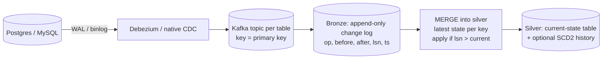

# Senior Deep Dive: Advanced Data Pipeline Architecture

> Architecture rounds reward candidates who can **choose between options and defend the choice** under constraints (latency, cost, consistency, team skills, compliance). Every answer here gives you a default, the alternatives, and the conditions that change the decision.

Tags: **[senior]** = expected at senior level · **[staff]** = expected at staff/principal level.

## Framing

[senior] How do you approach an open-ended "design our data platform" question?

**Headline:** start from **use cases and constraints**, not tools. Then design the flow layer by layer and call out the hard parts.

1. **Clarify consumers and use cases:** BI dashboards, finance reporting, ML features, product analytics, operational/real-time use, data sharing. Each has different freshness, correctness and access needs.
2. **Quantify:** sources (count, type), volume and growth, peak rates, freshness SLAs, retention, users, regulatory constraints (GDPR, SOX, residency).
3. **Sketch the layers:**
   - ingestion (batch connectors, CDC, events);
   - storage (lakehouse/warehouse, raw → curated);
   - processing (batch, streaming);
   - serving (BI warehouse, OLAP, KV/feature store, search, APIs);
   - governance (catalog, access, lineage, quality);
   - orchestration and observability.
4. **Pick defaults, justify them, and name alternatives:** "lakehouse on Delta with Unity Catalog because ML and BI share data; a warehouse-only design would be fine if it were BI-only and SQL-only".
5. **Deep-dive the risky parts:** CDC correctness, late data, hot keys, PII deletion, cost.
6. **Operate it:** SLOs, on-call, CI/CD, cost controls, ownership model (central vs domain teams).

Close with the evolution path: what you'd build first (thin slice, end to end), and what you'd defer.

[senior] Lakehouse, warehouse, or both? When does each win?

**Headline:** the deciding factors are **workload mix, data types, openness and team skills**, not hype.

| Choose | When |
|---|---|
| **Cloud warehouse** (Snowflake, BigQuery, Redshift) | Predominantly SQL/BI workloads, structured data, small platform team, strong preference for managed simplicity |
| **Lakehouse** (Delta/Iceberg on object storage + Spark/SQL engines) | Mixed BI + ML/AI + streaming, semi-structured/unstructured data, very large volumes where open storage cost matters, need for multiple engines on one copy, avoiding lock-in |
| **Both** | Existing warehouse for BI with a lake for raw/ML data. Increasingly unified via open table formats (warehouses reading Iceberg/Delta) to avoid copying data between them |

**Converging reality:** warehouses now read and write open table formats, and lakehouses offer warehouse-grade SQL (serverless SQL warehouses, Photon, caching). The real architectural question is **where the authoritative copy lives and which catalog governs it**. Copying data between a lake and a warehouse doubles cost, governance work and consistency problems.

## Ingestion and streaming

[senior] Design CDC from an OLTP database into a lakehouse, end to end. What are the hard parts?

**Headline:** **log-based CDC → durable log → bronze change table → MERGE into silver**, with careful handling of the initial snapshot, ordering, deletes, schema changes and replay.

**Hard parts and how to handle them:**
1. **Initial snapshot + stream handoff:** take a consistent snapshot, then stream changes from the snapshot's log position (Debezium does this with snapshot modes; incremental snapshots avoid long locks). Overlap is fine if MERGE is version-aware.
2. **Ordering:** Kafka key = primary key, so all changes to a row are in one partition and in order. Still apply changes **by log position** (`lsn`/`scn`), never by arrival time, so replays and reordering converge.
3. **Deletes:** apply delete events (tombstones) as `DELETE` or SCD2 close-outs; compaction must not drop the delete before consumers see it.
4. **Schema changes:** a schema registry plus a bronze table with schema evolution; silver changes are deliberate.
5. **Source impact and retention:** replication slots (Postgres) retain WAL if the connector stops, which can fill the primary's disk. Monitor slot lag and alert. Binlog retention must exceed the worst outage.
6. **Transactions spanning tables:** CDC emits per-table events. If consumers need transactional consistency across tables, use transaction metadata (Debezium transaction topic) or accept eventual consistency.
7. **Replay:** bronze keeps the full change log so silver can be rebuilt; change feeds downstream (Delta CDF) propagate increments further.
8. **Throughput:** batch MERGE per micro-batch (dedupe to the latest change per key within the batch first), and cluster the silver table on the key to keep MERGE fast.

[senior] How do you enrich or join streams in real time? Compare the options.

**Headline:** pick the join style by **how fast the reference data changes and how big it is**.

| Pattern | How | Good for | Watch out |
|---|---|---|---|
| **Stream–static join** | Join the stream with a table loaded at start (or periodically refreshed) | Small, slowly changing reference data (country codes) | Staleness until refresh |
| **Lookup join with cache** | For each event, look up a KV store/DB (async I/O), with a local cache | Large reference data with point lookups | Latency, external load, cache consistency |
| **Broadcast state** (Flink) | Reference updates broadcast to all tasks, kept in state | Small, frequently changing rules/configs | State size per task |
| **Stream–table (temporal) join** | The reference table is itself a changelog stream (CDC) materialised in state; join on key **as of event time** | Enrichment that must be correct at event time (price at time of order) | State size; needs watermarks and versioned state |
| **Stream–stream join** | Both sides are event streams, joined within a time bound (`ad_click.ts BETWEEN impression.ts AND impression.ts + 1h`) | Correlating events (impression ↔ click, order ↔ payment) | Unbounded state unless both sides have watermarks and time bounds |

**Senior points:** always bound state (watermarks, time-bounded conditions, TTL); decide outer-join semantics (emit unmatched after the timeout); and prefer **event-time-correct** enrichment (temporal joins) when the result is used for money or audits.

[staff] Event notification vs event-carried state transfer vs event sourcing vs CDC: when do you use each?

**Headline:** these are different contracts between producers and consumers. Choose by **who owns the truth and what consumers need**.

- **Event notification** ("order 123 changed"): tiny events, consumers call back for details. Low coupling on payload, but load on the source and race conditions (the state may have changed again by the time they call).
- **Event-carried state transfer** (the event includes the full new state): consumers keep local copies without calling back. Larger events, but decoupled and replayable. Good default for analytics.
- **Domain events** ("OrderPlaced", "PaymentCaptured"): business-meaningful facts designed by the producing team, with explicit semantics. Best for analytics *and* integration, but requires producer investment.
- **Event sourcing:** the event log **is** the source of truth; state is derived by replay. Powerful for audit and temporal queries, but complex (schema evolution of old events, snapshots, rebuilds).
- **CDC:** row-level changes derived from the database log. No producer code changes, captures everything, but exposes internal table structure (tight coupling to the schema) and lacks business intent.

**Typical recommendation:** CDC to bootstrap analytics quickly; move high-value domains to **published domain events / outbox** with contracts, so internal schema refactors don't break consumers.

## Serving and consumption

[senior] How do you choose the serving layer for different consumers?

**Headline:** match the store to the **query pattern, latency and concurrency**. The lakehouse is the system of record, not the answer to every query.

| Consumer need | Serving choice |
|---|---|
| Analyst SQL, BI dashboards (seconds, tens of concurrent users) | SQL warehouse over gold tables, aggregate tables, BI extracts/caching |
| User-facing analytics (sub-second, thousands of QPS, fresh data) | Real-time OLAP (Pinot, Druid, ClickHouse) ingesting from Kafka + batch backfills |
| Point lookups by key (profiles, features) | KV store (DynamoDB, Redis, Cassandra) / online feature store |
| Text and faceted search | Elasticsearch/OpenSearch |
| Semantic retrieval for LLMs | Vector index (Databricks Vector Search, pgvector, dedicated vector DBs) |
| Data sharing with partners | Delta Sharing / secure shares, governed views |
| APIs for applications | A service backed by an appropriate store, never direct warehouse queries from production apps |

**Patterns:** materialise per-consumer serving tables from gold; keep serving stores **rebuildable** from the lakehouse; monitor freshness from source to serving store; and use push (stream to the store) for low latency or pull (scheduled export) otherwise.

[senior] Where does a semantic (metrics) layer fit, and why do teams adopt one?

**Headline:** a semantic layer defines **business metrics and dimensions once** (revenue, active users, churn) and serves them consistently to every tool, so "revenue" means the same thing in every dashboard, notebook and AI assistant.

- **Position:** between gold tables and consumers (BI tools, notebooks, APIs, LLM agents). Examples: dbt Semantic Layer/MetricFlow, Cube, LookML, Databricks metric views, AtScale.
- **What it holds:** metric definitions (measure + filters + time grain), dimensions and joins, access rules, caching/pre-aggregation hints.
- **Benefits:** consistency, governance (a single place to certify metrics), faster dashboard building, and grounding for natural-language/LLM querying (the agent queries defined metrics instead of guessing SQL).
- **Costs:** another layer to own; tool integration varies; complex metrics (cohorts, attribution) may still need modelled tables.
- **Relationship to modelling:** it doesn't replace good dimensional models. It sits on top of them.

[senior] What is reverse ETL and how do you architect operational analytics safely?

**Headline:** reverse ETL syncs modelled warehouse/lakehouse data **back into operational tools** (CRM, marketing, support, ads), so business teams act on analytics.

**Architecture:** gold "activation" tables with an explicit contract (one row per entity, defined columns) → a sync tool or custom job (Hightouch/Census, or streaming) → destination APIs.

**Hard parts:**
- **Rate limits and partial failures:** diff-based syncs (send only changed rows), retries, DLQs, per-destination monitoring.
- **Idempotency:** upsert by external ID; never create duplicates in the CRM.
- **Data quality gates:** a bad model can overwrite thousands of CRM records, so validate before syncing and allow quick rollback/pausing.
- **Freshness expectations:** hourly batch vs streaming; communicate them.
- **Governance:** PII and consent (don't sync opted-out users to ad platforms), field ownership (which system wins for each field), audit logs.

## Resilience, ML and governance

[staff] Design disaster recovery for a lakehouse platform. What are RPO and RTO here?

**Headline:** define **RPO** (how much data you can lose) and **RTO** (how long you can be down) per data tier, then choose replication strategies to match. Most platforms need cross-region recovery for tier-1 data only.

**What must be recoverable:**
1. **Data:** object storage (cross-region replication of buckets; deep clone/sync of tables).
2. **Metadata:** catalog (table definitions, permissions, lineage). Losing it makes data unusable even if files survive.
3. **Code and config:** in git, deployable by CI/CD (pipelines, infrastructure as code, secrets in a vault).
4. **Streaming state:** checkpoints, Kafka topics (MirrorMaker/cluster linking) and consumer offsets.

**Strategies:**
- **Backup/restore** (cheapest; RTO hours-days): periodic snapshots copied cross-region.
- **Pilot light** (RTO hours): data replicated continuously, compute and catalog deployable on demand.
- **Warm standby/active-active** (RTO minutes; expensive): pipelines running in both regions, consumers routed by DNS or config.

**Gotchas:**
- Replicating table files without consistent metadata (a Delta log copied mid-commit) can produce corrupt tables. Use table-aware replication (deep clone, snapshot-consistent copies).
- Streaming checkpoints aren't portable across regions without care.
- Test failover regularly (game days); an untested DR plan is a hope.
- Protect against **logical** disasters (bad deletes, ransomware) with versioning, retention locks and time travel, not just region failures.

[senior] How do you keep online and offline ML features consistent (training/serving skew)?

**Headline:** compute each feature **from one definition** and serve it to both training (offline, point-in-time correct) and inference (online, low latency), typically via a feature store.

- **Single definition:** feature logic lives in one place (a feature pipeline/table), not re-implemented in the model service.
- **Offline store:** historical feature values with timestamps; training sets built with **point-in-time joins** (feature value as of the label's timestamp) to avoid leakage from the future.
- **Online store:** latest values in a low-latency KV store, kept fresh by streaming or frequent batch publishing from the same pipeline.
- **Streaming features** (counts in the last 10 minutes) computed once in a stream processor and written to both stores.
- **Monitoring:** compare feature distributions between training data and live requests (drift); log the features used at inference so future training uses exactly what was served.

[senior] How do you architect PII handling so privacy is the default, not an afterthought?

**Headline:** **minimise, isolate, pseudonymise, and govern by tags**, so new data is protected automatically.

1. **Classify at ingestion:** tag columns (`pii=email`, `sensitivity=high`) using contracts plus automated scanners.
2. **Isolate raw PII:** only bronze/restricted schemas hold raw identifiers, accessible to few service principals.
3. **Pseudonymise early:** replace direct identifiers with tokens/keyed hashes in silver; keep the token ↔ identity mapping in a **separate, tightly controlled vault**. Most analytics never needs real emails.
4. **Tag-based access control (ABAC):** policies mask or filter tagged columns for everyone except authorised groups, so new tables inherit protection when tagged.
5. **Deletion (right to be forgotten):** keep a key-to-location index via lineage; delete or crypto-shred (destroy the per-user key) across all tables; then `VACUUM`/expire snapshots so files are physically removed, and handle backups and downstream copies.
6. **Consent and purpose:** carry consent flags and filter by purpose (marketing vs analytics).
7. **Audit:** access logs, periodic reviews, DPIAs for new uses.

[staff] Open table format interoperability: how do you avoid locking data into one engine?

**Headline:** store data in an **open table format with an open catalog interface**, so multiple engines can read and write the same tables under one governance layer.

- **Formats:** Delta Lake, Apache Iceberg, Apache Hudi. All are Parquet plus a transaction log/metadata tree.
- **Interop bridges:** Delta UniForm (writes Iceberg/Hudi metadata alongside Delta so Iceberg readers can read Delta tables), Apache XTable for metadata translation, and engines adding native support for multiple formats.
- **Catalog is the real control point:** Iceberg REST catalog spec, Unity Catalog (open-sourced, with Iceberg REST APIs), Polaris, Glue, Hive Metastore. Governance (permissions, lineage) lives in the catalog, so pick one that multiple engines can use.
- **Trade-offs:** some features (deletion vectors, liquid clustering, Iceberg partition evolution) aren't fully portable; concurrent writers from different engines need careful coordination; performance features are often engine-specific.
- **Strategy:** one primary writer engine per table, multiple readers via open catalog APIs, and avoiding proprietary storage for the authoritative copy.

[senior] Centralised data team vs data mesh: how do you decide the ownership model?

**Headline:** it's an organisational decision first. Mesh solves **scaling bottlenecks of a central team** across many domains; it adds coordination cost that small organisations don't need.

- **Centralised:** one team owns ingestion to marts. Consistent and efficient early on; becomes a bottleneck as domains and requests multiply, and the team lacks domain context.
- **Data mesh principles:** domain ownership of data products, data as a product (contracts, SLAs, docs, discoverability), a self-serve platform, and federated computational governance (global standards enforced by tooling).
- **Pragmatic hybrid (most common):** a central **platform** team provides ingestion, storage, catalog, CI/CD templates, quality and observability tooling, and shared conformed dimensions; **domain teams** own their silver/gold data products on top, with published contracts.
- **Signals you need mesh:** a central team backlog measured in months, many domains with distinct expertise, and domain teams with engineering capacity.
- **Failure modes:** "mesh" without a platform, so every domain reinvents pipelines; no governance, so inconsistent definitions; data products without owners.

