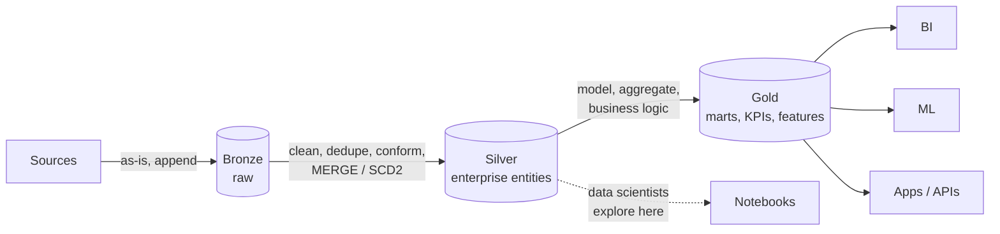
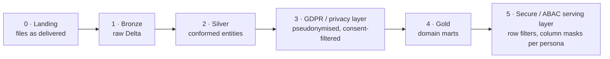

# Lakehouse and Medallion Architecture


---

## 1. How we got here: warehouse → lake → lakehouse

| | Data warehouse (Teradata, Redshift, Snowflake) | Data lake (HDFS/S3 + Hive) | Lakehouse (Delta/Iceberg/Hudi on object storage) |
|---|---|---|---|
| Storage | Proprietary, coupled to compute (classic) | Open files, cheap | **Open files + table format**, cheap |
| Data types | Structured | Anything | Anything |
| ACID / updates | ✅ | ❌ (rewrite whole partitions) | ✅ |
| Schema | On write, enforced | On read, often chaos ("data swamp") | Enforced + evolvable |
| BI performance | Excellent | Poor | Good–excellent (caching, clustering, Photon/vectorised engines) |
| ML / Python access | Export needed | Direct | Direct |
| Cost | $$$ | $ | $–$$ |
| Lock-in | High | Low | Low (open formats) |

**One-line definition for interviews:**
> "A lakehouse puts warehouse capabilities (ACID transactions, schema enforcement, governance, fast SQL) on top of open file formats in cheap object storage. BI, data science and streaming then share one copy of the data instead of copying it between a lake and a warehouse."

**What makes it possible:** an open **table format** writes a *transaction log* (Delta `_delta_log/*.json`, Iceberg metadata/manifest tree) that records which Parquet files make up each table version. Readers see a consistent snapshot; writers commit atomically with optimistic concurrency. See [Storage & table formats](/interview-prep/learn/architecture/05-storage-and-table-formats/).

---

## 2. Medallion architecture

A **convention for layering data by quality and purpose**, not a technology. Bronze → Silver → Gold.



### Layer contracts (what *each* layer promises)

| | Bronze | Silver | Gold |
|---|---|---|---|
| **Purpose** | Land everything, lose nothing | One clean, conformed version of each entity | Answer business questions fast |
| **Shape** | Source-shaped (mirrors source tables/events) | Entity-shaped (customer, order, device) | Consumption-shaped (star schema, OBT, aggregates) |
| **Writes** | Append-only | MERGE / upsert / SCD2 | Overwrite / incremental MERGE |
| **Schema** | Loose (`_rescued_data`, VARIANT/JSON) | Enforced, typed | Enforced, documented, versioned |
| **Quality** | None, but metadata added | Expectations, dedup, quarantine | Business rules, reconciled totals |
| **Retention** | Long (it's your replay source) | Long | As needed |
| **Owners** | Platform / ingestion team | Domain data engineers | Domain + analytics engineers |
| **Consumers** | Data engineers only | DE, DS, advanced analysts | Everyone, BI tools, apps |
| **PII** | Raw (restricted access) | Tagged, masked/tokenised | Minimised / aggregated |

### Metadata columns to add in bronze
```sql
SELECT
  *,
  current_timestamp()          AS _ingested_at,
  _metadata.file_path          AS _source_file,      -- AutoLoader / file sources
  'crm_postgres.orders'        AS _source_system,
  :pipeline_run_id             AS _run_id
FROM ...
```
For Kafka sources also keep `topic, partition, offset, timestamp`: they're your dedup and replay keys.

---

## 3. Design decisions interviewers ask about

### "Why not go straight from source to gold?"
- **Replayability:** bronze lets you rebuild silver/gold when logic changes, without re-extracting from sources (which may not keep history).
- **Debuggability:** you can always answer "what did the source actually send?"
- **Decoupling:** ingestion (one team, many sources) is separated from modelling (many domains).
- **Cost:** storage is cheap; re-extraction from production databases is expensive and risky.

### "Isn't three copies of the data wasteful?"
Storage is ~$23/TB-month; compute and engineer time cost far more. Mitigate with retention policies (bronze → cold tier after N days), `VACUUM`, and **views** instead of tables for thin gold layers.

### "How many layers?"
Medallion is a starting point. Real platforms often have more, e.g. a **six-layer enterprise layout**:



Each extra layer must earn its place with a **distinct contract** (e.g. "nothing downstream of layer 3 can contain direct identifiers"). Adding layers just to look organised is an anti-pattern.

### "Batch or streaming between layers?"
Both work. Delta tables are both a batch table and a streaming source/sink, so bronze → silver can be `readStream` with `trigger(availableNow=True)` (incremental batch) today and a continuous stream tomorrow, **with the same code**.

```python
(spark.readStream.table("bronze.orders")
   .withWatermark("event_ts", "1 hour")
   .dropDuplicatesWithinWatermark(["order_id"])
   .writeStream
   .foreachBatch(merge_into_silver)            # idempotent MERGE
   .option("checkpointLocation", "/chk/silver_orders")
   .trigger(availableNow=True)                 # or processingTime="1 minute"
   .start())
```

---

## 4. Anti-patterns

| Anti-pattern | Why it hurts | Fix |
|---|---|---|
| Business logic in bronze | Can't replay "raw" anymore | Bronze = as-landed + metadata only |
| Gold tables built from bronze directly | Each gold re-implements cleaning differently | Gold reads silver only |
| Silver mirrors source tables 1:1 forever | No conformance, every consumer joins 12 tables | Model entities in silver |
| "Gold" = 400 one-off tables per dashboard | Metric drift, cost | Conformed marts + semantic layer |
| No ownership per layer | Nobody fixes breakages | Owners + SLAs per table |
| Partitioning by high-cardinality column | Millions of small files | Partition by date (or not at all) + clustering |
| Every layer a full overwrite | Cost explodes with data growth | Incremental processing (CDF, streaming, MERGE) |

---

## 5. Lakehouse platform components (vendor-neutral map)

| Capability | Databricks | Open / AWS | Snowflake-centric |
|---|---|---|---|
| Table format | Delta (UniForm → Iceberg readers) | Iceberg / Hudi | Iceberg tables / native |
| Catalog & governance | Unity Catalog | Glue, Lake Formation, Polaris, Nessie | Horizon / Polaris |
| Batch engine | Spark / Photon | Spark (EMR), Trino, Athena | Snowflake |
| Streaming | Structured Streaming, DLT / Lakeflow | Flink, Kinesis | Snowpipe Streaming, Dynamic Tables |
| Transformations | dbt, DLT, notebooks | dbt, Spark | dbt, Dynamic Tables |
| Orchestration | Workflows / Lakeflow Jobs | Airflow (MWAA), Step Functions | Tasks, Airflow |
| BI SQL | Databricks SQL warehouses | Athena, Trino, Redshift Spectrum | Warehouses |
| ML | MLflow, Feature Store, Model Serving | SageMaker | Snowpark ML |

---

## 6. Interview questions

<details><summary>Explain the medallion architecture to a non-technical stakeholder.</summary>

"Like a water treatment plant. Bronze is water straight from the river: we keep all of it in case we need to re-treat it. Silver is filtered and cleaned. Gold is bottled for a specific use: drinking, cooking, industry. If we change the filtering process, we re-filter from the river water we saved."
</details>

<details><summary>Where would you apply data quality checks and what happens on failure?</summary>

Bronze: structural only (parsable, required metadata), and bad records go to a rescue column or quarantine; never drop silently. Silver: schema, types, uniqueness of business keys, referential checks; violations go to a quarantine table with reason codes, with alerting on thresholds. Gold: business rules and reconciliation (totals match finance/source), and failure **blocks publishing** (write-audit-publish) so consumers keep seeing the last good version.
</details>

<details><summary>How do you handle a source that sends full snapshots daily instead of changes?</summary>

Land each snapshot in bronze partitioned by snapshot date. Derive changes by comparing to the previous snapshot (hash of non-key columns → inserts/updates/deletes), then MERGE into silver as SCD1/SCD2. Keep a limited number of snapshots in bronze (cost) once silver history is trustworthy.
</details>

<details><summary>Lakehouse vs cloud warehouse: which would you choose for a new company?</summary>

It depends on workloads and team: mostly SQL/BI with a small team → a managed warehouse is fastest to value. Heavy ML, streaming, semi-structured data, very large volumes, or a strong desire to avoid lock-in → a lakehouse. Increasingly the line is blurring (warehouses read Iceberg, lakehouses have serverless SQL). The deciding factors are the **open format** and **one copy of data** for all engines.
</details>
