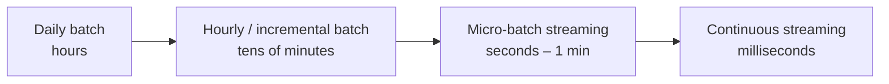
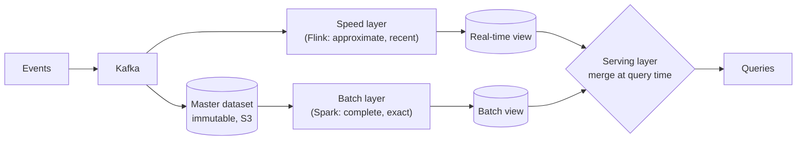
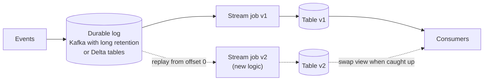
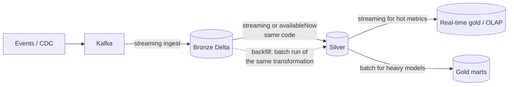

# Batch vs Streaming, Lambda vs Kappa

---

## 1. The spectrum, not a binary

| | Batch | Micro-batch (Spark SS) | Continuous (Flink, Kafka Streams) |
|---|---|---|---|
| Latency | minutes–hours | ~1–60 s | ms |
| Throughput efficiency | Highest | High | Good |
| Complexity / ops | Low | Medium | High (state, timers, savepoints) |
| Cost | Pay per run | Always-on cluster (or availableNow) | Always-on |
| Correctness w/ late data | Easy (recompute) | Watermarks | Watermarks + allowed lateness |
| Debugging | Easy | Medium | Hard |

### Decision rule

> **Use the slowest approach that meets the freshness requirement.** Streaming is a cost and complexity you pay every day; only pay it when the business value of freshness justifies it.

Questions that justify streaming:
- Does someone **act** on the data within minutes? (fraud blocking, surge pricing, alerting, personalisation)
- Is the data **perishable**? (a recommendation for a session that already ended is worthless)
- Is freshness a **product feature**? (user-facing analytics, live dashboards for customers)

If the answer is "a person looks at a dashboard each morning", hourly or daily batch is the right call. Say so in the interview; it signals judgement.

**The middle ground most people forget:** incremental batch with a streaming engine, e.g. `trigger(availableNow=True)` runs a streaming query as a batch that processes only new data, then stops. You get streaming's exactly-once bookkeeping (checkpoints) with batch economics, and switching to continuous later needs only a different trigger.

---

## 2. Lambda architecture

- **Batch layer** periodically recomputes views from all history → correct.
- **Speed layer** covers the gap since the last batch → fresh but possibly approximate.
- **Serving layer** merges: `batch_view (up to T) + realtime_view (after T)`.

**Problem:** the same logic is written twice (often in two frameworks), the two drift apart, and the numbers don't match. Plus double infra and on-call.

**Still valid when:** the exact number must come from a batch process for regulatory/billing reasons, while a fast approximate number is useful operationally. Ad billing is the canonical example.

---

## 3. Kappa architecture

- One code path. To reprocess, **deploy a new version that replays the log**, let it catch up, switch consumers.
- Requires the log to retain enough history (Kafka tiered storage, or use the lakehouse's bronze Delta tables as "the log").

**Problems:** replaying years of data through a streaming job is slow and can be expensive; stateful operators with large state are hard to rebuild; some computations (global re-ranking, complex joins over all history) are naturally batch.

---

## 4. What most companies actually run: the lakehouse hybrid

- Delta/Iceberg tables are both **stream sources and batch tables**, so the "log" is the bronze table, not Kafka with infinite retention.
- **Same DataFrame code** runs as a stream (low latency) or as a batch (backfill), which removes Lambda's two-codebase problem.
- Heavy models (SCD2 snapshots, complex marts) run as incremental batch; latency-sensitive aggregates run as streams.

Interview phrasing:
> "I'd use a Kappa-style design on the lakehouse: Kafka feeds bronze continuously, and transformations are written once with the DataFrame API. They run as streams where freshness matters and as batch for backfills, replaying from bronze rather than Kafka, since Kafka only keeps 7 days."

---

## 5. Streaming engine selection

| Requirement | Pick |
|---|---|
| Lakehouse shop, seconds of latency OK, team knows Spark | **Spark Structured Streaming / DLT** |
| Sub-second latency, complex event processing, huge keyed state, timers | **Flink** |
| Kafka → Kafka transformations inside a microservice | **Kafka Streams** |
| SQL-only teams, managed | Flink SQL (Confluent, Ververica), Materialize, RisingWave, Snowflake Dynamic Tables |
| Real-time OLAP ingestion with light transforms | Pinot/Druid ingest directly from Kafka |

---

## 6. Interview questions

The business says "we want everything real-time". How do you respond?

Ask what decision changes with fresher data and what it's worth. Map each use case to a freshness tier (seconds / minutes / hourly / daily), show the cost difference (always-on clusters, on-call, complexity), and propose streaming only for the use cases where acting quickly creates value. Often the real need is "the morning dashboard should be ready by 7am".

How do you reprocess history in a streaming pipeline?

Options: (1) Kappa replay: new job version, new checkpoint, start from earliest retained offset, write to a new table, swap. (2) Hybrid: batch-backfill history from bronze with the same transformation code, then start the stream from the backfill's end point (by timestamp/offset or Delta version), dedupe the overlap with idempotent MERGE. (2) is usually more practical because Kafka retention is short.

What's the difference between micro-batch and continuous processing, and when does it matter?

Micro-batch collects records for a trigger interval and processes them as a small batch job: simpler, efficient, exactly-once via checkpoint per batch, latency ≥ trigger + processing. Continuous processes each record as it arrives with checkpoint barriers flowing through the graph: ms latency, more complex. It matters when the latency budget is under ~1 s (fraud, bidding, alerting); for dashboards it rarely matters.

Why do Lambda architectures produce mismatched numbers?

Two implementations of the same logic (different frameworks, different dedup/late-data handling, different time zone or window semantics) and different input completeness. The batch layer sees late events the speed layer dropped. The fix is a single codebase, or explicitly labelling the speed numbers as provisional.

