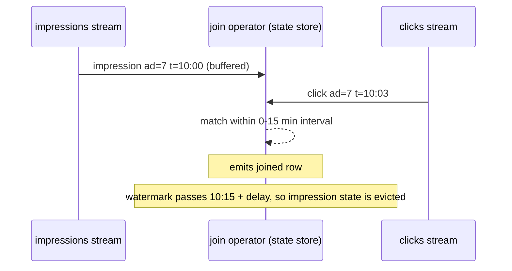

# Streaming Deep Dive

> Kafka, Spark Structured Streaming, Flink and the streaming patterns that come up in nearly every senior data engineering loop.


---

## Kafka Fundamentals

### Core Concepts

| Concept | Description |
|---------|-------------|
| **Topic** | Category/feed of messages |
| **Partition** | Ordered, immutable sequence within a topic |
| **Offset** | Position of a message within a partition |
| **Consumer Group** | Set of consumers sharing the work of reading a topic |
| **Broker** | Kafka server that stores data |

### Partitioning

```
Topic: orders (6 partitions)
┌────────────┬────────────┬────────────┐
│ Partition 0│ Partition 1│ Partition 2│
│ user_1     │ user_2     │ user_3     │
│ user_7     │ user_8     │ user_9     │
└────────────┴────────────┴────────────┘
┌────────────┬────────────┬────────────┐
│ Partition 3│ Partition 4│ Partition 5│
│ user_4     │ user_5     │ user_6     │
│ user_10    │ user_11    │ user_12    │
└────────────┴────────────┴────────────┘
```

**Partition Key Choices:**

| Key | Ordering Guarantee | Risk |
|-----|-------------------|------|
| `user_id` | All events for a user in order | Hot users cause skew |
| `null` (round-robin) | None | Even distribution |
| `event_type` | Events of same type in order | Uneven if types vary |

### Sizing Rules

```
Partitions = max(
    desired_throughput / throughput_per_partition,
    num_consumers_in_group
)

# Example: 100K msg/sec, each partition handles 10K/sec
# Partitions = max(100K/10K, 20 consumers) = max(10, 20) = 20
```

### Retention

| Strategy | Use Case |
|----------|----------|
| Time-based (7 days) | Standard: replay window |
| Size-based (100GB) | When storage constrained |
| Compacted | Keep latest per key (changelogs) |

---

## Delivery Semantics

### At-Most-Once
- Fire and forget
- May lose messages
- Use: Metrics where loss is okay

### At-Least-Once
- Retry until ack
- May duplicate messages
- Use: Most pipelines (with dedup)

### Exactly-Once
- No loss, no duplicates
- Requires: Idempotent producers + transactional consumers
- Use: Financial, billing

**How to Achieve Exactly-Once:**

```python
# Kafka producer
producer = KafkaProducer(
    enable_idempotence=True,  # Prevents duplicates on retry
    transactional_id="my-txn-id"  # Enables transactions
)

# Spark consumer
spark.readStream \
    .format("kafka") \
    .option("kafka.isolation.level", "read_committed")  # Only committed txns
```

---

## Windowing

### Tumbling Window
Fixed, non-overlapping intervals.

```
Events: [1, 2, 3, 4, 5, 6, 7, 8, 9]
Window: 3 events
Result: [1,2,3], [4,5,6], [7,8,9]
```

```python
.groupBy(window("timestamp", "5 minutes"))
```

### Sliding Window
Overlapping intervals.

```
Events: [1, 2, 3, 4, 5]
Window: 3, Slide: 1
Result: [1,2,3], [2,3,4], [3,4,5]
```

```python
.groupBy(window("timestamp", "10 minutes", "2 minutes"))  # 10min window, 2min slide
```

### Session Window
Gap-based, ends after inactivity.

```
Events: [1, 2, 3, --gap--, 7, 8, --gap--, 15]
Gap: 3
Result: [1,2,3], [7,8], [15]
```

```python
.groupBy(session_window("timestamp", "30 minutes"))  # Spark 3.2+
```

---

## Watermarks & Late Data

### What is a Watermark?
A watermark says: "I believe I've seen all events with timestamp <= W"

```python
df.withWatermark("event_time", "10 minutes")
```

This means: Allow events up to 10 minutes late. Later events are dropped.

### Handling Late Data

| Strategy | Implementation |
|----------|---------------|
| Drop late events | Default with watermark |
| Emit late to separate sink | `outputMode("update")` + side output |
| Reprocess in batch | Daily reconciliation job |

```python
# Late data to separate stream (Flink)
late_data = windowed_stream.getSideOutput(late_output_tag)
```

---

## Spark Structured Streaming

### Basic Pattern

```python
# Read
df = spark.readStream \
    .format("kafka") \
    .option("subscribe", "topic") \
    .option("startingOffsets", "latest") \
    .load()

# Transform
result = df.select(from_json(col("value"), schema).alias("data")) \
    .select("data.*") \
    .withWatermark("timestamp", "5 minutes") \
    .groupBy(window("timestamp", "1 minute")) \
    .count()

# Write
query = result.writeStream \
    .format("delta") \
    .outputMode("append") \
    .option("checkpointLocation", "/checkpoint") \
    .trigger(processingTime="30 seconds") \
    .start()
```

### Output Modes

| Mode | Behavior | Use Case |
|------|----------|----------|
| **Append** | Only new rows | Non-aggregated output |
| **Update** | Changed rows only | Aggregations to KV store |
| **Complete** | Full result table | Aggregations to file (small) |

### Triggers

| Trigger | Behavior |
|---------|----------|
| `processingTime="10 seconds"` | Micro-batch every 10s |
| `once=True` | Single batch, then stop |
| `availableNow=True` | Process all available, then stop |
| `continuous="1 second"` | True streaming (experimental) |

---

## Flink vs Spark Streaming

| Aspect | Spark Streaming | Flink |
|--------|-----------------|-------|
| **Model** | Micro-batch | True streaming |
| **Latency** | Seconds-minutes | Milliseconds |
| **State** | In-memory + checkpoint | RocksDB + checkpoint |
| **CEP** | Limited | First-class |
| **Exactly-once** | With checkpoints | Native |
| **Batch** | Excellent | Good |

### When to Use Flink
- Sub-second latency required
- Complex event processing (fraud patterns)
- Large state (>100GB)

### When to Use Spark Streaming
- Team knows Spark
- Delta Lake integration
- Batch + streaming on same code
- Latency >10s is acceptable

---

## State Management

### Stateless vs Stateful

| Type | Example | Complexity |
|------|---------|------------|
| Stateless | Filter, map, project | Easy |
| Stateful | Aggregation, join, dedup | Hard |

### State Backends

| Backend | Use Case |
|---------|----------|
| In-memory (Spark) | Small state, fast |
| RocksDB (Flink) | Large state, persistent |

### State Cleanup

```python
# Spark: State expires with watermark
df.withWatermark("timestamp", "1 hour")  # State cleared after 1 hour

# Flink: Explicit TTL
descriptor.enableTimeToLive(StateTtlConfig.newBuilder(Time.hours(1)).build())
```

---

## Checkpointing

Periodic snapshots of state for fault tolerance.

```python
# Spark
.option("checkpointLocation", "/checkpoints/my_job")

# Flink
env.enableCheckpointing(60000)  # Every 60 seconds
env.getCheckpointConfig().setCheckpointStorage("s3://bucket/checkpoints")
```

### Recovery
On failure, restart from last checkpoint. Reprocess events since checkpoint.

### Checkpoint vs Savepoint (Flink)
- **Checkpoint:** Automatic, for recovery
- **Savepoint:** Manual, for upgrades/migrations

---

## Common Patterns

### Deduplication

```python
# Spark: Dedupe within watermark window
df.withWatermark("timestamp", "10 minutes") \
  .dropDuplicates(["event_id", "timestamp"])

# Alternative: Use Delta MERGE with event_id as key
```

### Stream-Stream Join

```python
# Join two streams within time range
left.withWatermark("time", "10 minutes") \
    .join(
        right.withWatermark("time", "10 minutes"),
        expr("left.key = right.key AND left.time BETWEEN right.time - interval 5 minutes AND right.time + interval 5 minutes")
    )
```

### Stream-Static Join (Enrichment)

```python
# Join streaming events with static dimension
events.join(broadcast(dim_product), "product_id")
```

---

## References

- [Kafka Documentation](https://kafka.apache.org/documentation/)
- [Spark Structured Streaming Guide](https://spark.apache.org/docs/latest/structured-streaming-programming-guide.html)
- [Flink Documentation](https://nightlies.apache.org/flink/flink-docs-stable/)
- [Streaming Systems Book](https://www.oreilly.com/library/view/streaming-systems/9781491983867/)


---

## Stream-stream join: how state is bounded



```python
imps   = impressions.withWatermark("imp_ts", "10 minutes")
clicks = clicks.withWatermark("click_ts", "20 minutes")
joined = imps.join(
    clicks,
    expr("""click_ad_id = imp_ad_id AND
            click_ts >= imp_ts AND
            click_ts <= imp_ts + interval 15 minutes"""),
    "leftOuter")          # outer joins REQUIRE watermarks + time bounds
```

Without watermarks **and** a time-range condition, the engine must keep both sides forever, and state grows without bound.

---

## Interview questions

<details><summary>Your streaming job's state store keeps growing until executors OOM. What do you check?</summary>

1. Is there a watermark on every stateful operator (aggregations, dedup, stream-stream joins)? 2. Do joins have a time-range bound? 3. Is the key cardinality unbounded (e.g. grouping by session_id with no window)? 4. Use RocksDB state store instead of in-memory (HDFS-backed) for large state. 5. For arbitrary stateful processing, set state TTL / timeouts. 6. Watch the `stateOperators.numRowsTotal` and memory metrics in the streaming query progress.
</details>

<details><summary>How do you deduplicate a stream exactly?</summary>

Pick a unique event id. `dropDuplicatesWithinWatermark("event_id")` with a watermark bounded by the max expected duplicate delay; plus an idempotent sink (MERGE on event_id) to catch anything older than the watermark. Without a watermark, `dropDuplicates` keeps every id forever.
</details>

<details><summary>Checkpoint vs savepoint vs Delta transaction log?</summary>

Checkpoint: automatic, engine-owned snapshot of offsets + state for failure recovery. Savepoint (Flink): user-triggered, portable snapshot for upgrades/migrations/rescaling. Delta log: the sink table's own commit history; Structured Streaming also writes (appId, batchId) there so replays don't double-write.
</details>

<details><summary>Kafka consumer lag is growing steadily. Walk through your diagnosis.</summary>

Is input rate up (traffic spike) or processing rate down (slower batches)? Check batch duration vs trigger interval, skewed partitions (one partition lagging = hot key), GC/OOM, slow sinks (DB backpressure), external lookups per record. Fixes: scale executors / partitions (if parallelism is capped by partition count, add partitions carefully), salt hot keys, batch external calls, tune `maxOffsetsPerTrigger`, optimise the sink.
</details>
