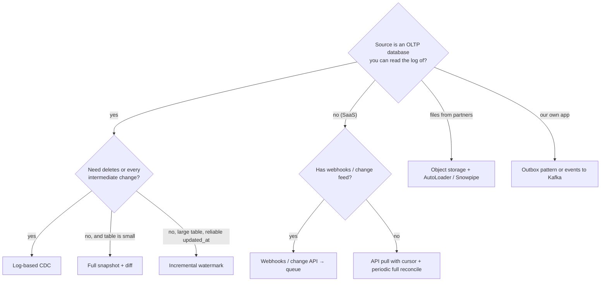

# Ingestion Patterns and Change Data Capture


---

## 1. The ingestion pattern menu

| Pattern | How | Captures deletes? | Captures every change? | Source load | Complexity |
|---|---|---|---|---|---|
| **Full snapshot** | `SELECT *` every run | ✅ (by diff) | ❌ intermediate states | High | Low |
| **Incremental (high-watermark)** | `WHERE updated_at > :last_max` | ❌ | ❌ | Medium | Low |
| **Log-based CDC** | Read WAL/binlog (Debezium, DMS, Fivetran HVR, Datastream) | ✅ | ✅ in commit order | **Very low** | Medium–high |
| **Trigger-based CDC** | DB triggers write to an audit table | ✅ | ✅ | High (write amplification) | Medium |
| **Outbox** | App writes event to outbox table in same txn → CDC | ✅ (as events) | ✅ business events | Low | Medium |
| **Event streaming** | App publishes events directly to Kafka | n/a | ✅ | n/a | Dual-write risk |
| **File drop** | Partner drops CSV/JSON/Parquet in a bucket → AutoLoader | depends | depends | n/a | Low |
| **API pull** | Paginated REST/GraphQL with cursors | rarely | ❌ | Rate limits | Medium |

### Choosing



---

## 2. Incremental high-watermark extraction: and its traps

```sql
-- run parameter: :last_watermark (from state table), :run_upper = now() - interval 5 minutes
SELECT * FROM orders
WHERE updated_at >  :last_watermark
  AND updated_at <= :run_upper;
-- after successful load: last_watermark = :run_upper
```

Traps:
1. **Deletes are invisible.** Hard-deleted rows never show up. Need soft deletes or a periodic full key reconcile.
2. **`updated_at` not maintained** by every code path (bulk updates, manual fixes) → silent misses.
3. **Long-running transactions:** a row committed *after* your extraction but with an `updated_at` *before* your watermark is skipped forever. Mitigation: upper bound lagging `now()` by a safety margin, plus overlap windows with idempotent MERGE downstream.
4. **Clock/timezone issues** between app servers and DB.
5. **Intermediate states lost**: if status went `PAID → SHIPPED` between runs, you never see `PAID`.

---

## 3. Log-based CDC in depth

### How it works
1. The DB writes every change to its transaction log (Postgres WAL, MySQL binlog, Oracle redo, SQL Server CDC tables).
2. A CDC connector (Debezium on Kafka Connect) registers as a replication client (Postgres: **replication slot** + `pgoutput` plugin) and streams changes.
3. Each change becomes an event with `before`, `after`, `op` (c/u/d/r), source position (LSN), transaction id, timestamp.
4. Events go to a Kafka topic per table, **keyed by primary key** → per-key ordering.

### Applying CDC to the lakehouse

```sql
-- silver current-state table (SCD1) from a micro-batch of CDC events
MERGE INTO silver.customers t
USING (
  SELECT * FROM cdc_batch
  QUALIFY ROW_NUMBER() OVER (PARTITION BY id ORDER BY lsn DESC) = 1   -- latest change per key in this batch
) s
ON t.id = s.id
WHEN MATCHED AND s.op = 'd'                 THEN DELETE
WHEN MATCHED AND s.lsn > t._lsn             THEN UPDATE SET *        -- ignore stale/out-of-order
WHEN NOT MATCHED AND s.op != 'd'            THEN INSERT *;
```

Databricks DLT / Lakeflow wraps this as `APPLY CHANGES INTO` / `AUTO CDC` with `SEQUENCE BY lsn` and `STORED AS SCD TYPE 2`.

### The hard parts (interview gold)

| Problem | Solution |
|---|---|
| **Initial load** of a 2 TB table | Consistent snapshot at LSN X, then stream from X (Debezium does this; incremental snapshots avoid long locks). Overlap is safe because MERGE is idempotent on (pk, lsn). |
| **Ordering** across partitions | Only per key is guaranteed. Multi-table transactional consistency needs `txId` grouping or accepting eventual consistency. |
| **Out-of-order / duplicate delivery** | Order by LSN not timestamp; `WHEN MATCHED AND s.lsn > t._lsn`. |
| **Schema changes** in the source | Schema registry with compatibility rules; Delta `mergeSchema` for additive changes; contract for breaking ones. |
| **Replication slot lag** | If the connector is down, Postgres retains WAL → **source disk fills up** → production outage. Alert on slot lag; set `max_slot_wal_keep_size`. |
| **Deletes** | `op='d'` + tombstone; decide hard vs soft delete in silver; GDPR deletion must propagate to gold and backups. |
| **TOAST / unchanged large columns** (Postgres) | Debezium may emit placeholders for unchanged large values → use `REPLICA IDENTITY FULL` or coalesce with the existing value. |
| **High-churn tables** | Compaction in Kafka; batch MERGE intervals of 1–5 min to avoid tiny commits. |

---

## 4. File ingestion (AutoLoader pattern)

```python
(spark.readStream.format("cloudFiles")
   .option("cloudFiles.format", "json")
   .option("cloudFiles.schemaLocation", "/schemas/partner_orders")
   .option("cloudFiles.schemaEvolutionMode", "addNewColumns")   # or rescue
   .option("cloudFiles.useNotifications", "true")                # queue-based discovery at scale
   .load("s3://landing/partner/orders/")
   .select("*", "_metadata.file_path", "_metadata.file_modification_time")
   .writeStream
   .option("checkpointLocation", "/chk/bronze_partner_orders")
   .trigger(availableNow=True)
   .toTable("bronze.partner_orders"))
```

Key points:
- **Incremental discovery**: directory listing (simple) vs file notifications (SQS/Event Grid, scales to millions of files).
- **Exactly-once file processing**: discovered files are tracked in the checkpoint (RocksDB) so each file is ingested once.
- **Schema inference + evolution**: unknown columns go to `_rescued_data` instead of failing or being lost.
- **Late/re-delivered files** with the same name: decide whether overwrite means re-ingest (`cloudFiles.allowOverwrites`).
- Partners send garbage: validate in silver, keep the original file path for traceability.

---

## 5. API ingestion

- **Cursor / since-token pagination** over offset pagination (offsets shift when data changes).
- Respect **rate limits** (token bucket, `Retry-After`), exponential backoff with jitter.
- Store **raw responses** in bronze (JSON) before parsing; APIs change without notice.
- Many APIs don't expose deletes → schedule a **periodic full key reconciliation**.
- Make each extraction window idempotent (`[start, end)` per run, overwrite that window).

---

## 6. Streaming ingestion from apps (events)

- Collect via an edge/collector service (validates, enriches with server timestamp, batches) → Kafka. Don't let millions of mobile clients connect to Kafka directly.
- Events carry `event_id` (UUID, client-generated, for dedup), `event_ts` (client), `received_ts` (server), `schema_version`.
- Mobile clients buffer offline → **late events up to days**; partition raw by `received_date`, model by `event_date`.

---

## 7. Interview questions

<details><summary>Why is log-based CDC preferred over querying updated_at?</summary>

Captures deletes and every intermediate change in commit order, doesn't depend on application discipline around updated_at, and puts negligible load on the source (reads the log instead of scanning tables). Costs: more infrastructure (Kafka Connect, registry), DB permissions/config (replication slots, binlog row format), and operational risk like WAL retention.
</details>

<details><summary>Debezium was down for 6 hours. What happens and how do you recover?</summary>

Postgres retained WAL for the slot (watch disk!). On restart Debezium resumes from its last committed LSN and replays 6 hours of changes; downstream MERGE by (pk, lsn) is idempotent, so consumers just catch up. Lag alerts should have fired. If the slot was dropped or WAL removed, you need a new snapshot (incremental snapshot) and reconcile.
</details>

<details><summary>How do you build SCD2 history from a CDC stream?</summary>

For each key, order changes by LSN; each change closes the current row (`valid_to = change_ts, is_current = false`) and inserts a new row (`valid_from = change_ts, valid_to = '9999-12-31', is_current = true`). Within a micro-batch you must handle multiple changes per key in order (window over LSN with LEAD to compute valid_to). Only track changes in columns that matter (hash of tracked columns) to avoid noise. Or use DLT `APPLY CHANGES ... STORED AS SCD TYPE 2`.
</details>

<details><summary>What's the dual-write problem and how does the outbox pattern solve it?</summary>

An app that writes to its DB and publishes to Kafka can fail between the two, leaving them inconsistent. With the outbox pattern, the app writes the business change and an event row to an outbox table in one local transaction; CDC reads the outbox and publishes it. The event is published if and only if the transaction committed, in commit order.
</details>
