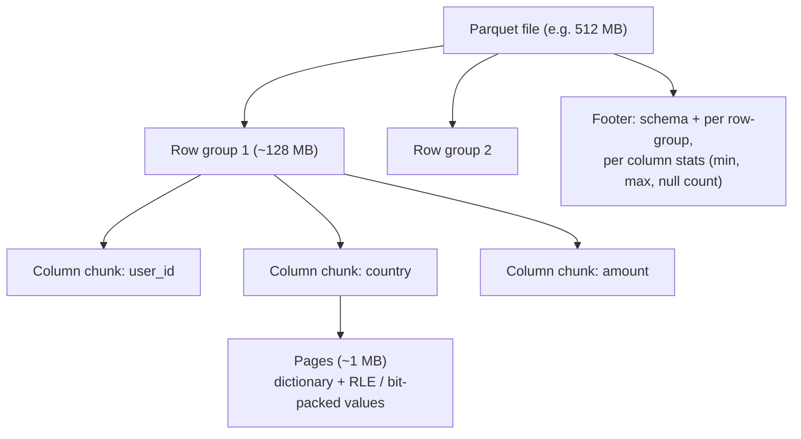
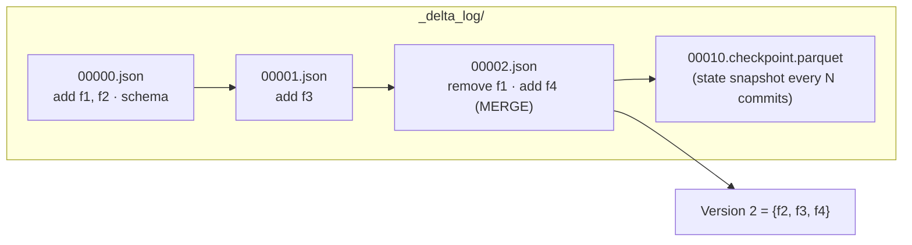
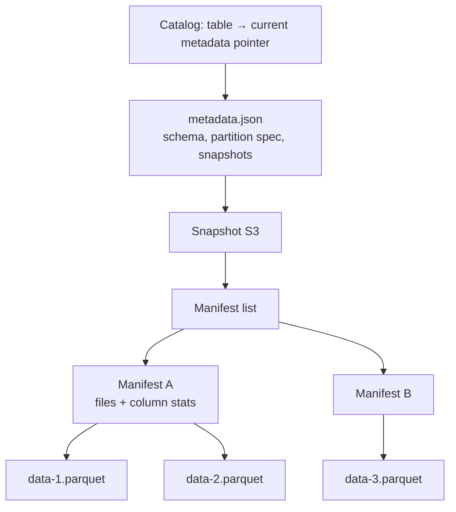
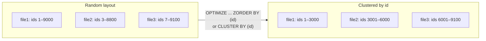

# Storage and Open Table Formats

> Most lakehouse performance and cost problems are **file layout problems**. Know how bytes sit on disk and you can answer half of all "this query is slow" questions.

---

## 1. Row vs columnar formats

| | Row (CSV, JSON, Avro) | Columnar (Parquet, ORC) |
|---|---|---|
| Layout | All columns of a row together | All values of a column together |
| Best for | Writing events, full-row reads, streaming (Avro) | Analytics: read few columns over many rows |
| Compression | Weak (mixed types) | Strong (similar values, dictionary/RLE) |
| Predicate pushdown | No | Yes (min/max stats, dictionary, bloom filters) |

**Rule:** Avro/Protobuf on the wire (Kafka), Parquet at rest (lake).

## 2. Parquet internals



How a query like `SELECT sum(amount) FROM t WHERE country = 'DE'` reads less:
1. **Column pruning:** reads only `country` and `amount` chunks.
2. **Row-group skipping:** footer stats say a row group has `country` min='AT', max='CH' → skip it.
3. **Dictionary filtering:** if 'DE' isn't in the dictionary page, skip.
4. **Encoding:** low-cardinality columns become tiny with dictionary + run-length encoding.

That's why **sorting/clustering data by commonly filtered columns** makes min/max stats selective and queries 10–100× faster.

---

## 3. Why table formats exist

Plain Parquet folders have no atomic commits (readers see half-written jobs), no updates/deletes without rewriting partitions, no schema enforcement, and slow file listing on object storage.

Table formats add a **metadata layer** that lists exactly which files form each table version.

### Delta Lake



- Each commit = a new JSON file with `add`/`remove` actions + stats. **Atomic** via put-if-absent on the next version number.
- **Optimistic concurrency:** writers read version N, write files, try to commit N+1; on conflict, check if the changes logically overlap; retry or fail.
- **Time travel:** `SELECT * FROM t VERSION AS OF 42` / `TIMESTAMP AS OF`, as long as `VACUUM` hasn't deleted the old files (default retention 7 days).
- Features: MERGE, Change Data Feed (row-level changes between versions), deletion vectors (soft-delete rows without rewriting files), liquid clustering, UniForm (Iceberg/Hudi-readable metadata).

### Apache Iceberg



- Tree of metadata → **fast planning on huge tables** (prune manifests by partition ranges without listing).
- **Hidden partitioning:** partition by `days(ts)` transform; users filter on `ts`, and Iceberg maps it. **Partition evolution** without rewriting old data.
- Schema evolution by field **IDs** (safe renames). Branching/tagging (WAP).
- Engine-neutral: Spark, Flink, Trino, Snowflake, BigQuery, Athena, DuckDB.

### Apache Hudi
- Built for **upsert-heavy, incremental** pipelines (born at Uber).
- **Copy-on-Write** (rewrite files on update, fast reads) vs **Merge-on-Read** (append delta logs, compact later: fast writes, reads merge on the fly).
- Built-in record-level index, incremental queries, clustering/compaction services.

### Comparison

| | Delta | Iceberg | Hudi |
|---|---|---|---|
| Metadata | Ordered JSON log + checkpoints | Snapshot → manifest list → manifests | Timeline + file groups |
| Strength | Spark/Databricks integration, simplicity, CDF, liquid clustering | Engine neutrality, huge tables, hidden partitioning, partition evolution | Streaming upserts, MoR, indexing |
| Row-level deletes | Deletion vectors | Position/equality deletes (v2), DVs (v3) | Native (MoR) |
| Interop | UniForm exposes Iceberg metadata | REST catalog standard | XTable for interop |

**Interview answer:** "All three give ACID, time travel and schema evolution on object storage. I'd choose based on the engine ecosystem: Delta if we're Databricks-centric, Iceberg if multiple engines (Snowflake, Trino, Flink) must read and write the same tables. Interop layers like UniForm and XTable are narrowing the gap."

---

## 4. Partitioning

**Partitioning = physical directories by column value** → whole-directory pruning.

Guidelines:
- Partition by a **low-cardinality column that's in almost every filter**: usually a date.
- Aim for **≥ 1 GB per partition**; if partitions would be smaller, partition coarser (month) or don't partition. Tables under ~1 TB often shouldn't be partitioned at all on modern Delta (use clustering).
- **Never** partition by high-cardinality columns (`user_id`) → millions of tiny files and directories.
- Partition column choice is (historically) hard to change → Iceberg partition evolution and Delta liquid clustering fix this.

## 5. The small-files problem

Causes: streaming with frequent triggers, over-partitioning, many parallel writers, high `spark.sql.shuffle.partitions` on small data.

Symptoms: slow queries (per-file open + task overhead), slow planning, driver OOM listing files, high object-storage request costs.

Fixes:
| Fix | How |
|---|---|
| Compaction | `OPTIMIZE table` (bin-packing to ~1 GB) on a schedule |
| Optimized writes | `delta.autoOptimize.optimizeWrite = true` (shuffle before write to produce right-sized files) |
| Auto compaction | `delta.autoOptimize.autoCompact = true` (small compaction after writes) |
| Fewer output partitions | `coalesce(n)` / AQE coalescing (`spark.sql.adaptive.coalescePartitions.enabled`) |
| Longer triggers | 1-minute instead of 1-second micro-batches if latency allows |
| Coarser partitioning | month instead of day/hour |

## 6. Data skipping: Z-order vs liquid clustering



`WHERE id = 4242` → before: all 3 files overlap → read all. After: only file2's range matches → read one.

| | Hive partitioning | Z-ORDER | Liquid clustering |
|---|---|---|---|
| Mechanism | Directories | Space-filling curve rewrite during OPTIMIZE | Incremental clustering by keys, managed by the table |
| Columns | 1–2 low-cardinality | Several, high-cardinality OK | 1–4 keys, high-cardinality OK |
| Change keys | Rewrite table | Re-OPTIMIZE (full rewrite) | `ALTER TABLE ... CLUSTER BY (...)`, no full rewrite |
| Incremental | n/a | No (rewrites clustered data) | Yes |
| Recommendation | Only for very large tables with a clear date filter | Legacy | **Default for new Delta tables** |

```sql
CREATE TABLE silver.events (...) CLUSTER BY (event_date, customer_id);
OPTIMIZE silver.events;   -- incrementally clusters new data
```

## 7. Maintenance operations cheat-sheet

| Operation | Purpose | Gotcha |
|---|---|---|
| `OPTIMIZE` | Compact + cluster | Costs compute; schedule off-peak or rely on predictive optimization |
| `VACUUM` | Delete files no longer referenced (older than retention) | Breaks time travel beyond retention; never set retention below the longest-running reader/stream |
| `ANALYZE TABLE ... COMPUTE STATISTICS` | Better join planning | |
| Checkpoint / log cleanup | Keep log small | Automatic in Delta |
| Iceberg `expire_snapshots`, `rewrite_data_files`, `rewrite_manifests` | Equivalent maintenance | Orphan file cleanup separate |

---

## 8. Interview questions

<details><summary>A query on a 5 TB Delta table filtering on customer_id takes 4 minutes. How do you speed it up?</summary>

Check the plan/metrics: files scanned vs total (is skipping happening?). Likely data isn't clustered on customer_id, so min/max stats overlap in every file. Apply liquid clustering (or Z-order) on customer_id, run OPTIMIZE, verify files pruned. Also check the small files count, whether stats are collected on that column (first 32 columns by default; move it or configure `dataSkippingNumIndexedCols`/`dataSkippingStatsColumns`), and whether the filter is wrapped in a function (prevents pushdown).
</details>

<details><summary>How does Delta guarantee atomicity on S3, which has no rename?</summary>

Commits are new files named by version (`000…042.json`); a commit succeeds only if no other writer created that version first. That needs a put-if-absent primitive: S3 now supports conditional writes, and historically a DynamoDB-based LogStore or the Databricks commit service coordinated it. Readers only consider committed log entries, so partially written data files are invisible.
</details>

<details><summary>Two jobs MERGE into the same Delta table at the same time. What happens?</summary>

Optimistic concurrency: both read version N; the first commits N+1; the second detects a conflict and checks whether the files it read were modified. If they touched disjoint partitions/files (and predicates prove it), it retries automatically and succeeds; otherwise it fails with `ConcurrentAppendException`/`ConcurrentUpdateException`. Mitigations: partition/cluster so writers touch disjoint data, include the partition predicate in the MERGE condition, row-level concurrency with deletion vectors, or serialise writers.
</details>

<details><summary>When would you pick Merge-on-Read over Copy-on-Write?</summary>

High-frequency updates/upserts with latency-sensitive writes (CDC every minute) where read latency can tolerate merging logs, with compaction scheduled. Copy-on-write for read-heavy tables with infrequent batch updates.
</details>
