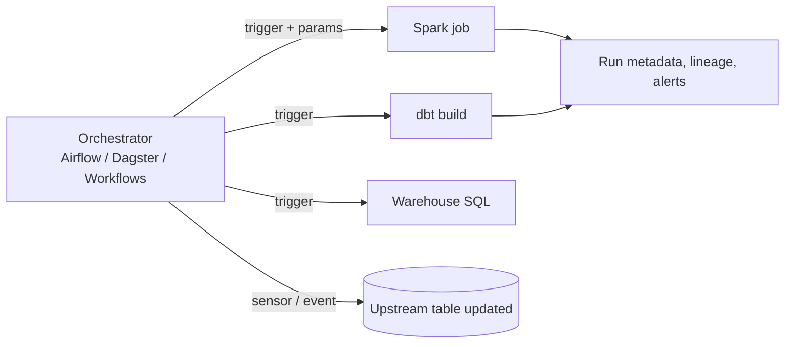
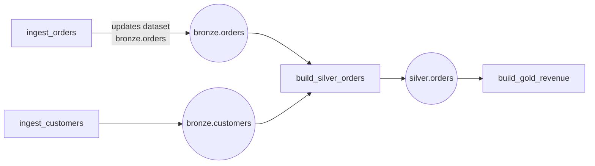
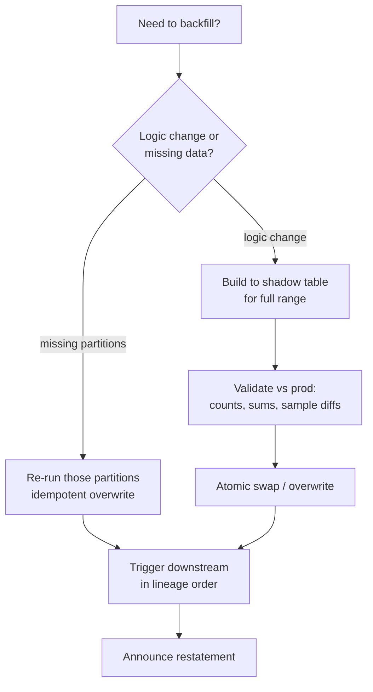

# Orchestration, Scheduling and Backfills

---

## 1. What an orchestrator is (and isn't)

An orchestrator **decides when and in what order** work runs, retries failures, tracks state, and alerts. It should **not do the heavy lifting**: Airflow workers shouldn't crunch 50 GB in pandas. They tell Spark/dbt/warehouse to do it.



## 2. DAG design principles

1. **Tasks are idempotent** and **parameterised by the logical date** (`{{ ds }}`, `data_interval_start`). Re-running yesterday's task produces yesterday's data exactly.
2. **Atomic tasks**: a task either fully succeeds or leaves no partial output (write to temp, then swap/merge).
3. **Small, meaningful tasks**: retry granularity = task granularity. Don't put 12 steps in one task.
4. **No data in the orchestrator**: pass references (table names, paths), not dataframes, through XCom.
5. **Prefer data-aware triggers** over time-based guesses ("run at 3am because upstream usually finishes at 2:30").
6. **Explicit SLAs** on outputs ("gold.revenue ready by 07:00"), not just task success.
7. **Retries with backoff** for transient failures; **no retries** for deterministic failures (bad SQL), since they just waste time.
8. **Concurrency limits / pools** to protect shared resources (source DBs, warehouses).

### Anti-patterns
- `datetime.now()` inside tasks → non-reproducible backfills.
- Mega-DAGs with 2,000 tasks and cross-team dependencies → split by domain, connect with datasets/assets.
- Sensors that poke every 30 s for hours, occupying worker slots → deferrable sensors / event triggers.
- Business logic in Python operators instead of versioned SQL/dbt/Spark code.

## 3. Tool comparison

| | Airflow | Dagster | Databricks Workflows (Lakeflow Jobs) | Prefect |
|---|---|---|---|---|
| Core abstraction | Task DAG | **Software-defined assets** | Job → tasks | Flow → tasks |
| Scheduling | Cron, datasets (data-aware), timetables | Schedules, sensors, **asset freshness policies** | Cron, file arrival, table update triggers, continuous | Cron, events |
| Backfills | `airflow dags backfill`, clear tasks | First-class partitioned backfills in UI | Repair runs, parameters | Re-runs |
| Lineage | Via OpenLineage | Native asset graph | Unity Catalog lineage | Limited |
| Ops | Self-host or MWAA/Composer/Astronomer | Self-host or Dagster+ | Fully managed | Cloud or self-host |
| Best for | Heterogeneous enterprise, huge ecosystem | Asset-centric modern data platforms | Lakehouse-native pipelines | Python-first teams |

**Interview take:** "Airflow if we orchestrate many heterogeneous systems and want the biggest ecosystem; Dagster if we want assets, partitions and lineage as first-class concepts; on Databricks, Workflows covers most needs without extra infrastructure, and I'd use Airflow only for cross-platform orchestration."

## 4. Data-aware scheduling



Airflow `Dataset`/`Asset` outlets, Dagster assets, Databricks table-update triggers: downstream runs **when its inputs actually change**, so no more "sleep until 3am and hope".

## 5. dbt in production

- Layering: `staging` (1:1 with sources, renames/casts) → `intermediate` (joins, logic) → `marts` (facts/dims).
- **Materialisations:** view, table, incremental (`merge`/`insert_overwrite`/`append` strategies, `unique_key`, `is_incremental()`), ephemeral, snapshot (SCD2).
- **Tests:** `unique`, `not_null`, `relationships`, `accepted_values`, plus custom/generic tests and dbt-expectations; **contracts** on public models (enforced columns/types).
- **Slim CI:** `dbt build --select state:modified+ --defer --state prod-manifest/` builds only changed models and dependents against prod artifacts.
- **Macros** for reusable logic (masking, surrogate keys, audit columns); **packages** for shared code across domains.
- Run with an orchestrator (`dbt build` task per domain or per model group via Cosmos / Dagster dbt integration / Databricks dbt task).

```sql
-- incremental model with late-data lookback
{{ config(materialized='incremental', unique_key='order_id', incremental_strategy='merge') }}
SELECT ...
FROM {{ ref('stg_orders') }}

WHERE updated_at > (SELECT max(updated_at) - INTERVAL 3 DAYS FROM {{ this }})

```

## 6. Backfills



Checklist (say these out loud in interviews):
- **Is the raw data still there?** (bronze retention ≥ backfill window)
- **Idempotent per partition** → safe to retry, safe to parallelise.
- **Concurrency cap** so the backfill doesn't starve daily production runs.
- **Order:** oldest → newest if there are cumulative dependencies (running totals, SCD2), otherwise parallel.
- **Downstream:** use lineage to find and rebuild dependants.
- **Validate before publishing**, and **communicate** that history changed.
- **Cost estimate** up front (TB × runtime).

## 7. SLAs, alerting, on-call

| Alert on | Not just |
|---|---|
| Output freshness breach (table not updated by 07:00) | Task failed |
| Volume anomaly (row count −60%) | Job succeeded |
| Long-running task (duration > p95 × 2) | |
| Repeated retries | |

Runbooks per critical pipeline: owner, upstreams, how to re-run, how to backfill, who to notify.

## 8. Interview questions

<details><summary>Your daily pipeline depends on 5 upstream sources that land at unpredictable times. How do you schedule it?</summary>

Data-aware triggers: run when all 5 inputs for the logical date are present (dataset/asset triggers or sensors on partition availability/control table), with a deadline. If not complete by the SLA cutoff, alert and optionally run with partial data flagged. Avoid cron + sleep guesses.
</details>

<details><summary>How do you make a dbt incremental model robust to late-arriving data?</summary>

Use a lookback window in the incremental predicate (e.g. reprocess the last 3 days by updated_at or event date) with a `merge` strategy on a unique key so re-processed rows update rather than duplicate; or `insert_overwrite` by date partition for the affected days. Periodic full refresh for drift.
</details>

<details><summary>A backfill of 2 years is needed after a logic bug. How do you plan it?</summary>

Estimate cost/time; build to a shadow table partitioned by month in parallel with capped concurrency; validate vs current prod (counts, key metrics, diffs on samples, finance reconciliation); swap atomically; backfill downstream in lineage order; communicate restated metrics; post-mortem with a regression test for the bug.
</details>
