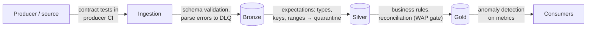
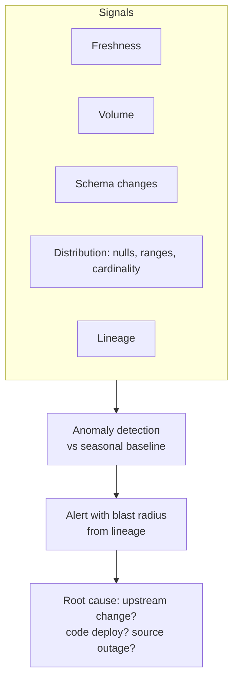
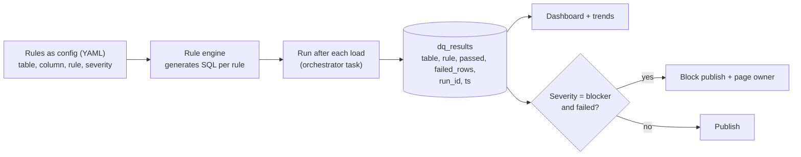

# Data Quality, Contracts and Observability

> "The pipeline is green but the numbers are wrong" is the most expensive class of data incident. Quality is designed in, not bolted on.

---

## 1. Quality dimensions

| Dimension | Question | Example check |
|---|---|---|
| **Completeness** | Is all the data here? | Row count vs expected / vs source; null rate of required columns |
| **Uniqueness** | Any duplicates? | `COUNT(*) = COUNT(DISTINCT order_id)` |
| **Validity** | Does it conform to rules? | `status IN (...)`, `amount >= 0`, regex on email |
| **Consistency** | Do related datasets agree? | Sum of order lines = order total; FK exists in dimension |
| **Accuracy** | Does it match reality? | Reconcile revenue to the finance ledger |
| **Timeliness / freshness** | Is it recent enough? | `max(event_ts) > now() - 1 hour` |

## 2. Where to check: shift left



The earlier a problem is caught, the cheaper it is. A bad schema rejected in the producer's CI costs nothing; a wrong revenue number found by the CFO costs a lot.

## 3. Handling failures: three actions

| Action | When | Example |
|---|---|---|
| **Warn** (log + metric) | Soft rules, monitoring | `email` format invalid in 0.3% of rows |
| **Drop / quarantine** row | Row-level violations, pipeline must continue | Negative quantity → quarantine table with reason |
| **Fail / block publish** | Dataset-level violations that make output untrustworthy | 0 rows today, duplicate primary keys in gold |

```python
# Delta Live Tables / Lakeflow declarative pipelines
@dlt.table
@dlt.expect("valid_ts", "event_ts IS NOT NULL")                 # warn
@dlt.expect_or_drop("positive_qty", "quantity > 0")            # drop row
@dlt.expect_or_fail("unique_id", "order_id IS NOT NULL")       # fail update
def silver_orders(): ...
```

Quarantine table pattern: `rejected_rows(source_table, rule_name, payload, rejected_at, run_id)` → dashboard + replay after fix.

## 4. Data contracts

A **data contract** is an agreement between a producer and its consumers:

```yaml
# contracts/orders.v2.yaml
dataset: sales.orders
owner: team-checkout (oncall: #checkout-oncall)
version: 2.1.0
schema:
  - {name: order_id,    type: string,    required: true, unique: true}
  - {name: customer_id, type: string,    required: true}
  - {name: amount,      type: decimal(18,2), required: true, checks: [">= 0"]}
  - {name: currency,    type: string,    checks: ["in (EUR, USD, GBP)"]}
  - {name: created_at,  type: timestamp, required: true}
semantics:
  amount: "gross amount incl. VAT, in major currency units (12.50 = 12.50 EUR)"
sla:
  freshness: "< 15 minutes"
  availability: "99.9%"
evolution: "backward compatible changes only; breaking changes need v3 + 30-day overlap"
pii: [customer_id]
```

Enforcement points: schema registry compatibility, producer CI (contract tests), ingestion validation, dbt model contracts. **Breaking changes** → new version, overlap period, consumers migrate.

## 5. Write-Audit-Publish

See [reliability patterns](/interview-prep/learn/system-design/04-reliability-patterns/#5-write-audit-publish-wap). Essential for gold tables that feed finance, executives, or ML training.

## 6. Observability: monitoring data, not just jobs



- **Static thresholds** for known rules; **seasonal baselines** (same weekday, last 4 weeks) for volumes and distributions. Monday volume differs from Sunday.
- **Lineage** (OpenLineage, Unity Catalog, dbt docs) answers "who is affected?" and "where did this come from?"
- Tools: Monte Carlo, Bigeye, Elementary (dbt), Soda, Great Expectations, Databricks Lakehouse Monitoring, custom SQL checks.

### Data SLOs
> "gold.daily_revenue is complete and correct by 07:00 UTC on 99% of days, measured over a rolling 30 days."

Track an **error budget**: if missed too often, prioritise reliability work over features.

## 7. Building a lightweight DQ framework (what to say if asked to design one)



- Rules as code/config, versioned in git, reviewed.
- Generic rules (not_null, unique, range, regex, referential, freshness, volume anomaly) + custom SQL.
- Results stored as data → trends, SLA reporting, per-domain scorecards.
- Profiling job suggests rules for new tables.

## 8. Interview questions

<details><summary>Revenue on the dashboard dropped 30% overnight. Walk me through it.</summary>

1. Is it real or data? Check freshness (did today's load complete?), volume vs baseline per source, recent deploys, schema changes. 2. Use lineage to walk upstream from the gold table: which input shows the anomaly first? 3. Typical culprits: partial load (one region missing), duplicate removal bug, join fan-out/fan-in (a dimension lost rows → inner join drops facts), currency/timezone change, upstream filter. 4. Communicate early ("investigating, numbers may be wrong"), fix, backfill, add a check that would have caught it (e.g. per-region volume anomaly, reconciliation to source totals).
</details>

<details><summary>How do you test data pipelines in CI?</summary>

Unit tests for transformation functions with small fixture DataFrames (pytest + local Spark/DuckDB); dbt tests on a CI schema built with slim CI; contract tests for schemas; integration tests on a sampled/anonymised dataset; data diff between PR build and prod for changed models (e.g. row counts, column-level diffs). Plus linting (sqlfluff, ruff).
</details>

<details><summary>Should a data quality failure stop the pipeline?</summary>

Depends on severity and consumer impact. Row-level issues → quarantine and continue. Dataset-level issues on critical outputs (finance, regulatory, ML training) → block publish, keep last-good version, page the owner. Being explicit about severity levels per rule is the key design decision.
</details>
