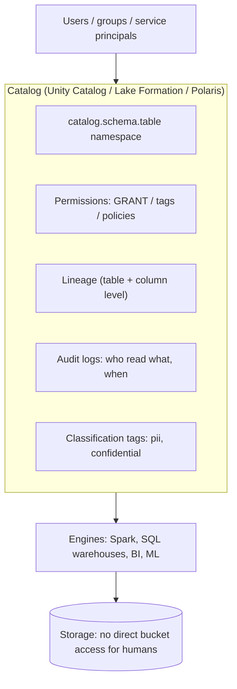
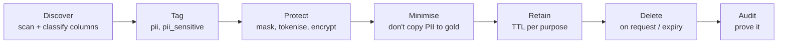
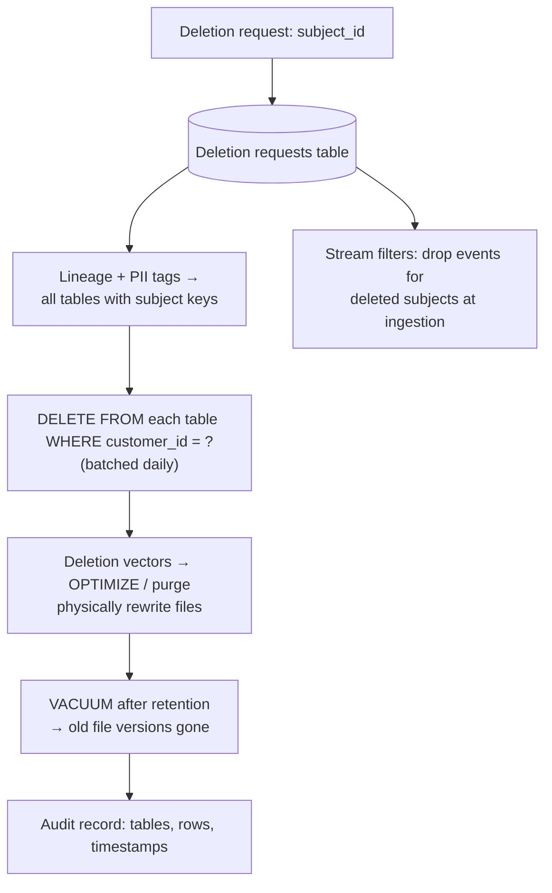

# Governance, Security and Privacy

> At senior level you'll be asked "how do you make sure the wrong people can't see PII?" and "how do you delete a customer's data from a 200 TB lakehouse?" Have crisp answers.

---

## 1. The governance stack



Key principle: **all access goes through the catalog**. Humans never get raw bucket credentials; engines get short-lived scoped credentials from the catalog (credential vending).

## 2. RBAC vs ABAC

| | RBAC (role-based) | ABAC (attribute-based) |
|---|---|---|
| Grants | `GRANT SELECT ON table TO group analysts_eu` | Policy: "users with `region=EU` attribute can see rows where `region=EU`; columns tagged `pii` masked unless user in `pii_readers`" |
| Scales with | Number of tables × roles (explodes) | Number of policies (stays small) |
| New table | Needs new grants | Tag it → policies apply automatically |
| Best for | Coarse access (schema/catalog level) | Fine-grained, many domains, compliance |

**Practical design:** RBAC at catalog/schema level (who can use which domain), ABAC via **tags + policies** for PII and row-level restrictions.

## 3. Row filters and column masks

```sql
-- Column mask: show full email only to the pii_readers group
CREATE FUNCTION gov.mask_email(email STRING)
RETURN CASE WHEN is_account_group_member('pii_readers') THEN email
            ELSE concat('***@', split(email, '@')[1]) END;

ALTER TABLE silver.customers ALTER COLUMN email SET MASK gov.mask_email;

-- Row filter: users only see rows for their region(s)
CREATE FUNCTION gov.region_filter(region STRING)
RETURN is_account_group_member('global_admins')
    OR is_account_group_member(concat('region_', lower(region)));

ALTER TABLE silver.orders SET ROW FILTER gov.region_filter ON (region);
```

Alternatives: dynamic views (`CREATE VIEW ... WHERE ...current_user()...`), Snowflake masking/row access policies, Lake Formation data filters.

## 4. PII lifecycle



Techniques:
| Technique | Reversible? | Use |
|---|---|---|
| Masking (`***`) | View-time only | Analysts don't need the value |
| Hashing (salted SHA-256) | No (but linkable) | Join keys without revealing identity; beware small domains (phone numbers are brute-forceable without a secret salt/HMAC) |
| Tokenisation (vault maps token ↔ value) | Yes, with vault access | Need to re-identify in controlled processes |
| Pseudonymisation | With key | GDPR-recognised risk reduction (still personal data!) |
| Anonymisation / aggregation | No | Truly non-personal data, k-anonymity thresholds |
| Encryption (column-level) | With key | High-sensitivity fields |

## 5. GDPR "right to be forgotten" in a lakehouse

The hard question. Data is spread across bronze, silver, gold, ML features, logs, backups, and immutable Parquet files.



Key points:
1. **Batch** requests (daily/weekly); deleting one row at a time rewrites files constantly.
2. Delta `DELETE` creates a new version, but **old files still contain the data until `VACUUM`** removes them after the retention period. Time travel must not exceed your legal deletion SLA (e.g. 30 days).
3. **Deletion vectors** make deletes cheap (mark rows deleted), but physical removal needs `REORG TABLE ... APPLY (PURGE)` / OPTIMIZE plus VACUUM.
4. **Crypto-shredding**: encrypt each subject's PII with a per-subject key; deleting the key renders all copies (including backups and immutable logs) unreadable. Great for Kafka topics and backups you can't rewrite.
5. **Design to minimise**: keep direct identifiers in a few silver tables only; downstream uses surrogate/pseudonymous keys. Then deletion = delete the mapping row + few tables.
6. Don't forget: ML training sets, feature stores, vector indexes (RAG!), exports, BI extracts, logs.
7. Prove it: audit trail of each request's execution.

## 6. Encryption and secrets

- **At rest:** storage-level (SSE-S3/KMS, customer-managed keys for sensitive domains).
- **In transit:** TLS everywhere (Kafka SASL_SSL, JDBC SSL).
- **Secrets:** Key Vault / Secrets Manager / Databricks secret scopes. Never in code, notebooks or job params. Rotate.
- **Service principals** with least privilege for pipelines; no personal tokens in production jobs.

## 7. Audit, lineage, compliance

- Audit logs: who queried which table/column, permission changes, exports, all queryable as tables (system tables).
- Lineage: impact analysis, root-cause analysis, compliance ("where does this PII flow?").
- SOX: change management on financial pipelines (code review, CI/CD, segregation of duties: developers can't deploy to prod alone), reproducibility of reported numbers (time travel / snapshots).
- Data residency: EU data stays in EU regions; separate catalogs/metastores per region.

## 8. Interview questions

<details><summary>Design access control for a lakehouse serving 8 business domains and 1,000+ users.</summary>

Catalog per environment (dev/test/prod) and schema (or catalog) per domain; domain-owned groups synced from the IdP (SCIM); RBAC for coarse domain access (USE CATALOG/SCHEMA, SELECT on schemas); ABAC with classification tags (pii, confidential) and central policies for masks and row filters (region, business unit); service principals per pipeline with least privilege; access requests via a workflow with approvals and expiry; audit logs reviewed; automated PII scanning tags new columns; regular access recertification.
</details>

<details><summary>Hashing emails to pseudonymise them: what can go wrong?</summary>

Unsalted hashes of low-entropy values (emails, phone numbers) can be reversed by dictionary attack. Use HMAC with a secret key stored in a vault (keyed hash), rotate carefully (breaks joins), and remember pseudonymised data is still personal data under GDPR.
</details>

<details><summary>How do you delete a user from Kafka topics with 30-day retention?</summary>

You can't rewrite Kafka logs selectively (except compacted topics via tombstones by key). Options: crypto-shredding (encrypt PII fields per user; delete the key), keep PII out of event payloads (reference IDs only, PII in a deletable store), or rely on retention expiry if within the legal deadline, and filter deleted subjects downstream.
</details>
