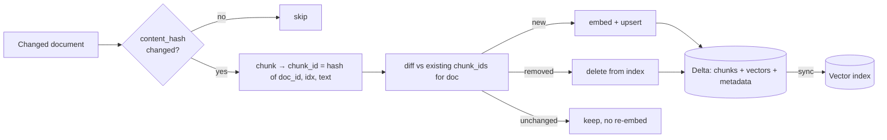
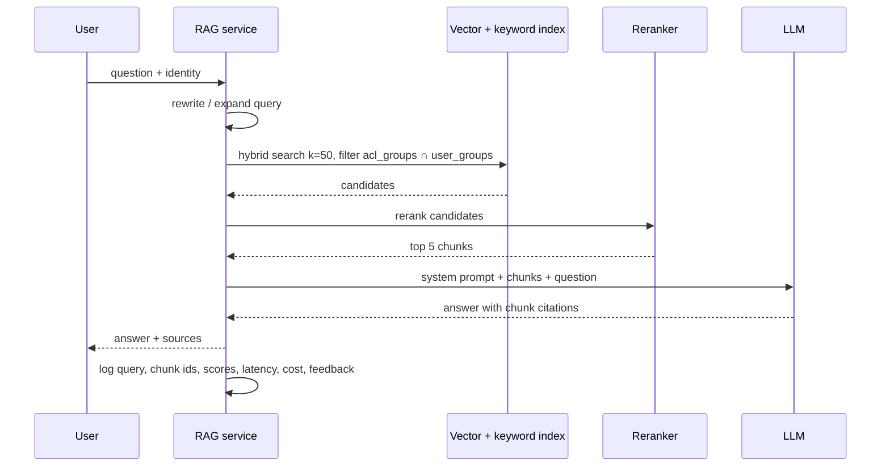
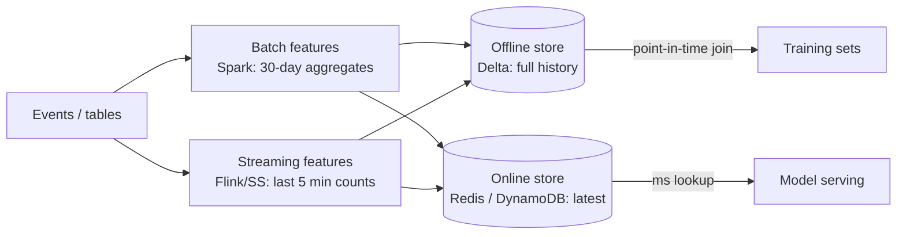
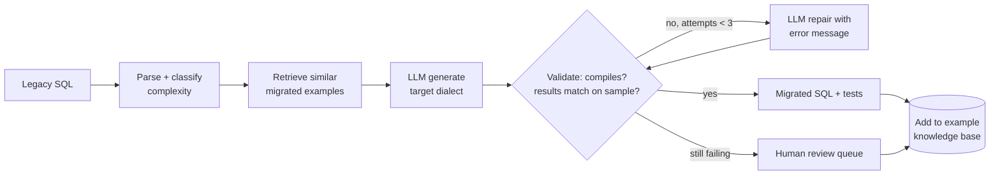

# Data Architecture for AI: RAG, Feature Stores, LLM Ops

> "AI data engineer" interviews mostly test whether you can apply data engineering rigour (incremental processing, idempotency, lineage, quality, governance) to AI workloads.


---

## 1. RAG in one paragraph

Retrieval-Augmented Generation: instead of relying on what a model memorised, **retrieve relevant documents at query time** and put them in the prompt. The LLM answers grounded in your data, with citations. It's the default architecture for "chat with our docs / tickets / data".

## 2. Ingestion pipeline (offline / incremental)

| Stage | Key decisions | Pitfalls |
|---|---|---|
| **Connect** | Pull vs webhook; incremental via `updated_at`, change APIs, content hash | Re-embedding everything nightly (cost), missing deletes |
| **Parse** | PDF/HTML/Office parsers, OCR, table extraction, layout-aware | Tables flattened into nonsense; headers/footers repeated in every chunk |
| **Clean** | Strip boilerplate, normalise whitespace, **redact PII**, language detect | PII leaking into an index everyone can query |
| **Chunk** | Size (300–800 tokens), overlap (10–20%), structure-aware (by heading/section), parent-child chunks | Splitting mid-table or mid-sentence; chunks without context ("it increased by 5%": what did?) |
| **Enrich metadata** | `doc_id, title, section_path, url, acl_groups, updated_at, version, language` | No ACLs → users retrieve docs they can't open |
| **Embed** | Model choice (dims, quality, cost, multilingual), batching, rate limits, retries | Mixing vectors from different models; no record of model version |
| **Index** | Vector DB choice, ANN index (HNSW/IVF), hybrid (BM25 + vector) | Index treated as source of truth (it should be rebuildable) |

### Idempotent, incremental design



- **Delta table of chunks is the source of truth**; the vector index is a derived, rebuildable serving copy (Databricks Vector Search delta-sync, or a sync job to pgvector/Pinecone).
- **Deletes propagate**: deleted doc → delete its chunk ids (and this is your GDPR path for the index).
- **Model upgrade = new index version** built in parallel, evaluated, then alias swap (blue/green).

### Chunking strategies

| Strategy | When |
|---|---|
| Fixed-size tokens with overlap | Baseline, homogeneous text |
| Recursive by separators (headings → paragraphs → sentences) | Most documents |
| Structure-aware (Markdown/HTML headings, code functions, SQL statements) | Docs, code, SQL repos |
| Semantic (split where embedding similarity drops) | Long unstructured text |
| Parent-child / small-to-big | Retrieve small precise chunks, pass the larger parent section to the LLM |
| Contextual chunks (prepend doc title/section summary) | Chunks that are ambiguous alone |

## 3. Retrieval (online)



- **Hybrid search** (BM25 + vectors, merged with reciprocal rank fusion) beats either alone, especially for IDs, error codes, and product names.
- **ACL filtering at retrieval time** (pre-filter), never "retrieve then hide".
- **Reranking** with a cross-encoder improves precision substantially for a small latency cost.
- **Guardrails:** refuse when retrieval confidence is low instead of hallucinating.

## 4. Vector stores

| Option | Good for |
|---|---|
| **pgvector** (Postgres) | < ~10–50M vectors, want SQL + transactions + one less system |
| **Managed lakehouse vector search** (Databricks Mosaic AI Vector Search, Snowflake Cortex) | Delta-synced indexes, governance via catalog |
| **Pinecone / Weaviate / Qdrant / Milvus** | Large scale, high QPS, advanced filtering |
| **Chroma / FAISS / LanceDB** | Local, prototypes, embedded |
| **Elasticsearch / OpenSearch** | Already have search infra; hybrid out of the box |

ANN index trade-off: **HNSW** = fast, high recall, memory-hungry; **IVF(-PQ)** = less memory, needs training, lower recall; **quantisation** (int8/binary) cuts memory 4–32× with a small recall loss.

## 5. Evaluation: the part most teams skip

| Layer | Metric | How |
|---|---|---|
| Retrieval | recall@k, precision@k, MRR, nDCG | Golden set of (question, relevant chunk ids) |
| Generation | Faithfulness/groundedness, answer relevance, completeness | LLM-as-judge calibrated against human labels; reference answers |
| System | Latency p50/p95, cost per query, refusal rate, freshness lag | Request logs |
| Business | Deflection rate, CSAT, thumbs up/down | Product analytics |

**Treat prompts, chunking configs, embedding models and retrieval params as versioned code**; every change runs the eval suite in CI before deployment. Grow the golden set from production failures (thumbs-down + reviewed).

## 6. Feature stores (classic ML)



- **Point-in-time correctness:** training rows must only use feature values known *at the label's timestamp*, otherwise you get leakage (great offline metrics, bad production).
- **Training/serving skew:** same feature definitions compute both offline and online values.
- Feature store = registry (definitions, owners, lineage) + offline store + online store + sync.

```sql
-- point-in-time join (AS OF) for training data
SELECT l.user_id, l.label_ts, l.label, f.txn_count_7d
FROM labels l
LEFT JOIN features f
  ON f.user_id = l.user_id
 AND f.feature_ts = (SELECT max(feature_ts) FROM features f2
                     WHERE f2.user_id = l.user_id AND f2.feature_ts <= l.label_ts);
```

## 7. LLM observability data model

Log every LLM call as data you can analyse:

```sql
CREATE TABLE llm_ops.requests (
  request_id STRING, session_id STRING, user_id_hash STRING, app STRING,
  ts TIMESTAMP, model STRING, prompt_version STRING,
  input_tokens INT, output_tokens INT, cost_usd DECIMAL(10,6), latency_ms INT,
  retrieved_chunk_ids ARRAY<STRING>, retrieval_scores ARRAY<DOUBLE>,
  tool_calls ARRAY<STRUCT<name STRING, args STRING, latency_ms INT, status STRING>>,
  status STRING, error STRING, feedback SMALLINT, eval_scores MAP<STRING, DOUBLE>
) CLUSTER BY (app, ts);
```

Powers: cost dashboards per team/app, latency SLOs, regression detection after model/prompt changes, and new golden-set examples.

## 8. Agentic data systems

LLM agents that plan and call tools (SQL, APIs, code execution) over multiple steps. Data-engineering concerns:
- **Tools are APIs with contracts:** typed inputs/outputs, idempotent where possible, permission-scoped (the agent runs as the user or a least-privilege principal).
- **Grounding with metadata:** catalog descriptions, column comments, lineage, sample queries are the "documentation" an agent reads. Good metadata = good agents.
- **Validation loops:** e.g. an LLM-driven SQL migration (legacy dialect → Spark SQL) works best as a pipeline: parse → retrieve similar already-migrated examples (RAG over a migration knowledge base) → generate → **validate** (compile, run on sample data, compare result sets to the legacy system) → repair loop → human review for low-confidence cases.
- **Observability and cost control:** trace every step; cap steps/tokens per task.
- **Evaluation:** task success rate on a benchmark set, not vibes.



## 9. Interview questions

<details><summary>Your RAG assistant gives outdated answers. Where do you look?</summary>

Freshness of the ingestion pipeline (connector lag, failed incremental runs), whether updated documents are re-chunked/re-embedded (content hash logic), whether old chunks are deleted (duplicates of old versions outrank new ones), whether the index sync from the chunks table is lagging, and whether retrieval prefers recency when relevant (metadata boosting/filters). Add a freshness metric: max(source updated_at) − max(index updated_at).
</details>

<details><summary>How do you enforce document permissions in RAG?</summary>

Ingest ACLs with each chunk (groups/users allowed), keep them synced on permission changes, and pre-filter retrieval by the requesting user's groups (from the IdP). Never rely on the LLM to hide content. Audit retrieval logs. For very fine-grained permissions consider per-tenant indexes.
</details>

<details><summary>How would you evaluate whether a new embedding model is better?</summary>

Build index v2 in parallel with the new model, run the golden retrieval set (recall@k, MRR) and end-to-end generation evals on both, compare cost/latency/memory, check slices (languages, doc types). If better, canary to a fraction of traffic, monitor feedback, then swap the alias. Never mix models within one index.
</details>

<details><summary>What is training/serving skew and how do feature stores prevent it?</summary>

Features computed differently for training (batch SQL over history) and serving (online code), producing different values → model degrades in production. Feature stores define features once and materialise both offline and online from the same definition, with point-in-time joins for training.
</details>
