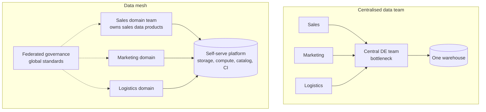
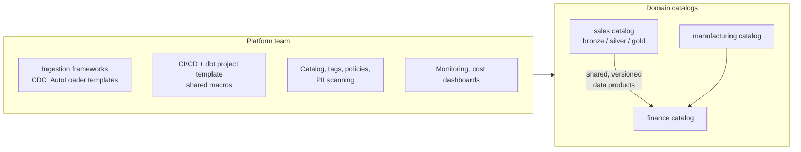

# Data Mesh, Data Products and Platform Thinking

> Senior and staff interviews increasingly include "how would you organise data for a company with N domains?" This is about architecture **and** people.

---

## 1. Centralised vs federated

## 2. The four data mesh principles (Zhamak Dehghani)

1. **Domain ownership:** the teams closest to the data own it end to end, including quality and SLAs.
2. **Data as a product:** datasets have owners, documentation, SLAs, versioning, discoverability. Consumers are customers.
3. **Self-serve data platform:** a platform team provides paved roads (ingestion templates, CI/CD, catalog, compute, monitoring) so domains don't each reinvent infrastructure.
4. **Federated computational governance:** global rules (PII handling, naming, interoperability, quality minimums) agreed centrally and **enforced automatically** by the platform.

## 3. What a "data product" looks like

| Attribute | Example |
|---|---|
| Name & owner | `logistics.shipments_daily`, owned by the Logistics data team, on-call channel |
| Interface | Gold table(s) + documented columns + semantic definitions |
| Contract | Schema, freshness (by 06:00), quality checks, versioning policy |
| Discoverability | Catalog entry, tags, sample queries, lineage |
| Access | Request workflow, policies applied via tags |
| Observability | Freshness/volume/quality dashboards, usage stats |

## 4. Multi-domain lakehouse reference layout

Practical patterns:
- **One catalog per domain** (per environment), schemas per layer; cross-domain consumption only via published gold data products (no reaching into another domain's silver).
- **Shared macro/library package** (masking, surrogate keys, audit columns, DQ checks) versioned by the platform team so 8 domains don't write 8 versions of the same logic.
- **Templates** (cookiecutter / asset bundles) for new pipelines: logging, alerting, tests, permissions pre-wired.
- **Conformed dimensions** (customer, product, calendar) owned by one domain and consumed by all.

## 5. When NOT to do data mesh

- Small company (< ~5 data engineers), few domains: centralised is faster and cheaper.
- Domains lack data skills or headcount: ownership on paper only.
- No platform investment: "mesh" becomes a mess of duplicated pipelines.

A common middle ground is **hub-and-spoke**: central platform + central core models (conformed dims), domain teams own their marts.

## 6. Cost management (FinOps for data)

| Lever | Example |
|---|---|
| Right-size and autoscale | Job clusters per job, autoscaling, auto-termination, serverless |
| Spot / preemptible instances | Workers on spot for batch, on-demand driver |
| Incremental over full refresh | MERGE/streaming instead of daily rebuilds of 10 TB |
| Storage tiers & retention | Bronze → infrequent-access after 90 days; VACUUM; drop unused tables |
| Query efficiency | Clustering, pruning, avoid `SELECT *`, cache hot results |
| Chargeback / showback | Tags per domain/job → cost dashboards → accountability |
| Kill zombie pipelines | Lineage + usage stats: tables nobody queried in 90 days |

Senior phrasing: *"I'd tag every job and warehouse with domain and owner, publish a weekly cost dashboard per domain, and target the top 10 most expensive jobs first. It's usually full refreshes that should be incremental, or tables with small-file problems."*

## 7. Interview questions

You're the first senior data engineer at a 200-person company with a messy warehouse. What do you do in the first 90 days?

Listen first: inventory sources, pipelines, consumers, pain points, top-used dashboards. Quick wins: monitoring/alerting on critical pipelines, fix the top recurring failures, document the 10 most important tables. Establish foundations: version control + CI for transformations (dbt), layering conventions, naming, ownership. Define a target architecture and a migration plan by value. Agree on SLAs with stakeholders. Avoid a big-bang rewrite.

How do you prevent 8 domain teams from each defining "active customer" differently?

Conformed, centrally owned definitions in a semantic/metrics layer (dbt semantic layer, metric views, LookML) with certified tables; governance process to propose and approve metric definitions; badges in the catalog (certified vs experimental); deprecate duplicates using usage stats.

How do you onboard a new domain onto a shared lakehouse quickly and safely?

Self-serve template: catalog + schemas + groups + default policies created by automation (Terraform); pipeline template with CI, tests, monitoring; shared macro package; onboarding docs and office hours; PII scanning on by default; a "first data product" checklist reviewed by the platform team.

