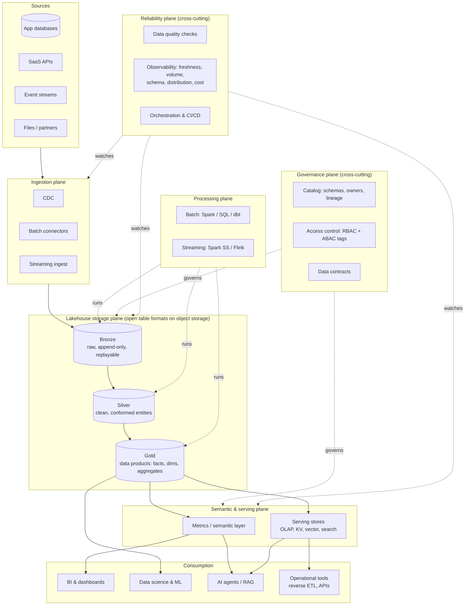

# The Big Picture: How It All Fits Together

Interviewers often ask a deceptively simple question: *"Draw your ideal data platform and explain how the pieces relate."* Candidates who know each buzzword in isolation (lakehouse, medallion, mesh, contracts, observability, semantic layer, catalog) often struggle to connect them. This module gives you **one coherent map** and the language to walk through it.

---

## 1. The map

Read it as **planes**:

| Plane | Question it answers | Key concepts |
|---|---|---|
| **Ingestion** | How does data get in, reliably and incrementally? | CDC, connectors, streaming, schema registry, contracts at the boundary |
| **Storage (lakehouse)** | Where does the authoritative copy live, and how is it organised? | Open table formats, medallion layers, partitioning/clustering, time travel |
| **Processing** | How is data transformed, and how fresh is it? | Batch vs streaming, incremental models, idempotency |
| **Semantic & serving** | How do consumers get consistent answers at the right latency? | Semantic/metrics layer, serving stores, APIs |
| **Governance** | Who owns it, who can see it, what does it mean? | Catalog, lineage, access policies, contracts, classification |
| **Reliability** | Is it correct and on time, and do we know when it isn't? | Quality checks, observability, SLOs, orchestration, CI/CD |
| **Organisation** | Who builds and owns each piece? | Central platform vs domain teams (data mesh) |

---

## 2. How the concepts relate (the sentences to say)

- **The lakehouse is the storage and processing foundation**: one copy of data in open formats that serves BI, ML and streaming. It's *where* data lives.
- **Medallion is the internal layout of that foundation**: bronze (raw, replayable) → silver (clean, conformed) → gold (consumer-ready). It's *how* data is refined, and each layer boundary has a contract.
- **Data mesh is the ownership model on top**: domains own their gold (and often silver) **data products**; a central platform team provides the lakehouse, tooling and standards. Mesh answers *who* owns what. It's not a technology.
- **Data contracts are the interfaces between owners**: schema, semantics, SLAs and change policy between producers and consumers (source team → platform, domain → domain). They make mesh workable.
- **Data quality checks enforce the contracts in the pipeline**: the tests that block bad data at each layer boundary (write-audit-publish).
- **Observability watches everything continuously**: freshness, volume, schema, distribution and lineage, catching what tests didn't anticipate and telling owners *before* consumers notice.
- **The catalog is the system of record for metadata**: what exists, who owns it, lineage, classifications and permissions. Governance policies (ABAC tags, masking) are enforced through it.
- **The semantic layer is the single definition of business meaning**: metrics and dimensions defined once on top of gold, consumed identically by BI tools, notebooks and AI agents.
- **Serving stores are performance projections of gold**: specialised copies (OLAP, KV, vector, search) for specific latency and concurrency needs, always rebuildable from the lakehouse.
- **Orchestration and CI/CD are the delivery mechanism**: they run pipelines in the right order (data-aware) and ship changes safely.

---

## 3. Follow one number from source to screen

*"Weekly active customers in Germany"* on the executive dashboard:

1. **Source:** `customers` and `sessions` live in app Postgres; clickstream events flow through Kafka.
2. **Ingestion:** CDC streams `customers` changes; events land via streaming ingest. Both write to **bronze** with schema evolution, under a contract with the app team (required fields, types, change notice).
3. **Silver:** dedupe events by `event_id`, apply CDC to a current-state `customers` table (and SCD2 history), conform country codes, pseudonymise emails. **Quality checks:** unique keys, valid country codes, event volume within the expected band.
4. **Gold (data product owned by the Growth domain):** `fct_customer_activity_daily` with documented grain and SLAs, plus a conformed `dim_customer` from the platform team.
5. **Semantic layer:** `weekly_active_customers = count_distinct(customer_id) where active_days ≥ 1 over ISO week`, with dimension `country`. This is defined once.
6. **Consumption:** the BI dashboard, a notebook and the AI analytics assistant all query the metric through the semantic layer and get the same number.
7. **Governance:** the catalog shows the lineage from dashboard to sources and the owners at each hop; ABAC masks PII for analysts; the metric is marked "certified".
8. **Reliability:** freshness SLO "Monday 07:00 UTC"; observability alerts if events from Germany drop 40% (e.g. a broken app release); the incident is routed to the Growth domain with lineage showing the upstream cause.

If you can tell this story fluently, you've demonstrated you understand how the pieces fit, which is exactly what the question is testing.

---

## 4. Responsibilities: platform team vs domain teams

| Capability | Central platform team | Domain team |
|---|---|---|
| Lakehouse infrastructure, compute policies, catalog | Owns | Uses |
| Ingestion frameworks, CDC tooling | Owns (self-serve) | Configures for their sources |
| Bronze for shared sources | Often owns | Consumes |
| Silver/gold data products | Provides templates and standards | **Owns** |
| Conformed dimensions (calendar, org, currency) | Owns | Consumes |
| Data contracts | Defines standards and enforcement tooling | Publishes and honours contracts for their products |
| Quality and observability | Provides the tooling | Defines checks and responds to alerts |
| Semantic layer | Runs the platform | Defines their domain's metrics (certified by governance) |
| Access policies | Global policies and tagging | Classifies their data, approves access |

---

## 5. Anti-patterns to name in interviews

- **Lakehouse as a dumping ground:** bronze grows forever, there's no silver/gold ownership, and every analyst rebuilds the same joins.
- **"Mesh" without a platform:** every domain reinvents ingestion, CI/CD and quality, so costs explode and standards fragment.
- **Metrics defined in dashboards:** five definitions of revenue in five BI workbooks; executives argue about numbers instead of decisions.
- **Observability without ownership:** alerts fire into a channel nobody owns.
- **Quality checks that never block:** warnings everyone ignores until a board deck is wrong.
- **Serving stores as sources of truth:** the Redis copy drifts from gold and nobody can rebuild it.
- **Governance as a gate, not a platform:** manual approval tickets for every table instead of tag-based policies applied automatically.

---

## 6. How to walk through it in an interview (2 minutes)

> "I think of the platform as planes. **Ingestion** brings data in via CDC, connectors and streams, under contracts with source teams. It lands in a **lakehouse**: open table formats on object storage, organised as medallion layers so raw data stays replayable and curated data has clear contracts. **Processing** is batch or streaming depending on freshness needs, always idempotent. Domain teams own **gold data products**, a mesh-style ownership model on a shared platform. A **semantic layer** defines metrics once for BI, notebooks and AI agents, and **serving stores** handle low-latency use cases. Cutting across everything, the **catalog** holds metadata, lineage and tag-based access policies, and the **reliability plane** (quality checks that gate publishing plus observability on freshness, volume and schema) makes sure we know before consumers do when something is wrong. Then I'd tailor each plane to your constraints: for example, if you're BI-only with a small team, a warehouse with dbt and a semantic layer may be all you need."

---

## Related modules

- [Lakehouse & medallion](/interview-prep/learn/architecture/01-lakehouse-and-medallion/) · [Storage & table formats](/interview-prep/learn/architecture/05-storage-and-table-formats/) · [Data quality & observability](/interview-prep/learn/architecture/07-data-quality-and-observability/) · [Governance, security & privacy](/interview-prep/learn/architecture/08-governance-security-privacy/) · [Data mesh & platform](/interview-prep/learn/architecture/10-data-mesh-and-platform/)
- Practice: [Governed enterprise lakehouse design](/interview-prep/practice/system-design/multi-domain-lakehouse/) · [Data quality platform design](/interview-prep/practice/system-design/data-quality-platform/)
- Questions: [Advanced pipeline architecture](/interview-prep/interview-qa/12-pipeline-architecture-advanced/)
