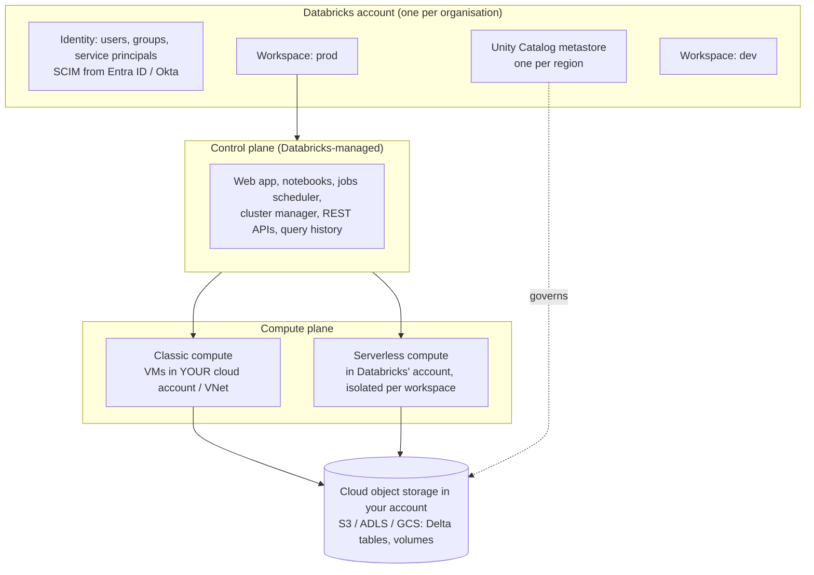

# Databricks 1: Platform Architecture and Compute

Databricks interviews start with "how does the platform work?" and quickly move to "which compute would you use for this workload, and what will it cost?". This module gives you the architecture vocabulary and the decision rules.

---

## 1. The architecture: control plane and compute plane

- **Control plane:** run by Databricks. Hosts the UI, notebooks' source, job definitions, cluster management and APIs. Your data isn't stored here (beyond metadata such as query text and results caching settings).
- **Compute plane:** where data is processed.
  - **Classic:** clusters run as VMs in **your** cloud subscription and network (you control VNet/VPC, NAT, firewalls; you pay the cloud provider for VMs plus Databricks for DBUs).
  - **Serverless:** compute runs in Databricks-managed infrastructure, starts in seconds, scales automatically, and is billed in DBUs only. Isolation between customers is enforced by Databricks.
- **Storage:** your data lives in **your** object storage (or in Unity Catalog managed storage you configure), as Delta/Parquet files. Databricks compute accesses it with credentials governed by Unity Catalog.
- **Account vs workspace:** the account holds identities, Unity Catalog metastores, billing and networking configs. Workspaces are environments (prod, dev, per business unit) attached to a regional metastore, which lets several workspaces share governed data.

**Why it matters in interviews:** security questions ("does data leave our account?"), networking (private link, no public IPs), and the classic vs serverless trade-off all follow from this split.

---

## 2. Compute types and when to use each

| Compute | What it is | Use it for | Avoid for |
|---|---|---|---|
| **All-purpose (interactive) cluster** | Long-running cluster shared by notebooks | Development, exploration, collaboration | Production jobs (more expensive DBU rate, shared state, "it worked on my cluster") |
| **Jobs compute (job cluster)** | Created for a job run, terminated after | Scheduled production pipelines on classic compute | Interactive work |
| **Serverless compute for notebooks/jobs** | Managed, instant-start compute | Most jobs and notebooks when the workload fits serverless limits; spiky or short workloads | Workloads needing custom VM images, specific instance types, GPUs, or unsupported libraries/configs |
| **Serverless Lakeflow Declarative Pipelines** | Managed pipeline compute with enhanced autoscaling | Declarative ETL (streaming tables, materialised views) | Custom low-level Spark tuning |
| **SQL warehouse (serverless / pro / classic)** | SQL-optimised endpoint with Photon, caching, concurrency scaling | BI dashboards, SQL analytics, dbt runs | Python/Scala ETL |
| **Instance pools** | Pre-warmed idle VMs for classic clusters | Faster classic cluster start, reduced cloud API throttling | Serverless (not needed) |
| **GPU / ML runtime clusters** | Clusters with ML libraries and GPUs | Deep learning, fine-tuning, batch inference | General ETL |

**Access modes (Unity Catalog era):**
- **Standard** (formerly *shared*): multi-user, with user isolation and fine-grained access control enforced; supports Python/SQL/Scala on recent runtimes.
- **Dedicated** (formerly *single user*): assigned to one user or group; needed for some workloads (ML runtimes, RDD APIs, certain libraries).
- **No isolation**: legacy, not governed by Unity Catalog. Avoid.

---

## 3. Databricks Runtime and Photon

- **Databricks Runtime (DBR):** a versioned bundle of Spark plus Databricks optimisations, Delta Lake and libraries. Use **LTS** versions for production stability; the ML runtime adds ML libraries.
- **Photon:** a vectorised query engine written in C++ that executes Spark SQL/DataFrame operations on columnar batches. It speeds up scans, joins, aggregations and writes (especially Delta `MERGE`, wide tables and SQL-heavy workloads). It's on by default for SQL warehouses and serverless.
  - Best for SQL/DataFrame-heavy work; **no benefit for Python UDFs or RDD code** (those still run outside Photon).
  - Photon compute has a higher DBU rate, so the speed-up must exceed the price difference. It usually does for heavy SQL; measure for your jobs.
  - The query profile shows which operators ran in Photon.

---

## 4. Autoscaling, spot and cluster policies

- **Autoscaling** adds and removes workers based on pending tasks. Classic autoscaling suits batch; **enhanced autoscaling** (pipelines, serverless) also considers streaming backlog and scales down more aggressively.
- **Auto-termination** on all-purpose clusters (e.g. 30-60 minutes idle) is the single easiest cost saving.
- **Spot/preemptible workers** for fault-tolerant batch: keep the driver on-demand, use spot with fallback for workers. Losing a spot node causes task retries (and lost shuffle files), so avoid spot for long stateful streaming jobs.
- **Cluster policies** constrain what users can create (instance types, max workers, mandatory tags, auto-termination, allowed runtimes, spot ratio). They're the main governance lever for classic compute cost and security.
- **Tags** on compute flow through to cloud billing and to the billing system tables for chargeback.

---

## 5. How cost works: DBUs

- A **DBU (Databricks Unit)** is a normalised unit of processing per hour. Each compute type has a DBU consumption rate per instance and a price per DBU that depends on the **product** (jobs, all-purpose, SQL, serverless, pipelines), tier and cloud.
- **Classic compute cost = cloud VM cost + DBU cost.** **Serverless cost = DBUs only** (higher DBU price, but no idle VM time and no separate cloud bill for compute).
- **Rule of thumb:** jobs compute is much cheaper per DBU than all-purpose, so running production on all-purpose clusters is a classic cost mistake.
- **Visibility:** the `system.billing.usage` and `system.billing.list_prices` system tables give usage by workspace, SKU, job, warehouse and custom tag. Build cost dashboards and budgets from them.

**Cost levers interviewers expect:** jobs instead of all-purpose compute, serverless for spiky/short workloads (no idle), auto-termination, right-sizing (memory vs compute-optimised), spot for batch, Photon where it pays back, liquid clustering and predictive optimisation to reduce scanned data, SQL warehouse auto-stop and sizing, and cluster policies to prevent oversized clusters.

---

## 6. Choosing compute: worked decisions

A nightly dbt project with 300 SQL models, run by a scheduler. Which compute?

A **serverless SQL warehouse** (or pro SQL warehouse) sized for the workload: Photon, result and disk caching, and intelligent workload management for concurrent models; it auto-stops after the run. Trigger it from a Lakeflow Job (dbt task) or your orchestrator.

A PySpark pipeline using a proprietary JVM library and a custom init script, every 2 hours.

**Classic jobs compute** with a cluster policy, because custom init scripts and specific libraries/instance types may not be supported on serverless. Use an LTS runtime, autoscaling, spot workers with fallback, and an instance pool if start time matters.

Ad-hoc data science exploration by 10 people.

A shared all-purpose cluster in **standard access mode** (Unity Catalog governed) with auto-termination and a policy limiting size, or serverless notebooks if the libraries fit. Use dedicated-mode or ML runtime clusters only for users who need GPUs or ML libraries.

A streaming pipeline that must run 24/7 with low latency.

A continuous Lakeflow Declarative Pipeline or a Structured Streaming job on **jobs compute with on-demand workers** (no spot for stateful streaming), RocksDB state store, autoscaling sized for peak, and alerts on processing lag. Serverless pipelines are an option if supported features fit.

---

## Interview questions

Explain the Databricks control plane and compute plane. Where does my data live?

The control plane (Databricks-managed) runs the web app, notebooks, job scheduler, cluster manager and APIs. The compute plane processes data: classic clusters run in your cloud account/network; serverless compute runs in Databricks-managed infrastructure with workspace isolation. Your table data lives in your cloud object storage (directly or as Unity Catalog managed storage), governed by Unity Catalog; the control plane holds metadata such as notebook source and job configs.

All-purpose vs job clusters vs serverless: how do you choose?

All-purpose for interactive development (higher DBU rate, shared); job clusters for scheduled production on classic compute (cheaper DBU rate, isolated per run, reproducible configuration); serverless when you want instant start and no infrastructure management, and the workload fits serverless constraints (supported languages, libraries and configs). SQL warehouses for SQL/BI and dbt.

What is Photon and when doesn't it help?

Photon is Databricks' vectorised C++ execution engine for Spark SQL and DataFrame operations. It accelerates scans, joins, aggregations, writes and MERGE on columnar batches. It doesn't help Python UDFs, RDD code or workloads dominated by I/O wait or external calls, and its higher DBU rate must be justified by the speed-up.

How would you control and reduce Databricks costs across 20 teams?

Visibility first: mandatory tags via cluster policies, billing system tables, dashboards and budgets per team. Then guardrails: policies (instance types, max workers, auto-termination, spot), production on jobs compute or serverless, SQL warehouse auto-stop and sizing. Then efficiency: Photon where it pays back, liquid clustering and predictive optimisation, incremental processing instead of full refreshes, and deleting unused tables and jobs. Review top spenders monthly with owners.

What do cluster access modes mean for Unity Catalog?

Standard (shared) access mode supports multiple users with isolation and enforces Unity Catalog fine-grained permissions, row filters and column masks; dedicated (single user) mode assigns compute to one user or group and supports workloads needing full machine access (ML runtimes, RDD APIs); no-isolation mode is legacy and can't access Unity Catalog data securely. Production pipelines typically run as a service principal on jobs compute or serverless.

