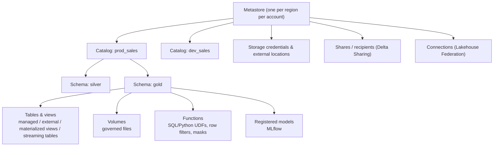

# Databricks 3: Unity Catalog and Governance

Unity Catalog (UC) is Databricks' unified governance layer for data and AI assets: tables, views, volumes (files), functions, models and more. Expect questions on its object model, how permissions inherit, how to implement row/column security, and how to lay out catalogs for environments and domains.

---

## 1. Object model



- **Three-level namespace:** `catalog.schema.object` (e.g. `prod_sales.gold.fct_orders`).
- **Metastore:** the top-level container per region, attached to one or more workspaces. Data can be shared across all workspaces attached to it (subject to **workspace-catalog binding**, which can restrict a catalog to specific workspaces, e.g. prod data only from the prod workspace).
- **Securable objects** include catalogs, schemas, tables, views, volumes, functions, models, storage credentials, external locations, connections, shares and clean rooms.

**Typical catalog layouts:**
- **By environment:** `dev`, `test`, `prod` catalogs with the same schema names, so promotion is a namespace change.
- **By environment × domain:** `prod_sales`, `prod_finance`, `dev_sales`… which gives clear ownership and isolation (often with separate managed storage locations per catalog).
- **By layer inside:** schemas `bronze`, `silver`, `gold` (or per data product).

---

## 2. Managed vs external, tables vs volumes

| | Managed table | External table |
|---|---|---|
| Storage location | UC-managed storage (configured per metastore, catalog or schema) | A path you specify in an external location |
| `DROP TABLE` | Deletes metadata **and** data (after a retention period allowing `UNDROP`) | Deletes metadata only; files remain |
| Optimisations | Predictive optimisation, automatic liquid clustering, faster metadata | You manage maintenance |
| Use when | Default for new tables | Data must stay in a specific location, shared with external systems, or migrated in place |

**Volumes** govern **non-tabular files** (CSVs to ingest, images, PDFs for RAG, ML artifacts) under the same namespace and permissions (`/Volumes/catalog/schema/volume/path`). They replace ad-hoc DBFS mounts, which are not governed and are deprecated for UC workloads.

**Storage credentials and external locations:** a *storage credential* wraps a cloud identity (IAM role, managed identity, service account); an *external location* binds a credential to a storage path. Users never handle cloud keys; they're granted `READ FILES`/`WRITE FILES`/`CREATE EXTERNAL TABLE` on the location.

---

## 3. Privileges and inheritance

- Privileges are granted to **principals** (users, groups, service principals); always grant to **groups**, never individuals.
- **Hierarchy:** to read `prod.gold.orders`, a user needs `USE CATALOG` on `prod`, `USE SCHEMA` on `prod.gold` and `SELECT` on the table (or on the schema/catalog, from which it **inherits** down).
- Granting `SELECT` on a schema covers all current **and future** tables in it, which is powerful for domains, and dangerous if over-granted.
- **Ownership:** every object has an owner (prefer a group or service principal) who can grant privileges on it.
- Common privileges: `USE CATALOG`, `USE SCHEMA`, `SELECT`, `MODIFY`, `CREATE TABLE`, `CREATE SCHEMA`, `READ VOLUME`, `WRITE VOLUME`, `EXECUTE` (functions/models), `MANAGE` (grant without owning), `BROWSE` (see metadata without data access).

```sql
GRANT USE CATALOG ON CATALOG prod_sales TO `sales-analysts`;
GRANT USE SCHEMA, SELECT ON SCHEMA prod_sales.gold TO `sales-analysts`;
GRANT MODIFY ON SCHEMA prod_sales.silver TO `sp-sales-pipelines`;     -- pipeline service principal writes
```

---

## 4. Fine-grained access: row filters, column masks and ABAC

**Row filters and column masks** are SQL UDFs attached to tables, evaluated on every query with the caller's identity:

```sql
CREATE FUNCTION gov.filters.by_region(region STRING)
RETURN is_account_group_member('admins') OR region IN (SELECT region FROM gov.acl.user_regions WHERE user = current_user());

ALTER TABLE prod_sales.gold.orders SET ROW FILTER gov.filters.by_region ON (region);

CREATE FUNCTION gov.masks.email(email STRING)
RETURN CASE WHEN is_account_group_member('pii-readers') THEN email ELSE regexp_replace(email, '^.*@', '***@') END;

ALTER TABLE prod_sales.gold.customers ALTER COLUMN email SET MASK gov.masks.email;
```

**Tag-based ABAC (attribute-based access control):** instead of attaching filters table by table, **governed tags** classify data (`pii=email`, `sensitivity=restricted`, `region`), and **policies** defined at catalog/schema level apply masks and filters to every column/table carrying the tag. Newly created tables are protected as soon as they're tagged, which is the scalable approach for thousands of tables. (ABAC rolled out recently; check availability in your workspace, and know the concept either way.)

**Dynamic views** (the older pattern): views with `CASE WHEN is_account_group_member(...)` logic. Still valid, but they multiply objects and are easy to bypass if users can read the underlying table.

---

## 5. Lineage, auditing and system tables

- **Lineage:** UC automatically captures table- and column-level lineage for queries run on UC-enabled compute (notebooks, jobs, pipelines, SQL), visible in Catalog Explorer and via APIs/system tables. Use it for impact analysis ("who breaks if I change this column?") and root cause analysis.
- **System tables** (`system.*` catalog) expose operational data as queryable Delta tables:
  - `system.access.audit` for audit logs: who accessed or changed what;
  - `system.access.table_lineage` / `column_lineage`;
  - `system.billing.usage` / `list_prices` for cost;
  - `system.compute.*` for clusters, warehouses and node utilisation;
  - `system.lakeflow.*` for job and pipeline runs;
  - `system.query.history` for SQL warehouse queries.

  These power cost dashboards, access reviews, SLA monitoring and anomaly detection.
- **Data quality monitoring:** Lakehouse Monitoring (data profiling and drift on tables and inference tables) integrates with UC.

---

## 6. Sharing and federation

- **Delta Sharing:** an open protocol to share live tables, views, volumes and models without copying. **Databricks-to-Databricks** sharing uses UC on both sides (recipients see shares as catalogs); **open sharing** gives non-Databricks recipients token/OIDC-based access via connectors (pandas, Spark, Power BI…). Shares are read-only, auditable and revocable; partitions or views can limit what's shared.
- **Clean rooms:** privacy-safe collaboration where parties run approved code on combined data without seeing each other's raw data.
- **Lakehouse Federation:** query external databases (Postgres, MySQL, Snowflake, BigQuery, SQL Server…) through UC **connections** and **foreign catalogs**, with UC permissions and lineage, without ingesting first. This is good for exploration and migration; for heavy, repeated workloads, ingest instead.
- **Catalog federation / Iceberg REST:** UC exposes tables to external engines via open APIs (including the Iceberg REST catalog interface), so other engines can read UC-governed tables.

---

## 7. Design example: governance for a multi-domain enterprise

1. One metastore per region; workspaces for dev/test/prod bound to the matching catalogs.
2. Catalogs per domain × environment with separate managed storage locations; schemas per layer.
3. Groups synced from the IdP via SCIM; privileges only on groups; pipelines run as service principals; no human `MODIFY` in prod.
4. Governed tags for PII and sensitivity applied at ingestion; ABAC policies mask PII and filter by region for everyone except approved groups.
5. Domain gold schemas shared to other domains with `SELECT` grants or Delta Sharing; cross-domain consumption only via gold.
6. Audit and lineage system tables feed quarterly access reviews and a cost/usage dashboard.

See the full design in [Governed enterprise lakehouse](/interview-prep/practice/system-design/multi-domain-lakehouse/).

---

## Interview questions

<details><summary>What problem does Unity Catalog solve compared with the legacy Hive metastore?</summary>

The Hive metastore was per workspace, had coarse table ACLs that only applied on some cluster types, no lineage, no governance for files or ML models, and relied on mounts with shared credentials. Unity Catalog is account-level and multi-workspace: a three-level namespace, centralised fine-grained permissions (row filters, column masks, ABAC), governed files (volumes), models and functions, automatic lineage, audit logs and system tables, credential management via storage credentials and external locations, and open sharing/federation.
</details>

<details><summary>Managed vs external table: what happens on DROP, and which do you default to?</summary>

Dropping a managed table removes metadata and (after a retention window allowing UNDROP) the underlying data; dropping an external table removes only metadata. Default to managed tables: UC handles storage layout, predictive optimisation and automatic clustering. Use external tables when data must live at a specific path or be written by external systems.
</details>

<details><summary>How do permissions inherit in Unity Catalog? What does a user need to query a table?</summary>

Privileges granted on a catalog or schema apply to all current and future child objects. To query `c.s.t` a user needs `USE CATALOG` on c, `USE SCHEMA` on c.s, and `SELECT` on t (directly or inherited from s or c). Grants should target groups; owners (ideally groups/service principals) can grant privileges on their objects.
</details>

<details><summary>Implement 'analysts see only their region's rows and masked emails'.</summary>

Create a row-filter SQL function that checks the caller's group membership or a region-mapping table (`current_user()`, `is_account_group_member()`), and attach it with `ALTER TABLE … SET ROW FILTER … ON (region)`. Create a mask function returning the email only for a `pii-readers` group and attach it with `ALTER COLUMN email SET MASK`. At scale, tag the columns (`pii=email`, `region`) and define ABAC policies once at catalog/schema level so every tagged table is protected automatically.
</details>

<details><summary>How would you share curated data with an external partner who doesn't use Databricks?</summary>

Delta Sharing open sharing: create a share containing the relevant tables (or views limiting rows/columns), create a recipient with token or OIDC federation, and grant the share. The partner reads live data with pandas, Spark, Power BI or other connectors without copying; access is audited and revocable, and you can share specific partitions or table versions with history.
</details>

<details><summary>What are system tables, and give two uses.</summary>

Databricks-managed, queryable Delta tables in the `system` catalog covering audit logs, lineage, billing, compute, jobs/pipelines and query history. Uses: a cost dashboard and budgets per team from `system.billing.usage` joined with list prices and custom tags; security reviews detecting unusual access via `system.access.audit`; finding unused tables via lineage and access logs; and SLA monitoring of job durations from `system.lakeflow` tables.
</details>
