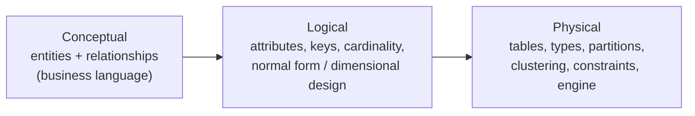
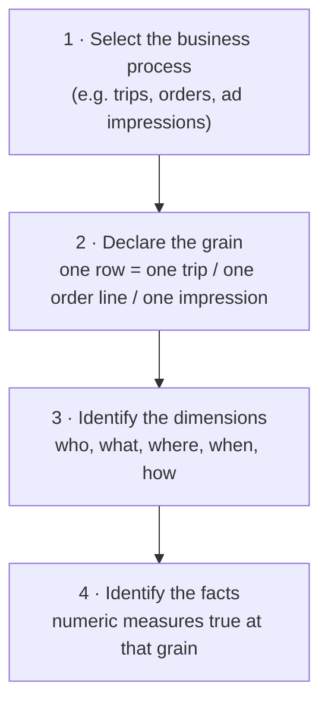

# The Data Modeling Process

> In a modeling interview, nobody cares if you memorised "star schema". They care whether you can turn a vague business ask into tables with a **clear grain** that answer the questions **correctly** and **efficiently**, and evolve without breaking.

---

## 1. Three levels of models

| Level | Audience | Example |
|---|---|---|
| Conceptual | Business stakeholders | "A **rider** requests a **trip**; a **driver** fulfils it; the trip has a **payment**." |
| Logical | Engineers, analysts | `fact_trip(trip_id, rider_key, driver_key, date_key, fare_amount, …)`, `dim_rider(rider_key, …)` |
| Physical | Engineers | Delta table clustered by `(trip_date, city_id)`, `fare_amount DECIMAL(12,2)`, SCD2 columns |

## 2. OLTP vs OLAP modeling

| | OLTP (application DB) | OLAP (warehouse / lakehouse) |
|---|---|---|
| Goal | Fast, correct **writes**; integrity | Fast, understandable **reads** over history |
| Shape | Normalised (3NF): no redundancy | Denormalised: star schemas, wide tables |
| Queries | Point lookups, small transactions | Scans + aggregations over millions/billions of rows |
| History | Current state (overwrite) | Full history (append, SCD) |
| Users | Applications | Analysts, BI, ML |

### Normalisation in one table

| Form | Rule | Violation example |
|---|---|---|
| 1NF | Atomic values, no repeating groups | `phone_numbers = "123, 456"` |
| 2NF | No partial dependency on part of a composite key | `order_line(order_id, product_id, product_name)`: name depends only on product_id |
| 3NF | No transitive dependency | `customer(id, zip, city)`: city depends on zip |

**Why OLAP denormalises:** joins across 15 normalised tables are slow and error-prone for analysts. A star schema trades storage redundancy (cheap) for query simplicity and speed. **Why not one giant table for everything:** updates to a dimension attribute would require rewriting billions of fact rows, and different facts have different grains.

---

## 3. Kimball's four-step design process (use it in interviews)

### Step 2 is the one that matters: the grain

> **Grain = the exact meaning of one row.** Declare it in one sentence *before* listing columns.

- "One row per **order line** (product within an order)" ≠ "one row per **order**".
- Mixing grains in one table (e.g. order-level shipping fee repeated on each line) causes **double counting**. The most common modeling bug in production.
- Choose the **most atomic grain** available. You can always aggregate up; you can never drill down below your grain.

### Facts must be true at the grain

| Grain: one row per order line | Valid facts | Invalid facts |
|---|---|---|
| | quantity, line_amount, discount_on_line | order_shipping_fee (order-level), customer_lifetime_value (customer-level) |

Order-level facts go in an order-grain fact table (or are allocated to lines with an explicit rule).

---

## 4. The modeling interview script

1. **Clarify the business:** what decisions will this data support? List 4–6 concrete questions ("revenue by city by week", "average driver rating", "cancellation rate by hour").
2. **Identify business processes** (each typically becomes a fact table): trips, payments, ratings, driver shifts.
3. **Declare the grain** of each fact table.
4. **Dimensions** shared across facts (conformed): date, rider, driver, city, product.
5. **Draw the ERD** (star per process, shared dims in the middle).
6. **Handle change:** which dimension attributes need history (SCD2)? Late-arriving data?
7. **Validate against the questions:** write 2–3 of the business questions as SQL against your model. If a query is awkward, the model is wrong.
8. **Physical design:** partitioning/clustering, surrogate keys, incremental loading, data quality checks.
9. **Trade-offs:** star vs OBT for BI, SCD2 vs snapshots, where to compute metrics.

### Bus matrix: the one-slide summary of a model

| Business process (fact) | Date | Customer | Product | Store | Promotion | Employee |
|---|---|---|---|---|---|---|
| Sales (order line) | ✅ | ✅ | ✅ | ✅ | ✅ | ✅ |
| Inventory (daily snapshot) | ✅ | | ✅ | ✅ | | |
| Returns | ✅ | ✅ | ✅ | ✅ | | ✅ |
| Shipments | ✅ | ✅ | ✅ | | | |

Rows = facts, columns = **conformed dimensions**. It shows reuse and integration at a glance. Drawing it in an interview is a strong senior signal.

---

## 5. Keys

| Key | What | Why |
|---|---|---|
| **Natural / business key** | ID from the source (`customer_id = "C-1042"`) | Identifies the real-world entity |
| **Surrogate key** | Warehouse-generated (`customer_key = 98765`, or a hash) | Decouples from source IDs; **required for SCD2** (one entity, many versions); handles multiple sources with clashing IDs; compact joins |
| **Hash key** | `sha2(source_system || '|' || natural_key)` | Deterministic → idempotent loads, parallel loading without sequences (Data Vault style) |
| **Degenerate dimension** | Transaction ID kept on the fact with no dimension table (`order_number`) | Grouping lines per order, drill-through to source |

**Unknown / ghost members:** reserve `customer_key = -1` ("Unknown") so facts with missing or late dimension data still join (no inner-join row loss), and fix them later.

---

## 6. Common modeling mistakes (and how interviewers expose them)

| Mistake | Symptom | Fix |
|---|---|---|
| Undeclared or mixed grain | Totals double count | State grain; split fact tables |
| Facts in dimensions (e.g. `customer.total_spend`) | Stale, inconsistent numbers | Keep measures in facts; derive aggregates |
| Snowflaking everything | Many joins, slow BI | Flatten small hierarchies into the dimension |
| No history strategy | "What was the customer's tier when they ordered?" can't be answered | SCD2 or point-in-time snapshot |
| Using natural keys only | SCD2 impossible; source key collisions | Surrogate keys |
| Inner joins to dims with missing members | Silent fact loss | Unknown members + left joins + DQ checks |
| One table per dashboard | Metric drift, cost | Conformed facts/dims + semantic layer |
| Nullable foreign keys in facts | Unjoinable rows | Default to unknown member key |

---

## 7. Practice

Work through the [data modeling case studies](/interview-prep/practice/data-modeling/). Each follows this exact script.
