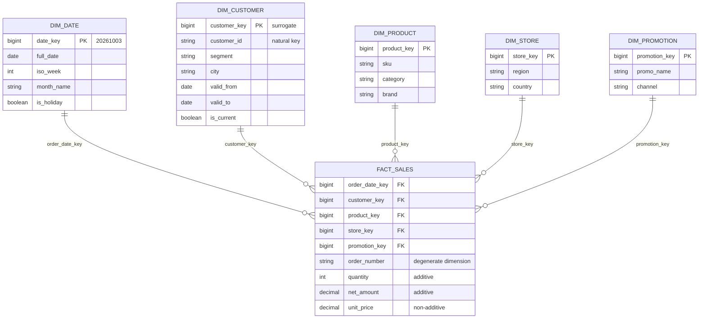
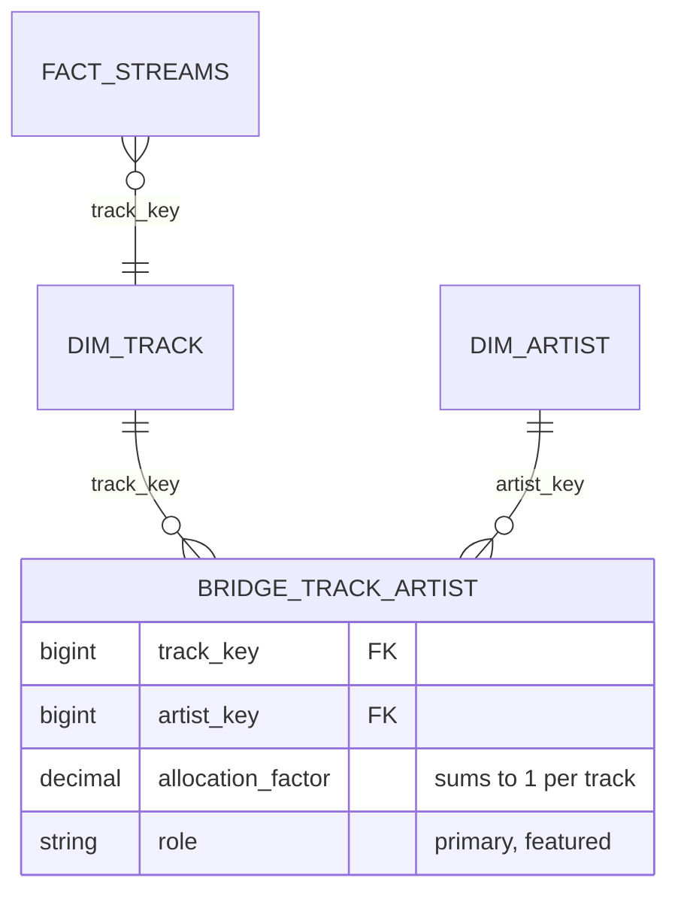

# Dimensional Modeling Deep Dive

---

## 1. The three (plus one) fact table types

| Type | Grain | Rows… | Example | Typical facts |
|---|---|---|---|---|
| **Transaction** | One row per event | are inserted, never updated | Order line, click, payment | amount, quantity |
| **Periodic snapshot** | One row per entity per period | inserted each period | Daily account balance, monthly inventory | balance, quantity_on_hand (semi-additive) |
| **Accumulating snapshot** | One row per process instance (with milestones) | **updated** as milestones happen | Order lifecycle: ordered → paid → shipped → delivered | timestamps per milestone, lag durations |
| **Factless fact** | One row per event/coverage with no measures | inserted | Student attendance, product on promotion (coverage) | just keys (COUNT(*) is the measure) |

### Accumulating snapshot example

| order_id | ordered_date_key | paid_date_key | shipped_date_key | delivered_date_key | hours_to_ship | hours_to_deliver |
|---|---|---|---|---|---|---|
| 1001 | 20261001 | 20261001 | 20261002 | 20261004 | 26 | 72 |
| 1002 | 20261002 | 20261002 | -1 (not yet) | -1 | NULL | NULL |

Great for **pipeline/funnel analysis** (where are orders stuck?). Multiple date keys = the date dimension plays several **roles**.

## 2. Additivity

| Measure type | Can be summed across… | Example | How to aggregate |
|---|---|---|---|
| **Additive** | all dimensions | revenue, quantity | SUM |
| **Semi-additive** | some dimensions, **not time** | account balance, inventory level, headcount | SUM across accounts; AVG/last-value across time |
| **Non-additive** | none | unit price, ratios, percentages, distinct counts | Store components (numerator, denominator) and compute the ratio after aggregation |

**Interview trap:** "Total balance for March" = SUM of daily balances is wrong. Use the end-of-month balance (or average daily balance). And never store a precomputed `conversion_rate` in a fact to be averaged later; store `conversions` and `visits`.

## 3. Dimension patterns

### Conformed dimensions
Same dimension (same keys, same attribute meanings) shared by multiple fact tables → you can **drill across** processes ("orders vs returns by product category"). The backbone of an integrated warehouse (the bus matrix columns).

### Role-playing dimensions
One physical dimension used in several roles: `dim_date` as order date, ship date, delivery date; `dim_airport` as origin and destination; `dim_user` as sender and receiver. Implement with views or aliases (`dim_date AS ship_date`).

### Degenerate dimensions
Identifiers with no attributes worth a table (`order_number`, `invoice_id`, `ticket_id`) stored directly on the fact. Useful for grouping and drill-back to the source.

### Junk dimensions
Several low-cardinality flags/indicators (`is_gift`, `payment_type`, `channel`, `is_express`) combined into one small dimension of all observed combinations, instead of 6 columns or 6 tiny dimensions on a billion-row fact.

### Mini-dimensions
Rapidly changing attributes of a huge dimension (customer age band, income band, loyalty score band) split into a separate small dimension referenced directly by the fact. Avoids an exploding SCD2 customer dimension.

### Outriggers
A dimension referencing another dimension (customer → `dim_geography`). Acceptable sparingly; most of the time flatten.

### Bridge tables (many-to-many)

A song has multiple artists; a patient has multiple diagnoses; a bank account has multiple owners.

Joining facts through a bridge **multiplies rows**, so revenue per artist double counts unless you either multiply by an `allocation_factor` (weights summing to 1 per track) or report counts explicitly as "streams involving the artist" (non-additive across artists). Always mention this.

### Hierarchies
- **Fixed-depth** (country → region → city): flatten as columns in the dimension.
- **Ragged / variable-depth** (org charts, account trees): parent–child table + a **closure/bridge table** (ancestor, descendant, depth) for easy roll-ups; or recursive CTEs.

## 4. Factless fact tables

- **Event tracking:** `fact_attendance(student_key, class_key, date_key)`: count attendance.
- **Coverage:** `fact_promotion_coverage(product_key, store_key, date_key)`: which products *were on promotion*. Answer "promoted products that **didn't** sell" by anti-joining coverage with sales. That question is impossible with the sales fact alone.

## 5. Late-arriving data

| Situation | Problem | Solution |
|---|---|---|
| **Late-arriving dimension** (fact references customer C-9 not yet in dim) | FK lookup fails | Insert an **inferred member** (placeholder row with natural key, attributes "Unknown", flag `is_inferred`), use its key; update attributes when the real record arrives (SCD1 on the inferred row) |
| **Late-arriving fact** (event from last month arrives today) | Which dimension version applies? | Look up the SCD2 version valid at the **event time**, not the current version; partition by event date and restate aggregates |
| **Early-arriving fact for future-dated dims** | | Same lookup by effective dates |

## 6. Star vs snowflake vs OBT

| | Star | Snowflake | One Big Table (OBT) |
|---|---|---|---|
| Shape | Fact + denormalised dims | Dims normalised into sub-dimensions | Fact pre-joined with all dimension attributes |
| Joins | 1 hop | Multiple hops | None |
| Storage | Moderate | Least | Most (repeated attributes) |
| Dimension changes | Update dim rows | Update sub-dim rows | **Rewrite fact rows** |
| BI performance | Good | Worse | Best (columnar engines love it) |
| Best for | Default warehouse/lakehouse model | Very large, shared hierarchies; rarely worth it | Serving layer for a specific dashboard/ML feature set |

Modern practice: **star schema as the governed core**, OBTs (or materialised views) generated **from** it for specific high-performance consumers. Columnar storage makes the repeated attributes in OBTs cheap (dictionary encoding).

## 7. Physical design in a lakehouse

- Facts: partition by date (if large) or liquid-cluster by `(date, frequently filtered key)`; incremental loads via MERGE / append.
- Dimensions: small → no partitioning; broadcast in joins; SCD2 via MERGE or `dbt snapshot`.
- Surrogate keys: hash keys (`xxhash64`/`sha2` of natural key + source) are deterministic and parallel-friendly; identity columns are compact but serialize inserts.
- Enforce **not-null FKs** with unknown members; test referential integrity in CI (dbt `relationships` tests).

## 8. Interview questions

What's the grain of a daily inventory fact, and why is quantity_on_hand semi-additive?

One row per product per store per day. You can sum quantity across products/stores for a given day (total stock), but summing across days counts the same stock repeatedly, so across time use the period-end value or average.

How would you model orders where shipping cost is charged per order but analysts analyse at line level?

Two options: (1) an order-grain fact holding shipping cost (and order totals) alongside the line-grain fact; (2) allocate shipping cost to lines by a documented rule (by line amount or weight) so line-level sums reconcile. Never repeat the full order-level fee on every line.

When would you choose a periodic snapshot over deriving state from transactions?

When state at a point in time is queried often and is expensive to reconstruct (balances from years of transactions, inventory from movements), or when the source only gives you snapshots. Snapshots trade storage for query simplicity and speed; transactions remain the source of truth.

Explain a junk dimension and when you'd use it.

A dimension of combinations of low-cardinality flags (payment_type × is_gift × channel). It keeps the fact narrow (one key instead of several flag columns), groups related indicators, and stays tiny (only observed combinations). Use it when you have several unrelated flags that don't belong to any other dimension.

