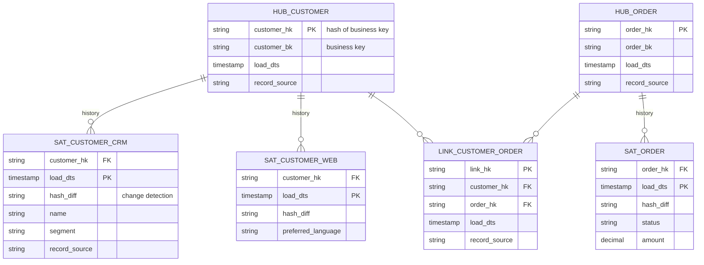
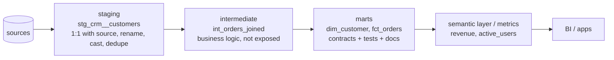

# Modern Data Modeling

> The modern stack (cheap columnar storage, elastic compute, dbt, lakehouses) changed *where* modeling effort pays off, but not *why* we model: correct, understandable, reusable data.

---

## 1. The big methodologies

| | Kimball (dimensional) | Inmon (CIF) | Data Vault 2.0 | One Big Table / wide tables |
|---|---|---|---|---|
| Core idea | Business-process stars with conformed dims, bottom-up | Normalised enterprise DWH (3NF), marts downstream | Hubs (keys), Links (relationships), Satellites (history), insert-only | Pre-joined denormalised tables per use case |
| Strength | Usable by analysts, fast BI | Single integrated truth | Auditability, many changing sources, parallel loading, history of everything | Simplicity, BI speed on columnar engines |
| Weakness | Integration across many sources takes design | Slow to deliver, complex | Not query-friendly: needs a dimensional/business layer on top | Duplication, metric drift, costly rebuilds |
| Typical place | Gold / marts | Legacy enterprise DWHs | Silver/integration layer in regulated enterprises | Serving layer for dashboards / ML |

**Pragmatic modern answer:** sources → bronze (raw) → silver (cleaned, conformed entities; sometimes Data Vault in regulated, multi-source enterprises) → gold (Kimball stars) → optional OBTs/semantic layer for consumption.

---

## 2. Data Vault 2.0



| Component | Contains | Changes |
|---|---|---|
| **Hub** | Unique business keys of a core concept (customer, order) + hash key | Insert-only, one row per key ever seen |
| **Link** | Relationships between hubs (customer–order) | Insert-only |
| **Satellite** | Descriptive attributes + history, per source / rate of change | Insert a row when `hash_diff` changes |
| (Business vault) | Derived/computed structures, PIT and bridge tables for performance | |

**Why people choose it:** dozens of sources that change often, strict audit ("show me exactly what system X said on date Y"), parallel loading (hash keys, no lookups), insert-only (no updates → easy restatement). **Why people avoid it:** 3× more tables, needs a dimensional layer for consumption, PIT (point-in-time) tables to make joins tolerable, and a team that knows the method.

---

## 3. One Big Table (OBT) in the lakehouse

```sql
CREATE OR REPLACE TABLE gold.obt_orders AS
SELECT f.*, c.segment, c.city, c.country, p.category, p.brand, d.iso_week, d.month_name, s.region
FROM gold.fct_order_lines f
JOIN gold.dim_customer c ON f.customer_key = c.customer_key
JOIN gold.dim_product  p ON f.product_key  = p.product_key
JOIN gold.dim_date     d ON f.order_date_key = d.date_key
JOIN gold.dim_store    s ON f.store_key    = s.store_key;
```

- Columnar compression makes repeated attributes cheap; BI tools love no-join tables.
- Build OBTs **from** the star schema (not instead of it): the star keeps definitions consistent; OBTs are disposable, rebuildable serving artifacts.
- Watch out for: SCD2 semantics (which version did you join?), rebuild cost when dimensions change, and grain mixing when you bolt on aggregates.

---

## 4. Modeling event data

Event streams (clickstream, IoT, app logs) have **many event types with different properties**.

| Approach | Shape | Pros | Cons |
|---|---|---|---|
| One table per event type | `fct_page_view`, `fct_add_to_cart` | Clean schemas, typed | Hundreds of tables, cross-event analysis needs unions |
| Single wide events table + semi-structured properties | `events(event_id, user_id, ts, event_type, properties VARIANT/MAP)` | Flexible, one table to query | Weak typing, property drift, JSON extraction cost |
| Hybrid (common) | Common columns typed + `properties` map; promote hot properties to columns in silver | Balance | Needs governance (tracking plan) |
| **Activity schema** | One narrow `activity_stream(entity_id, ts, activity, feature_1..3, revenue_impact, link)` | Any customer-journey question with self-joins on one table | Unfamiliar; extra modeling discipline |

**Always** include: `event_id` (dedup), `event_ts` (client), `received_ts` (server), `schema_version`, source/app version.

## 5. Semi-structured & nested data

- Bronze: keep raw JSON (`STRING`/`VARIANT`) to never lose fields.
- Silver: parse into typed structs; `explode` arrays into child tables when items are analysed independently (`order_items` from `order.items[]`).
- Keep nested `STRUCT`s when they're always read together (address, device info). Columnar formats store nested fields as separate columns, so you still get column pruning.
- Schema drift: `_rescued_data`, `mergeSchema`, contracts for promoted columns.

## 6. Modeling for streaming

- Facts are append-only streams → natural fit for transaction facts.
- Dimensions change → streaming joins need **versioned** (temporal) lookups: stream-to-static join against SCD2 with event-time predicates, or temporal table joins in Flink (`FOR SYSTEM_TIME AS OF`).
- Accumulating snapshots in streaming = **upserts** keyed by process id (order_id): MERGE into Delta, upsert tables in Pinot/Hudi.
- Pre-aggregated rollups (per minute/hour) are their own fact tables at coarser grain; state the grain clearly.

## 7. dbt project layering



Conventions: `stg_<source>__<entity>`, `int_<verb/description>`, `dim_`/`fct_`; tests on every primary key (unique + not_null) and foreign key (relationships); model contracts on public marts; exposures for dashboards.

## 8. Semantic / metrics layer

Problem: "revenue" is defined differently in 12 dashboards. Solution: define **metrics once** (measure + aggregation + filters + dimensions allowed) in a semantic layer (dbt Semantic Layer/MetricFlow, Databricks metric views, Cube, LookML, AtScale), and let BI tools query metrics instead of raw tables.

## 9. Choosing: a decision guide

| Situation | Model |
|---|---|
| Analytics for a product team, few sources | Kimball stars (+ OBTs for dashboards) |
| Many volatile sources, regulated, audit everything | Data Vault in silver, Kimball in gold |
| Exploratory, small team, speed over purity | Wide tables built in dbt, refactor to stars as reuse emerges |
| Customer-journey analytics across many event types | Activity schema or hybrid events table |
| ML feature engineering | Entity-centric feature tables (one row per entity per timestamp) |

## 10. Interview questions

<details><summary>Kimball or Data Vault for a new lakehouse with 40 source systems in a bank?</summary>

Likely Data Vault (or a vault-inspired integration layer) in silver for auditability, parallel loading and absorbing source changes without remodeling, with Kimball marts in gold for consumption. With few sources and a small team, a vault's overhead isn't justified; go straight to conformed silver entities + stars.
</details>

<details><summary>Is dimensional modeling obsolete with columnar warehouses and OBTs?</summary>

No. Columnar engines reduce the *performance* need for stars, but not the need for clear grain, conformed definitions, history handling and reuse. OBTs built from a governed star give both speed and consistency; OBTs without a core model drift and duplicate logic.
</details>

<details><summary>How do you model an events table where each event type has different properties?</summary>

Typed common columns (event_id, user_id, ts, event_type, session_id, app_version) plus a map/variant for properties; promote frequently used properties to typed columns in silver or per-event-type tables for hot events; enforce a tracking plan (schemas per event type) in a registry so properties don't drift.
</details>
