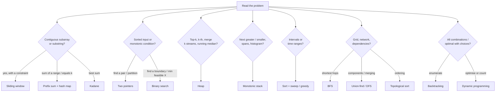

# Algorithm Patterns for the Coding Round

Most interview problems are a known pattern in disguise. Strong candidates don't memorise hundreds of solutions. They memorise about 16 templates, learn the **signals** that point to each one, and can explain the **invariant** that makes the template correct. This module gives you all three for every pattern, then links to runnable problems in the [Algorithms practice track](/interview-prep/practice/algorithms/).

> **How to use this page:** read one pattern, solve its linked problems back to back without looking at hints, then come back and re-read the pitfalls. Repetition within a pattern is what makes the template automatic.

---

## Step 0: The 60-second triage

Before writing code, answer four questions out loud. Interviewers grade this as much as the code.

1. **What's the input shape?** Array or string, sorted or not, stream or in-memory, grid, graph, intervals?
2. **What's being asked?** One answer, the best answer, all answers, or a count?
3. **What constraints?** `n ≤ 20` hints at exponential/backtracking; `n ≤ 10⁴` allows O(n²); `n ≥ 10⁵` means O(n log n) or O(n).
4. **What's the brute force, and what's it wasting?** The optimisation is usually "stop recomputing something".



**Complexity budget** (≈ 10⁸ simple operations per second in C, about 10⁷ in Python):

| n | Feasible | Typical pattern |
|---|---|---|
| ≤ 20 | O(2ⁿ), O(n!) for n ≤ 10 | Backtracking, bitmask DP |
| ≤ 500 | O(n³) | Interval DP, Floyd–Warshall |
| ≤ 10⁴ | O(n²) | 2D DP, all pairs |
| ≤ 10⁶ | O(n log n) | Sorting, heaps, binary search |
| ≥ 10⁷ or stream | O(n), O(1) memory | Sliding window, hashing, sketches |

---

## 1. Sliding window

**Signals:** "longest / shortest / count of **contiguous** subarray or substring" + a condition that can be checked incrementally (at most k distinct, sum ≥ target, no repeats, contains all of t).

**Template (variable size):**

```python
left = 0
for right, x in enumerate(arr):
    add(x)                              # expand the window
    while window_invalid():
        remove(arr[left])               # shrink from the left
        left += 1
    best = max(best, right - left + 1)  # window [left, right] is valid here
```

**Invariant:** after the `while`, `arr[left:right+1]` is the longest valid window ending at `right`.

**Why it's O(n):** each element enters once and leaves at most once, so the inner `while` runs O(n) times *in total*.

**When it's valid:** shrinking must never make an invalid window valid in a way you'd skip. Sums of **non-negative** numbers, counts and distinctness are monotonic. **Negative numbers break it** → use prefix sums instead.

**Variants:**
- *Fixed size k:* add `arr[i]`, remove `arr[i-k]` once `i ≥ k`.
- *Shortest valid window:* move the `best` update inside the `while`, before shrinking.
- *Exactly k:* `atMost(k) - atMost(k-1)`.

**Pitfalls:** forgetting the "only move left forward" rule when jumping (`left = max(left, last[c] + 1)`), comparing whole counters every step instead of tracking a `missing`/`matches` counter.

**DE angle:** stream window aggregations (tumbling/sliding), session limits, rate limiting, "longest period without an alert".

**Practice:** [Longest unique substring](/interview-prep/practice/algorithms/01-longest-unique-substring/) · [Minimum window](/interview-prep/practice/algorithms/02-minimum-window-substring/) · [Shortest burst](/interview-prep/practice/algorithms/03-minimum-size-subarray-sum/) · [k replacements](/interview-prep/practice/algorithms/04-longest-repeating-replacement/) · [All anagrams](/interview-prep/practice/algorithms/05-find-all-anagrams/) · [Moving average (stream)](/interview-prep/practice/python/12-moving-average-stream/)

---

## 2. Two pointers: opposite ends

**Signals:** sorted array, "find a pair/triplet", palindromes, "maximise area/width between two positions".

```python
lo, hi = 0, len(a) - 1
while lo < hi:
    if good(a[lo], a[hi]):
        record()
    if need_bigger:
        lo += 1
    else:
        hi -= 1
```

**Invariant (elimination argument):** every step discards a pointer that **cannot** be part of any better answer with the remaining candidates. Be ready to say *why*. In sorted two-sum: if `a[lo] + a[hi] < target`, `a[lo]` paired with anything left of `hi` is even smaller, so `lo` is useless.

**Complexity:** O(n) after an O(n log n) sort if the input isn't sorted.

**Pitfalls:** deduplication in 3Sum (skip equal anchors and equal `lo`/`hi` values after a match); greedy moves without a proof (Container With Most Water requires moving the *shorter* wall).

**DE angle:** a sorted two-pointer walk is a **merge join**; the hash-map alternative is a **hash join**.

**Practice:** [Two sum, both ways](/interview-prep/practice/algorithms/06-two-sum/) · [3Sum](/interview-prep/practice/algorithms/07-three-sum/) · [Container](/interview-prep/practice/algorithms/08-container-most-water/) · [Palindrome](/interview-prep/practice/algorithms/09-valid-palindrome/)

---

## 3. Two pointers: same direction (read/write)

**Signals:** "in place", "O(1) extra space", remove/compact/partition while keeping order.

```python
write = 0
for read in range(len(a)):
    if keep(a[read]):
        a[write] = a[read]
        write += 1
return write                 # a[:write] is the result
```

**Invariant:** `a[:write]` is the correct output for `a[:read]`.

**Pitfalls:** comparing with the *input* instead of the *output* (for "keep at most k copies" compare with `a[write - k]`), swapping vs overwriting (swap when the rejected elements must be preserved at the end).

**DE angle:** sort-based `DISTINCT`, compaction in one streaming pass with O(1) memory.

**Practice:** [Compact sorted array](/interview-prep/practice/algorithms/10-dedupe-sorted-in-place/) · [Move zeroes / remove element](/interview-prep/practice/algorithms/11-move-zeroes/) · [Merge sorted streams](/interview-prep/practice/python/05-merge-sorted-streams/)

---

## 4. Fast & slow pointers (Floyd)

**Signals:** linked list cycle, middle of a list, "a sequence produced by repeatedly applying a function", find a duplicate with O(1) memory and read-only input.

```python
slow = fast = start
while fast and fast.next:
    slow, fast = slow.next, fast.next.next
    if slow is fast:          # cycle; reset one pointer to start, move both by 1 → they meet at the entry
        ...
```

**Why the entry trick works:** if the tail is `a` long and they meet `b` into the cycle of length `C`, then `a + b = kC`, so walking `a` more steps from the meeting point lands on the entry.

**Pitfalls:** comparing values instead of identity (`is`), forgetting `fast.next` in the loop condition.

**DE angle:** detecting loops in parent-child hierarchies or redirect chains. For general graphs (job DAGs) use DFS colouring or Kahn's algorithm instead.

**Practice:** [Cycle + entry](/interview-prep/practice/algorithms/12-linked-list-cycle/) · [Happy number](/interview-prep/practice/algorithms/13-happy-number/) · [Find the duplicate](/interview-prep/practice/algorithms/14-find-duplicate-number/) · [Palindrome list](/interview-prep/practice/algorithms/15-palindrome-linked-list/)

---

## 5. Prefix sums (and prefix + hash map)

**Signals:** many range-sum queries; "subarray sum equals k"; "subarray divisible by k"; "longest balanced subarray"; negatives present (so no sliding window).

```python
prefix = [0]
for x in nums:
    prefix.append(prefix[-1] + x)
# sum(nums[i..j]) == prefix[j + 1] - prefix[i]

# count subarrays summing to k
seen = {0: 1}; running = 0; count = 0
for x in nums:
    running += x
    count += seen.get(running - k, 0)
    seen[running] = seen.get(running, 0) + 1
```

**Key identity:** a subarray sum is a **difference of two prefix sums**. Turning "find a subarray" into "find an earlier prefix with value P − k" makes it a hash lookup.

**Variants:** 2D summed-area tables; first-occurrence maps for "longest" questions; remainders for divisibility; difference arrays for range *updates*.

**Pitfalls:** seeding the map with `{0: 1}` (or `{0: -1}` for index maps), storing the *first* index when asked for the longest run.

**DE angle:** running totals, OLAP pre-aggregation, cumulative tables that answer any date range with one subtraction.

**Practice:** [Range sum 1D/2D](/interview-prep/practice/algorithms/16-range-sum-queries/) · [Divisible by k](/interview-prep/practice/algorithms/17-continuous-subarray-sum/) · [Pivot index](/interview-prep/practice/algorithms/18-pivot-index/) · [Subarray sum = target](/interview-prep/practice/python/18-subarray-sum-target/)

---

## 6. Binary search (boundaries and "on the answer")

**Signals:** sorted data; "first/last position"; "minimum X such that feasible(X)"; "maximise the minimum". Anything where a yes/no predicate flips **once**.

**The one template:** find the first index where `pred` becomes true.

```python
lo, hi = 0, len(a)            # answer in [lo, hi]; hi means "none"
while lo < hi:
    mid = (lo + hi) // 2
    if pred(mid):
        hi = mid              # mid may be the answer
    else:
        lo = mid + 1
return lo
```

- `lower_bound(x)`: `pred = a[mid] >= x`.
- `upper_bound(x)`: `pred = a[mid] > x`.
- **On the answer:** search `X` in `[lo_bound, hi_bound]` with `pred = feasible(X)` (usually a greedy O(n) check).

**Pitfalls:** mixing closed `[lo, hi]` and half-open `[lo, hi)` templates, `hi = mid - 1` with `mid` possibly being the answer, and infinite loops from `lo = mid` (use `mid = (lo + hi + 1) // 2` if you must).

**DE angle:** time-range lookups in sorted files and indexes, min/max-stat data skipping, and **capacity planning** ("smallest cluster that finishes by 6am").

**Practice:** [First/last position](/interview-prep/practice/algorithms/19-first-last-position/) · [Integer sqrt](/interview-prep/practice/algorithms/20-integer-sqrt/) · [Rotated array](/interview-prep/practice/algorithms/21-rotated-sorted-search/) · [Backfill capacity](/interview-prep/practice/algorithms/22-ship-within-days/) · [Time-based KV store](/interview-prep/practice/python/14-time-based-kv-store/)

---

## 7. Heaps

**Signals:** top-k, k-th largest/smallest, merging k sorted inputs, scheduling by earliest finish, running median, "repeatedly take the smallest two".

```python
import heapq
heap = []                       # min-heap; push -x for a max-heap
for x in stream:
    if len(heap) < k:
        heapq.heappush(heap, x)
    elif x > heap[0]:
        heapq.heapreplace(heap, x)   # keeps the k largest; heap[0] is the k-th largest
```

**Choosing:** heap O(n log k) for streams/small k; quickselect O(n) average for a one-off array; sort O(n log n) if you need the full ranking anyway. **Two heaps** (max-heap low half, min-heap high half) for running medians.

**Pitfalls:** using a max-heap when a size-k **min**-heap is what keeps the k largest; non-deterministic ties (add a tie-breaker to the tuple); comparing non-comparable payloads (put a counter in the tuple).

**DE angle:** `takeOrdered` in Spark (per-partition heaps then merge), k-way merge in external sort and LSM compaction, leaderboards, schedulers.

**Practice:** [k-th largest](/interview-prep/practice/algorithms/23-kth-largest/) · [k closest](/interview-prep/practice/algorithms/24-k-closest-points/) · [Merge files cheaply](/interview-prep/practice/algorithms/25-merge-files-min-cost/) · [Top-k terms](/interview-prep/practice/python/01-word-frequency-top-k/) · [k-way merge](/interview-prep/practice/python/10-k-way-merge/) · [Running median](/interview-prep/practice/python/19-running-median/)

---

## 8. Monotonic stack (and deque)

**Signals:** "next/previous greater or smaller element", "how many days until", spans, histograms, "remove digits/letters to get the smallest result", sliding-window max.

```python
stack = []                      # indices; values decreasing from bottom to top
for i, x in enumerate(a):
    while stack and a[stack[-1]] < x:
        j = stack.pop()         # x is the next greater element of a[j]
        answer[j] = i - j
    stack.append(i)
```

**Invariant:** the stack holds the elements whose answer is still unknown, in monotonic order. Each element is pushed and popped once → O(n).

**Which direction?** next greater → decreasing stack, pop while `top < x`. Next smaller → increasing stack, pop while `top > x`. "Or equal" changes `<` to `<=`.

**Deque variant:** sliding-window maximum keeps a decreasing deque and pops from the front when indices leave the window.

**Pitfalls:** storing values instead of indices (you usually need distances), forgetting the sentinel that flushes the stack at the end (histogram).

**Practice:** [Days until warmer / circular](/interview-prep/practice/algorithms/26-daily-temperatures/) · [Trapping rain water](/interview-prep/practice/algorithms/27-trapping-rain-water/) · [Largest rectangle](/interview-prep/practice/algorithms/28-largest-rectangle-histogram/) · [Smallest unique subsequence](/interview-prep/practice/algorithms/29-remove-duplicate-letters/)

---

## 9. Kadane and "best subarray" DP

**Signals:** maximum (or minimum) sum/product of a contiguous subarray; best single buy/sell; "maximum drawdown".

```python
best = cur = a[0]
for x in a[1:]:
    cur = max(x, cur + x)       # extend or restart
    best = max(best, cur)
```

**The DP idea:** `cur` = best answer **ending here**. A negative running sum never helps the future, so restart. For products keep both max and min (a negative flips them). For circular arrays: `max(kadane, total − min_subarray)` unless all values are negative.

**Practice:** [Max subarray (+circular)](/interview-prep/practice/algorithms/30-max-subarray/) · [Max product](/interview-prep/practice/algorithms/31-max-product-subarray/) · [Buy and sell](/interview-prep/practice/algorithms/32-best-time-to-trade/)

---

## 10. Intervals: sort, then sweep or greedy

**Signals:** meetings, sessions, validity windows, reservations, "merge overlapping", "minimum rooms", "maximum non-overlapping".

| Question | Technique |
|---|---|
| Merge overlapping | Sort by start, extend the last merged interval |
| Insert into sorted schedule | Three phases: before / overlapping / after |
| Minimum rooms, peak concurrency | Min-heap of end times, or sweep `+1/-1` events |
| Max non-overlapping (min removals) | Greedy by **earliest end** |

**Pitfalls:** half-open vs closed intervals (does `[1,5]` touch `[5,7]`?), sorting by the wrong key (activity selection needs *end* time), processing ties in the sweep (ends before starts for half-open intervals).

**DE angle:** SCD2 windows, sessionization, concurrency metrics (the SQL version is a running `SUM` over +1/−1 events).

**Practice:** [Insert interval](/interview-prep/practice/algorithms/33-insert-interval/) · [Meeting rooms](/interview-prep/practice/algorithms/34-meeting-rooms/) · [Fewest removals](/interview-prep/practice/algorithms/35-non-overlapping-intervals/) · [Merge intervals](/interview-prep/practice/python/08-merge-intervals/) · [Peak concurrency](/interview-prep/practice/python/09-peak-concurrency/) · [Sessionize](/interview-prep/practice/python/11-sessionize-events/)

---

## 11. Hashing (counting, canonical keys, complements)

**Signals:** "have I seen it?", frequency, duplicates, anagrams, grouping by equivalence, two-sum-like complements, O(n) instead of O(n²).

**Moves:** `Counter` for frequencies; **canonical keys** (sorted string, normalised tuple) to group equivalents; complement lookups (`target - x`); sets for O(1) membership (longest consecutive sequence).

**Pitfalls:** mutable keys (lists can't be dict keys, so use tuples), relying on dict order when the problem expects a specific order (Python dicts keep insertion order, which you can use deliberately).

**Practice:** [Valid anagram / group anagrams](/interview-prep/practice/algorithms/38-valid-anagram/) · [Missing ID (sum/XOR)](/interview-prep/practice/algorithms/36-missing-number/) · [Longest streak](/interview-prep/practice/python/17-longest-consecutive-days/) · [Dedupe keep latest](/interview-prep/practice/python/03-dedupe-keep-latest/)

---

## 12. Stacks for parsing

**Signals:** matching brackets, nested structures, evaluating expressions, undo, "most recent unmatched".

```python
stack = []
for token in tokens:
    if opens(token):
        stack.append(token)
    elif not stack or not matches(stack.pop(), token):
        return False
return not stack
```

**Practice:** [Valid brackets](/interview-prep/practice/algorithms/37-valid-parentheses/) · [Roman numerals](/interview-prep/practice/algorithms/39-roman-numerals/) · [Flatten nested JSON](/interview-prep/practice/python/02-flatten-nested-json/)

---

## 13. Graphs: BFS, DFS, topological sort

**Signals:** grid regions, shortest hops, dependencies, reachability, "number of connected …".

```python
from collections import deque
q, seen = deque([start]), {start}
while q:
    node = q.popleft()
    for nxt in neighbours(node):
        if nxt not in seen:
            seen.add(nxt)        # mark when enqueuing
            q.append(nxt)
```

| Need | Use |
|---|---|
| Shortest path, unweighted | BFS |
| Shortest path, weighted (non-negative) | Dijkstra (heap) |
| Any path / components / cycle detection | DFS (iterative in Python) |
| Ordering with dependencies | Kahn's algorithm (in-degree queue) |

**Pitfalls:** recursion depth in Python (≈1,000 frames), marking visited on dequeue (exponential duplicates), forgetting disconnected components (loop over all nodes).

**DE angle:** job/table DAGs, lineage blast radius, identity graphs.

**Practice:** [Islands](/interview-prep/practice/algorithms/40-number-of-islands/) · [Shortest path](/interview-prep/practice/algorithms/41-shortest-path-grid/) · [DAG task order](/interview-prep/practice/python/15-dag-task-order/)

---

## 14. Union-find (disjoint sets)

**Signals:** "merge groups that share something", connected components with incremental edges, entity resolution, "are a and b connected?".

```python
parent = {}
def find(x):
    parent.setdefault(x, x)
    while parent[x] != x:
        parent[x] = parent[parent[x]]    # path halving
        x = parent[x]
    return x
def union(a, b):
    parent[find(b)] = find(a)
```

Near-O(1) amortised per operation. Prefer it over BFS when edges arrive over time.

**Practice:** [Merge customer records](/interview-prep/practice/algorithms/42-accounts-merge/)

---

## 15. Dynamic programming

**Signals:** "minimum/maximum/number of ways", choices at each step, overlapping subproblems (the brute-force recursion recomputes the same states).

**Recipe (say it out loud):**
1. **State:** what uniquely describes a subproblem? (`dp[i]`, `dp[i][j]`, `dp[amount]`)
2. **Transition:** how does a state combine smaller states?
3. **Base cases.**
4. **Order:** fill so dependencies are ready (or memoise recursion with `@lru_cache`).
5. **Answer location** and **space optimisation** (rolling rows).

| Family | Example |
|---|---|
| 1D linear | Climbing stairs, house robber, LIS |
| Knapsack | Coin change (unbounded), subset sum (0/1) |
| Two sequences | Edit distance, LCS |
| State machine | Stock with cooldown/fees |
| Intervals | Burst balloons, matrix-chain |

**Pitfalls:** loop order in counting problems (coins outer → combinations; amounts outer → permutations), off-by-one in table sizes, using greedy where it fails (coins `[1,3,4]`, amount 6).

**Practice:** [Coin change](/interview-prep/practice/algorithms/43-coin-change/) · [Edit distance](/interview-prep/practice/algorithms/44-edit-distance/) · [LIS in O(n log n)](/interview-prep/practice/algorithms/45-longest-increasing-subsequence/)

---

## 16. Backtracking and tries

**Backtracking signals:** "all subsets / permutations / combinations", constraint satisfaction, small n.

```python
def go(start, path):
    record_or_check(path)
    for i in range(start, len(items)):
        path.append(items[i]); go(i + 1, path); path.pop()
```

Prune early (sort + `break` when the remaining budget is exceeded), and copy `path[:]` when recording.

**Trie signals:** prefix queries, autocomplete, word dictionaries, longest common prefix.

**Practice:** [Subsets / combination sum](/interview-prep/practice/algorithms/46-subsets-and-combination-sum/) · [Autocomplete](/interview-prep/practice/algorithms/47-autocomplete-trie/)

---

## Presenting your solution like a senior engineer

1. **Restate** the problem and confirm edge cases (empty input, duplicates, negatives, ties, ordering).
2. **Brute force first** in one sentence with its complexity, then the insight that removes the waste.
3. **Name the pattern and the invariant** before coding: "sliding window; invariant: the window never contains a duplicate".
4. **Code cleanly:** small helpers, meaningful names, no premature micro-optimisation.
5. **Test out loud** with a normal case, an edge case and a tricky case (`"abba"`, all negatives, ties).
6. **Complexity** in time and space, and what changes at scale: "if this didn't fit in memory, I'd partition by key and run this per partition".

That last step is where data engineers stand out: connecting the in-memory algorithm to its distributed equivalent (hash join, external sort, per-partition top-k, connected components).
