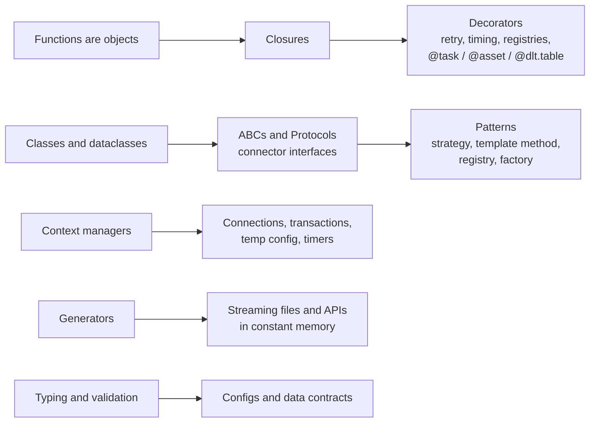

# Python for Data Engineers: Decorators, OOP and the Features Pipelines Run On

Senior data engineering interviews increasingly include a "production Python" round: *write a retry decorator*, *design a connector interface*, *make this file reader memory-safe*, *how would you test this transformation?* This module covers the language features those questions are really about, and shows where each one appears in the tools you already use.



---

## 1. Functions are objects, and closures remember

Everything in this module builds on two facts:

1. Functions are values: you can pass them, return them and store them in dicts.
2. A nested function **closes over** variables from the enclosing scope and keeps them alive after the outer function returns.

```python
def make_threshold_check(column: str, max_null_rate: float):
    def check(rows: list[dict]) -> bool:
        nulls = sum(1 for r in rows if r.get(column) is None)
        return nulls / max(len(rows), 1) <= max_null_rate
    return check            # `column` and `max_null_rate` live on inside `check`

checks = [make_threshold_check("email", 0.01), make_threshold_check("country", 0.0)]
all(chk(batch) for chk in checks)
```

**DE use:** data-quality rule factories, parametrised transformations, callbacks in orchestrators.

**Classic trap (late binding):** closures look up variables when called, not when defined.

```python
fns = [lambda: i for i in range(3)]
[f() for f in fns]                 # [2, 2, 2]  - all see the final i
fns = [lambda i=i: i for i in range(3)]
[f() for f in fns]                 # [0, 1, 2]  - default argument captures the value
```

This bites people generating Airflow tasks or Spark column expressions in a loop.

---

## 2. Decorators

### 2.1 What a decorator actually is

`@decorator` above a function is just syntax for `func = decorator(func)`. A decorator takes a function and returns a (usually wrapped) function.

```python
import functools, time, logging

log = logging.getLogger(__name__)

def timed(func):
    @functools.wraps(func)                  # keep __name__, __doc__, signature for tooling
    def wrapper(*args, **kwargs):
        start = time.perf_counter()
        try:
            return func(*args, **kwargs)
        finally:                            # runs on success *and* failure
            log.info("%s took %.3fs", func.__name__, time.perf_counter() - start)
    return wrapper

@timed
def load_partition(day: str) -> int: ...
```

**Why `functools.wraps` matters (a common interview question):** without it, every decorated function is called `wrapper`. That breaks logging, metrics names, Airflow/Dagster task naming, `help()`, pytest output and anything that introspects signatures.

### 2.2 Decorators with arguments: three levels

`@retry(max_attempts=5)` first *calls* `retry(...)`, which must return the real decorator.

```python
import random

def retry(max_attempts=3, base_delay=1.0, retry_on=(ConnectionError, TimeoutError), sleep=time.sleep):
    def decorator(func):
        @functools.wraps(func)
        def wrapper(*args, **kwargs):
            for attempt in range(1, max_attempts + 1):
                try:
                    return func(*args, **kwargs)
                except retry_on as exc:
                    if attempt == max_attempts:
                        raise                                   # re-raise with original traceback
                    delay = base_delay * 2 ** (attempt - 1) * random.uniform(0.5, 1.0)  # backoff + jitter
                    log.warning("%s failed (%s), retry %d in %.1fs", func.__name__, exc, attempt, delay)
                    sleep(delay)
        return wrapper
    return decorator

@retry(max_attempts=5, retry_on=(TimeoutError,))
def fetch_page(url: str) -> dict: ...
```

What a senior answer adds:
- **Only retry transient errors.** Retrying a `ValueError` from bad data just wastes time and hides the bug.
- **Jitter**, so 500 workers don't retry in lockstep (thundering herd).
- **Idempotency:** retrying a non-idempotent write (e.g. `INSERT` without a key) creates duplicates. The decorator can't fix that; the operation must be idempotent.
- **Injectable `sleep`** (and clock) makes it testable without real waiting.

You can practise this one in the [retry-with-backoff problem](/interview-prep/practice/python/23-retry-with-backoff/).

### 2.3 The registry pattern: decorators that don't wrap

A decorator can register a function and return it unchanged. Most frameworks are built on this.

```python
SOURCES: dict[str, type] = {}

def register_source(name: str):
    def decorator(cls):
        SOURCES[name] = cls
        return cls
    return decorator

@register_source("postgres")
class PostgresSource: ...

@register_source("s3_csv")
class S3CsvSource: ...

def build_source(config: dict):
    return SOURCES[config["type"]](**config["options"])     # config-driven pipelines
```

**DE use:** config-driven ingestion frameworks ("add a YAML entry, get a pipeline"), plugin systems for connectors, transformation catalogues.

### 2.4 Where you meet decorators in data tools

| Decorator | What it does under the hood |
|---|---|
| Airflow `@dag`, `@task` (TaskFlow API) | Turn a function into a DAG/task object; return values are passed between tasks via XCom |
| Dagster `@asset`, `@op` | Register a software-defined asset with its dependencies (inferred from parameters) in a definitions registry |
| Prefect `@flow`, `@task` | Wrap execution with state tracking, retries and caching |
| Databricks / Lakeflow `@dlt.table`, `@dlt.expect` | Register a function's returned DataFrame as a managed table and attach data-quality expectations |
| PySpark `@pandas_udf`, `@udf` | Wrap a Python function so Spark can run it on Arrow batches (vectorised) or row by row |
| `@functools.lru_cache` / `@cache` | Memoise results (e.g. a schema lookup); beware unbounded memory and unhashable args |
| `@dataclass`, `@property`, `@staticmethod`, `@classmethod` | Class-building decorators (see section 3) |
| pytest `@pytest.fixture`, `@pytest.mark.parametrize` | Register fixtures and generate test cases |

### 2.5 Class-based decorators and stateful wrappers

When the decorator needs state (counts, a rate limiter's tokens), a class with `__call__` reads better:

```python
class CountCalls:
    def __init__(self, func):
        functools.update_wrapper(self, func)
        self.func, self.calls = func, 0
    def __call__(self, *args, **kwargs):
        self.calls += 1
        return self.func(*args, **kwargs)
```

**Stacking order:** `@a` above `@b` means `a(b(f))`. The outermost runs first on the way in. Put `@retry` *outside* `@timed` if you want each attempt timed, inside if you want total time.

---

## 3. Object-oriented Python for pipelines

### 3.1 The pieces you actually use

```python
from dataclasses import dataclass, field
from datetime import date

@dataclass(frozen=True)          # immutable, hashable, auto __init__/__repr__/__eq__
class PartitionSpec:
    table: str
    day: date
    columns: tuple[str, ...] = ()

    @property
    def path(self) -> str:       # computed attribute, no parentheses at call site
        return f"s3://lake/{self.table}/dt={self.day:%Y-%m-%d}/"

    @classmethod
    def from_string(cls, s: str) -> "PartitionSpec":     # alternative constructor
        table, day = s.split("@")
        return cls(table, date.fromisoformat(day))
```

| Feature | Use it for |
|---|---|
| `@dataclass` | Config objects, records, results. Removes boilerplate. `frozen=True` for value objects that can be dict keys or set members |
| `@property` | Derived values and validation on assignment without changing the call site |
| `@classmethod` | Alternative constructors (`from_config`, `from_env`, `from_string`) |
| `@staticmethod` | Helpers that logically belong to the class but need no instance (often better as a module function) |
| `__slots__` | Millions of small objects in memory (saves ~40-50% per instance) |
| Dunder methods | `__enter__/__exit__` (context managers), `__iter__` (iteration), `__len__`, `__eq__`, `__hash__`, `__repr__` (debuggable logs) |

### 3.2 Interfaces: ABCs vs Protocols

A connector framework needs every source to look the same to the pipeline.

```python
from abc import ABC, abstractmethod
from typing import Iterator, Protocol

class Source(ABC):                                  # nominal: subclasses must inherit and implement
    @abstractmethod
    def read(self, since: str | None) -> Iterator[dict]: ...
    @abstractmethod
    def checkpoint(self) -> str: ...

class Sink(Protocol):                               # structural: anything with these methods fits
    def write(self, rows: list[dict]) -> int: ...
```

- **ABC**: forgetting a method fails at instantiation (`TypeError: Can't instantiate abstract class`). Good for your own framework's plugins.
- **Protocol**: duck typing checked by mypy/pyright, with no inheritance needed. Good for accepting third-party objects (anything with `.write()`), and for testing with simple fakes.

### 3.3 Patterns that show up in real DE code

**Template method:** the base class fixes the pipeline skeleton; subclasses fill in steps.

```python
class BatchJob(ABC):
    def run(self, day: date) -> None:              # the invariant flow lives here, once
        raw = self.extract(day)
        clean = self.transform(raw)
        self.validate(clean)
        self.load(clean, day)                      # e.g. idempotent overwrite of the partition

    @abstractmethod
    def extract(self, day): ...
    @abstractmethod
    def transform(self, df): ...
    def validate(self, df):                        # sensible default, overridable
        assert df.count() > 0, "empty output"
    @abstractmethod
    def load(self, df, day): ...
```

**Strategy:** swap behaviour without `if/elif` chains.

```python
class WriteMode(Protocol):
    def write(self, df, table: str) -> None: ...

class Overwrite:
    def write(self, df, table): df.write.mode("overwrite").saveAsTable(table)

class Merge:
    def __init__(self, keys: list[str]): self.keys = keys
    def write(self, df, table): ...   # MERGE INTO table USING df ON keys

job_writer: WriteMode = Merge(["order_id"])        # chosen from config
```

**Registry/factory:** section 2.3. **Composition over inheritance:** a `Pipeline(source, transforms, sink)` built from small parts beats a deep `PostgresToS3ParquetJob(BaseJob)` hierarchy you can't reuse.

### 3.4 When *not* to use classes

Spark and pandas transformations are best as **pure functions** `DataFrame → DataFrame`. They're easy to test, compose and reuse:

```python
def add_revenue(df):
    return df.withColumn("revenue", df.qty * df.unit_price)

def only_completed(df):
    return df.filter(df.status == "COMPLETED")

result = orders.transform(only_completed).transform(add_revenue)
```

A good interview line: *"Classes for things with identity, state or a lifecycle (connections, clients, jobs with config). Functions for transformations."*

---

## 4. Context managers: guaranteed cleanup

`with` guarantees `__exit__` runs even if the block raises, which is exactly what resources need.

```python
from contextlib import contextmanager

@contextmanager
def transaction(conn):
    cur = conn.cursor()
    try:
        yield cur
        conn.commit()            # only if the block finished without an exception
    except Exception:
        conn.rollback()          # leave no partial writes
        raise
    finally:
        cur.close()

with transaction(conn) as cur:
    cur.execute("DELETE FROM sales WHERE day = %s", (day,))
    cur.execute("INSERT INTO sales SELECT ... WHERE day = %s", (day,))   # delete+insert is atomic
```

**DE uses:** database transactions (atomic partition replace), temporarily changing Spark config (`spark.conf.set` then restore), acquiring a lock so two backfills don't write the same partition, timers and tracing spans, temporary directories, opening many files safely with `contextlib.ExitStack`.

**Interview nuance:** if `__exit__` returns `True` the exception is **swallowed**. Almost never do that in pipeline code.

---

## 5. Generators: process anything in constant memory

A generator produces values lazily with `yield`, holding only its current state.

```python
import csv, gzip
from typing import Iterator

def read_rows(path: str) -> Iterator[dict]:
    with gzip.open(path, "rt", newline="") as f:          # file closes when iteration ends
        yield from csv.DictReader(f)

def valid(rows):
    for r in rows:
        if r["amount"] and float(r["amount"]) >= 0:
            yield r

def batched(rows, size=10_000):
    batch = []
    for r in rows:
        batch.append(r)
        if len(batch) == size:
            yield batch
            batch = []
    if batch:
        yield batch

for batch in batched(valid(read_rows("orders.csv.gz"))):   # a lazy pipeline: one batch in memory
    sink.write(batch)
```

**API pagination as a generator** hides the cursor logic from callers:

```python
def paginate(client, endpoint):
    cursor = None
    while True:
        page = client.get(endpoint, params={"cursor": cursor, "limit": 500})
        yield from page["items"]
        cursor = page.get("next_cursor")
        if not cursor:
            return
```

**Know the trade-offs:** generators are single-pass (iterate twice and the second pass is empty), exceptions surface when consumed (not when created), and a half-consumed generator holding a file keeps it open until it's garbage-collected or closed. `itertools` (`islice`, `chain`, `groupby` on **sorted** input, `batched` in 3.12+) covers most needs.

Practice: [chunked batches](/interview-prep/practice/python/22-chunked-batches/), [merge sorted streams](/interview-prep/practice/python/05-merge-sorted-streams/), [external sort](/interview-prep/practice/python/27-external-sort/).

---

## 6. Typing, validation and data contracts

Type hints don't run, but they catch bugs before production (mypy/pyright in CI) and document intent.

```python
from typing import Literal, TypedDict
from enum import Enum

class Mode(str, Enum):
    APPEND = "append"
    MERGE = "merge"

class TableConfig(TypedDict):
    name: str
    mode: Literal["append", "merge"]
    keys: list[str]
```

For **runtime validation** of configs and records, use dataclasses with checks in `__post_init__`, or Pydantic models:

```python
@dataclass
class JobConfig:
    table: str
    mode: Mode
    keys: list[str] = field(default_factory=list)       # never use a mutable default directly

    def __post_init__(self):
        if self.mode is Mode.MERGE and not self.keys:
            raise ValueError("merge mode needs keys")
```

**Mutable default trap (a top-5 Python interview question):** `def f(x, acc=[])` shares one list across all calls, because defaults are evaluated once at definition time. Use `None` (or `field(default_factory=list)` in dataclasses).

---

## 7. Designing errors

Pipelines need to decide **retry, skip, or stop**. An exception hierarchy makes that explicit:

```python
class PipelineError(Exception): ...
class RetryableError(PipelineError): ...       # timeouts, throttling, 5xx
class DataError(PipelineError): ...            # bad record → quarantine, keep going
class FatalError(PipelineError): ...           # bad config, schema break → stop and alert

try:
    load(batch)
except DataError as e:
    quarantine(batch, reason=str(e))
except RetryableError:
    raise                                      # let the retry decorator / orchestrator handle it
except Exception as e:
    raise FatalError(f"unexpected failure loading {batch.id}") from e   # keep the cause chain
```

- `raise ... from e` preserves the original traceback as `__cause__`.
- Never write a bare `except:`; it also catches `KeyboardInterrupt` and `SystemExit`.
- Log with context (table, partition, batch id, attempt) so on-call can act without re-running.

---

## 8. Concurrency: threads, processes, asyncio

| Workload | Use | Why |
|---|---|---|
| I/O-bound: many API calls, S3 downloads, DB queries | `ThreadPoolExecutor` or `asyncio` | The GIL is released while waiting on I/O |
| CPU-bound pure Python: parsing, hashing, compression | `ProcessPoolExecutor` | Separate processes bypass the GIL (pay serialisation cost) |
| Large data transformations | Spark/Polars/DuckDB | Vectorised native code; don't hand-roll multiprocessing |

```python
from concurrent.futures import ThreadPoolExecutor, as_completed

with ThreadPoolExecutor(max_workers=16) as pool:
    futures = {pool.submit(fetch_page, url): url for url in urls}
    for fut in as_completed(futures):
        rows = fut.result()          # re-raises the worker's exception here
```

**Senior points:** bound concurrency to respect API rate limits (semaphore/token bucket), make results order-independent or re-sort, and remember Python 3.13's free-threaded build is still optional, so the GIL rules above remain the default.

---

## 9. Testing data code

```python
import pytest

@pytest.fixture(scope="session")
def spark():
    from pyspark.sql import SparkSession
    return SparkSession.builder.master("local[2]").getOrCreate()

@pytest.mark.parametrize("status,kept", [("COMPLETED", 1), ("CANCELLED", 0)])
def test_only_completed(spark, status, kept):
    df = spark.createDataFrame([(1, status)], "id int, status string")
    assert only_completed(df).count() == kept
```

- **Pure transformation functions** are trivially testable with tiny DataFrames.
- **Inject dependencies** (clients, clocks, `sleep`) instead of patching globals.
- **Test the contract, not the implementation:** schema, keys unique, row counts reconcile, idempotency (running twice gives the same result).
- Add **data tests** in the pipeline (dbt tests, expectations) as well as unit tests; they catch different failures.

---

## Interview questions

<details><summary>What does functools.wraps do and what breaks without it?</summary>

It copies `__name__`, `__qualname__`, `__doc__`, `__module__`, `__dict__` and sets `__wrapped__` from the original function onto the wrapper. Without it every decorated function reports itself as `wrapper`. That breaks log lines, metric names, orchestrator task IDs that default to the function name, `inspect.signature` (used by frameworks like FastAPI and Dagster to infer inputs), and debugging.
</details>

<details><summary>Write a decorator that logs how long a function takes, including when it raises.</summary>

Use `time.perf_counter()` before the call and log in a `finally` block so the duration is recorded on success and failure; re-raise implicitly by not catching. Use `functools.wraps`. For production, emit a metric (histogram) tagged with the function name and outcome rather than only a log line.
</details>

<details><summary>How would you design a pluggable connector framework in Python?</summary>

Define a `Source` interface (ABC or Protocol) with `read(since) -> Iterator[Record]` and `checkpoint()`, and a `Sink` with `write(batch)`. Register implementations with a decorator-based registry keyed by type name; build pipelines from YAML config (`type: postgres`, options). Keep cross-cutting concerns (retries, metrics, schema validation) in wrappers/decorators so connectors stay small. Use generators for streaming reads, checkpoints for incremental loads, and idempotent sinks (merge on keys or partition overwrite). Test each connector against a shared contract test suite.
</details>

<details><summary>ABC vs Protocol: when do you use each?</summary>

ABCs enforce implementation through inheritance at instantiation time, which suits a plugin hierarchy you own. Protocols describe a shape for static type checkers without inheritance, which suits accepting external objects and lightweight test fakes. Use `@runtime_checkable` if you need `isinstance` checks against a Protocol (it only checks method presence, not signatures).
</details>

<details><summary>Why are generators useful in data pipelines? What are their pitfalls?</summary>

They stream data with O(batch) memory, compose into lazy pipelines (read → filter → batch → write) and hide pagination or chunking logic. Pitfalls: they're single-use; errors appear when consumed, far from where the generator was created; resources stay open if a generator isn't exhausted or closed (use `with` inside the generator and `contextlib.closing` or explicit `.close()`); and debugging lazy chains is harder (materialise a small sample when investigating).
</details>

<details><summary>Explain the mutable default argument problem.</summary>

Default values are evaluated once, when `def` runs. A mutable default (`[]`, `{}`) is shared by every call that doesn't pass the argument, so state leaks between calls (e.g. a batch list that keeps growing across invocations). Use `None` and create the object inside the function, or `field(default_factory=list)` in dataclasses.
</details>

<details><summary>Threads, processes or asyncio for downloading 10,000 files from S3?</summary>

It's I/O-bound, so threads (or asyncio with an async client) are right: the GIL is released during network I/O. Use a bounded pool (e.g. 32-64 workers), retries with backoff for throttling (`SlowDown`), and stream to disk rather than holding files in memory. Processes add serialisation overhead with no benefit here. If the next step is CPU-heavy parsing, hand files to a process pool or, better, a vectorised engine.
</details>

<details><summary>How do you make a context manager that commits on success and rolls back on failure?</summary>

With `@contextmanager`: open the cursor, `yield` it, `commit()` after the yield, `rollback()` and re-raise in `except`, and close in `finally`. With a class: implement `__enter__` returning the cursor and `__exit__(exc_type, exc, tb)` that commits if `exc_type is None` else rolls back, returning `False` so exceptions propagate.
</details>

<details><summary>Where do decorators appear in Databricks / Lakeflow Declarative Pipelines?</summary>

`@dlt.table` (or `@dp.table` in newer APIs) registers the decorated function's DataFrame as a managed table or streaming table in the pipeline graph; `@dlt.view` registers a temporary view; `@dlt.expect`, `@dlt.expect_or_drop` and `@dlt.expect_or_fail` attach data-quality constraints with warn/drop/fail semantics. The framework reads these registrations to build the dependency DAG, so you never call the functions yourself.
</details>

<details><summary>How do you test a Spark transformation?</summary>

Write transformations as pure `DataFrame → DataFrame` functions; use a session-scoped local SparkSession fixture; build tiny input DataFrames with explicit schemas; assert on collected rows and the output schema (or use `chispa`/`assertDataFrameEqual` in Spark 3.5+). Parametrise edge cases (nulls, duplicates, late records). Keep I/O at the edges so it can be mocked, and add an integration test on a small realistic sample in CI.
</details>
