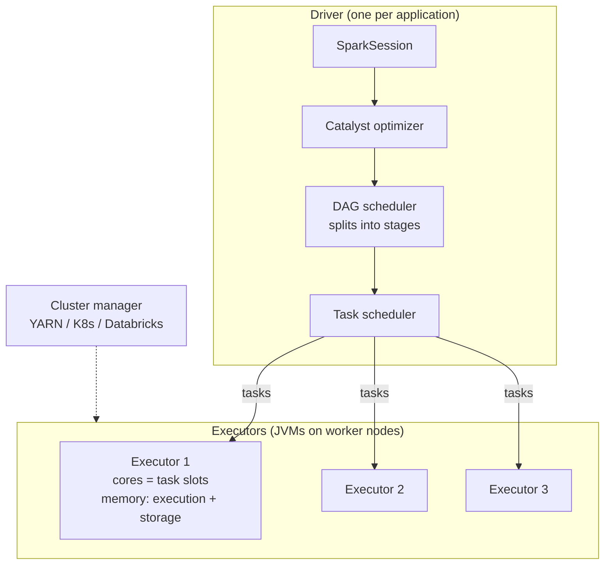
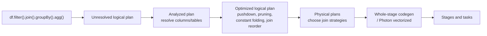
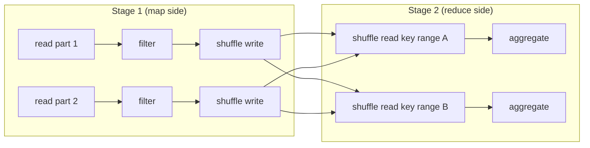
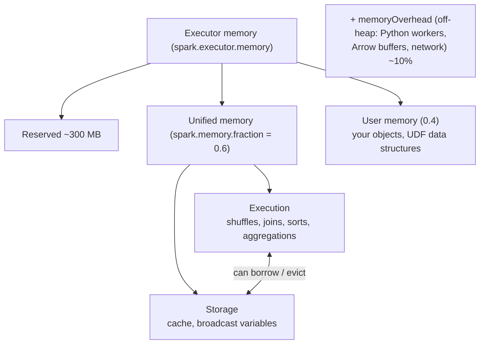
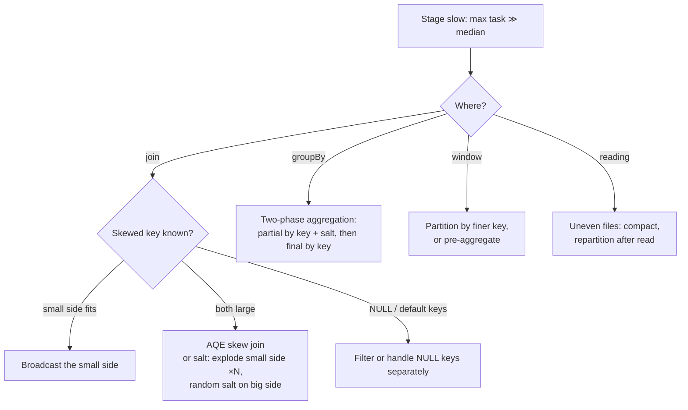

# Spark Internals and Performance Tuning

> Senior interviews don't ask "what is an RDD". They ask "this job takes 3 hours. What do you look at?" You need a mental model of how Spark turns your code into work, and where time goes.

---

## 1. Architecture



- **Driver:** plans the job, schedules tasks, collects small results. A driver OOM usually means `collect()`/`toPandas()` on big data, huge broadcast, or too many files/partitions to track.
- **Executor:** runs tasks; one task per core at a time; caches data; writes shuffle files.
- **Task:** processes **one partition** of data in one stage.

## 2. From code to execution



- **Lazy evaluation:** transformations build a plan; **actions** (`count`, `write`, `collect`) trigger execution. This lets Catalyst optimise the whole pipeline.
- **Narrow transformations** (`filter`, `select`, `withColumn`, `map`): each output partition depends on one input partition → same stage, no data movement.
- **Wide transformations** (`groupBy`, `join` (non-broadcast), `distinct`, `orderBy`, `repartition`, window `partitionBy`): need data from many partitions → **shuffle** → **new stage**.



**The shuffle is where jobs get slow:** data is serialised, written to local disk, sent over the network, read and deserialised. Minimising and right-sizing shuffles is most of Spark tuning.

## 3. Partitions: the unit of parallelism

| Where | Controlled by | Rule of thumb |
|---|---|---|
| Reading files | `spark.sql.files.maxPartitionBytes` (128 MB) | One input partition ≈ 128 MB |
| After a shuffle | `spark.sql.shuffle.partitions` (default 200) / AQE | Target 100–200 MB per shuffle partition; AQE coalesces small ones |
| Writing | number of partitions at write time | Files of 128 MB–1 GB; avoid thousands of tiny files |

- `repartition(n)` = full shuffle to n partitions (even sizes, or by key).
- `coalesce(n)` = merge partitions **without** a shuffle (only to reduce; can create uneven partitions).
- Too few partitions → underused cores, huge tasks, spill. Too many → scheduling overhead, tiny files.

## 4. Join strategies (and how to influence them)

| Strategy | When | Notes |
|---|---|---|
| **Broadcast hash join** | One side small (`spark.sql.autoBroadcastJoinThreshold`, 10 MB default; AQE can switch at runtime using real sizes) | No shuffle of the big side. Hint: `broadcast(df)` / `/*+ BROADCAST(t) */` |
| **Sort-merge join** | Default for large equi-joins | Shuffle + sort both sides |
| **Shuffle hash join** | Medium side fits per-partition hash table | Avoids sort; AQE may pick it |
| **Broadcast nested loop / cartesian** | Non-equi joins without better option | Danger: O(n·m) |

**Bucketing / pre-partitioning:** if two big tables are repeatedly joined on the same key, storing them bucketed (or clustered) by that key can avoid shuffles (more common in Hive-style tables; on Delta, liquid clustering helps data skipping but joins still shuffle).

## 5. Adaptive Query Execution (AQE)

Enabled by default in Spark 3.2+. Re-optimises **at runtime** using actual shuffle statistics:

1. **Coalesce shuffle partitions:** merges tiny partitions after a shuffle (no more 200 × 1 MB tasks).
2. **Switch join strategy:** converts sort-merge to broadcast when a side turns out small after filters.
3. **Skew join handling:** splits oversized partitions of a skewed join into smaller tasks (`spark.sql.adaptive.skewJoin.*`).

Know that AQE exists, what it fixes, and what it doesn't: skew in **aggregations** (groupBy) still needs salting/two-phase aggregation; and it can't fix bad file layouts.

## 6. Memory model



- **Spill**: when execution memory runs out, data spills to disk: correct but slow (look for "Spill (Memory/Disk)" in the Spark UI).
- **Container killed by YARN/K8s for exceeding memory** = usually overhead (PySpark UDFs, Arrow) → increase `spark.executor.memoryOverhead`.
- Python UDFs move data between JVM and Python workers. Prefer built-in functions; if you need Python, use **Pandas UDFs** (Arrow, vectorised).

## 7. Data skew: the most common senior question

Symptoms: one task takes 30× longer than the median; one executor OOMs; stage stuck at 199/200 tasks.



```python
# Salting a skewed join: big fact skewed on customer_id, dimension too large to broadcast
N = 16
fact_s = fact.withColumn("salt", (F.rand() * N).cast("int"))
dim_s = dim.crossJoin(spark.range(N).withColumnRenamed("id", "salt"))
joined = fact_s.join(dim_s, ["customer_id", "salt"]).drop("salt")
```

## 8. Caching

- `cache()`/`persist()` only helps when the same DataFrame is **reused** by multiple actions. Otherwise it costs memory and time.
- It's lazy: materialised on the first action. Unpersist when done.
- On Databricks, the **disk cache** (automatic SSD caching of Parquet/Delta) usually beats manual `cache()` for repeated reads.

## 9. File and table layout (often the real fix)

- Small files → `OPTIMIZE`, optimized writes, fewer output partitions.
- Missing data skipping → cluster by filter columns (liquid clustering / Z-order), make sure stats exist for those columns.
- Over-partitioned tables (by high-cardinality columns) → repartition the table layout.
- Details: [Storage & table formats](/interview-prep/learn/architecture/05-storage-and-table-formats/).

## 10. The tuning playbook (say this in interviews)

1. **Measure first:** Spark UI → which stage/task dominates? Task time distribution (skew), shuffle read/write sizes, spill, GC time, input size vs files read.
2. **Read less:** partition pruning, column pruning, data skipping, predicate pushdown. Check `PartitionFilters` in the plan.
3. **Shuffle less:** broadcast small sides, filter/aggregate before joins, avoid unnecessary `distinct`/`orderBy`/`repartition`.
4. **Right-size partitions:** AQE coalescing, `shuffle.partitions`, avoid tiny/huge tasks.
5. **Fix skew:** AQE skew join, salting, NULL-key handling, two-phase aggregation.
6. **Avoid Python row-by-row:** built-in functions > Pandas UDF > Python UDF.
7. **Fix the layout:** compaction and clustering.
8. **Then** consider hardware: more cores, memory-optimised nodes, Photon.

## 11. Interview questions

<details><summary>What triggers a new stage in Spark?</summary>

A wide dependency, meaning a shuffle (groupBy, non-broadcast join, distinct, repartition, orderBy, window partitionBy). Stages are separated at shuffle boundaries; each stage runs one task per partition.
</details>

<details><summary>repartition vs coalesce?</summary>

`repartition(n[, cols])` performs a full shuffle and produces evenly sized partitions (optionally hashed by columns), and can increase or decrease the count. `coalesce(n)` only decreases, by merging existing partitions without a shuffle. It's cheaper, but can produce uneven partitions and reduce upstream parallelism if pushed into the same stage.
</details>

<details><summary>Your job fails with "Container killed by YARN for exceeding memory limits". Fix?</summary>

The off-heap overhead was exceeded, typically by Python workers (UDFs, toPandas, Arrow) or large shuffle buffers. Increase `spark.executor.memoryOverhead`, reduce per-task data (more partitions), replace Python UDFs with built-ins or Pandas UDFs with smaller batches, and avoid collecting large data.
</details>

<details><summary>Why is `count()` after `cache()` sometimes slow and sometimes instant?</summary>

`cache()` is lazy. The first action materialises the cache (full computation + storing); later actions read from memory. If cached partitions were evicted (memory pressure), Spark recomputes them from lineage.
</details>
