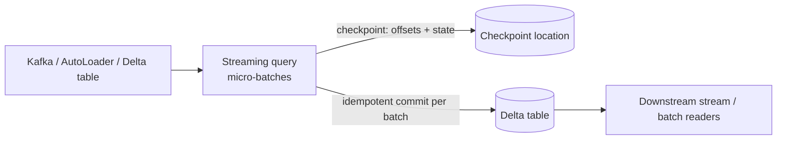
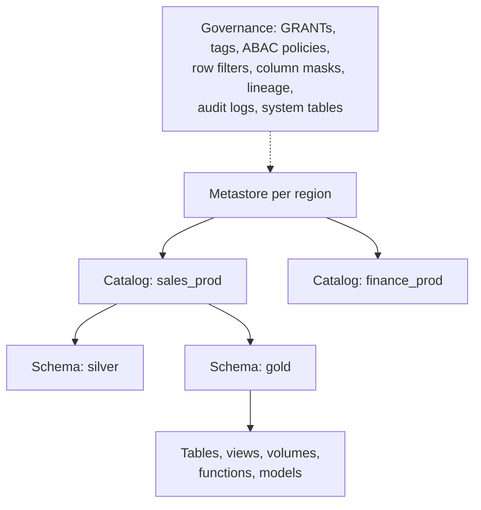

# Delta Lake and the Databricks Platform

> A practical map of the features senior Databricks interviews probe, with the "why" behind each.

---

## 1. Delta Lake features you must know

| Feature | What it does | Interview angle |
|---|---|---|
| ACID transaction log | Atomic commits, snapshot isolation | How concurrency works (optimistic), conflicts |
| Time travel | `VERSION AS OF`, `TIMESTAMP AS OF`, `RESTORE` | Recovery from bad writes; limited by VACUUM retention |
| MERGE | Upserts, deletes, SCD | Performance: partition/cluster predicates in ON clause |
| Schema enforcement & evolution | Reject mismatches; `mergeSchema`, `ALTER TABLE ADD COLUMNS`; column mapping for renames/drops | Contracts vs flexibility |
| Change Data Feed (CDF) | Row-level changes between versions (`_change_type`) | Incremental downstream processing without full scans |
| Deletion vectors | Mark deleted rows without rewriting files | Fast DELETE/UPDATE/MERGE; physical purge later (GDPR) |
| Liquid clustering | Incremental, changeable clustering keys | Replaces partitioning + Z-order for most tables |
| OPTIMIZE / VACUUM | Compaction / remove unreferenced files | Scheduling, retention vs time travel |
| Constraints | `NOT NULL`, `CHECK` | Data quality at write time |
| Generated / identity columns | Computed columns, surrogate keys | Identity columns serialise inserts on concurrent writers |
| UniForm | Expose Iceberg (and Hudi) metadata | Interop with other engines |

### Incremental processing with CDF

```python
changes = (spark.readStream
           .option("readChangeFeed", "true")
           .option("startingVersion", 120)
           .table("silver.orders"))
# rows carry _change_type in (insert, update_preimage, update_postimage, delete), _commit_version
```

## 2. Structured Streaming on Delta



| Concept | Key points |
|---|---|
| Triggers | `processingTime="1 minute"`, `availableNow=True` (process all available then stop: incremental batch), continuous/real-time mode for low latency |
| Checkpoints | Store source offsets, state, sink commit info. Never share between queries; changing the query logic may require a new checkpoint |
| Exactly-once | Replayable source + checkpoint + Delta sink's idempotent commits (txnAppId/txnVersion); `foreachBatch` needs your own idempotency (MERGE) |
| `foreachBatch` | Arbitrary batch logic per micro-batch (MERGE, multiple sinks) |
| Watermarks & state | Bound state for aggregations, dedup (`dropDuplicatesWithinWatermark`), stream-stream joins; RocksDB state store for large state |
| Schema evolution | AutoLoader `schemaEvolutionMode`; restart stream on new columns (by design) |
| Rate limiting | `maxFilesPerTrigger`, `maxBytesPerTrigger`, `maxOffsetsPerTrigger` |

## 3. Lakeflow Declarative Pipelines (formerly Delta Live Tables)

Declarative pipelines: you declare tables/views and their queries; the platform handles orchestration, dependencies, retries, checkpoints, scaling and data quality.

```sql
CREATE OR REFRESH STREAMING TABLE bronze_orders
AS SELECT * FROM STREAM read_files('/landing/orders', format => 'json');

CREATE OR REFRESH STREAMING TABLE silver_orders (
  CONSTRAINT valid_amount EXPECT (amount >= 0) ON VIOLATION DROP ROW,
  CONSTRAINT has_id       EXPECT (order_id IS NOT NULL) ON VIOLATION FAIL UPDATE
) AS SELECT * FROM STREAM bronze_orders;

CREATE OR REFRESH MATERIALIZED VIEW gold_daily_revenue
AS SELECT order_date, SUM(amount) AS revenue FROM silver_orders GROUP BY order_date;
```

- **Streaming tables** (append/incremental) vs **materialized views** (recomputed incrementally where possible).
- `AUTO CDC` / `APPLY CHANGES` for SCD1/SCD2 from CDC feeds (handles out-of-order events with `SEQUENCE BY`).
- Expectations: warn / drop / fail, with metrics in the event log.
- When not to use: highly custom orchestration, cross-system workflows, or teams standardised on dbt.

## 4. Unity Catalog



- Three-level namespace `catalog.schema.object`; managed vs external tables; **volumes** for files.
- Privileges inherited downward (`USE CATALOG`, `USE SCHEMA`, `SELECT`, `MODIFY`).
- Row filters and column masks as SQL UDFs; tag-based ABAC policies for scale.
- Automatic **lineage** (table and column level) and **system tables** (audit, billing, query history, lineage) queryable with SQL.
- Delta Sharing for sharing data across orgs/platforms without copies.
- Details: [Governance, security, privacy](/interview-prep/learn/architecture/08-governance-security-privacy/).

## 5. Compute and cost

| Compute | Use |
|---|---|
| Job clusters / serverless jobs | Production pipelines (isolated, terminate after run) |
| All-purpose clusters | Interactive development (don't run prod on them) |
| SQL warehouses (serverless/pro) | BI and SQL workloads |
| Photon | Vectorised C++ engine: large speedups for SQL/DataFrame workloads; costs more per DBU, so check the job actually benefits |

Cost levers: auto-termination, autoscaling, spot workers, right-sized node types, serverless for spiky loads, **predictive optimization** (automatic OPTIMIZE/VACUUM), cluster policies, tagging + system billing tables for chargeback.

## 6. Workflows (Lakeflow Jobs)

Multi-task jobs (notebooks, Python wheels, SQL, dbt, pipelines), task dependencies, retries, repair runs (re-run only failed tasks), parameters, file-arrival and table-update triggers, and Asset Bundles (`databricks.yml`) for CI/CD of jobs, pipelines and their configuration as code.

## 7. Interview questions

<details><summary>MERGE into a 5 TB Delta table takes an hour. How do you speed it up?</summary>

Reduce the target files touched: add partition/cluster predicates to the ON clause (e.g. `t.event_date >= current_date() - 3`), cluster the target by the merge key, enable deletion vectors (cheaper updates), dedupe the source first (duplicate source keys cause errors or extra work), make the source small (only changed rows, e.g. from CDF), ensure the source can be broadcast, and compact small files. Check the MERGE metrics (files scanned/rewritten).
</details>

<details><summary>availableNow trigger vs a normal batch job?</summary>

availableNow runs a streaming query that processes everything new since the last checkpoint and then stops. You get incremental processing with exactly-once bookkeeping (checkpointed offsets, AutoLoader file tracking) on a batch schedule, and switching to continuous later means changing one line. A plain batch job must track "what's new" itself.
</details>

<details><summary>How does Unity Catalog lineage help in an incident?</summary>

It shows upstream sources and downstream consumers of a table/column automatically: find the root cause (which upstream changed), assess blast radius (which dashboards/models/jobs read it), and notify owners. System tables make this queryable.
</details>

<details><summary>Liquid clustering vs partitioning: which for a new 10 TB events table?</summary>

Liquid clustering on the common filter columns (e.g. event_date, customer_id). It avoids small-file problems from over-partitioning, handles high-cardinality keys, clusters incrementally, and the keys can change later without a full rewrite. Partitioning only makes sense for very large tables with a clear, low-cardinality filter, or for lifecycle management (dropping old partitions).
</details>
