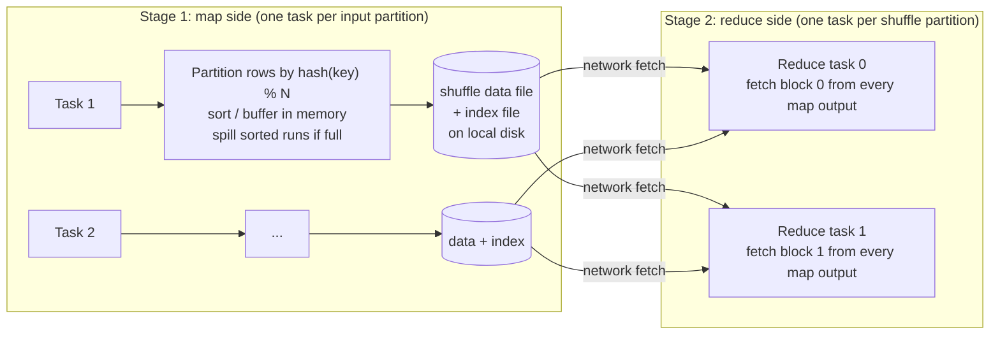
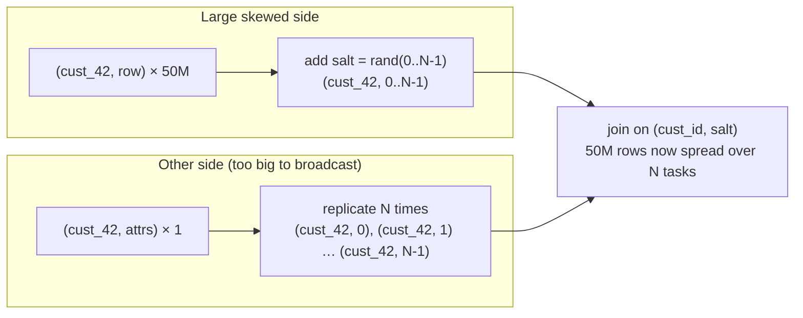

# Shuffle, Spill and Salting: Complete Internals

Most slow Spark jobs come down to three things: **shuffles** that move too much data, tasks that **spill** because their partition doesn't fit in memory, and **skew** that makes one task do the work of hundreds. Senior interviews go past "use salting" and ask *why* each happens, how you'd **see** it in the Spark UI, and what each fix costs. This module walks through the machinery end to end.

---

## 1. What a shuffle is, physically

A shuffle happens whenever rows must be regrouped by key across the cluster: `groupBy`, `join` (non-broadcast), `distinct`, `repartition`, window functions with `partitionBy`, `orderBy`. It is the boundary between two **stages**.



**Map side (shuffle write):**
1. Each map task computes the target partition for every row: `hash(key) mod spark.sql.shuffle.partitions` (or a range for `orderBy`).
2. Rows are serialised into Spark's compact binary format and buffered in **execution memory**, grouped (sorted) by target partition.
3. If the buffer fills, the sorted buffer is written to disk as a **spill file**; at the end, spills are merged.
4. The task writes **one data file plus one index file** (the index records the byte offsets of each reduce partition's block). This is the *sort-based shuffle*. Older hash-based shuffle wrote M × R files and was abandoned for that reason.

**Reduce side (shuffle read):**
1. Each reduce task fetches *its* block from **every** map output: M × R fetch requests overall.
2. Blocks are deserialised and fed into the next operator (hash aggregation, sort-merge join, window), which may itself spill.

**Why shuffles are expensive:** serialisation + disk write + network transfer + disk read + deserialisation, plus the risk of spill on both sides. And the number of fetch requests grows with *M × R*, which is why 10,000 input partitions × 2,000 shuffle partitions (20 million tiny blocks) can be slower than the data size suggests.

**Supporting machinery worth naming:**
- **External shuffle service** (and on Kubernetes, shuffle tracking or decommissioning): shuffle files outlive the executor that wrote them, so dynamic allocation can remove executors without losing map output.
- **Push-based shuffle** (Spark 3.2+, YARN): mappers push blocks to remote merger services, turning many small random reads into fewer large sequential ones.
- **Fetch failures** (`FetchFailedException`) usually mean an executor holding map output died (often OOM or a preempted spot node), so the *previous* stage reruns. A stage that "retries forever" is often this, not the stage you're looking at.

---

## 2. Reading shuffles in the plan and the UI

In `df.explain("formatted")`, every shuffle is an **`Exchange`** node:

```
+- HashAggregate(keys=[customer_id], functions=[sum(amount)])        <- final aggregation
   +- Exchange hashpartitioning(customer_id, 200)                    <- SHUFFLE
      +- HashAggregate(keys=[customer_id], functions=[partial_sum(amount)])   <- map-side partial agg
         +- FileScan parquet [customer_id, amount] PushedFilters: [IsNotNull(amount)]
```

Note the **partial aggregation before the Exchange**: Spark pre-aggregates on the map side, so only one row per key per map task crosses the network. That's why `groupBy().sum()` shuffles far less than you'd think, and why `collect_list` (which can't be reduced much) shuffles a lot.

In the **Spark UI → Stages**, check for each stage:

| Metric | Healthy | Red flag |
|---|---|---|
| Shuffle Write / Read size | Proportional to data | Much larger than input (an exploding join) |
| Task duration (min / median / max) | max ≈ 1-3× median | **max ≫ median → skew** |
| Shuffle Read size per task (max vs median) | Similar | One task reads 50× more → skewed key |
| Spill (Memory) / Spill (Disk) | 0 or small | Large → partitions too big for memory |
| GC Time | < 10% of task time | > 20% → memory pressure, too many objects |
| Shuffle Read Blocked Time | Small | Large → network/disk bottleneck or too many tiny blocks |

---

## 3. Spill: why it happens and what it costs

**Unified memory** (`spark.memory.fraction`, default 0.6 of the heap after ~300 MB reserved) is shared by **execution** (shuffle buffers, hash tables, sort buffers) and **storage** (cache, broadcast). Execution can evict cached blocks but not vice versa. Each running task gets roughly `execution memory / concurrent tasks`, so with 4 cores sharing an executor, each task gets about a quarter.

When a task's data structure (sort buffer, aggregation hash map, join build side) outgrows its share, Spark writes it to local disk and continues: **spill**.

- **Spill (Memory)** = the deserialised in-memory size of the data that was spilled.
- **Spill (Disk)** = its serialised, compressed size on disk. Memory is typically 3-10× disk.

Spill is *correct but slow*: extra serialisation, disk I/O and merge passes. Heavy spill is also a precursor to OOMs and executor loss.

**Common causes and fixes:**

| Cause | How you see it | Fix |
|---|---|---|
| Too few shuffle partitions for the data | Every task spills, all similar size | Increase `spark.sql.shuffle.partitions` or let AQE set it (`advisoryPartitionSizeInBytes`) |
| Skewed key | Only a few tasks spill, huge max shuffle read | Salting, AQE skew join, isolate hot keys (section 5) |
| Too many cores per executor for its memory | Spill + high GC on every executor | Fewer cores per executor or more memory per core |
| Exploding join (many-to-many) | Shuffle write ≫ input; output rows ≫ inputs | Fix the join keys, dedupe before joining, aggregate first |
| `collect_list`/`collect_set` on big groups | Huge rows per key | Aggregate differently, cap list sizes, or write a nested structure in stages |
| Wide rows (many columns, big strings) | Large bytes per row | Select only needed columns *before* the shuffle |

**Sizing shuffle partitions with arithmetic** (interviewers love this):

> Shuffle write is 600 GB. Target ~128-200 MB per partition after compression → 600 GB / 150 MB ≈ **4,000 partitions**. The cluster has 50 executors × 4 cores = 200 cores, so that's 20 waves of tasks: fine. With the default 200 partitions each task would handle 3 GB and spill heavily.

With AQE on (default since 3.2), set a generous initial number (`spark.sql.adaptive.coalescePartitions.initialPartitionNum`) and let AQE **coalesce** down to `spark.sql.adaptive.advisoryPartitionSizeInBytes` (64 MB default; 128-256 MB is common for large jobs). AQE can merge small partitions; it **cannot split** a partition for plain aggregations, so starting too low still spills.

---

## 4. Skew: detection and root causes

Skew means a few keys hold a disproportionate share of rows. Because all rows of a key go to the same reduce task, that task becomes the stage's critical path: **199 tasks finish in 30 seconds, one runs for 40 minutes**.

**Finding the key:**

```python
(df.groupBy("customer_id").count()
   .orderBy(F.desc("count"))
   .limit(20)
   .show())
# or, cheaply, on a sample: df.sample(0.01).groupBy(...)...
```

Typical culprits: `NULL` or default keys (`-1`, `'unknown'`, `''`), test/bot accounts, a few mega-customers or hot products, a date that holds a backfill, or a power-law distribution (a few celebrities with most of the followers).

**First questions before salting:**
1. **Are the skewed keys junk?** `NULL` join keys never match in an inner join, so filter them out before the shuffle (or handle them separately for outer joins). This alone fixes a large share of real-world skew.
2. **Can the other side be broadcast?** A broadcast join has no shuffle, so no skew. Check whether filtering or selecting fewer columns makes the small side fit (`autoBroadcastJoinThreshold`, or a hint up to a few hundred MB if executors have room).
3. **Is AQE skew join enabled and applicable?** (sort-merge joins only; see section 6.)

---

### 4.1 A systematic skew investigation

**Know the five kinds of skew**, because the fix depends on the kind:

| Kind | What it looks like | Typical fix |
|---|---|---|
| **Key skew** | A few join/group keys own most rows (power law, bots, mega-customers) | Broadcast, AQE skew join, salting hot keys, two-phase aggregation |
| **Null/default skew** | `NULL`, `-1`, `'unknown'` keys dominate | Filter or process separately |
| **Input/file skew** | Uneven files (one 20 GB gzip that isn't splittable, a few huge files among tiny ones) | Splittable codecs, compaction, `repartition` after read |
| **Partition-layout skew** | One date/region partition far larger (a backfill day, the biggest market) | Finer partitioning or clustering, more tasks for that slice |
| **Join explosion** | Not skew in input, but many-to-many keys multiply output | Deduplicate/aggregate before joining, fix the key |

**Step 1: confirm from the UI.** Stages tab → the slow stage → *Summary Metrics*: compare max vs median **duration**, **shuffle read size** and **records**. A max/median ratio above about 3-5× on shuffle read means data skew. The same ratio on duration with *similar* shuffle read points to something else (slow nodes, GC, an expensive record such as a huge array). In the SQL tab, the `AQEShuffleRead` node shows whether AQE already split skewed partitions.

**Step 2: find the keys and quantify.**

```python
from pyspark.sql import functions as F
dist = df.groupBy("customer_id").count()
stats = dist.agg(F.expr("percentile_approx(count, 0.5)").alias("median"),
                 F.max("count").alias("max"), F.sum("count").alias("total"))
top = dist.orderBy(F.desc("count")).limit(20)        # the hot keys
# share of rows owned by the top 20 keys = top.sum / total; ratio = max / median
```

On huge tables, run it on a sample, or check per-partition sizes directly: `df.groupBy(F.spark_partition_id()).count()` after the repartition/shuffle in question shows how rows land in partitions.

**Step 3: check the "why" with the data owner.** Are those keys legitimate (a big customer), junk (bots, test accounts, NULLs) or a bug (a default value introduced by an upstream change)? Junk and bugs get fixed at the source; legitimate skew gets an engineering fix.

**Step 4: fix, then verify** that max/median is close to 1-3× and that spill on the hot tasks is gone. Then add a **monitor** on the top-key share so the next spike is caught before it becomes an incident.

## 5. Salting: the full mechanics

Salting spreads a hot key across many partitions by appending a random suffix, then reconciles the result.

### 5.1 Salting a join



```python
from pyspark.sql import functions as F

N = 32                                              # salt factor
hot = ["cust_42", "cust_7"]                         # salt only the hot keys (cheaper)

big_s = big.withColumn(
    "salt",
    F.when(F.col("customer_id").isin(hot), (F.rand(seed=7) * N).cast("int")).otherwise(F.lit(0)))

salts = spark.range(N).select(F.col("id").cast("int").alias("salt"))
small_s = (small.filter(F.col("customer_id").isin(hot)).crossJoin(salts)          # hot keys: N copies
           .unionByName(small.filter(~F.col("customer_id").isin(hot)).withColumn("salt", F.lit(0))))

joined = big_s.join(small_s, ["customer_id", "salt"]).drop("salt")
```

**Choosing N:** aim for the hot key's rows / N ≈ a normal partition's rows. If the hot key has 50M rows and a typical partition 1.5M, N ≈ 32. Bigger N spreads more but **replicates the small side N times** for those keys.

**Costs and caveats:**
- **Replication cost:** the small side's matching rows are multiplied by N. Salting *only the hot keys* (as above) keeps that cost tiny; blanket salting of every key multiplies the whole small side.
- **Non-determinism:** `rand()` without a seed gives different salts on task retries. Results are still correct (each row gets *a* salt and every salt exists on the other side), but use a seed or a deterministic salt (`hash(row_id) % N`) to make debugging and reproducibility easier.
- **Outer joins:** with a left join on the big side, every big row still matches exactly one replicated small row, so it's safe. With the replicated side on the *preserved* side of an outer join, unmatched rows would appear N times: be careful which side you replicate.

### 5.2 Salting an aggregation (two-phase aggregation)

AQE does not fix skewed `groupBy`s. Do the reduction in two steps:

```python
N = 32
partial = (df.withColumn("salt", (F.rand(seed=1) * N).cast("int"))
             .groupBy("customer_id", "salt")
             .agg(F.sum("amount").alias("amount"), F.count("*").alias("cnt")))     # N partial rows per key
result = (partial.groupBy("customer_id")
                 .agg(F.sum("amount").alias("amount"), F.sum("cnt").alias("cnt")))
```

This works for **decomposable aggregates**: sum, count, min, max, and average computed as sum/count. It does **not** work directly for exact `count(distinct)` or medians. For distinct counts, salt by `hash(value) % N` so each distinct value lands in exactly one sub-group, then sum the sub-group distinct counts. Or use `approx_count_distinct` (HyperLogLog), which merges naturally.

Note that Spark's map-side partial aggregation already reduces many skew cases for sum/count. Salting matters when a single key's rows on *one map task* are still huge, or when the aggregate isn't partially computable (e.g. `collect_list`).

### 5.3 Salting windows

A window `PARTITION BY customer_id ORDER BY ts` with one huge customer forces all their rows into one task. Options: partition by a finer key if the logic allows (customer + day), pre-aggregate before the window, or compute the window in two levels (e.g. running totals per day, then a running sum of daily totals).

---

## 6. AQE skew join: what it does and doesn't do

With `spark.sql.adaptive.enabled` and `spark.sql.adaptive.skewJoin.enabled` (both default true in 3.2+), after the shuffle map stage finishes AQE looks at the real partition sizes. A partition is skewed if it is larger than `skewedPartitionFactor` (default 5) × the median **and** larger than `skewedPartitionThresholdInBytes` (default 256 MB). AQE then **splits** that partition into several sub-partitions and **replicates** the matching partition from the other side, so several tasks share the hot key.

**Limits:**
- Only **sort-merge** (and shuffled hash) **joins**, not aggregations or windows.
- Splitting works at the granularity of map-output blocks: if one *map task's* output for the key is itself huge, AQE can only split so far.
- Some join types can only split one side (e.g. it can't split the right side of a left outer join).
- It reacts after the map stage, so the map side of the shuffle still had to write everything.

Interview line: *"AQE handles moderate join skew automatically; I salt when skew is in an aggregation or window, when it's extreme, or when AQE can't split the side that's skewed."*

---

## 7. Avoiding shuffles in the first place

| Technique | Removes the shuffle because… |
|---|---|
| Broadcast join | The small side is copied to every executor; the big side stays put |
| Filter and project early | Less data crosses the Exchange (check `PushedFilters`, `PartitionFilters`) |
| Aggregate before joining | Join 1 row per key instead of millions |
| Bucketed tables joined on the bucket key (same bucket count) | Data is already co-partitioned on disk, so Spark can skip the Exchange |
| Reuse partitioning | `repartition("k")` once, then several operations on `k` reuse it (watch the plan for repeated Exchanges) |
| Avoid needless global ordering | `orderBy` is a range shuffle; sort within partitions (`sortWithinPartitions`) when global order isn't needed |
| Approximate algorithms | `approx_count_distinct`, `percentile_approx` reduce shuffle volume |

---

## 8. Putting it together: a diagnosis walkthrough

> *"Our nightly job joins 2 TB of events with 300 GB of user profiles. It used to take 40 minutes; now it takes 3 hours and sometimes fails with executors lost."*

1. **UI first:** the join stage shows 1,999 tasks done in about 2 minutes and one task at 2.5 hours, with 180 GB of shuffle read against a median of 1 GB, plus heavy spill on that task. → Join skew.
2. **Find the key:** top-20 keys show `user_id = NULL` with 900M rows (a tracking change started sending anonymous events).
3. **Fix the cause:** anonymous events can never match a profile, so filter `user_id IS NOT NULL` before the join (and union them back afterwards if the output needs them).
4. **Remaining skew:** a handful of bot accounts with 50M events each. AQE splits those partitions; verify the max task time is now about 3× the median.
5. **Executor loss:** caused by the giant spilling task (memory and disk pressure). It disappears once the skew is fixed.
6. **Prevent recurrence:** add a data-quality check on the null rate of `user_id` with an alert, and a stage-duration SLO in the job's monitoring.

The point interviewers want to hear: **measure → find the key → remove junk keys → broadcast if possible → AQE → salt only the hot keys → prevent recurrence**.

---

## Interview questions

<details><summary>Walk me through what happens physically during a Spark shuffle.</summary>

Map tasks compute each row's target partition (hash of the key mod the partition count), serialise rows into execution-memory buffers sorted by partition, spill sorted runs to disk if the buffer fills, then merge everything into one data file plus an index file per task on local disk. When the map stage finishes, each reduce task fetches its block from every map output over the network (via the executor or the external shuffle service), deserialises it and feeds it to the next operator, which may spill again. Costs: serialisation, disk, network, and M × R fetches.
</details>

<details><summary>What's the difference between Spill (Memory) and Spill (Disk)?</summary>

Both describe the same spilled data. Spill (Memory) is its deserialised size in memory at the moment it was spilled; Spill (Disk) is the serialised, compressed size written to disk. The ratio is often 3-10×. Any non-trivial spill means a task's working set exceeded its share of execution memory.
</details>

<details><summary>How do you choose spark.sql.shuffle.partitions?</summary>

Divide the shuffle write size by a target of roughly 128-200 MB per partition, and make sure the result is at least a few multiples of total cores. With AQE, start high (via `initialPartitionNum`) and let it coalesce to the advisory size; AQE can merge but not split partitions for aggregations, so starting too low still causes spill.
</details>

<details><summary>When does salting not help, or make things worse?</summary>

When the skewed keys are junk (NULLs or defaults), filtering them is better. When the other side can be broadcast, broadcasting removes the shuffle entirely. When N is large and you salt all keys, replicating the other side N times can cost more than the skew. And for non-decomposable aggregates such as exact distinct counts or medians, naive salting gives wrong answers unless you salt by the value's hash.
</details>

<details><summary>AQE is on. Why is my groupBy still skewed?</summary>

AQE's skew handling only applies to joins. For aggregations it can coalesce small partitions but it never splits a large one. Use two-phase (salted) aggregation, rely on map-side partial aggregation where possible, or change the key granularity.
</details>

<details><summary>Why can a FetchFailedException make a 'later' stage look like it's failing repeatedly?</summary>

The reduce stage can't fetch map output because the executor that wrote it died (OOM, spot preemption, decommissioning). Spark must recompute the parent map stage, then retry the reduce stage. The root cause is usually memory pressure or node loss in the map stage, or a missing external shuffle service. Fixing skew or spill there, or enabling decommissioning and shuffle migration, stops the loop.
</details>

<details><summary>How does map-side partial aggregation reduce shuffle size, and when doesn't it?</summary>

Before the Exchange, each map task aggregates its own rows per key (`partial_sum`, `partial_count`), so at most one row per key per task is shuffled. It doesn't help when keys are nearly unique (no reduction), or when the aggregate keeps all values (`collect_list`, exact percentile), since then nearly all data still crosses the network.
</details>

<details><summary>How do you salt a count(distinct user_id) per page when a few pages are hot?</summary>

Salt by `hash(user_id) % N` (not random), so each distinct user always lands in the same sub-group. Compute distinct counts per (page, salt), then sum across salts per page; the sub-groups are disjoint, so the sum is exact. Alternatively use `approx_count_distinct`, whose HyperLogLog sketches merge correctly across partitions.
</details>
