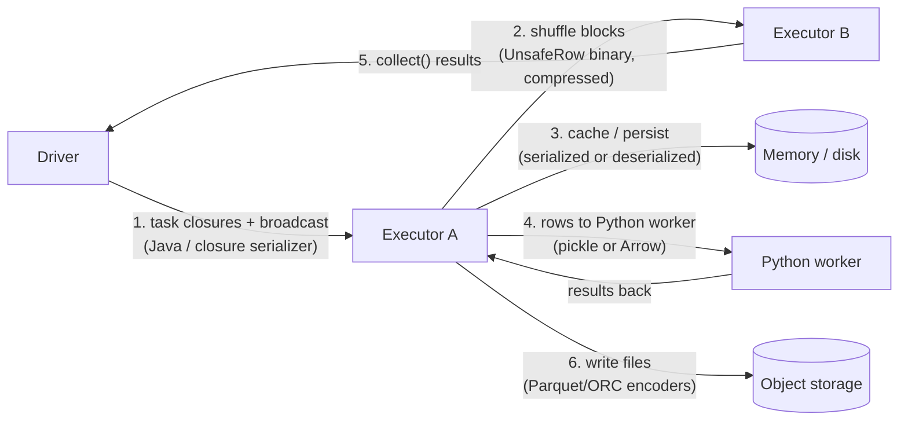
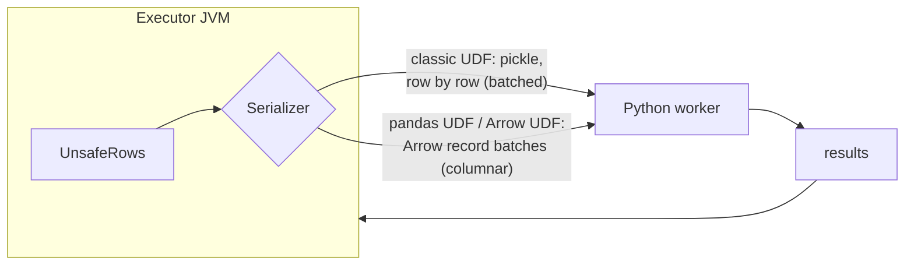

# Serialization and Deserialization in Spark: Complete Internals

Serialization is the hidden tax on every distributed job: any time data or code crosses a process boundary (driver to executor, executor to executor, JVM to Python, memory to disk) it must be turned into bytes and back. Interviewers ask about it because it explains a lot: why DataFrames beat RDDs, why Python UDFs are slow, why Kryo exists, why caching formats matter, and where the infamous `Task not serializable` comes from.

---

## 1. Where Spark serializes



| # | What crosses the boundary | Serializer | Cost driver |
|---|---|---|---|
| 1 | Task code + captured variables (closures) | Java serialization (closure serializer) | Size of captured objects; non-serializable references |
| 1b | Broadcast variables / broadcast join tables | Configured serializer, torrent-style distribution | Size of the broadcast table |
| 2 | Shuffle data | **DataFrames:** Tungsten `UnsafeRow` binary + codec (lz4/zstd). **RDDs:** `spark.serializer` (Java or Kryo) | Bytes shuffled, compression ratio |
| 3 | Cached data | DataFrames: columnar in-memory format. RDDs: objects or serialized bytes depending on storage level | Memory footprint vs CPU to deserialize |
| 4 | Python UDF input/output | Pickle (classic UDFs) or **Apache Arrow** (pandas UDFs, Arrow-optimised UDFs) | Per-row overhead vs columnar batches |
| 5 | Results to the driver | Task results serialized and sent back | `collect()` of large data = driver OOM |
| 6 | Files | Parquet/ORC columnar encodings + compression | Encoding choice, column pruning |

---

## 2. Java serialization vs Kryo

**Java serialization** (`java.io.Serializable`) works for any serializable class but is slow and verbose: it writes class metadata and field names, and reflection makes it CPU-heavy.

**Kryo** (`spark.serializer=org.apache.spark.serializer.KryoSerializer`) is typically several times faster and much more compact, especially with registered classes (`spark.kryo.classesToRegister`; with `spark.kryo.registrationRequired=true`, an unregistered class fails fast instead of silently writing full class names).

**What it affects today:** RDD shuffles, RDD caching in serialized form, and some broadcast/accumulator payloads. **DataFrame/Dataset operations mostly bypass both** because Spark SQL uses its own binary format (next section). So "switch to Kryo" is a meaningful tuning step for RDD-heavy and GraphX/MLlib-style code, and nearly irrelevant for pure DataFrame pipelines. Saying that distinction out loud is a strong signal.

**Closures are always Java-serialized** (the closure serializer isn't configurable), which is why non-serializable captured objects fail regardless of the Kryo setting.

---

## 3. Tungsten: why DataFrames avoid most serialization cost

Spark SQL represents rows internally as **`UnsafeRow`**: a compact binary layout, not Java objects.

```
UnsafeRow for (id: long, name: string, amount: double)
┌──────────────┬────────────┬──────────────────┬────────────┬───────────────┐
│ null bitmap  │ id (8 B)   │ name: off+len 8B │ amount 8 B │ "alice" bytes │
└──────────────┴────────────┴──────────────────┴────────────┴───────────────┘
fixed-length region: one 8-byte slot per field              variable-length region
```

Consequences:
- **No per-row object allocation:** less garbage collection, better CPU cache use.
- **Shuffle "serialization" is mostly a byte copy:** rows are already bytes, so writing a shuffle block is copying (plus compression).
- **Operations work on bytes directly:** hashing, comparing and sorting (with prefix keys) without deserializing.
- **Whole-stage code generation** fuses operators into a tight generated Java loop over these rows, avoiding virtual calls per row. In `explain()` the `*(1)` markers show codegen stages.
- Photon on Databricks goes further with a **vectorised C++ engine** over columnar batches.

**Encoders** (`Dataset[T]` in Scala/Java) convert between JVM objects and `UnsafeRow`. A typed `map(x => ...)` on a Dataset must **deserialize each row into an object and re-serialize** the result, and the optimiser can't see inside your lambda. That's why untyped column expressions (`col("a") + 1`) usually beat typed lambdas.

---

## 4. PySpark: the JVM ↔ Python boundary

PySpark's driver talks to the JVM through **Py4J**; on executors, Python code runs in separate **Python worker processes**. DataFrame operations written with built-in functions run **entirely in the JVM**: Python only builds the plan. The boundary is crossed when you use Python UDFs, RDD operations, `toPandas()`, `createDataFrame(pandas_df)`, or `foreach` with Python functions.



| Approach | Data transfer | Execution | Relative speed |
|---|---|---|---|
| Built-in functions (`F.when`, `F.regexp_extract`, `F.transform`, SQL) | None | JVM / Photon, codegen | Fastest |
| Pandas UDF (`@pandas_udf`) | Arrow batches (columnar, zero-copy into pandas) | Vectorised pandas/NumPy | Often 10-100× faster than classic UDFs |
| Arrow-optimised Python UDF (`useArrow=True`, Spark 3.5+) | Arrow batches | Python function per row | Faster transfer than pickle; still per-row Python |
| Classic Python UDF (`@udf`) | Pickle, row by row in batches | Python per row | Slowest; blocks optimisations |

Why classic UDFs hurt beyond transfer cost:
- They are **opaque to Catalyst**: no predicate pushdown through them, no codegen, and they can force extra projections.
- Memory for Python workers lives **outside the JVM heap** (in `memoryOverhead`), which is why PySpark jobs get containers killed for exceeding memory even when the heap looks fine.

**`toPandas()`**: with `spark.sql.execution.arrow.pyspark.enabled=true` it transfers Arrow batches, which is much faster, but it still collects **everything to the driver**. Limit or aggregate first.

---

## 5. Caching formats: serialized vs deserialized

| Storage level | Format | Trade-off |
|---|---|---|
| DataFrame `cache()` (`MEMORY_AND_DISK`) | Compressed **in-memory columnar** batches | Compact and fast to scan; the default you usually want |
| RDD `MEMORY_ONLY` | Deserialized Java objects | Fastest access, biggest footprint, GC pressure |
| RDD `MEMORY_ONLY_SER` / `MEMORY_AND_DISK_SER` | Serialized bytes (Kryo recommended) | 2-5× smaller, CPU to deserialize on each access |
| `DISK_ONLY` | Serialized on local disk | Cheap memory, slow |
| `OFF_HEAP` | Serialized, off-heap memory | Avoids GC; needs off-heap memory configured |

On Databricks, the **disk cache** keeps copies of remote Parquet/Delta files in a fast local columnar format automatically, so it often beats `df.cache()` for repeated reads of tables.

---

## 6. "Task not serializable": causes and fixes

```
org.apache.spark.SparkException: Task not serializable
Caused by: java.io.NotSerializableException: com.acme.DbClient
```

Spark must ship your function to executors, so it serializes the closure **and everything it references**. Typical causes:

1. **Capturing a non-serializable object** (DB connection, HTTP client, logger, SparkSession/SparkContext) in a `map`/UDF.
2. **Implicitly capturing `this`** (Scala/Java): referencing a field or method of an enclosing class pulls in the whole instance.
3. **PySpark:** capturing objects that can't be pickled (locks, open sockets/files, some client libraries), or referencing the SparkSession inside a UDF.

**Fixes:**
- Create the resource **on the executor**, once per partition: `mapPartitions` / `foreachPartition` opening a connection at the start of each partition (and closing it at the end).
- Copy needed fields into local variables before the closure, so it captures values, not `this`.
- Mark fields `@transient lazy val` (Scala) so they're rebuilt on each executor.
- Use **broadcast variables** for large read-only data instead of capturing it (captured data is re-sent with every task; a broadcast is sent once per executor).
- Never use the SparkSession inside a transformation; do joins instead of lookups.

```python
def enrich_partition(rows):
    client = make_geo_client()          # created on the executor, once per partition
    try:
        for r in rows:
            yield (*r, client.lookup(r.ip))
    finally:
        client.close()

enriched = df.rdd.mapPartitions(enrich_partition).toDF([*df.columns, "geo"])
```

(Better still: load the lookup data as a DataFrame and **join** it, which keeps everything in the JVM.)

---

## 7. Serialization and file formats

On disk, columnar formats apply their own encodings before compression:
- **Dictionary encoding** for low-cardinality strings (country, status) → tiny files and fast filters.
- **Run-length / bit-packing** for repeated or small integers.
- **Delta encoding** for sorted timestamps and IDs.
- Then a codec (snappy for speed, zstd for a better ratio).

Sorting or clustering data on write (e.g. by `country, event_date`) improves these encodings and min/max statistics. That's why a well-clustered Delta table can be several times smaller and faster than the same data written randomly.

---

## 8. Practical checklist

- Prefer built-in functions → pandas UDF → Arrow UDF → classic UDF, in that order.
- Enable Arrow for pandas conversions; never `collect()`/`toPandas()` unbounded data.
- Broadcast large read-only lookups; don't capture them in closures.
- Create connections per partition, not per row and not on the driver.
- For RDD-heavy code, use Kryo and register classes.
- Watch `memoryOverhead` for PySpark jobs (Python workers and Arrow buffers live there).
- Select only needed columns before shuffles and caches: fewer bytes to serialize everywhere.

---

## Interview questions

<details><summary>Why is a DataFrame job usually faster than the equivalent RDD job?</summary>

DataFrames go through Catalyst (predicate/projection pushdown, join selection, constant folding) and Tungsten (binary `UnsafeRow`s, whole-stage codegen, off-heap memory management). Rows are already bytes, so shuffles and caches avoid per-object serialization and GC churn. RDDs hold opaque JVM/Python objects: Spark can't optimise inside your lambdas and must serialize objects with Java/Kryo on every shuffle.
</details>

<details><summary>Does switching to Kryo speed up a DataFrame pipeline?</summary>

Usually not much. Spark SQL uses its own binary row format and encoders for shuffles and caching, so `spark.serializer` mainly affects RDD operations, serialized RDD caching and some internal payloads. Closures are always Java-serialized. Kryo is worthwhile for RDD-heavy, MLlib or GraphX code.
</details>

<details><summary>Why are Python UDFs slow, and what would you do instead?</summary>

Each row is pickled, shipped from the JVM to a Python worker process, processed by the interpreter and shipped back. The UDF is opaque to the optimiser (no pushdown, no codegen), and Python workers use off-heap memory. Prefer built-in functions or SQL expressions (higher-order functions like `transform`/`filter` for arrays); if Python is needed, use a pandas UDF so data moves as Arrow batches and runs vectorised, or an Arrow-optimised UDF in Spark 3.5+.
</details>

<details><summary>You get 'Task not serializable' when using a database client inside map(). Fix it.</summary>

The closure captured the client, which isn't serializable. Instantiate the client inside `mapPartitions`/`foreachPartition` so each executor creates its own connection once per partition (and closes it), or broadcast connection *config* (not the connection). If it's a lookup, load the reference data as a DataFrame and join instead.
</details>

<details><summary>What's the difference between capturing a variable in a closure and using a broadcast variable?</summary>

A captured variable is serialized into every task, so a 200 MB map in a closure is re-sent with each of thousands of tasks. A broadcast variable is sent once per executor (BitTorrent-style), cached there, and referenced by all tasks on that executor. Use broadcast for large read-only data; for join-like lookups prefer a broadcast join.
</details>

<details><summary>Why does a PySpark job get killed for 'exceeding memory limits' when the JVM heap looks fine?</summary>

Python worker processes and Arrow buffers live outside the JVM heap, in the container's overhead allowance (`spark.executor.memoryOverhead`, or `spark.executor.pyspark.memory`). Large pandas UDF batches, big Python objects or many concurrent Python workers exceed it, and YARN/Kubernetes kills the container. Increase overhead, reduce `spark.sql.execution.arrow.maxRecordsPerBatch`, use fewer cores per executor, or move logic into built-in functions.
</details>
