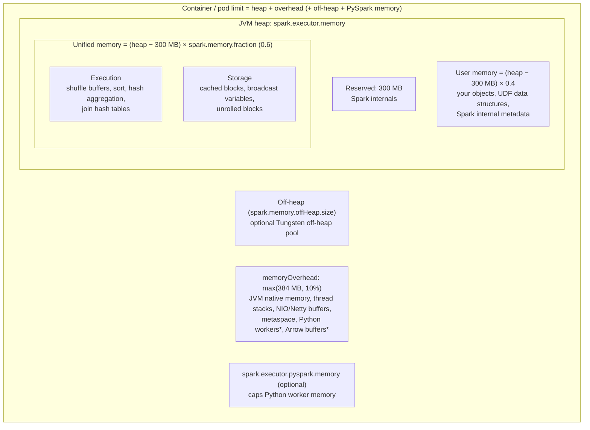
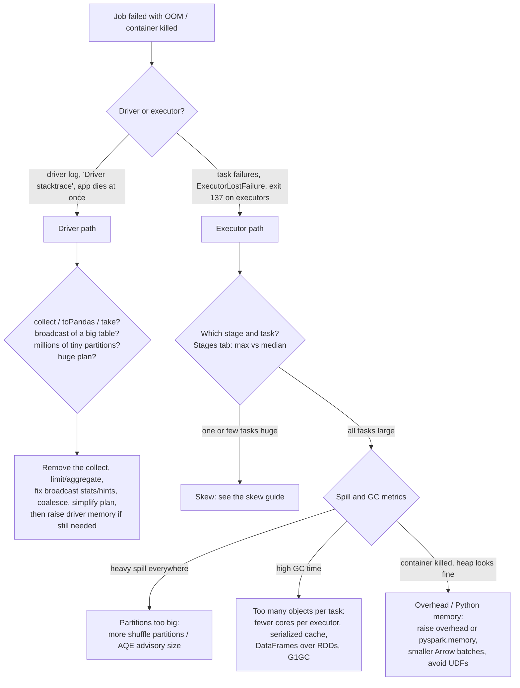

# Spark Memory Architecture and OOM Debugging

"The job died with an OutOfMemoryError. What do you do?" is one of the most common senior Spark questions, and one of the most commonly fumbled. "Add more memory" is the junior answer. The senior answer identifies **which process** ran out (driver or executor), **which memory region** (heap, off-heap, overhead, Python), **why** (skew, too-large partitions, collect, broadcast, caching, UDFs), and fixes the cause. This module gives you the mental model and the debugging path.

---

## 1. The memory layout of an executor

\* If `spark.executor.pyspark.memory` isn't set, Python workers draw from the overhead allowance.

**Worked example:** `spark.executor.memory=16g`, 4 cores.
- Usable heap ≈ 16 GB − 300 MB ≈ 15.7 GB.
- Unified (execution + storage) ≈ 15.7 × 0.6 ≈ **9.4 GB**; user memory ≈ 6.3 GB.
- `spark.memory.storageFraction=0.5` makes ≈ 4.7 GB of storage **protected from eviction** by execution; the rest is borrowable either way.
- Per running task: execution memory is shared fairly among active tasks, so each of 4 tasks gets between 1/(2N) and 1/N of the execution pool, roughly **1.2-2.3 GB**.
- Container request ≈ 16 GB + overhead (1.6 GB by default) ≈ 17.6 GB.

### The borrowing rules (the asymmetry interviewers ask about)

- Execution and storage share one pool and borrow each other's free space.
- **Execution can evict cached blocks** (storage beyond the protected `storageFraction`) when it needs memory.
- **Storage cannot evict execution memory**: if execution holds it, new cache blocks are dropped or spilled to disk (per storage level).
- Reasoning: execution memory is needed *now* to finish tasks; cached data can always be recomputed.

### The driver

The driver has the same JVM structure (`spark.driver.memory`, `spark.driver.memoryOverhead`), but it holds very different things:
- query plans and task metadata;
- **results of `collect()`, `toPandas()`, `take()`**;
- **broadcast relations, which are collected to the driver before being shipped**;
- accumulators, listener events, and the Spark UI's job and stage history.

`spark.driver.maxResultSize` (default 1 GB) caps the total serialized size of results collected from tasks, so a failing job is better than a dead driver.

---

## 2. Every kind of out-of-memory failure, decoded

| Error / symptom | Which memory | Typical causes | First fixes |
|---|---|---|---|
| `java.lang.OutOfMemoryError: Java heap space` (executor) | Executor heap (execution/user) | Huge partition (skew or too few partitions), giant rows, `collect_list` on big groups, wide explode, big UDF data structures | Find the task (skew?), more shuffle partitions, fix skew, reduce row width, avoid unbounded aggregates |
| `OutOfMemoryError: Java heap space` (driver) | Driver heap | `collect()`/`toPandas()` of big data, broadcasting a large table, too many tasks/partitions (task metadata), huge plans from loops of `withColumn` | Don't collect, limit or aggregate first, lower broadcast thresholds, coalesce tiny partitions, build plans with `select` instead of loops |
| `GC overhead limit exceeded` | Heap, thrashing | Heap nearly full, GC reclaims almost nothing; too many objects (RDD/Python-object-heavy code, deserialized caches) | More memory per task, serialized caching, DataFrames instead of RDDs, G1GC tuning, fewer cores per executor |
| `Container killed by YARN for exceeding memory limits` / Kubernetes `OOMKilled` (exit 137) | **Total container**: usually overhead or Python | PySpark workers, pandas UDFs and Arrow batches, off-heap/native libraries, Netty buffers, too many cores sharing overhead | Raise `memoryOverhead` (or set `pyspark.memory`), smaller Arrow batches, fewer cores per executor, native functions instead of UDFs |
| `OutOfMemoryError: Direct buffer memory` | Off-heap NIO buffers | Large shuffle fetches / network buffers, some connectors | Raise overhead / `-XX:MaxDirectMemorySize`, reduce `spark.reducer.maxSizeInFlight`, more partitions |
| `OutOfMemoryError: Metaspace` | Metaspace (class metadata, in overhead) | Many dynamically generated classes (codegen on huge plans), class loader leaks in long-running sessions | Simplify plans, restart long-lived sessions/notebooks, raise metaspace |
| `SparkOutOfMemoryError: Unable to acquire N bytes of memory` | Execution pool could not grant memory for an operator | One task's operator needs more than it can get (skewed join/aggregation, huge sort buffer) | Same as heap OOM: skew, partition size, cores per executor |
| `FetchFailedException` / `ExecutorLostFailure` loops | Indirect: an executor died (often OOM or preemption) | The executor holding shuffle output was killed | Find *why* it died (usually one of the above), external shuffle service/decommissioning |
| `spark.driver.maxResultSize` exceeded | Driver protection | Collecting too much | Write to storage instead of collecting |

---

## 3. The debugging path

### Step 1: Driver or executor?
- **Driver:** the whole application dies, the error appears in the driver log, and often right after an action like `collect()` or during planning or broadcasting.
- **Executor:** individual tasks fail and are retried (`Lost task … ExecutorLostFailure`), and the error appears in executor logs; the job fails after `spark.task.maxFailures` (4).

### Step 2: Which stage and task?
In the **Stages** tab, open the failing stage and look at the **Summary Metrics** for completed tasks: duration, shuffle read size, records, spill, GC time (min / 25th / median / 75th / max).
- **max ≫ median** on shuffle read or records → **skew**: one task got a giant partition. Go to [skew](/interview-prep/learn/spark-databricks/03-shuffle-spill-salting/).
- **all tasks similar but big** → partitions too large for per-task memory.

### Step 3: Spill
**Spill (Memory)** vs **Spill (Disk)**: spill means operators already ran out of execution memory and wrote to disk. A ratio of memory to disk of roughly 3-10× is normal (deserialized vs compressed). Heavy spill on every task is the precursor to OOM: increase partitions or memory per task.

### Step 4: GC time
GC time above ~10% of task time signals memory pressure; above 20-30% is a problem. Patterns:
- **High GC everywhere:** too many cores per executor for its heap, deserialized caches, object-heavy code (RDDs, Python objects in the JVM).
- **High GC on a few tasks:** skew.
- **GC rising over the job:** cached data accumulating, or a leak in a long-lived session.

### Step 5: GC logs (when it isn't obvious)
Add `-Xlog:gc*:file=…` (JDK 11+) or `-verbose:gc` via `spark.executor.extraJavaOptions`. Look for back-to-back full GCs that reclaim little (heap genuinely too small for the working set), long pauses, or humongous allocations with G1 (very large arrays such as big join hash tables or large records).

### Step 6: Fix the cause, then size
Only after removing causes (skew, collect, oversized broadcast, UDF memory) should you resize: more memory per task (fewer cores or more memory), more overhead for PySpark, more partitions.

---

## 4. GC and serialization tuning

- **G1GC** (the default on modern JVMs) suits most Spark workloads; tune `-XX:InitiatingHeapOccupancyPercent` (start concurrent marking earlier, e.g. 35) and `-XX:G1HeapRegionSize` for very large objects. **ZGC/Shenandoah** reduce pause times for very large heaps or latency-sensitive jobs, at some throughput cost.
- **Fewer, smaller objects:** DataFrames (Tungsten binary rows) instead of RDDs of objects; serialized storage levels for RDD caches; Kryo for RDD serialization.
- **Cached data lives in the old generation:** large `MEMORY_ONLY` caches increase full-GC cost. Prefer DataFrame columnar caching or `MEMORY_AND_DISK_SER`, and unpersist when done.
- **Avoid giant heaps per executor** (say over 64 GB) with many cores: GC pauses grow. Prefer more medium executors (4-5 cores).

---

## 5. Observability: where to look

| Place | What it tells you |
|---|---|
| **Executors tab** | Storage memory used per executor, task time vs GC time, failed tasks, shuffle read/write, peak JVM/off-heap/Python memory metrics (Spark 3.x executor metrics) |
| **Stages tab → Summary Metrics** | Distribution of duration, shuffle read, spill, GC: skew vs uniform pressure |
| **Storage tab** | What's cached, fraction cached, memory vs disk size: over-caching |
| **SQL tab** | Per-operator metrics (peak memory, spill size, rows) in the query DAG |
| **Environment tab** | The memory settings actually in effect (catches config that didn't apply) |
| **REST API / metrics sinks** | `/api/v1/applications/<id>/executors` for automation; the Prometheus servlet and executor metrics for Grafana dashboards and alerts (e.g. alert on GC ratio > 20%) |
| **Cluster logs** | Container exit codes: 137 = killed (OOM killer / limit), 143 = terminated |

---

## 6. Memory anti-patterns

1. `collect()` / `toPandas()` on unbounded data. Aggregate or write out instead.
2. Broadcasting a table that's large after decompression (or is large because statistics are stale).
3. `collect_list`/`collect_set` over unbounded groups (one key → millions of elements in one row).
4. Python UDFs on large columns without budgeting memory overhead.
5. Building plans in a loop of `withColumn` (hundreds of nested projections → driver memory and planning time); use one `select` with all expressions.
6. Fat executors (all cores, huge heap) → long GC pauses and shared-overhead OOMs.
7. Caching everything "just in case": evicts useful data and adds GC pressure.
8. Too few shuffle partitions for the data (each task gets GBs).
9. Ignoring skew and "fixing" it with bigger executors, which only moves the cliff.

---

## 7. Configuration reference

| Setting | Default | What it controls |
|---|---|---|
| `spark.executor.memory` / `spark.driver.memory` | 1g | JVM heap |
| `spark.executor.memoryOverhead` | max(384 MB, 10% of heap) | Non-heap container allowance |
| `spark.executor.pyspark.memory` | unset | Separate cap for Python workers |
| `spark.memory.fraction` | 0.6 | Unified (execution + storage) share of usable heap |
| `spark.memory.storageFraction` | 0.5 | Storage share of unified memory protected from eviction |
| `spark.memory.offHeap.enabled` / `.size` | false / 0 | Tungsten off-heap pool (also counts toward container size) |
| `spark.driver.maxResultSize` | 1g | Cap on collected results |
| `spark.sql.shuffle.partitions` | 200 | Partitions after shuffles (size per task) |
| `spark.sql.adaptive.advisoryPartitionSizeInBytes` | 64 MB | AQE target partition size |
| `spark.sql.autoBroadcastJoinThreshold` | 10 MB | Max estimated size to broadcast |
| `spark.sql.execution.arrow.maxRecordsPerBatch` | 10000 | Arrow batch size for pandas UDFs |
| `spark.reducer.maxSizeInFlight` | 48 MB | Shuffle fetch buffer per reduce task |

---

## Interview questions

Explain Spark's unified memory model and why execution can evict storage but not the reverse.

After 300 MB reserved, `spark.memory.fraction` (0.6) of the heap is a unified pool shared by execution (shuffles, sorts, aggregations, join hash tables) and storage (cache, broadcast). Either side can borrow the other's free memory. Execution can evict cached blocks down to the protected `storageFraction`, but storage can't evict execution memory, because tasks need execution memory to make progress while cached data can be recomputed or re-read. The remaining 0.4 is user memory for user objects and internal metadata.

A PySpark job fails with "Container killed by YARN for exceeding memory limits", but heap usage looks fine. Why?

YARN enforces the total container size, which includes memory outside the JVM heap: Python worker processes, Arrow buffers for pandas UDFs, native/NIO buffers and metaspace. These come out of `memoryOverhead` (10% by default), which is too small for Python-heavy workloads, especially with many cores (one Python worker per concurrent task). Fix: raise `memoryOverhead` or set `spark.executor.pyspark.memory`, reduce `arrow.maxRecordsPerBatch`, use fewer cores per executor, and replace Python UDFs with native functions.

How do you tell a driver OOM from an executor OOM, and what are the usual causes of each?

A driver OOM kills the whole application, appears in the driver log and usually follows an action that brings data to the driver (`collect`, `toPandas`), a broadcast (relations are collected on the driver first), or planning of a huge plan or millions of partitions. An executor OOM shows as failed and retried tasks with `ExecutorLostFailure` or exit 137 in executor logs, usually caused by skewed or oversized partitions, unbounded per-key aggregates, or UDF memory.

What does high GC time tell you and how do you fix it?

The heap is under pressure with many live objects: the JVM spends its time collecting instead of computing. If it's high on all tasks: too many concurrent tasks per heap (reduce cores per executor or raise memory), object-heavy code (move from RDDs/Python objects to DataFrames), or deserialized caches (use serialized/columnar caching, unpersist). If only a few tasks: skew. Then tune G1GC (earlier concurrent marking, region size) if needed.

Why can increasing executor memory fail to fix an OOM?

If the cause is skew, one key's data still lands in one task and keeps growing with the data; if it's the driver (collect/broadcast), executor memory is irrelevant; if it's overhead/Python memory, a larger heap doesn't help (and can shrink the overhead headroom within a fixed container). Identify the process, the memory region and the root cause first.

