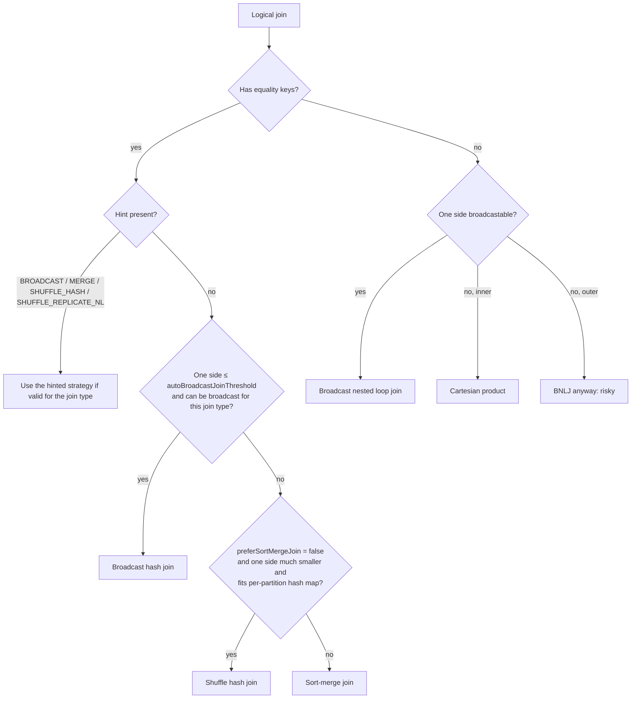
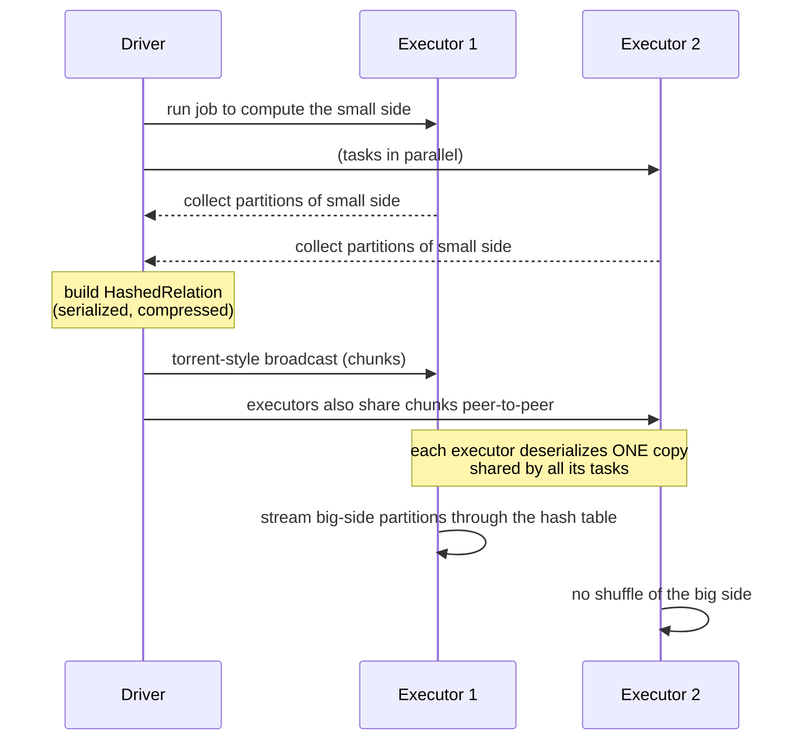

# Spark Join Strategies and Broadcast Joins

Joins are where most Spark time and most interview questions go. This module explains how a logical join becomes a physical strategy, how to read and influence that choice, how broadcast joins really work (and fail), and what AQE changes at runtime.

---

## 1. The five physical strategies

| Strategy | How it works | Needs | Cost profile | Supports |
|---|---|---|---|---|
| **Broadcast hash join (BHJ)** | Collect the small side to the driver, ship it to every executor, build a hash table; stream the big side through it | Equi-join; small side fits in memory (≤ 8 GB hard limit, practically ≤ a few hundred MB) | No shuffle of the big side: fastest for star joins | Inner, left/right outer (broadcast the non-preserved side), semi, anti; **not full outer** |
| **Shuffle hash join (SHJ)** | Shuffle both sides by key; in each partition build a hash table from the smaller side | Equi-join; build side per partition fits in memory | One shuffle, no sort; risky if a build partition is big | Most join types (full outer since 3.1) |
| **Sort-merge join (SMJ)** | Shuffle both sides by key, sort each partition, merge | Equi-join with sortable keys | Shuffle + sort of both sides; robust because it spills | All equi-join types; the default for large-large |
| **Broadcast nested loop join (BNLJ)** | Broadcast one side; compare every pair with the condition | Any condition (non-equi) | O(n·m) comparisons; OK only if one side is tiny | All types |
| **Cartesian product** | Every row × every row | Explicit cross join / no condition | O(n·m) output | Inner only |



**Notes on the selection logic:**
- Spark compares **estimated** sizes (from table/column statistics or file sizes) with `spark.sql.autoBroadcastJoinThreshold` (10 MB). Estimates can be badly wrong after filters, joins and aggregations; AQE (section 6) corrects with real sizes.
- `spark.sql.join.preferSortMergeJoin=true` (the default) means Spark picks SMJ over SHJ unless hinted, or unless AQE converts.
- **Build side rules:** BHJ/SHJ build the hash table from the side that may be broadcast/built for that join type, e.g. for `A LEFT JOIN B` only B can be the build side.

---

## 2. Join type and strategy compatibility

| Join type | BHJ | SHJ | SMJ | BNLJ |
|---|---|---|---|---|
| Inner | either side | either side | ✓ | ✓ |
| Left outer / left semi / left anti | broadcast **right** | build right | ✓ | broadcast right |
| Right outer | broadcast **left** | build left | ✓ | broadcast left |
| Full outer | ✗ | ✓ (3.1+) | ✓ | ✓ (slow) |
| Cross | ✗ (equi only) | ✗ | ✗ | ✓ / Cartesian |

Interview trap: "Why didn't my left join broadcast the small left table?" Because in a left outer join the left side is **preserved** and can't be the broadcast side. Broadcast the right side, or rewrite.

---

## 3. Statistics, size estimation and the cost-based optimizer

- **Sources of estimates:** catalog statistics from `ANALYZE TABLE t COMPUTE STATISTICS [FOR COLUMNS …]` (row count, size, column min/max, null counts, distinct counts, optional equi-height histograms with `spark.sql.statistics.histogram.enabled`); table format metadata (Delta/Iceberg file stats); otherwise file sizes on disk.
- **Propagation:** each plan node estimates its output (`Filter` applies selectivity, `Join` estimates cardinality from distinct counts, `Aggregate` from group keys). Without column stats, Spark falls back to crude rules (e.g. a filter barely reduces size), so tables often look bigger than they are after filtering.
- **When estimates go wrong:** compressed Parquet that's 10× bigger in memory; stale stats after big loads; UDF filters with unknown selectivity; joins that explode. Symptoms: a missed broadcast (SMJ on a tiny table) or, worse, a broadcast of a huge table (driver OOM, broadcast timeout).
- **CBO** (`spark.sql.cbo.enabled=true`, plus `spark.sql.cbo.joinReorder.enabled=true`) uses statistics to reorder multi-way inner joins to minimise intermediate sizes, and can detect **star schemas** (fact + dimensions) to join selective dimensions first. Limitations: it needs fresh column stats, considers a limited number of joins (`spark.sql.cbo.joinReorder.dp.threshold`, 12), and only reorders inner joins.

---

## 4. Join hints

| Hint | Effect |
|---|---|
| `BROADCAST` / `BROADCASTJOIN` / `MAPJOIN` | Broadcast this side (if allowed for the join type), regardless of the threshold |
| `MERGE` / `SHUFFLE_MERGE` / `MERGEJOIN` | Use sort-merge join |
| `SHUFFLE_HASH` | Use shuffle hash join with this side as the build side |
| `SHUFFLE_REPLICATE_NL` | Use a Cartesian/nested-loop strategy |

```sql
SELECT /*+ BROADCAST(d) */ f.*, d.region FROM sales f JOIN stores d ON f.store_id = d.store_id;
SELECT /*+ SHUFFLE_HASH(o) */ * FROM orders o JOIN payments p USING (order_id);
```
```python
from pyspark.sql.functions import broadcast
fact.join(broadcast(dim), "store_id")
orders.hint("shuffle_hash").join(payments, "order_id")
```

- **Priority when both sides are hinted:** BROADCAST > MERGE > SHUFFLE_HASH > SHUFFLE_REPLICATE_NL. If both sides have BROADCAST, Spark picks the smaller side (by stats).
- A hint that's invalid for the join type (BROADCAST on the preserved side) is ignored, with a warning in the logs.
- **Use hints sparingly:** they freeze a decision that may become wrong as data grows. Prefer fixing statistics and letting AQE decide; use hints where you *know* the data shape (a tiny dimension, or a known build side).
- Partitioning hints also exist: `REPARTITION(n, col)`, `COALESCE(n)`, `REBALANCE(col)` (lets AQE split skew and rebalance before writes).

---

## 5. Broadcast joins in depth

### How a broadcast join runs



1. The small side is **computed and collected to the driver** (so driver memory must hold it).
2. The driver builds a `HashedRelation` (a hash map keyed by the join key), serializes and compresses it, and splits it into chunks.
3. **TorrentBroadcast** distributes the chunks; executors fetch from the driver and from each other.
4. Each executor deserializes **one copy** into memory (storage memory), shared by all tasks on it.
5. Big-side tasks probe the hash table locally: **no shuffle, no sort** of the big side.

### Sizing and limits
- The threshold compares the **estimated** size, but the in-memory hash relation can be several times larger than compressed Parquet on disk.
- The hard limit is 8 GB for the broadcast table; practical limits are far lower. Memory per executor is needed for the deserialized copy, and network cost is roughly size × number of executors.
- `spark.sql.broadcastTimeout` (300 s) bounds how long building and shipping may take.

### Failure modes
| Symptom | Cause | Fix |
|---|---|---|
| Driver OOM during a join | A large table broadcast (wrong stats, aggressive hint/threshold) | Fix stats, remove the hint, lower the threshold; let AQE decide |
| `Could not execute broadcast in 300 secs` | Small side is expensive to compute (big upstream job) or too large | Materialise or cache the small side first, filter earlier, raise the timeout only if the size is fine |
| Executor OOM / heavy GC in BHJ stages | The hash relation is big in deserialized form × the executor's memory | Lower the threshold or use SHJ/SMJ; more memory per executor |
| Missed broadcast (SMJ on a small table) | Estimate is too big (no stats, filter selectivity unknown) | ANALYZE statistics, explicit `broadcast()` hint, or rely on AQE runtime conversion |
| Broadcast reused wrongly after `cache()` | A cached DataFrame's size estimate replaces the source estimate | Check `explain()` after caching (see the caching module) |

### Broadcast join vs broadcast variable
A broadcast **join** is planned by Spark SQL for DataFrames. A broadcast **variable** (`sc.broadcast(obj)`) ships any read-only object (a lookup dict, a model) to executors once instead of capturing it in every task closure. Use joins for tabular lookups and variables for small non-tabular objects in UDFs and RDD code.

---

## 6. AQE: runtime join changes

With adaptive execution, Spark re-plans after each shuffle map stage using **actual** sizes:

| AQE rule | What it does |
|---|---|
| **SMJ → BHJ** | If a side's actual shuffle output is ≤ `spark.sql.adaptive.autoBroadcastJoinThreshold` (defaults to the static threshold), convert to broadcast; the **local shuffle reader** then reads already-written shuffle files locally instead of fetching over the network |
| **SMJ → SHJ** | If all partitions of a side fit under `spark.sql.adaptive.maxShuffledHashJoinLocalMapThreshold`, use shuffle hash join (no sort) |
| **Demote broadcast** | Don't broadcast a side whose shuffle output is mostly empty partitions (non-empty ratio below `spark.sql.adaptive.nonEmptyPartitionRatioForBroadcastJoin`), where a broadcast would be inefficient (`DemoteBroadcastHashJoin`) |
| **Skew join** | Split skewed partitions of an SMJ/SHJ and replicate the matching side (see [skew](/interview-prep/learn/spark-databricks/03-shuffle-spill-salting/)) |
| **Coalesce partitions** | Merge small post-shuffle partitions before the join's reduce tasks |

Read the final plan after the query runs (`AdaptiveSparkPlan isFinalPlan=true` in the SQL tab) to see what actually happened. The initial plan can say SMJ while the executed plan used BHJ.

---

## 7. Non-equi joins, range joins and tricky conditions

- **Only equality predicates enable hash and sort strategies.** `ON a.ts BETWEEN b.start AND b.end` alone forces BNLJ or Cartesian.
- **Range join workaround (binning):** add an equality on a coarse bucket, then filter precisely:

```sql
-- events joined to sessions by time range: bucket by hour (a session can span hours, so explode its hours)
WITH s AS (SELECT *, explode(sequence(date_trunc('hour', start_ts), date_trunc('hour', end_ts), INTERVAL 1 HOUR)) AS hr FROM sessions)
SELECT e.*, s.session_id
FROM events e JOIN s
  ON e.user_id = s.user_id AND date_trunc('hour', e.ts) = s.hr      -- equi part → hash/sort strategies
 AND e.ts BETWEEN s.start_ts AND s.end_ts                           -- precise part
```

Databricks also provides a **range join optimization** hint (`/*+ RANGE_JOIN(s, 3600) */`) that does this binning internally.
- **OR conditions** (`ON a.x = b.x OR a.y = b.y`) defeat equi-join planning. Rewrite as a `UNION` of two equi-joins (deduplicating if a row can match both).
- **Null keys:** `=` never matches NULLs; use null-safe equality `<=>` when NULL should match NULL (rare), and filter out NULL keys before inner joins (they can't match and often cause skew).
- **ON vs WHERE in outer joins:** conditions on the right table in `ON` keep unmatched left rows; the same condition in `WHERE` filters them out, silently turning a left join into an inner join.
- **Duplicate keys** on both sides multiply rows (many-to-many explosion). Check key uniqueness before joining, or aggregate first.
- **Composite keys:** join on all key columns; joining on a subset causes explosions.

---

## 8. Runtime filters, DPP and storage-partitioned joins

- **Runtime Bloom filter joins** (Spark 3.3+, `spark.sql.optimizer.runtime.bloomFilter.enabled`): when one side is selective, Spark builds a Bloom filter of its join keys and applies it to the other side's scan before the shuffle, so far fewer rows are shuffled. It helps large joins where one side is filtered heavily but too big to broadcast.
- **Dynamic partition pruning:** the filtered dimension's key values prune the fact table's partitions at runtime (see [tuning deep dive](/interview-prep/learn/spark-databricks/05-performance-tuning-deep-dive/)). Combined with AQE, it can reuse the broadcast exchange as the pruning filter.
- **Storage-partitioned joins (SPJ):** with V2 data sources that report partitioning (e.g. Iceberg tables both partitioned by `bucket(N, customer_id)` with compatible layouts), Spark can join partition-to-partition **without a shuffle** (`spark.sql.sources.v2.bucketing.enabled` and related settings). It's the table-format successor to Hive bucketed joins.
- **Bucketed tables (Hive/Spark):** tables bucketed on the join key with the same bucket count skip the shuffle; not supported on Delta.

---

## 9. Optimisation playbook and decision framework

1. **Shrink before joining:** filter, project, and aggregate inputs; semi-join to reduce one side (`WHERE EXISTS` / `left_semi`).
2. **Small side ≤ a few hundred MB?** Broadcast it (fix stats or hint); make sure the join type allows it.
3. **Both large?** SMJ by default; consider SHJ if one side is moderately small per partition and sorting dominates.
4. **Repeated large-large joins on the same key?** Co-partition: Iceberg SPJ or bucketed Hive tables, or persist both sides repartitioned by the key within one job.
5. **Skewed keys?** AQE skew join → salting hot keys → handle NULL/default keys separately.
6. **Non-equi condition?** Add an equi bucket key (binning), use range join hints, or restructure.
7. **Many joins?** Fresh statistics + CBO join reordering, or reorder manually (selective joins first).
8. **Verify** in the executed plan and the SQL tab: strategy per join, rows in/out, shuffle sizes, spill.

**Override the optimizer when:** you know a side is tiny but the stats say otherwise (`broadcast()`), you know a broadcast is dangerous as data grows (`MERGE`), or a known build side should be enforced (`SHUFFLE_HASH`). Document why next to the hint.

---

## Interview questions

<details><summary>Walk me through how Spark chooses a join strategy for an equi-join.</summary>

Hints first (BROADCAST > MERGE > SHUFFLE_HASH > SHUFFLE_REPLICATE_NL, if valid for the join type). Otherwise, if one side's estimated size is under `autoBroadcastJoinThreshold` and that side can be the build side for the join type, broadcast hash join. Otherwise, if sort-merge isn't preferred and one side is small enough for per-partition hash maps, shuffle hash join; else sort-merge join. Without equality keys: broadcast nested loop join or a Cartesian product. AQE can then change the strategy at runtime using actual sizes.
</details>

<details><summary>Why might Spark broadcast a huge table, and how do you prevent it?</summary>

Because the decision uses size estimates: stale or missing statistics, compressed file sizes that understate memory size, or a hint/threshold set too high. Symptoms are driver OOM or a broadcast timeout. Fix the statistics (`ANALYZE TABLE`), remove or lower the hint/threshold, and rely on AQE's runtime conversion, which uses actual shuffle sizes.
</details>

<details><summary>A LEFT JOIN with a small left table isn't broadcast. Why?</summary>

In a left outer join, the left side is preserved (all its rows must appear), so only the right side can be the broadcast/build side. If the right side is big, Spark falls back to sort-merge. Rewrite (e.g. swap to a right join or an inner join plus a union for unmatched rows), or accept SMJ.
</details>

<details><summary>How do you join events to sessions where event time falls between session start and end, at scale?</summary>

A pure range condition forces a nested loop. Add an equality on user_id plus a time bucket: explode each session into the hourly (or daily) buckets it spans, join on (user_id, bucket), then apply the exact BETWEEN filter. On Databricks the RANGE_JOIN hint does this binning automatically. Pick the bucket size near typical session length to balance replication and selectivity.
</details>

<details><summary>What does AQE change about joins at runtime?</summary>

After shuffle map stages finish, it uses real sizes to convert sort-merge to broadcast (then reads shuffle files locally), convert sort-merge to shuffle hash join when partitions are small, avoid inefficient broadcasts, split skewed partitions for skew joins, and coalesce small partitions. The initial plan in `explain()` can differ from the final executed plan.
</details>

<details><summary>What's a storage-partitioned join?</summary>

A shuffle-free join between V2 tables (e.g. Iceberg) whose storage partitioning on the join key is compatible (such as matching bucket transforms). Spark uses the reported partitioning to join corresponding partitions directly. It's the modern table-format equivalent of bucketed joins in Hive tables, and is enabled via the v2 bucketing configs.
</details>
