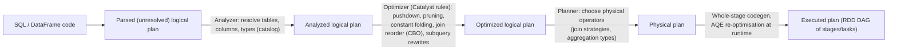

# Reading Spark Execution Plans Like a Pro

Senior engineers debug Spark by reading plans, not by guessing configs. This module is a field guide: how to produce a plan, how to read it, what every common operator means, and what to look for.

---

## 1. From query to physical plan



```python
df.explain()                 # physical plan only
df.explain("extended")       # parsed, analyzed, optimized logical + physical
df.explain("formatted")      # compact operator tree + numbered details: the most readable
df.explain("cost")           # optimized logical plan with size/row estimates (stats)
df.explain("codegen")        # generated Java code per codegen stage
```
```sql
EXPLAIN FORMATTED SELECT ...;   EXPLAIN COST SELECT ...;
```

`explain()` shows the plan **before execution**. With AQE, the plan actually executed can differ. Check the **SQL / DataFrame tab** of the Spark UI after the query runs (`isFinalPlan=true`).

---

## 2. How to read a plan

- **Read bottom-up** (leaves are scans, the root produces the output). Indentation and `+-` / `:-` show children; a join has two children (`:-` left, `+-` right).
- In `formatted` mode each operator has an id like `(7)`, and the details section lists its inputs, output columns, conditions and arguments.
- `*(n)` before an operator (in `simple` mode) or `WholeStageCodegen (n)` blocks (in `formatted` mode) mark operators fused into one generated function.
- **Stage boundaries are the Exchanges**: everything between two Exchanges runs as one stage of pipelined tasks.

### The five-question checklist
1. **How much is read?** Scans: `PartitionFilters`, `PushedFilters`, `ReadSchema`, data-skipping indicators, files/bytes read (SQL tab).
2. **How many shuffles, and of what size?** Count the `Exchange` nodes; check shuffle bytes in the SQL tab.
3. **Which join strategies?** BHJ vs SMJ vs SHJ vs nested loop.
4. **Is anything leaving the JVM or blocking optimisation?** `BatchEvalPython`/`ArrowEvalPython`, missing codegen.
5. **Did AQE change the plan?** `AQEShuffleRead` (coalesced / skewed), strategy switches.

---

## 3. Operator field guide

### Reading data
| Operator | Meaning | Look for |
|---|---|---|
| `FileScan parquet/delta …` / `BatchScan` (V2, e.g. Iceberg) | Reads files | `PartitionFilters` (directory pruning), `PushedFilters` (row-group skipping), `ReadSchema` (column pruning), `DataFilters` |
| `ColumnarToRow` | Converts columnar batches from the vectorized reader into rows | Normal above scans; many of them can signal unsupported vectorization |
| `InMemoryTableScan` / `InMemoryRelation` | Reads a cached DataFrame | Confirms the cache is used |
| `LocalTableScan` | Data embedded in the plan (small literal data) | |
| `Scan ExistingRDD` | DataFrame created from an RDD | Lost optimisation opportunities |

### Row-level operators
| Operator | Meaning |
|---|---|
| `Filter` | Predicate evaluation (check whether it could have been pushed into the scan) |
| `Project` | Column selection / expressions |
| `Generate` | `explode`, `posexplode`, `inline`: multiplies rows; watch output row counts |
| `Expand` | Duplicates each row once per grouping set: used for `ROLLUP`, `CUBE`, `GROUPING SETS` and **multiple `count(DISTINCT …)` in one query** (rows × number of distinct expressions!) |
| `Union` | Concatenation of children |
| `Sample` | Sampling |

### Exchanges (shuffles and broadcasts)
| Operator | Meaning |
|---|---|
| `Exchange hashpartitioning(keys, n)` | Shuffle by key (joins, aggregations, windows, `repartition(col)`) |
| `Exchange rangepartitioning(keys, n)` | Range shuffle for global sort (`orderBy`), with sampling first |
| `Exchange RoundRobinPartitioning(n)` | `repartition(n)` without keys |
| `Exchange SinglePartition` | Everything into one task (global aggregates without keys, some window functions without partitionBy, `limit` on large data): a scalability red flag |
| `BroadcastExchange` | Collect and broadcast a side for BHJ/BNLJ |
| `ReusedExchange` | Spark reused an identical exchange computed elsewhere in the plan (good: computed once) |
| `AQEShuffleRead` (formerly `CustomShuffleReader`) | AQE's reading of shuffle output: `coalesced`, `skewed` (split partitions) or `local` (after converting to broadcast) |

### Aggregations
| Operator | Meaning |
|---|---|
| `HashAggregate` (partial) → `Exchange` → `HashAggregate` (final) | Two-phase aggregation: partial aggregation before the shuffle shrinks the data moved |
| `ObjectHashAggregate` | Hash aggregation for aggregates with object state (e.g. `collect_list`, some UDAFs) |
| `SortAggregate` | Fallback when hash aggregation isn't possible (unsupported types or memory): sorts first, so it's slower |
| Aggregates with `distinct` | Often rewritten into extra aggregation levels (and `Expand` for multiple distincts) |

### Joins
`BroadcastHashJoin` (with `BuildLeft/BuildRight`), `ShuffledHashJoin`, `SortMergeJoin` (preceded by `Sort` on both sides), `BroadcastNestedLoopJoin`, `CartesianProduct`. See [join strategies](/interview-prep/learn/spark-databricks/07-join-strategies-and-broadcast/).

### Sorting, windows, limits
| Operator | Meaning |
|---|---|
| `Sort [k ASC], true/false` | `true` = global sort (after range exchange); `false` = sort within partitions (for SMJ, windows) |
| `Window [...]` | Window function evaluation, after `Exchange hashpartitioning(partition keys)` + `Sort` |
| `WindowGroupLimit` (Spark 3.5) | Optimisation for "top-N per group" (`row_number() <= N`) that filters early |
| `TakeOrderedAndProject` | `orderBy(...).limit(n)` done as per-partition top-n then merge: efficient |
| `CollectLimit` / `GlobalLimit` / `LocalLimit` | Limits; `CollectLimit` at the root of `show()`/`take()` |

### Leaving the JVM / blocking optimisation
| Operator | Meaning |
|---|---|
| `BatchEvalPython` | Classic Python UDF evaluation (pickled rows, per row) |
| `ArrowEvalPython` / `MapInPandas` / `FlatMapGroupsInPandas` | Pandas/Arrow UDFs and `applyInPandas` (vectorized, still outside the JVM) |
| `DeserializeToObject` / `SerializeFromObject` / `MapElements` | Typed Dataset lambdas (object conversion per row) |

### Subqueries and AQE
| Operator | Meaning |
|---|---|
| `Subquery` / `ScalarSubquery` / `SubqueryBroadcast` | Uncorrelated subqueries evaluated separately (e.g. DPP's key list) |
| `dynamicpruningexpression(...)` in `PartitionFilters` | Dynamic partition pruning applied |
| `AdaptiveSparkPlan isFinalPlan=false/true` | AQE-managed plan; `true` once executed |

*On Databricks with Photon*, operators appear as `PhotonScan`, `PhotonShuffleExchangeSink`, `PhotonGroupingAgg`, etc., with `PhotonResultStage` / `ColumnarToRow` transitions. Operators not supported by Photon fall back to regular Spark (a transition in the plan).

---

## 4. Whole-stage code generation

Spark fuses chains of operators within a stage (scan → filter → project → partial aggregate) into one generated Java method that processes rows in a tight loop, avoiding virtual function calls and intermediate objects (the "Volcano" iterator model).

- In `formatted` mode, look for `WholeStageCodegen (n)` blocks; `explain("codegen")` shows the code.
- **What breaks codegen:** Python UDFs, some complex expressions (very wide rows or huge expressions exceed method-size limits, `spark.sql.codegen.hugeMethodLimit`), certain aggregate functions, and non-codegen operators such as `SortAggregate` in some cases.
- If a query has hundreds of columns or deeply nested expressions, Spark may fall back to interpreted mode; it still works, just slower.

---

## 5. Confirm with the SQL tab

The plan says what Spark *intends*; the SQL/DataFrame tab says what *happened*, with metrics per operator:

| Metric | Where | Tells you |
|---|---|---|
| number of files read, size of files read, **files pruned** / partitions pruned | Scan | Whether pruning and data skipping worked |
| number of output rows | Every operator | Selectivity of filters; join explosions (output ≫ inputs) |
| shuffle bytes written / records, data size | Exchange | Shuffle volume; skew via min/med/max |
| spill size, peak memory | Sort, aggregate, join | Memory pressure per operator |
| build side size / time | Broadcast and hash joins | Broadcast cost |
| partitions coalesced / skewed partitions split | AQEShuffleRead | What AQE did |
| time (sort, aggregate, build, scan) | Most operators | Where time goes |

Click the stages from the SQL DAG to see task-level distributions (max vs median) for skew.

---

## 6. Worked examples

<details><summary>Example 1: "Why does this aggregation shuffle 900 GB?"</summary>

```
HashAggregate(keys=[user_id], functions=[count(distinct page), count(distinct session_id)])
+- Exchange hashpartitioning(user_id, 2000)
   +- HashAggregate(keys=[user_id, page, session_id, gid], functions=[])
      +- Expand [[user_id, page, null, 1], [user_id, null, session_id, 2]]
         +- FileScan parquet events[user_id, page, session_id]
```

Two `count(DISTINCT …)` in one aggregation trigger `Expand`, which doubles every row before the shuffle, and the partial aggregate can only deduplicate, not reduce. Fixes: compute each distinct count in a separate aggregation and join the results (or two-level aggregation: first `groupBy(user_id, page)`, then count), or use `approx_count_distinct` if exactness isn't required.
</details>

<details><summary>Example 2: "The join is slow and spills"</summary>

```
SortMergeJoin [customer_id], [customer_id], Inner
:- Sort [customer_id ASC], false
:  +- Exchange hashpartitioning(customer_id, 200)
:     +- Filter isnotnull(customer_id)
:        +- FileScan parquet orders[...] PartitionFilters: [], PushedFilters: [IsNotNull(customer_id)]
+- Sort [customer_id ASC], false
   +- Exchange hashpartitioning(customer_id, 200)
      +- Filter ((segment = enterprise) AND isnotnull(customer_id))
         +- FileScan parquet customers[...]
```

Readings:
- `PartitionFilters: []` on orders means no pruning; the query probably filters on a derived date, so filter the partition column instead.
- The filtered `customers` side is likely small, but Spark estimated it above 10 MB, so add `broadcast()` or fresh stats, or let AQE convert at runtime.
- 200 shuffle partitions for a large `orders` table means each task handles GBs and spills, so raise partitions or the AQE advisory size.

The SQL tab confirms it with the bytes read, shuffle size per partition and spill metrics.
</details>

<details><summary>Example 3: "Everything runs in one task"</summary>

```
Window [row_number() windowspecdefinition(ts ASC ...) AS rn]
+- Sort [ts ASC], false
   +- Exchange SinglePartition
```

A window function without `PARTITION BY` forces all rows into a single partition (one task, no parallelism, and likely OOM). Add a partition key (e.g. per user or per day), or compute global rankings differently: approximate quantiles, or a two-step approach with per-partition ranks plus offsets.
</details>

---

## Interview questions

<details><summary>What's the difference between the logical and physical plan, and what does each stage of Catalyst do?</summary>

The analyzer resolves names and types against the catalog (analyzed logical plan); the optimizer applies rule-based (and cost-based) rewrites such as predicate pushdown, column pruning, constant folding, subquery rewriting and join reordering (optimized logical plan); the planner picks physical operators such as join and aggregation algorithms (physical plan); then whole-stage codegen and AQE shape the executed plan. Logical plans describe *what*, physical plans describe *how*.
</details>

<details><summary>How do you tell from a plan whether partition pruning and predicate pushdown worked?</summary>

On the scan node: `PartitionFilters` lists the predicates used to skip directories (it should include your partition column filter, or a `dynamicpruningexpression` for DPP); `PushedFilters` lists predicates pushed to the file reader for row-group/stripe skipping; `ReadSchema` shows the pruned columns. In the SQL tab, compare files/bytes read with the table size.
</details>

<details><summary>What is Expand and why can it make queries slow?</summary>

Expand replicates each input row once per grouping set. It implements ROLLUP/CUBE/GROUPING SETS and multiple DISTINCT aggregates in one query. It multiplies the data before the shuffle by the number of grouping sets or distinct expressions. Splitting distinct counts into separate aggregations, or using approximate algorithms, avoids it.
</details>

<details><summary>Why can explain() be misleading with AQE enabled?</summary>

`explain()` shows the plan before execution. AQE re-optimises at runtime from actual shuffle statistics: coalescing partitions, switching join strategies, splitting skewed partitions. The executed plan in the SQL tab (`isFinalPlan=true`, `AQEShuffleRead` nodes, strategy changes) is the source of truth.
</details>

<details><summary>What breaks whole-stage code generation and why does it matter?</summary>

Python UDFs (evaluated outside the JVM), some unsupported expressions and aggregates, and huge generated methods (very wide or deeply nested expressions over the codegen size limit). Without codegen Spark uses the slower iterator model with per-row virtual calls and object creation, so CPU-heavy stages slow down noticeably.
</details>
