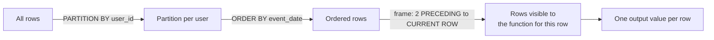
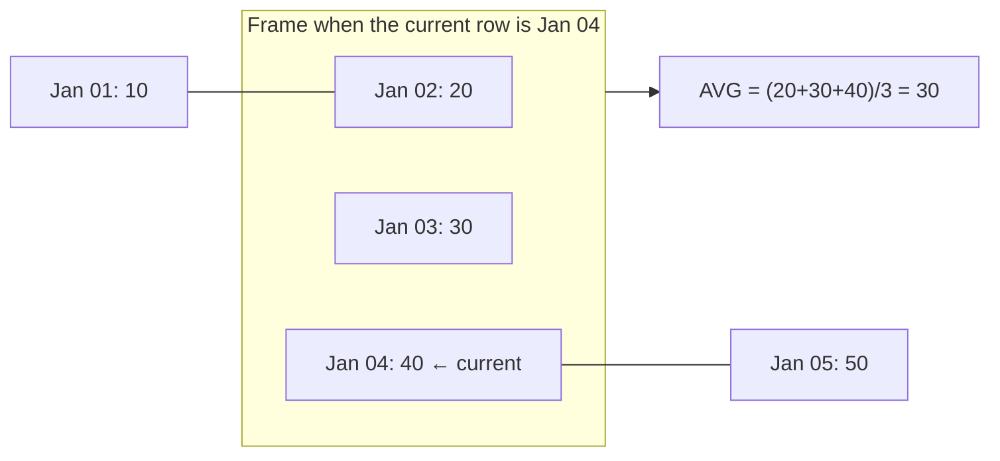

# Window Functions: The Complete Guide

> Window functions show up in nearly every data engineering SQL round. If you can explain **PARTITION BY, ORDER BY and the frame** precisely, most "hard" SQL questions become mechanical.

---

## 1. The mental model

A window function computes a value **for each row** using a set of related rows (the *window*), **without collapsing rows** like `GROUP BY` does.

```sql
function(args) OVER (
    PARTITION BY ...      -- split rows into independent groups (like GROUP BY, but rows are kept)
    ORDER BY ...          -- order rows inside each partition
    ROWS | RANGE | GROUPS BETWEEN <start> AND <end>   -- the frame: which rows relative to the current row
)
```



**GROUP BY vs window:**

| order_id | customer | amount | `SUM(amount) GROUP BY customer` | `SUM(amount) OVER (PARTITION BY customer)` |
|---|---|---|---|---|
| 1 | A | 10 | A → 30 (one row) | 30 |
| 2 | A | 20 | | 30 |
| 3 | B | 5 | B → 5 (one row) | 5 |

### Logical query processing order
```
FROM / JOIN → WHERE → GROUP BY → HAVING → WINDOW FUNCTIONS → SELECT → DISTINCT → ORDER BY → LIMIT
```
Consequences (classic interview trap):
- You **can't use a window function in WHERE**. Wrap it in a CTE/subquery, or use `QUALIFY` (Snowflake, BigQuery, Databricks, DuckDB, Teradata).
- Window functions **can** wrap aggregates: `SUM(SUM(amount)) OVER (...)` after a GROUP BY.

---

## 2. The function families

### 2.1 Ranking

| Function | Ties | Gaps after ties | Example values for scores 100, 90, 90, 80 |
|---|---|---|---|
| `ROW_NUMBER()` | arbitrary order | n/a | 1, 2, 3, 4 |
| `RANK()` | same rank | **yes** | 1, 2, 2, 4 |
| `DENSE_RANK()` | same rank | no | 1, 2, 2, 3 |
| `NTILE(n)` | buckets of ~equal size | n/a | NTILE(2): 1, 1, 2, 2 |
| `PERCENT_RANK()` | (rank − 1) / (n − 1) | | 0, 0.33, 0.33, 1 |
| `CUME_DIST()` | rows ≤ current / n | | 0.25, 0.75, 0.75, 1 |

**When to use which:**
- *Deduplicate / pick one row per key*: `ROW_NUMBER()` (always add a deterministic tie-breaker!).
- *Top N per group, ties included*: `DENSE_RANK()` or `RANK()` depending on whether "3rd highest salary" means 3rd distinct value (`DENSE_RANK`).
- *Percentiles/quartiles*: `NTILE`, `PERCENT_RANK`, or `PERCENTILE_CONT`.

```sql
-- Latest record per customer (dedup pattern, used constantly in CDC/silver layers)
SELECT * FROM (
  SELECT *, ROW_NUMBER() OVER (PARTITION BY customer_id
                               ORDER BY updated_at DESC, ingest_id DESC) AS rn
  FROM customers_raw
) WHERE rn = 1;
```

### 2.2 Offset (value) functions

| Function | Returns |
|---|---|
| `LAG(col, n, default)` | value n rows **before** in the partition |
| `LEAD(col, n, default)` | value n rows **after** |
| `FIRST_VALUE(col)` | first value in the **frame** |
| `LAST_VALUE(col)` | last value in the **frame** (trap: see §4) |
| `NTH_VALUE(col, n)` | nth value in the frame |

```sql
-- Day-over-day change and % growth
SELECT day, revenue,
       revenue - LAG(revenue) OVER (ORDER BY day)                         AS abs_change,
       ROUND(100.0 * (revenue - LAG(revenue) OVER (ORDER BY day))
             / NULLIF(LAG(revenue) OVER (ORDER BY day), 0), 2)            AS pct_change
FROM daily_revenue;
```

`LAG/LEAD` power: period-over-period growth, time between events, sessionization (gap > 30 min), detecting status changes, building SCD2 `valid_to` from the next row's `valid_from`.

### 2.3 Aggregate windows

`SUM, AVG, COUNT, MIN, MAX` with `OVER(...)`: running totals, moving averages, percent of total, share within group.

```sql
SELECT region, product, revenue,
       ROUND(100.0 * revenue / SUM(revenue) OVER (PARTITION BY region), 1) AS pct_of_region,
       SUM(revenue) OVER (PARTITION BY region ORDER BY revenue DESC
                          ROWS BETWEEN UNBOUNDED PRECEDING AND CURRENT ROW)    AS running_total
FROM sales;
```

---

## 3. Frames: ROWS vs RANGE vs GROUPS

The frame decides *which rows of the partition* the function sees.

```
ROWS   BETWEEN 2 PRECEDING AND CURRENT ROW      → physical rows: this row and the 2 before it
RANGE  BETWEEN 2 PRECEDING AND CURRENT ROW      → logical values: rows whose ORDER BY value is within [current−2, current]
GROUPS BETWEEN 1 PRECEDING AND CURRENT ROW      → peer groups: this group of tied values and the previous one
```

### Visual: 3-row moving average, ROWS frame



### Why ROWS vs RANGE matters: missing days and ties

| day | revenue | `ROWS 2 PRECEDING` avg | `RANGE 2 days PRECEDING` avg |
|---|---|---|---|
| Jan 01 | 10 | 10 | 10 |
| Jan 02 | 20 | 15 | 15 |
| Jan 05 | 50 | (10+20+50)/3 = **26.7** (includes Jan 1–2!) | 50 (only Jan 3–5) |
| Jan 06 | 60 | (20+50+60)/3 = 43.3 | (50+60)/2 = 55 |

- `ROWS` counts **rows**. If days are missing, a "7-row" average is not a "7-day" average.
- `RANGE` with an interval counts **time**. Correct for calendar windows, but not every engine supports interval offsets (Postgres 11+, Spark, Snowflake, BigQuery: yes for numeric/date; SQLite: numeric offsets only, so convert dates to day numbers).
- Alternative that works everywhere: **densify with a calendar table** (left join to all dates, fill 0), then use `ROWS`.

### The default frame (the #1 window function bug)

| You write | Engine uses |
|---|---|
| `OVER (PARTITION BY x)` (no ORDER BY) | whole partition |
| `OVER (PARTITION BY x ORDER BY y)` | **`RANGE BETWEEN UNBOUNDED PRECEDING AND CURRENT ROW`** |

So `SUM(amount) OVER (ORDER BY day)` is a **running total**, not a total, and with `RANGE` semantics **ties on `day` get the same running total** (all peers included). Use `ROWS BETWEEN UNBOUNDED PRECEDING AND CURRENT ROW` when you want strictly row-by-row accumulation.

---

## 4. Classic pitfalls (asked to catch candidates)

1. **`LAST_VALUE` returns the current row.** Because of the default frame ending at `CURRENT ROW`. Fix:
   ```sql
   LAST_VALUE(price) OVER (PARTITION BY sku ORDER BY ts
                           ROWS BETWEEN UNBOUNDED PRECEDING AND UNBOUNDED FOLLOWING)
   -- or: FIRST_VALUE(price) OVER (PARTITION BY sku ORDER BY ts DESC)
   ```
2. **Non-deterministic `ROW_NUMBER`**: ties in ORDER BY → different results between runs → flaky dedup. Always add a tie-breaker (unique id, ingest offset).
3. **Filtering on a window function in WHERE**: not allowed. Use a CTE or `QUALIFY`.
4. **`COUNT(DISTINCT ...) OVER (...)`**: not supported in many engines (Postgres, SQL Server, SQLite). Workarounds: `DENSE_RANK` trick (`DENSE_RANK() OVER (PARTITION BY p ORDER BY x) + DENSE_RANK() OVER (PARTITION BY p ORDER BY x DESC) − 1`), or `SIZE(COLLECT_SET(x) OVER ...)` in Spark, or pre-aggregate.
5. **Moving average over missing dates** with `ROWS` (see §3).
6. **Integer division**: `SUM(a)/COUNT(*)` with integers truncates in Postgres/SQL Server/SQLite. Multiply by `1.0`.
7. **NULLs in ORDER BY**: placement differs by engine (`NULLS FIRST/LAST`).
8. **Performance**: each distinct `OVER (PARTITION BY ... ORDER BY ...)` spec can require a separate sort/shuffle. Reuse the same window (`WINDOW w AS (...)`) and be careful with huge partitions (one partition = one task in Spark → skew).

---

## 5. Recipes you should be able to write from memory

```sql
-- Running total per customer
SUM(amount) OVER (PARTITION BY customer_id ORDER BY order_ts
                  ROWS BETWEEN UNBOUNDED PRECEDING AND CURRENT ROW)

-- 7-day moving average (dense daily data)
AVG(revenue) OVER (ORDER BY day ROWS BETWEEN 6 PRECEDING AND CURRENT ROW)

-- 7-day moving average only when a full 7 days exist
CASE WHEN COUNT(*) OVER (ORDER BY day ROWS BETWEEN 6 PRECEDING AND CURRENT ROW) = 7
     THEN AVG(revenue) OVER (ORDER BY day ROWS BETWEEN 6 PRECEDING AND CURRENT ROW) END

-- Centered moving average
AVG(x) OVER (ORDER BY day ROWS BETWEEN 3 PRECEDING AND 3 FOLLOWING)

-- Cumulative share (Pareto / 80-20)
SUM(revenue) OVER (ORDER BY revenue DESC ROWS UNBOUNDED PRECEDING) * 1.0 / SUM(revenue) OVER ()

-- Year-over-year with LAG on monthly data
LAG(revenue, 12) OVER (ORDER BY month)

-- Time since previous event
julianday(ts) - julianday(LAG(ts) OVER (PARTITION BY user_id ORDER BY ts))   -- SQLite
ts - LAG(ts) OVER (PARTITION BY user_id ORDER BY ts)                          -- Postgres interval

-- Gaps & islands key (consecutive days)
DATE(day, '-' || ROW_NUMBER() OVER (PARTITION BY user_id ORDER BY day) || ' days')   -- SQLite
day - ROW_NUMBER() OVER (PARTITION BY user_id ORDER BY day) * INTERVAL '1 day'        -- Postgres

-- Forward-fill last non-null value
MAX(value) OVER (PARTITION BY id, grp)  -- where grp = COUNT(value) OVER (PARTITION BY id ORDER BY ts)

-- Median (engines with PERCENTILE_CONT)
PERCENTILE_CONT(0.5) WITHIN GROUP (ORDER BY x)   -- Postgres/Snowflake (aggregate)
percentile_approx(x, 0.5)                        -- Spark
```

---

## 6. Window functions in Spark (DataFrame API)

```python
from pyspark.sql import Window, functions as F

w = Window.partitionBy("customer_id").orderBy("order_ts")
df = (orders
      .withColumn("rn", F.row_number().over(w))
      .withColumn("running_total", F.sum("amount").over(w.rowsBetween(Window.unboundedPreceding, 0)))
      .withColumn("prev_amount", F.lag("amount").over(w))
      .withColumn("ma_7", F.avg("amount").over(w.rowsBetween(-6, 0))))

# RANGE over time: order by epoch seconds and use a numeric range
w_time = Window.partitionBy("customer_id").orderBy(F.col("order_ts").cast("long")).rangeBetween(-7*86400, 0)
```

Spark executes a window by **shuffling by the partition key and sorting within partitions**. A partition key with one giant value (e.g. `PARTITION BY country` where 60% is US) is a skew problem. A window without `partitionBy` moves **all data to one task** (Spark warns: "No Partition Defined for Window operation!").

---

## 7. Practice

Work through the [SQL practice set](/interview-prep/practice/sql/). The window-function problems are tagged `window-functions`, `moving-average`, `ranking`, `gaps-and-islands`.
