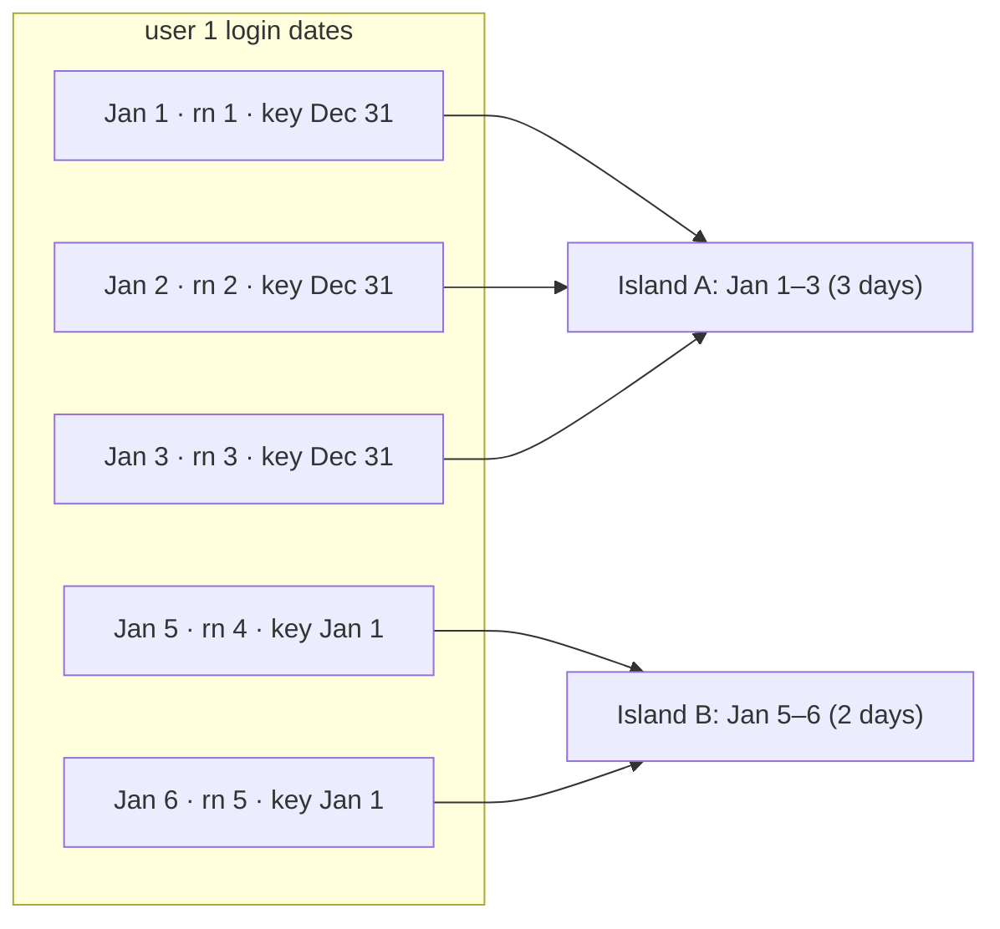
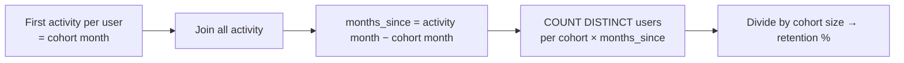

# Advanced SQL Patterns

> FAANG SQL rounds reuse about a dozen patterns. Learn to **recognise the pattern from the wording**, then the query writes itself.

| If the question says… | Pattern |
|---|---|
| "consecutive days", "streak", "longest run" | [Gaps and islands](#1-gaps-and-islands) |
| "session", "inactive for 30 minutes" | [Sessionization](#2-sessionization) |
| "latest record", "remove duplicates" | [Dedup with ROW_NUMBER](#3-deduplication) |
| "top N per X" | [Ranking per group](#4-top-n-per-group) |
| "moving/rolling average", "running total" | [Window frames](/interview-prep/learn/sql/01-window-functions/#3-frames-rows-vs-range-vs-groups) |
| "% of users who did A then B" | [Funnels](#5-funnels) |
| "retention", "cohort", "came back in week N" | [Cohort retention](#6-cohort-retention) |
| "never", "without", "didn't" | [Anti-join](#7-anti-joins-and-semi-joins) |
| "rows to columns", "per month as columns" | [Pivot](#8-pivot-and-unpivot) |
| "hierarchy", "manager chain", "all descendants" | [Recursive CTE](#9-recursive-ctes) |
| "overlapping", "concurrent", "at the same time" | [Intervals](#10-intervals-overlap-merge-concurrency) |
| "fill missing dates", "zero when no data" | [Densification](#11-date-spines-and-densification) |
| "median", "p95" | [Percentiles](#12-percentiles-and-median) |

---

## 1. Gaps and islands

**Problem shape:** find runs of consecutive values (days, ids, statuses).

**Trick:** for consecutive values, `value − ROW_NUMBER()` is constant within a run.



```sql
WITH d AS (SELECT DISTINCT user_id, login_date FROM logins),       -- dedupe first!
g AS (
  SELECT user_id, login_date,
         DATE(login_date, '-' || ROW_NUMBER() OVER (PARTITION BY user_id ORDER BY login_date) || ' days') AS grp
  FROM d
)
SELECT user_id, MIN(login_date) AS start_date, MAX(login_date) AS end_date, COUNT(*) AS days
FROM g GROUP BY user_id, grp;
```

**Variant: islands of equal status** (e.g. machine state runs): use the *difference of two row numbers*:
```sql
ROW_NUMBER() OVER (PARTITION BY machine ORDER BY ts)
- ROW_NUMBER() OVER (PARTITION BY machine, status ORDER BY ts) AS grp
```
or the **change-flag + running sum** approach (more general, works for any "new group starts when…" rule):
```sql
SUM(CASE WHEN status <> LAG(status) OVER (PARTITION BY machine ORDER BY ts) THEN 1 ELSE 0 END)
    OVER (PARTITION BY machine ORDER BY ts) AS grp
```

## 2. Sessionization

"New session if more than 30 minutes since the previous event". This is the change-flag + running-sum pattern with a time condition:

```sql
WITH flagged AS (
  SELECT *, CASE WHEN LAG(ts) OVER (PARTITION BY user_id ORDER BY ts) IS NULL
                   OR (julianday(ts) - julianday(LAG(ts) OVER (PARTITION BY user_id ORDER BY ts))) * 24 * 60 > 30
                 THEN 1 ELSE 0 END AS is_new
  FROM events
)
SELECT *, SUM(is_new) OVER (PARTITION BY user_id ORDER BY ts ROWS UNBOUNDED PRECEDING) AS session_no
FROM flagged;
```

Follow-ups: max session length (also split sessions > 24 h), sessions crossing midnight (assign to start date), streaming version (session windows).

## 3. Deduplication

```sql
SELECT * FROM (
  SELECT *, ROW_NUMBER() OVER (PARTITION BY business_key ORDER BY updated_at DESC, _ingest_id DESC) AS rn
  FROM raw
) WHERE rn = 1;
-- Snowflake/Databricks/BigQuery: ... QUALIFY ROW_NUMBER() OVER (...) = 1
```

Know the alternatives and their costs:
- `SELECT DISTINCT`: only exact-duplicate rows.
- `GROUP BY key` with `MAX(...)`: mixes columns from different rows (bug!) unless using `MAX_BY`/`ARG_MAX`.
- `MAX_BY(col, updated_at)` (Spark, Trino, Snowflake): compact for a few columns.

## 4. Top N per group

```sql
SELECT * FROM (
  SELECT department, employee, salary,
         DENSE_RANK() OVER (PARTITION BY department ORDER BY salary DESC) AS r
  FROM employees
) WHERE r <= 3;
```
Clarify ties: "top 3 salaries" (DENSE_RANK) vs "top 3 employees" (ROW_NUMBER, with a tie-breaker) vs "3 highest earners including ties at the boundary" (RANK).

## 5. Funnels

"Of users who viewed, how many added to cart and then purchased, in that order?"

```sql
WITH firsts AS (
  SELECT user_id,
         MIN(CASE WHEN event = 'view'     THEN ts END) AS t_view,
         MIN(CASE WHEN event = 'cart'     THEN ts END) AS t_cart,
         MIN(CASE WHEN event = 'purchase' THEN ts END) AS t_purchase
  FROM events GROUP BY user_id
)
SELECT COUNT(t_view)                                                     AS viewed,
       COUNT(CASE WHEN t_cart > t_view THEN 1 END)                       AS carted,
       COUNT(CASE WHEN t_purchase > t_cart AND t_cart > t_view THEN 1 END) AS purchased
FROM firsts;
```
Clarify: order enforced? Time limit between steps (within 1 day)? Per session or per user? First occurrence vs any?

## 6. Cohort retention



```sql
WITH cohort AS (
  SELECT user_id, MIN(strftime('%Y-%m', activity_date)) AS cohort_month FROM activity GROUP BY user_id
), act AS (
  SELECT DISTINCT a.user_id, c.cohort_month,
         (CAST(strftime('%Y', a.activity_date) AS INT) * 12 + CAST(strftime('%m', a.activity_date) AS INT))
       - (CAST(substr(c.cohort_month, 1, 4) AS INT) * 12 + CAST(substr(c.cohort_month, 6, 2) AS INT)) AS month_n
  FROM activity a JOIN cohort c USING (user_id)
)
SELECT cohort_month, month_n, COUNT(*) AS users,
       ROUND(100.0 * COUNT(*) / FIRST_VALUE(COUNT(*)) OVER (PARTITION BY cohort_month ORDER BY month_n), 1) AS pct
FROM act GROUP BY cohort_month, month_n ORDER BY cohort_month, month_n;
```

Related metrics: **DAU/MAU stickiness**, **N-day retention** (active exactly on day N vs on-or-after day N, "unbounded"), **churned / resurrected / new** user classification (compare activity in the current vs previous period).

## 7. Anti-joins and semi-joins

"Customers who never ordered":

```sql
-- Preferred: NOT EXISTS (NULL-safe, optimisers turn it into an anti-join)
SELECT c.* FROM customers c
WHERE NOT EXISTS (SELECT 1 FROM orders o WHERE o.customer_id = c.customer_id);

-- Also fine: LEFT JOIN ... WHERE o.customer_id IS NULL
-- DANGER: NOT IN (SELECT customer_id FROM orders) returns NOTHING if any customer_id is NULL
```

Semi-join ("customers with at least one order") → `EXISTS` or `IN`, not `JOIN` + `DISTINCT` (join can multiply rows).

## 8. Pivot and unpivot

```sql
-- Portable conditional aggregation
SELECT product,
       SUM(CASE WHEN month = '2026-01' THEN revenue ELSE 0 END) AS jan,
       SUM(CASE WHEN month = '2026-02' THEN revenue ELSE 0 END) AS feb
FROM sales GROUP BY product;
-- Postgres: SUM(revenue) FILTER (WHERE month = '2026-01')
-- Spark/Snowflake: PIVOT (SUM(revenue) FOR month IN ('2026-01' AS jan, '2026-02' AS feb))
```
Unpivot: `UNION ALL` of each column, or `UNPIVOT` / `stack()` in Spark.

## 9. Recursive CTEs

```sql
WITH RECURSIVE chain(employee_id, manager_id, depth, path) AS (
  SELECT employee_id, manager_id, 0, CAST(employee_id AS TEXT) FROM employees WHERE manager_id IS NULL
  UNION ALL
  SELECT e.employee_id, e.manager_id, c.depth + 1, c.path || '>' || e.employee_id
  FROM employees e JOIN chain c ON e.manager_id = c.employee_id
)
SELECT * FROM chain;
```
Uses: org charts, bill of materials, category trees, generating date series, graph reachability (guard against cycles with a depth limit or path check). Spark SQL supports recursive CTEs only in recent versions; otherwise iterate in PySpark or use GraphFrames.

## 10. Intervals: overlap, merge, concurrency

**Overlap test** for `[s1, e1)` and `[s2, e2)`: `s1 < e2 AND s2 < e1`.

**Merge overlapping intervals** (gaps and islands on intervals):
```sql
WITH o AS (
  SELECT *, MAX(end_ts) OVER (PARTITION BY user_id ORDER BY start_ts
                              ROWS BETWEEN UNBOUNDED PRECEDING AND 1 PRECEDING) AS prev_max_end
  FROM subscriptions
), g AS (
  SELECT *, SUM(CASE WHEN prev_max_end IS NULL OR start_ts > prev_max_end THEN 1 ELSE 0 END)
              OVER (PARTITION BY user_id ORDER BY start_ts ROWS UNBOUNDED PRECEDING) AS grp
  FROM o
)
SELECT user_id, MIN(start_ts) AS start_ts, MAX(end_ts) AS end_ts FROM g GROUP BY user_id, grp;
```

**Max concurrency** (peak concurrent sessions/calls): turn intervals into +1/−1 events and take a running sum:
```sql
WITH ev AS (
  SELECT start_ts AS ts, 1 AS delta FROM calls
  UNION ALL
  SELECT end_ts, -1 FROM calls
)
SELECT MAX(concurrent) FROM (
  SELECT SUM(delta) OVER (ORDER BY ts, delta ROWS UNBOUNDED PRECEDING) AS concurrent FROM ev
);   -- ORDER BY ts, delta: process ends (−1) before starts (+1) at the same timestamp
```

## 11. Date spines and densification

Missing days break moving averages and make charts lie. Generate a calendar and left join:
```sql
WITH RECURSIVE days(d) AS (
  SELECT DATE('2026-01-01') UNION ALL SELECT DATE(d, '+1 day') FROM days WHERE d < '2026-01-31'
)
SELECT days.d, COALESCE(SUM(o.amount), 0) AS revenue
FROM days LEFT JOIN orders o ON o.order_date = days.d
GROUP BY days.d;
-- Postgres: generate_series(...) · Spark: sequence() + explode() · Snowflake: GENERATOR / date dimension
```
In production, use a **date dimension table** rather than generating one per query.

## 12. Percentiles and median

```sql
-- Engines with ordered-set aggregates
SELECT PERCENTILE_CONT(0.5) WITHIN GROUP (ORDER BY latency_ms) FROM requests;   -- Postgres, Snowflake
SELECT percentile_approx(latency_ms, array(0.5, 0.95)) FROM requests;           -- Spark
-- Portable median with window functions
SELECT AVG(x) FROM (
  SELECT x, ROW_NUMBER() OVER (ORDER BY x) AS rn, COUNT(*) OVER () AS n FROM t
) WHERE rn IN ((n + 1) / 2, (n + 2) / 2);
```

---

## Interview approach for any SQL problem

1. **Restate and clarify**: grain of input, duplicates, NULLs, ties, time zones, inclusive/exclusive boundaries.
2. **Describe the output grain** ("one row per user per week").
3. **Name the pattern** out loud ("this is gaps and islands").
4. **Build in CTEs**, one transformation per step, readable names.
5. **Check edge cases**: empty groups, single row, ties, NULLs, first/last row of a partition.
6. **Talk performance** if asked: partitioning keys, avoiding cartesian joins, pre-aggregation, `UNION ALL` vs `UNION`.
