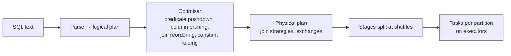

# SQL Performance, Execution Plans and Dialects

> Senior candidates are expected to say *why* a query is slow and how the engine executes it, not just produce correct results.

---

## 1. How a distributed SQL engine runs your query



The expensive parts, in order: **reading data** (I/O), **shuffling** (network + disk), **sorting**, then CPU.

## 2. Join strategies

| Strategy | How | When chosen | Cost |
|---|---|---|---|
| **Broadcast hash join** | Small table copied to every executor; probe locally | One side < broadcast threshold (Spark default 10 MB; AQE can switch at runtime) | No shuffle of the big side: fastest |
| **Shuffle hash join** | Both sides shuffled by key; hash table on one side per partition | Medium sides, equi-join | Shuffle both |
| **Sort-merge join** | Both sides shuffled + sorted by key; merged | Large-large equi-joins (Spark default) | Shuffle + sort both |
| **Nested loop / cartesian** | Every row × every row | Non-equi joins without better option | O(n·m): danger |

```sql
-- Force a broadcast in Spark SQL when you know the dimension is small
SELECT /*+ BROADCAST(d) */ f.*, d.name FROM fact f JOIN dim d ON f.dim_id = d.id;
```

**Non-equi joins** (ranges, `BETWEEN`, interval overlaps) often become nested loops. Mitigate with bucketing tricks (join on day/bucket first, then filter), range join hints (Databricks `RANGE_JOIN`), or rewriting as window functions.

## 3. Reading a plan: what to look for

```
== Physical Plan ==
*(5) HashAggregate(keys=[country], functions=[sum(amount)])
+- Exchange hashpartitioning(country, 200)           ← shuffle
   +- *(4) HashAggregate(keys=[country], functions=[partial_sum(amount)])   ← map-side partial agg
      +- *(4) Project [country, amount]
         +- *(4) BroadcastHashJoin [customer_id], [id], Inner, BuildRight   ← broadcast join, good
            :- *(4) Filter isnotnull(customer_id)
            :  +- *(4) ColumnarToRow
            :     +- FileScan parquet [customer_id, amount] PushedFilters: [IsNotNull(customer_id)],
            :        PartitionFilters: [isnotnull(dt), (dt = 2026-10-01)]    ← partition pruning worked
            +- BroadcastExchange
               +- FileScan parquet [id, country]
```

Checklist:
- **PartitionFilters / PushedFilters** present? Otherwise you're scanning everything.
- How many **Exchange** (shuffle) nodes? Can a broadcast remove one?
- **Join type** as expected? Unexpected `CartesianProduct` / `BroadcastNestedLoopJoin`?
- Spark UI: task duration skew (max ≫ median), spill to disk, shuffle read size per task.

## 4. Query anti-patterns

| Anti-pattern | Why it's slow | Fix |
|---|---|---|
| `SELECT *` on wide columnar tables | Reads every column | Select needed columns |
| Function on filter column: `WHERE DATE(ts) = '2026-10-01'` | Can block pruning/pushdown | `WHERE ts >= '2026-10-01' AND ts < '2026-10-02'` (or filter on the partition column) |
| `UNION` instead of `UNION ALL` | Extra dedup (sort/shuffle) | `UNION ALL` when duplicates impossible or wanted |
| `COUNT(DISTINCT)` on huge cardinality | Big shuffle | `approx_count_distinct`, or pre-aggregate |
| Join then aggregate | Joins explode row counts | Aggregate first, then join (when semantics allow) |
| `OR` across different columns in join conditions | Prevents hash join | Split into `UNION ALL` of two joins |
| Correlated subqueries per row | N executions (engine-dependent) | Rewrite as join / window |
| `ORDER BY` without `LIMIT` on huge results | Global sort | Sort only when needed |
| `NOT IN` with NULLable subquery | Wrong results and slow | `NOT EXISTS` |
| Window with no `PARTITION BY` | Single task | Partition, or accept for small data |

## 5. Data skew in SQL engines

Symptom: one task runs 30 min while others take 30 s. Causes: join or group key with a dominant value (NULLs, "unknown", one mega-customer).

Fixes:
- Filter or separately handle NULL/default keys (they all hash to one partition).
- **AQE skew join** (`spark.sql.adaptive.skewJoin.enabled`) splits skewed partitions.
- **Salting**: add a random 0..N-1 suffix to the skewed side's key and replicate the other side N times.
- Broadcast the smaller side if it fits.
- Two-stage aggregation (partial by salted key, then final).

## 6. Dialect cheat sheet

| Task | Postgres | Spark SQL / Databricks | Snowflake | BigQuery | SQLite (used in this repo's runner) |
|---|---|---|---|---|---|
| Filter on window result | subquery | `QUALIFY` | `QUALIFY` | `QUALIFY` | subquery |
| Date add | `d + INTERVAL '7 day'` | `date_add(d, 7)` | `DATEADD(day, 7, d)` | `DATE_ADD(d, INTERVAL 7 DAY)` | `DATE(d, '+7 days')` |
| Date diff (days) | `d2 - d1` | `datediff(d2, d1)` | `DATEDIFF(day, d1, d2)` | `DATE_DIFF(d2, d1, DAY)` | `julianday(d2) - julianday(d1)` |
| Truncate to month | `date_trunc('month', d)` | `date_trunc('MONTH', d)` | `DATE_TRUNC('month', d)` | `DATE_TRUNC(d, MONTH)` | `strftime('%Y-%m-01', d)` |
| Pick column of max row | `DISTINCT ON` | `max_by(col, ts)` | `MAX_BY(col, ts)` | `ARRAY_AGG(col ORDER BY ts DESC LIMIT 1)[OFFSET(0)]` | window + filter |
| String agg | `string_agg(x, ',')` | `array_join(collect_list(x), ',')` | `LISTAGG(x, ',')` | `STRING_AGG(x, ',')` | `group_concat(x, ',')` |
| Conditional agg | `FILTER (WHERE …)` | `count_if`, `FILTER` | `COUNT_IF` | `COUNTIF` | `SUM(CASE …)` / `FILTER` |
| Median | `percentile_cont(0.5) WITHIN GROUP` | `percentile_approx` / `median` | `MEDIAN` | `APPROX_QUANTILES` | manual |
| Explode array | `unnest` | `explode` | `LATERAL FLATTEN` | `UNNEST` | `json_each` |
| Upsert | `INSERT … ON CONFLICT` | `MERGE INTO` | `MERGE` | `MERGE` | `INSERT … ON CONFLICT` |
| Integer division `5/2` | 2 | 2.5 | 2.5 | 2.5 (`/` is float) | 2 |

## 7. Interview questions

<details><summary>A query joining a 2 TB fact table with a 50 MB dimension is slow. What do you check?</summary>

Whether the dimension is broadcast (plan shows SortMergeJoin with two Exchanges instead of BroadcastHashJoin). Raise the broadcast threshold or add a hint; check stats are up to date. Then check partition pruning on the fact table, skew on the join key (NULL keys), and whether only needed columns are read.
</details>

<details><summary>Why can GROUP BY before JOIN be faster, and when is it incorrect?</summary>

Pre-aggregating the large side shrinks the data before the shuffle/join. It's incorrect if the join filters or multiplies rows in a way that changes the aggregate (e.g. the join removes some rows, or a one-to-many join should duplicate values), or if you need columns lost in aggregation.
</details>

<details><summary>What's the difference between WHERE and HAVING, and between ON and WHERE in a LEFT JOIN?</summary>

WHERE filters rows before grouping, HAVING filters groups after aggregation. In a LEFT JOIN, a condition on the right table in ON keeps unmatched left rows (with NULLs); the same condition in WHERE removes them, effectively turning the LEFT JOIN into an INNER JOIN.
</details>
