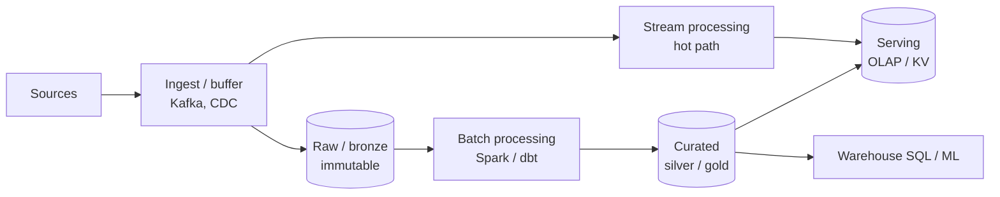

# The Data System Design Interview Framework

> **Goal of this page:** a repeatable 45-minute script you can run on *any* data system design prompt: "design a clickstream pipeline", "design Uber's surge pricing data", "design a RAG platform". Practice the script until it's muscle memory; then the content becomes the only variable.


---

## Why data system design is different from SWE system design

| SWE system design | Data system design |
|---|---|
| Request/response latency, QPS | **Freshness** (event → queryable), throughput (events/sec, TB/day) |
| Consistency of a single row | **Correctness of aggregates**: duplicates, late data, reprocessing |
| Cache, load balancer, DB sharding | **Partitioning, file layout, shuffle, skew, state size** |
| Rollback = redeploy | Rollback = **backfill / reprocess history** (much harder) |
| Schema = API contract | Schema = **data contract**; evolution breaks *downstream* consumers |
| Users are end customers | Users are analysts, ML, finance, regulators, other pipelines |

Interviewers at senior level are listening for: **grain, idempotency, late data, backfills, partitioning/skew, data contracts, cost, governance**. If you say those words *with reasons*, you sound senior.

---

## Phase ① Requirements (0–5 min)

Never start drawing. Ask, then **write the answers on the board** as a numbered list you can point back to.

### The clarifying-question checklist

**Functional (what)**
1. What business questions must this answer? (Get 2–3 concrete examples: "DAU by country", "fraud score per transaction".)
2. Who are the consumers? Dashboards, analysts with SQL, ML training, an online service, finance?
3. What are the sources? Apps, OLTP DBs, third parties, devices? Push or pull?

**Non-functional (how well)**
4. **Freshness SLA**: seconds, minutes, hourly, daily? *This single answer decides streaming vs batch.*
5. **Volume**: events/day, bytes/event, peak multiplier, growth rate per year.
6. **Correctness**: Exact counts (billing) or approximate OK (trending)? Can we tolerate duplicates?
7. **Late / out-of-order data**: How late can events arrive (mobile offline = days)?
8. **Retention & compliance**: How long hot vs cold? PII? GDPR deletion? SOX audit?
9. **Availability**: What happens if the dashboard is 10 minutes stale? Is this on the critical path of revenue?

> **Senior move:** propose defaults instead of only asking. *"I'll assume sub-minute freshness for the dashboard but hourly is fine for analysts. Does that match?"* It shows judgement and saves time.

### Example: requirement board for "Design ad click aggregation"

```
F1  Advertisers see clicks/impressions/spend per campaign per minute
F2  Billing needs exact daily click counts per campaign
F3  Analysts query 2 years of history
NF1 Dashboard freshness < 1 min; billing T+1 day but EXACT
NF2 10B impressions/day, 1B clicks/day, 5x peak (Black Friday)
NF3 Click fraud filtering before billing
NF4 Late events up to 24h (mobile SDK batching)
```

Notice that F2 + NF1 already tells you: **a fast approximate streaming path + an exact batch reconciliation path**. The design is half done.

---

## Phase ② Estimate (5–10 min)

Only compute what changes a decision. See [Back-of-envelope](/interview-prep/learn/system-design/02-back-of-envelope/) for the numbers to memorise.

```
1B clicks/day ÷ 100k s/day ≈ 10k/s avg → ×5 peak = 50k/s
10B impressions/day ≈ 100k/s avg → 500k/s peak
~300 B/event → 500k × 300 B = 150 MB/s peak ingest
Kafka @ ~10 MB/s per partition (conservative) → ≥ 15 partitions; choose 64 for headroom + parallelism
Storage: 11B × 300 B ≈ 3.3 TB/day raw → ~500 GB/day as compressed Parquet → ~350 TB for 2 years
```

**Decisions those numbers drive:** Kafka is necessary (not a DB queue); you need a distributed stream processor; 2-year history means the lakehouse rather than an OLAP store for everything; per-minute rollups for the dashboard are tiny, so an OLAP store or even Postgres can serve them.

---

## Phase ③ High-level design (10–20 min)

Draw the **reusable skeleton**, then specialise it:



Rules:
- **Left to right.** Sources on the left, consumers on the right.
- **Every box gets a technology and a reason.** "Kafka, because we need replay for backfills and fan-out to 3 consumers."
- **Show the data model**: the event schema and 1–2 core tables with their **grain** ("one row per campaign per minute").
- **Walk one record through the system.** "A click hits the edge collector, lands in Kafka partition by `campaign_id`…"

---

## Phase ④ Deep dives (20–35 min): where seniority shows

Pick 2–3 of the riskiest components (or let the interviewer pick). For each one use this micro-structure:

> **Problem → Options → Choice → Why → Cost of the choice → How I'd know it's failing**

### Deep-dive menu (have a 3-minute answer ready for each)

| Topic | The 3-minute answer covers |
|---|---|
| Partitioning & skew | Key choice, hot keys, salting, two-phase aggregation |
| Exactly-once | Replayable source + checkpoint + idempotent sink; dedup keys |
| Late data | Event vs processing time, watermarks, allowed lateness, restatement |
| Backfills | Idempotent partitions (`INSERT OVERWRITE` / `MERGE`), replay from bronze |
| Storage layout | Partition by date, target 128 MB–1 GB files, compaction, Z-order/liquid clustering |
| Serving | Pre-aggregate vs query-time; OLAP store (Pinot/Druid/ClickHouse) vs lakehouse SQL vs Redis |
| Data model | Grain, star schema, SCD2, conformed dimensions |
| Schema evolution | Schema registry, compatibility modes, contracts, quarantine |
| Governance | PII tagging, masking, row filters, GDPR deletion, lineage |

Have one snippet ready per topic, e.g. the MERGE for idempotent upserts:

```sql
MERGE INTO silver.clicks t
USING (SELECT * FROM batch QUALIFY ROW_NUMBER() OVER (PARTITION BY click_id ORDER BY ingest_ts DESC) = 1) s
ON t.click_id = s.click_id
WHEN NOT MATCHED THEN INSERT *;
```

---

## Phase ⑤ Failure modes (35–40 min)

Run the **"what breaks?" sweep** out loud. For each: *detect → mitigate → recover*.

| Failure | Detect | Mitigate / recover |
|---|---|---|
| Stream job crashes | Consumer lag alert, heartbeat | Auto-restart from checkpoint; idempotent sink makes replay safe |
| Upstream schema change | Schema registry rejects / DQ check | Compatibility rules; quarantine table; contract with producer |
| Traffic spike 10× | Lag growth, batch duration > trigger | Autoscaling, backpressure (`maxOffsetsPerTrigger`), Kafka buffers |
| Bad data published | DQ anomaly on volume/nulls | Write-Audit-Publish; time travel to restore; backfill |
| Hot key | Per-partition lag skew | Salting, split hot keys, local pre-aggregation |
| Region outage | Health checks | Kafka MirrorMaker / multi-region replication; RPO/RTO stated |

---

## Phase ⑥ Wrap-up (40–45 min)

A 30-second recap in this shape:
> "Events land in Kafka for durability and replay; a Flink job produces per-minute aggregates into Pinot for the <1 min dashboard; the same events land in Delta bronze, and a nightly exact job deduplicates, filters fraud and produces billing tables, which are the source of truth. The main risks are hot campaigns (handled with salting) and late mobile events (handled by a 24h restatement window). At 10× I'd add tiered Kafka storage and pre-aggregation at the edge."

Then volunteer: **cost drivers**, **what you'd build in v2**, **the weakest part of your design**.

---

## Junior vs senior signals

| Junior answer | Senior answer |
|---|---|
| "Use Kafka, Spark, Snowflake." | "Kafka because we need replay for backfills; partition by `user_id` for per-user ordering, at the cost of hot users, which we mitigate by…" |
| Designs only the happy path | Designs for late data, replays, backfills, schema change |
| "Exactly-once because Kafka supports it" | Explains the end-to-end requirement: replayable source, checkpoint, idempotent sink |
| One pipeline for everything | Separates fast/approximate from slow/exact when requirements differ |
| Ignores cost | "Raw retention in Kafka is 7 days; history lives in object storage at ~$20/TB-month" |
| Talks only tech | Talks about **ownership, contracts, SLAs, on-call** |

---

## Phrases that buy you time and credibility

- "Before I go deeper, let me make sure the overall picture works end to end."
- "There are two reasonable options here. Let me compare them on latency, cost and operational burden."
- "I'm going to make this idempotent so that a retry or a backfill can never double count."
- "The grain of this table is one row per X per Y. Everything else follows from that."
- "If I had to cut scope, I'd drop X first, because…"
- "The part of this design I'm least comfortable with is X. Here's how I'd de-risk it."

---

## Practice plan

1. Read [Building blocks](/interview-prep/learn/system-design/03-building-blocks/) and [Reliability patterns](/interview-prep/learn/system-design/04-reliability-patterns/).
2. Do 3 problems from [practice/system-design](/interview-prep/practice/system-design/) **out loud, timed, drawing on paper**.
3. Compare to the reference answer; score yourself with the rubric at the bottom of each problem.
4. Repeat the ones you scored < 70% after 3 days (spaced repetition works for design too).
