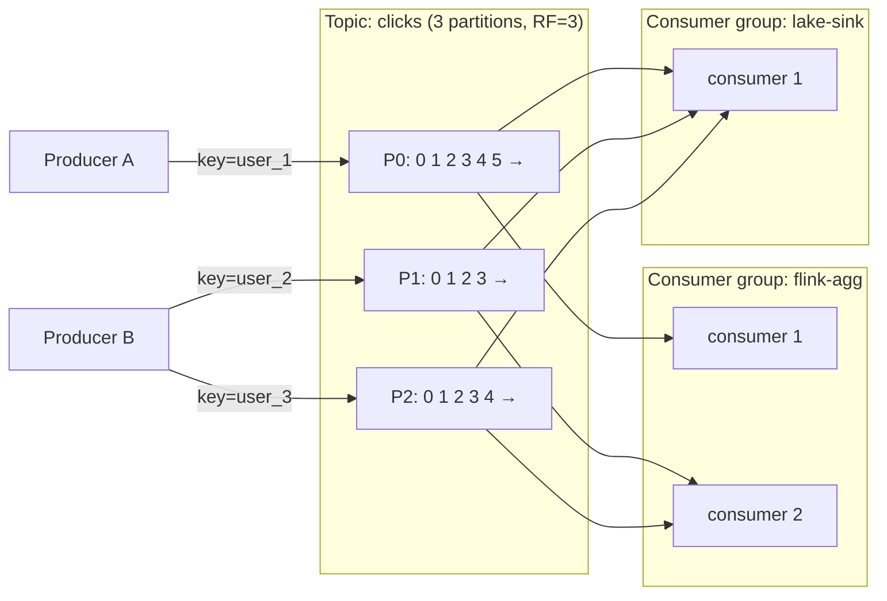
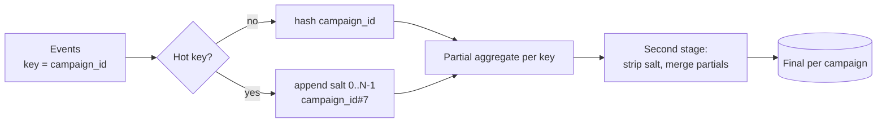
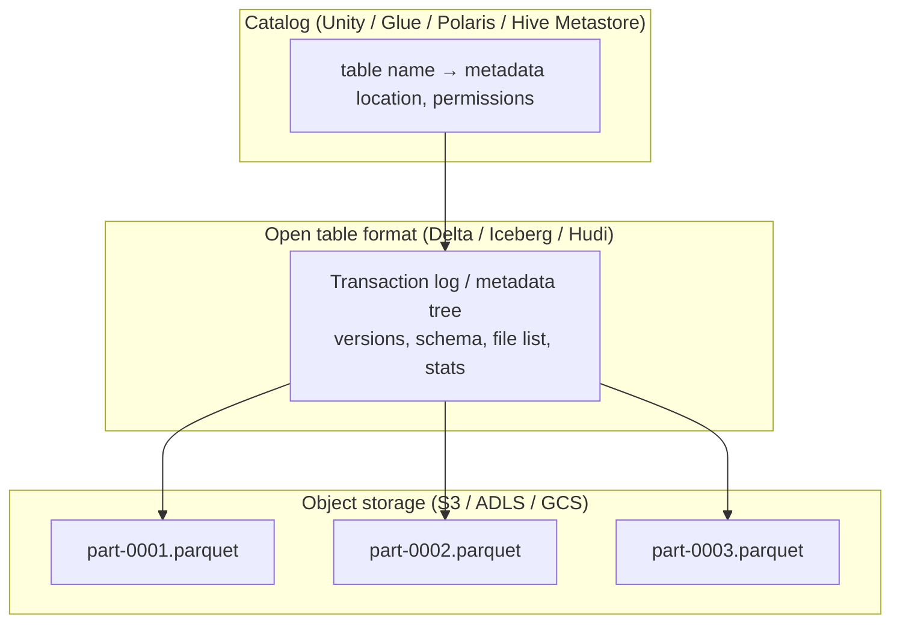
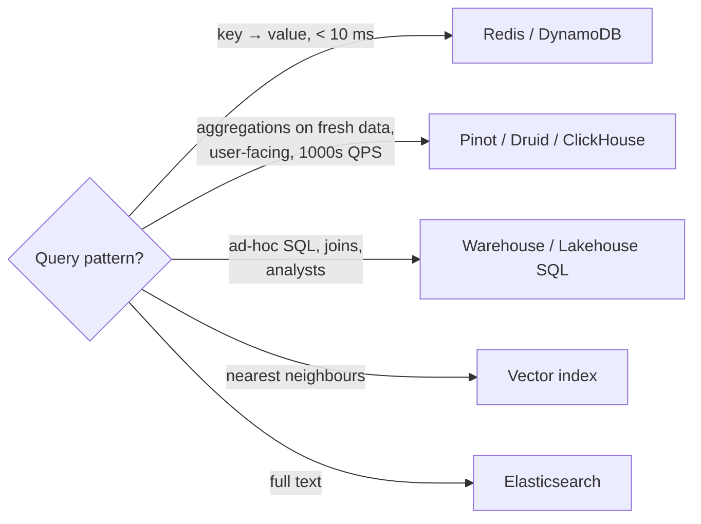

# Building Blocks of Data Systems

> Every data system design is assembled from roughly ten building blocks. For each one, know **what it's for, how it works inside, the knobs, and when NOT to use it**.

**Contents:** [Message log (Kafka)](#1-the-message-log-kafka) · [Partitioning](#2-partitioning-strategies) · [Stream processors](#3-stream-processors) · [Batch engines](#4-batch-engines) · [Storage & table formats](#5-storage-layer) · [Serving stores](#6-serving-stores) · [Caches](#7-caches) · [Orchestrators](#8-orchestrators) · [Schema registry](#9-schema-registry--contracts) · [Probabilistic structures](#10-probabilistic-data-structures)

---

## 1. The message log (Kafka)

### Mental model
A Kafka topic is **an append-only, partitioned, replicated log**. Producers append; consumers read at their own offset. Data isn't deleted when it's read. It's deleted by retention (time/size) or compaction.

### Key facts interviewers probe
| Concept | What to say |
|---|---|
| **Ordering** | Guaranteed **only within a partition**. Same key → same partition (`hash(key) % N`) → per-key order. |
| **Parallelism** | Max active consumers in a group = number of partitions. Partitions are the unit of scale. |
| **Consumer groups** | Each group gets every message once (load-balanced across its members); different groups are independent → **fan-out for free**. |
| **Replication** | `replication.factor=3`, `min.insync.replicas=2`, producer `acks=all` → no data loss if one broker dies. |
| **Retention** | Time/size based (e.g. 7 days) → **replay window** for reprocessing/backfills. Tiered storage moves old segments to S3 for long retention. |
| **Log compaction** | Keeps only the latest value per key; tombstone (`key, null`) deletes. Good for CDC/changelog topics and state restore. |
| **Idempotent producer** | `enable.idempotence=true` → broker dedupes retries via (producer id, sequence number). |
| **Transactions** | Atomic writes across partitions + offset commits → exactly-once for read-process-write *within Kafka*. |
| **Adding partitions** | Changes `hash(key) % N` → **breaks key ordering** for existing keys. Over-provision up front. |
| **Consumer lag** | `log-end-offset − committed-offset`: *the* health metric for streaming. |

### Kafka vs alternatives
| | Kafka | Kinesis | Pulsar | Pub/Sub | RabbitMQ/SQS |
|---|---|---|---|---|---|
| Model | Log | Log (shards) | Log + queue | Managed log-ish | Queue (delete on ack) |
| Replay | ✅ retention | ✅ up to 365d | ✅ tiered | ✅ seek (7d) | ❌ |
| Ordering | per partition | per shard | per key | per ordering key | limited |
| Ops | heavy (or MSK/Confluent) | zero | heavy | zero | light |
| Use when | default for data pipelines | AWS-native, simpler | multi-tenant, geo | GCP-native | task queues, not analytics |

**When NOT Kafka:** low volume (< a few hundred events/s) where a DB table + CDC or SQS is simpler; pure batch file drops (land in object storage + AutoLoader).

---

## 2. Partitioning strategies

Partitioning shows up in **Kafka topics, Spark shuffles, table layouts and serving stores**. Same trade-off everywhere: **locality vs balance**.

| Strategy | Example | Pros | Cons |
|---|---|---|---|
| **Hash by key** | `hash(user_id) % 64` | Even spread; co-locates a key's data (ordering, joins, state) | Hot keys → hot partition; resizing reshuffles |
| **Range** | dates, `A–F`, `G–M` | Range scans, pruning | Hotspots on the "latest" range (time-ordered writes) |
| **Round-robin** | no key | Perfect balance | No ordering; aggregations need a shuffle later |
| **Time-based** (tables) | `PARTITION BY event_date` | Pruning, easy retention/backfill per day | Too fine-grained → small files |
| **Composite / salted** | `(campaign_id, salt 0–9)` | Spreads hot keys | Two-phase aggregation needed |
| **Geo / tenant** | `region`, `tenant_id` | Isolation, data residency | Uneven tenant sizes |

### Hot-key mitigation (classic deep dive)

1. **Detect**: per-partition lag/throughput skew; top-K key metrics.
2. **Salt** the hot keys (or all keys) with a random suffix → partial aggregates → merge in a second stage. Works because SUM/COUNT/MIN/MAX/HLL are *mergeable*.
3. **Local pre-aggregation** (combiner) before shuffle: Spark does this automatically for `reduceByKey`/`groupBy().agg()` partial aggregation.
4. **Split hot keys onto dedicated partitions/consumers.**
5. In joins: **broadcast** the small side, or **AQE skew join** (Spark splits skewed partitions automatically).

---

## 3. Stream processors

| | Spark Structured Streaming | Apache Flink | Kafka Streams | Managed (DLT, Dataflow) |
|---|---|---|---|---|
| Model | Micro-batch (default), continuous experimental | True streaming, event-at-a-time | Library inside your app | Spark / Beam under the hood |
| Latency | ~100 ms – seconds (Real-Time Mode lowers this) | **ms** | ms | seconds |
| State | RocksDB state store, `applyInPandasWithState` / `transformWithState` | **Best-in-class**: keyed state, timers, savepoints | RocksDB, changelog topics | managed |
| Exactly-once | checkpoint + idempotent/transactional sinks | checkpoint barriers (Chandy-Lamport) + 2PC sinks | Kafka transactions | ✅ |
| Batch + stream same code | ✅ (same DataFrame API) | ✅ (Table API) | ❌ | ✅ |
| Choose when | Lakehouse/Delta shop, seconds latency OK, team knows Spark | Sub-second, complex event processing, huge state, timers | Kafka-in Kafka-out microservices | Want zero ops |

**Talking point:** *"Our freshness SLA is under a minute and we're a Databricks shop, so Structured Streaming with Delta sinks is the pragmatic choice. If we needed sub-100 ms fraud scoring with per-user timers, I'd pick Flink."*

### Core streaming concepts (detail in [streaming deep dive](/interview-prep/learn/architecture/03-streaming-deep-dive/))

- **Event time vs processing time:** always aggregate on event time.
- **Watermark** = "I believe I've seen all events up to time T". Lets the engine finalise windows and drop state.
- **Windows:** tumbling, sliding/hopping, session.
- **Output modes:** append (only finalised rows), update (changed rows), complete (whole result).
- **Triggers:** processing-time interval, available-now (batch-like incremental), continuous.

---

## 4. Batch engines

| Engine | Sweet spot |
|---|---|
| **Spark** | Large-scale ETL, joins over TBs, ML feature pipelines, lakehouse |
| **dbt** (on a warehouse/Spark) | SQL transformations with tests, docs, lineage, incremental models |
| **Warehouse SQL** (Snowflake, BigQuery, Databricks SQL, Redshift) | ELT, analytics, BI |
| **Trino/Presto** | Federated interactive SQL over lakes |
| **DuckDB / Polars** | Single-node, up to ~100s GB, insanely fast; great for tests and small jobs |

**Key batch design rules:**
1. **Idempotent partitions**: each run overwrites exactly one logical partition (`INSERT OVERWRITE ... PARTITION (dt='2026-10-01')` or `MERGE` / `replaceWhere`).
2. **Incremental by default**: process only new data (watermark column, Delta CDF, AutoLoader), with a full-refresh escape hatch.
3. **Deterministic**: no `now()` inside transformations. Pass the logical date in as a parameter so backfills reproduce history.

---

## 5. Storage layer

- **Object storage**: cheap, infinitely scalable, 11 nines durable, *but* no transactions, no in-place updates, and listing is slow.
- **Parquet**: columnar, compressed, with min/max stats per row group → column pruning + predicate pushdown.
- **Table format** adds: ACID commits, time travel, schema evolution, MERGE/UPDATE/DELETE, file-level stats for data skipping, concurrent writers (optimistic concurrency).
- Deep dive: [Storage & table formats](/interview-prep/learn/architecture/05-storage-and-table-formats/).

**File-size rule:** target **128 MB–1 GB** files. Thousands of tiny files are the most common lakehouse performance bug (metadata overhead, task overhead, S3 request costs) → compaction (`OPTIMIZE`), optimized writes, auto-compaction.

---

## 6. Serving stores

The **access pattern** picks the store:

| Need | Store | Why |
|---|---|---|
| Sub-second slice-and-dice on fresh events, high concurrency (user-facing analytics) | **Apache Pinot / Druid / ClickHouse** | Columnar + indexes + pre-aggregation (star-tree, rollups), real-time ingestion from Kafka |
| Internal BI, complex SQL, joins, moderate concurrency | **Warehouse / lakehouse SQL** | Flexible, cheaper per TB, seconds latency |
| Point lookup by key in ms (features, profile, counters) | **Redis / DynamoDB / Cassandra / Bigtable** | KV, predictable latency, horizontal scale |
| Search, text, logs | **Elasticsearch / OpenSearch** | Inverted index |
| Similarity search | **Vector DB** (pgvector, Pinecone, Milvus, Mosaic AI Vector Search) | ANN indexes (HNSW, IVF) |
| Graph traversals | Neo4j / Neptune | Relationships |
| Transactions (source of truth for an app) | Postgres / MySQL | OLTP, ACID |

**Senior nuance:** you often need **two** serving stores: raw history in the lakehouse for flexibility, and pre-aggregated hot data in an OLAP/KV store for latency. Say explicitly which one is the **source of truth** (usually the lakehouse) and that serving stores can be **rebuilt** from it.

---

## 7. Caches

- **Cache-aside** (app reads cache, falls back to source, populates cache): default.
- **Write-through**: write cache + source synchronously (consistency, slower writes).
- **TTL** for freshness; **key design** e.g. `metric:{campaign}:{minute}`.
- In data systems, a cache is mostly used for **serving pre-computed aggregates/features**, and for **dimension lookups inside streaming jobs** (broadcast state or async lookups to Redis) to avoid hammering the OLTP DB.
- Pitfalls: thundering herd on expiry (jitter TTLs, request coalescing), cache inconsistency on backfill (invalidate or version keys).

---

## 8. Orchestrators

| | Airflow | Dagster | Databricks Workflows / Lakeflow Jobs | Prefect |
|---|---|---|---|---|
| Paradigm | Task DAGs, schedule-centric | **Asset**-centric (data-aware) | Jobs + tasks, native to the lakehouse | Python flows |
| Strength | Ecosystem, ubiquity | Lineage, partitions, testing | Zero infra, cluster mgmt, DLT/dbt tasks | Dynamic workflows |
| Watch out | Scheduler scale, DAG parsing, XCom misuse | Smaller ecosystem | Vendor-specific | Smaller ecosystem |

Design rules: **tasks idempotent**, **parameterised by logical date**, **retries with backoff**, **SLAs/alerts on freshness not just failure**, **data-aware triggers** (run when upstream table updates) over cron chains. More in [Orchestration & backfills](/interview-prep/learn/architecture/06-orchestration-and-backfills/).

---

## 9. Schema registry & contracts

- Central store of Avro/Protobuf/JSON schemas, versioned per subject (topic).
- **Compatibility modes:**
  - **BACKWARD** (default): new consumers can read old data → you can *add fields with defaults* or *delete fields*. Upgrade consumers first.
  - **FORWARD**: old consumers can read new data → add fields, delete optional fields. Upgrade producers first.
  - **FULL**: both.
- Producer serialization fails fast on incompatible change → bad schemas never enter the log.
- **Data contract** = schema + semantics + SLAs + ownership + quality rules, agreed between producer and consumer and enforced in CI.

---

## 10. Probabilistic data structures

| Structure | Answers | Memory | Error | Mergeable? |
|---|---|---|---|---|
| **HyperLogLog** | Count distinct | ~1.5–12 KB | ~0.8–2% | ✅ (union) → great for rollups |
| **Count-Min Sketch** | Frequency of item (heavy hitters) | KBs–MBs | Overestimates only | ✅ |
| **Bloom filter** | "Have I seen X?" (dedup, join pre-filter) | ~10 bits/item for 1% FP | False positives, no false negatives | ✅ (OR) |
| **t-digest / KLL** | Percentiles (p50/p95/p99) | KBs | small rank error | ✅ |
| **Reservoir sampling** | Uniform sample of a stream | k items | exact sample | – |

**Use in design:** "Real-time unique visitors per page per minute: I'll store HLL sketches per minute; the hourly/daily numbers are unions of the minute sketches, so I never re-scan raw data. Finance's exact numbers come from batch."

SQL examples: `approx_count_distinct(user_id)`, `percentile_approx(latency, 0.95)`, Databricks `hll_sketch_agg` / `hll_union_agg`.

---

## Cheat table: "If they say X, reach for Y"

| They say… | Reach for… |
|---|---|
| "Replay", "multiple consumers", "decouple" | Kafka |
| "Changes from the database" | Log-based CDC (Debezium) → Kafka → MERGE |
| "Sub-second dashboards for customers" | Pinot/Druid/ClickHouse fed from Kafka |
| "Exactly once" | Replayable source + checkpoint + idempotent sink; dedup keys |
| "Late events" | Event-time windows + watermarks + restatement batch |
| "History of changes" | SCD Type 2 / Delta CDF / snapshots |
| "Unique users at scale" | HLL sketches |
| "Top-K trending" | Count-min sketch + heap, or windowed aggregation + rank |
| "Point lookup features at inference" | Online feature store (Redis/DynamoDB) synced from offline |
| "Search docs with LLM" | RAG pipeline: chunk → embed → vector index + ACLs |
| "PII / GDPR" | Classification tags, masking, crypto-shredding, deletion pipeline |
