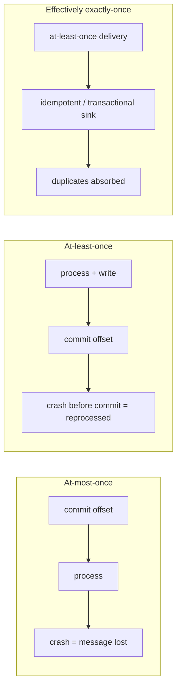
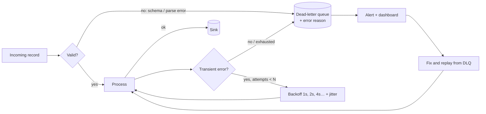
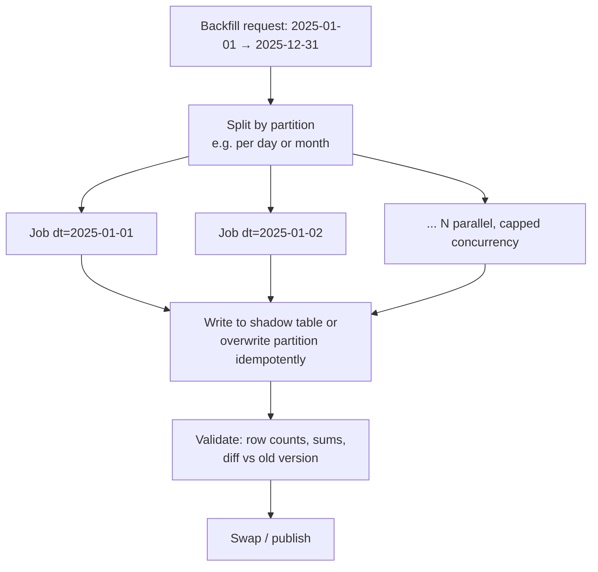
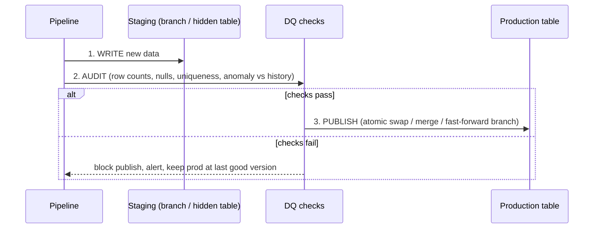
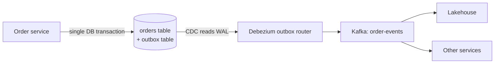

# Reliability Patterns for Data Pipelines

> The difference between a pipeline that works in a demo and one that runs for years at 3 a.m. Interviewers use these to separate senior from mid-level candidates.

---

## 1. Idempotency: the most important word in data engineering

**Definition:** running the same job with the same input N times gives the same result as running it once.

Why it matters: retries, at-least-once delivery, backfills, and humans re-running jobs **will** happen. If your pipeline isn't idempotent, every one of those is a data incident.

### Idempotent write patterns

| Pattern | How | When |
|---|---|---|
| **Partition overwrite** | `INSERT OVERWRITE TABLE t PARTITION (dt='2026-10-01') SELECT ...` / Delta `replaceWhere` | Daily batch, full recompute of a partition |
| **MERGE on a natural key** | `MERGE INTO t USING s ON t.id = s.id WHEN MATCHED ... WHEN NOT MATCHED ...` | Upserts, CDC, late updates |
| **Dedup on event id** | `ROW_NUMBER() OVER (PARTITION BY event_id ORDER BY ingest_ts)` = 1, or `dropDuplicatesWithinWatermark` | At-least-once event streams |
| **Transactional batch id** | Sink stores last committed batch id; skips if seen (Delta `txnAppId` + `txnVersion`) | `foreachBatch` streaming writes |
| **Deterministic output paths** | `s3://bucket/table/dt=.../run_id=...` then atomic pointer swap | Non-transactional sinks |

### Anti-patterns
- `INSERT INTO` (append) in a batch job that can be retried → duplicates.
- `WHERE updated_at > now() - interval 1 day` → results depend on when it runs. Use the **logical run date** passed in by the orchestrator.
- Auto-increment surrogate keys generated during the load → different keys on re-run. Use hash keys (`sha2(concat_ws('|', natural_key...))`) or stable key maps.
- Side effects inside transformations (sending emails, calling APIs) → can't replay safely.

---

## 2. Delivery semantics

**Script for the interview:**
> "True exactly-once *delivery* is impossible in a distributed system, but exactly-once *results* are achievable. We need three things: a replayable source (Kafka offsets), a processor that checkpoints its progress and state atomically, and a sink that's either idempotent (MERGE on key) or transactional (commits output and offsets together). Any external side effect, like a payment API call, needs its own idempotency key."

---

## 3. Retries, backoff and dead-letter queues

- Separate **transient** errors (timeouts, throttling → retry) from **permanent** errors (bad schema, null key → DLQ, never retry forever).
- **Exponential backoff + jitter** avoids synchronized retry storms.
- **Poison pill**: one bad message must not block a partition forever. Route it to the DLQ after N attempts.
- DLQ records need: original payload, error, stack trace, source offset, timestamp, pipeline version. Without a **replay path** a DLQ is just a trash can.
- Spark equivalents: `_rescued_data` column (AutoLoader), `badRecordsPath`, DLT expectations `@dlt.expect_or_drop` + a quarantine table.

---

## 4. Backfills and reprocessing

You will need to recompute history: a bug fix, new logic, a new column, a late source.

### Pattern: partition-parallel, idempotent backfill

Checklist:
1. **Source still available?** Bronze/raw retention must cover the backfill window; Kafka usually doesn't (7 days). This is why you keep raw data in the lake.
2. **Write to a shadow table first**, diff against production (counts, key metrics), then swap. Don't overwrite prod blind.
3. **Throttle** to protect shared clusters and downstream systems.
4. **Downstream cascade**: which tables/dashboards/ML models consume this? Lineage tells you. Backfill them too, in topological order.
5. **Streaming jobs**: changing logic usually means a new checkpoint. Options: replay Kafka from an earlier offset (if retained), or batch-backfill history from bronze + start the stream from "now" (the Kappa/Lambda hybrid that most companies actually run).
6. **Communicate**: restating history changes numbers people have already seen. Announce it.

---

## 5. Write-Audit-Publish (WAP)

Never expose unvalidated data to consumers.

Implementations: Iceberg branches (`WAP` / Nessie), Delta write to staging + `MERGE`/`INSERT OVERWRITE` in one transaction, dbt `build` (tests run before dependants), DLT expectations.

---

## 6. Handling late and out-of-order data

| Strategy | Mechanism | Trade-off |
|---|---|---|
| Watermark + drop | Stream engine finalises window after `max_event_time − delay` | Fast, bounded state, loses very late data |
| Watermark + side output | Late events go to a "late" table | No loss; needs a merge/restatement step |
| Restatement window | Batch job recomputes the last N days every day | Simple, correct; numbers change for N days |
| Upsert-friendly sinks | Aggregates written with MERGE so late data updates them | Sink must support updates (Delta, Pinot upsert) |
| Ingestion-time partitioning + event-time column | Partition raw by arrival date; query by event time | Raw writes never touch old partitions |

Senior phrasing: *"Mobile events can arrive up to 3 days late. The stream uses a 10-minute watermark for freshness, late events land in bronze anyway, and a daily job restates the last 3 days of aggregates with MERGE. Dashboards label the last 3 days as 'preliminary'."*

---

## 7. Schema evolution

| Change | Safe? | Handling |
|---|---|---|
| Add nullable column | ✅ | `mergeSchema` / registry BACKWARD compatible |
| Add column with default | ✅ | |
| Widen type (int → long) | ✅ usually | Delta type widening, Iceberg promotion |
| Rename column | ⚠️ | Column mapping (Delta) / Iceberg field ids; otherwise add-new + deprecate |
| Drop column | ⚠️ | Contract + deprecation window |
| Change semantics (cents → dollars) | ❌ silently breaks | New column/version; contract |

Bronze: tolerate everything (`_rescued_data`, schema-on-read). Silver: enforce schema, quarantine violations. Gold: changes go through review.

---

## 8. Observability: the four signals for data

| Signal | Metric | Example alert |
|---|---|---|
| **Freshness** | now − max(event_time) in table | gold.orders older than 2 h |
| **Volume** | rows per partition vs 7-day baseline | today's rows < 50% of usual |
| **Schema** | column added/removed/type changed | unexpected schema drift in silver |
| **Quality / distribution** | null %, uniqueness, value ranges, referential integrity | `order_id` duplicates > 0 |
| + **Pipeline health** | consumer lag, batch duration, failure rate, cost | lag > 5 min for 10 min |

Define **SLOs on data** ("99% of days, gold.revenue is ready by 07:00 UTC") instead of only "the job succeeded". A green job can still produce wrong or empty data.

---

## 9. Disaster recovery & high availability

- **RPO** (how much data can we lose) and **RTO** (how long can we be down): ask for both, and design for them.
- Kafka: RF=3 across AZs; cross-region with MirrorMaker 2 / Cluster Linking for DR.
- Lakehouse: object storage is multi-AZ by default; cross-region replication for DR; table formats' time travel recovers from *logical* corruption (bad writes), as long as `VACUUM` retention allows.
- Streaming checkpoints are tied to a location and sources; plan how to restart in another region (often: restart from latest + backfill the gap from replicated raw).
- **Rehearse** restores. An untested backup isn't a backup.

---

## 10. The outbox pattern (getting events out of an OLTP app reliably)

Problem: the app writes to its DB **and** publishes to Kafka. Either can fail → inconsistency (the dual-write problem).

The app writes the business row and an event row in **one local transaction**; CDC ships the outbox to Kafka. Guarantees: event published if and only if the transaction committed, in commit order.

---

## Quick self-test

1. Your daily job appends to a table; an engineer re-ran yesterday's run. What happened and how do you prevent it?

Duplicates for that day. Make the write idempotent: `INSERT OVERWRITE` the `dt` partition (or Delta `replaceWhere dt = '...'`), or MERGE on a natural key. Parameterise by logical date.

2. A streaming job writes to Postgres with plain INSERTs. It crashes after writing but before checkpointing. What happens?

The micro-batch is replayed → duplicate rows. Fix: upsert with `ON CONFLICT (event_id) DO NOTHING/UPDATE`, or write `(batch_id)` in the same transaction and skip seen batch ids.

3. Why keep raw data in the lake if Kafka has the same events?

Kafka retention is typically days; reprocessing/backfills, audits, ML training and new use cases need months/years. The lake is cheap, queryable, and the replay source for the Kappa pattern at long horizons.

4. How do you safely change the logic of a stateful streaming aggregation?

State schema may be incompatible, so start the new version with a new checkpoint. Backfill historical output from bronze with a batch job using the same code, run the new stream from a chosen offset/time, validate side by side (shadow output table), then switch consumers (view swap).

