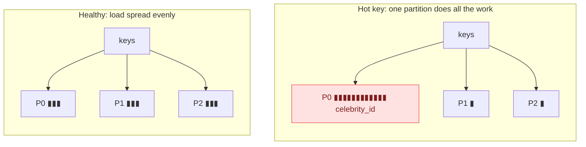
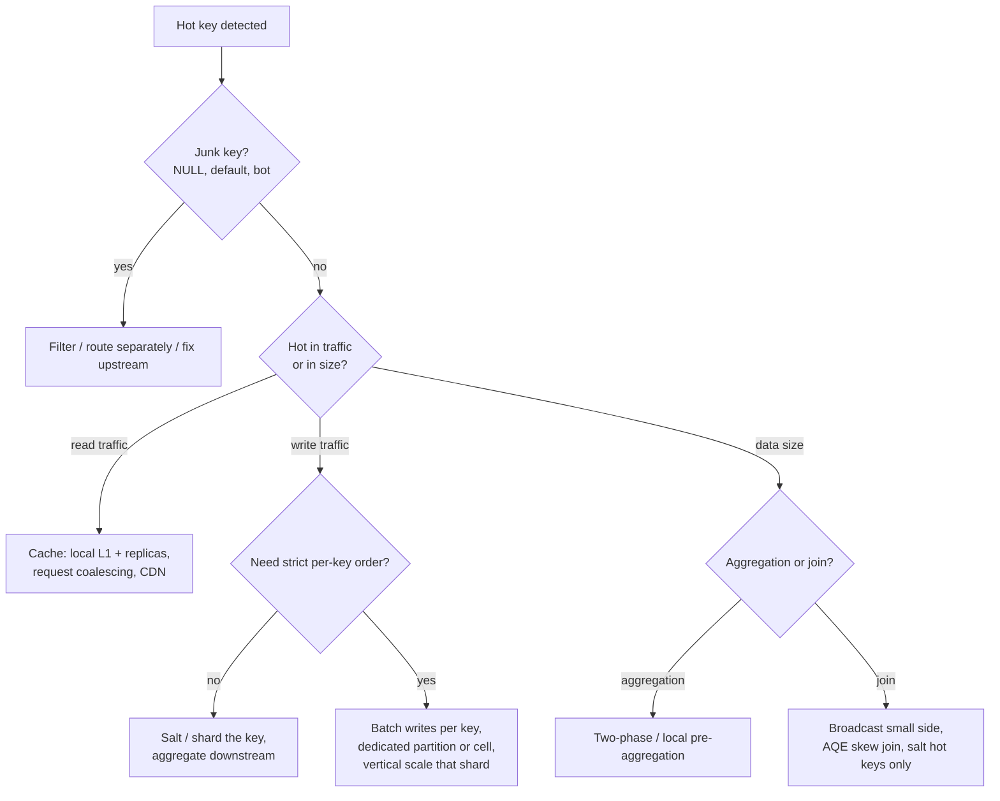

# Hot Keys: The Complete Guide Across All Systems

Every scalable data system partitions work by a key: Kafka by message key, Spark by shuffle key, Flink by `keyBy`, DynamoDB/Cassandra/Bigtable by partition key, Redis Cluster by hash slot. Partitioning scales **only if load spreads evenly across keys**. A **hot key** is a key whose traffic or data volume is so large that the single partition, task, node or shard owning it becomes the bottleneck, while the rest of the cluster sits idle.

In system design interviews, raising hot keys *before* the interviewer does is one of the clearest senior signals. This module gives you the vocabulary, the per-system behaviour and a playbook.

---

## 1. Where hot keys come from

| Source | Example |
|---|---|
| **Power-law popularity** | Celebrity accounts, viral posts, best-selling products, top merchants |
| **Default / sentinel values** | `NULL`, `-1`, `'unknown'`, `''`, the "guest" user, a shared tenant id |
| **Monotonic keys** | Timestamps or auto-increment IDs as partition keys, where all new writes hit the latest range |
| **Time concentration** | Flash sales, ticket drops, end-of-month batch, a backfill of one day |
| **Bots and abuse** | A scraper or misbehaving client hammering one key |
| **Low-cardinality keys** | Partitioning by `country` or `status` (a handful of values for many partitions) |
| **Bad hashing** | A custom partitioner that maps many keys to one partition |

Two different problems hide under one name:
- **Hot in traffic:** too many requests per second for one key (read or write throughput).
- **Hot in size:** too much data for one key (a 200 GB group in a shuffle, an unbounded state entry).

The fixes differ, so say which one you mean.

---

## 2. How each system suffers

### Kafka (and Kinesis, Pub/Sub ordering keys)

- The producer's partitioner sends all messages with the same key to **one partition**. A hot key means one partition receives most of the traffic.
- Consequences: one broker's disk and network saturate; the **one consumer** assigned that partition lags (consumer parallelism is capped at one per partition per group); end-to-end latency grows for *all* keys sharing the partition.
- **Detection:** per-partition bytes-in and messages-in, per-partition consumer lag (max vs median).
- **Mitigations:**
  - Key by a finer-grained key (`user_id` instead of `merchant_id`) if per-merchant ordering isn't required.
  - **Key salting:** `merchant_42#3` with a salt 0..N-1, then re-aggregate downstream. Ordering is only preserved per salted key.
  - For keyless events, use the sticky/round-robin partitioner.
  - More partitions **don't help a single hot key**. Say this explicitly.

### Spark (batch shuffles, joins, aggregations)

- A hot key's rows all land in one shuffle partition, so one task runs for an hour while 1,999 finish in a minute; that task spills, may OOM, and can cause fetch failures upstream.
- **Mitigations:** filter junk keys, broadcast the small side, AQE skew join, salting, two-phase aggregation. See [shuffle, spill & salting](/interview-prep/learn/spark-databricks/03-shuffle-spill-salting/).

### Flink / Spark Structured Streaming / Kafka Streams (keyed state)

- `keyBy(merchant)` sends every event of a merchant to one parallel subtask: **CPU hot spot** plus **state hot spot** (RocksDB state for that key grows large; checkpoints slow down).
- Backpressure from the hot subtask propagates upstream and slows the **whole** job, including cold keys.
- **Mitigations:**
  - **Local (pre-)aggregation:** aggregate per key within each upstream subtask for a short interval or count, then send partial results to `keyBy`. This is a two-phase aggregation, the streaming version of salting. Flink SQL has built-in *mini-batch* and *local-global aggregation* options for exactly this.
  - **Salted keys + second-level aggregation** for decomposable aggregates.
  - State TTL to bound per-key state; split large per-key collections.

### Databases and key-value stores

| System | Hot-key behaviour | Typical fix |
|---|---|---|
| **DynamoDB** | Each physical partition has throughput limits (on the order of 3,000 RCU / 1,000 WCU). One hot key throttles even with spare table capacity; adaptive capacity helps but can't split a *single* key's item. | **Write sharding** (`key#0..N`), caching reads (DAX), spreading time-ordered keys |
| **Cassandra / ScyllaDB** | A partition key lives on its replica set; huge partitions (wide rows) cause slow reads, compaction and GC trouble | Bucket the partition key (`(sensor_id, day)`), cap partition size (<100 MB) |
| **Bigtable / HBase** | Row keys are range-partitioned. **Monotonic keys** (timestamps first) send all writes to the last tablet/region | Field promotion and reversal (`sensor#reverse_ts`), hashed prefixes, salting |
| **Relational DBs** | Hot rows (a global counter, a popular product's stock row) cause lock contention | Sharded counters, queueing updates, optimistic concurrency, batching |
| **Object storage (S3)** | Request-rate limits per prefix (thousands of requests/s); one hot prefix gets throttled with `SlowDown` | Spread keys across prefixes, cache, fewer larger objects |

### Caches (Redis, Memcached, CDN)

- A viral item's key hits one Redis shard (one hash slot), saturating that node's CPU or network.
- **Cache stampede:** when a hot key expires, thousands of requests miss at once and all hit the database.
- **Mitigations:**
  - **Local in-process cache** (L1) in front of Redis for the hottest keys, with a short TTL.
  - **Replicate hot keys** under several names (`item:42#0..7`) and read a random replica.
  - **Request coalescing / single-flight:** one request recomputes, the others wait.
  - **Early probabilistic refresh** (refresh before expiry) and TTL jitter.
  - Push static content to the CDN edge.

### APIs and rate limiters

- A single tenant or API key generating most traffic starves others.
- Fixes: per-tenant quotas, token buckets, fair queueing, isolating large tenants on dedicated capacity ("cell" architecture).

---

## 3. Detection: measure before you fix

1. **Distribution metrics per partition:** look at max vs median, not averages. Averages hide hot spots.
2. **Top-k keys:** a heavy-hitter sketch (Count-Min Sketch + heap, or Space-Saving) on the stream; `groupBy(key).count().orderBy(desc)` on a sample in batch.
3. **Symptoms:**
   - Kafka: one partition with lag growing while others are at zero.
   - Spark: max task time ≫ median, one task with huge shuffle read and spill.
   - Flink: one subtask at 100% busy with backpressure upstream.
   - DynamoDB: `ThrottledRequests` with consumed capacity well below provisioned (the classic hot-partition signature).
   - Redis: one shard's CPU or network at its limit while others are idle.
4. **Alert on skew ratios:** e.g. `max_partition_lag / median_partition_lag > 10` or the top key's share of traffic > 5%.

---

## 4. The mitigation playbook

| Technique | How it works | Cost / trade-off |
|---|---|---|
| **Filter / isolate junk keys** | Drop or separately process NULL/default keys | Must ensure semantics (outer joins, counts) stay right |
| **Salting / write sharding** | Append `#0..N-1` to spread one key over N partitions | Reads must fan out to N shards and merge; ordering is only per shard |
| **Two-phase aggregation** | Partial aggregates per (key, salt) or per upstream task, then final per key | Only for decomposable aggregates (sum, count, min, max, sketches) |
| **Local pre-aggregation** | Combine in memory before the network hop (Flink mini-batch, Kafka Streams/Spark map-side combine) | Adds small latency and memory per task |
| **Caching + replication** | Serve hot reads from memory, copies on several nodes | Staleness; invalidation complexity |
| **Request coalescing** | Concurrent misses share one backend call | Requires a coordination layer |
| **Dedicated capacity / cells** | Put whale tenants on their own partitions/clusters | Operational overhead; capacity planning per tenant |
| **Better key design** | Composite keys (`tenant, day`), hashed prefixes, avoid monotonic keys | Changes access patterns; migrations |
| **Adaptive systems** | AQE skew join, DynamoDB adaptive capacity, Kafka Streams/Flink rebalancing | Helps moderate skew; not a cure for extreme single keys |

**The fundamental trade-off:** spreading a key across N places multiplies the cost of reading it (fan-out and merge) and weakens per-key ordering or atomicity. Only spread as much as the load requires, and only for the keys that need it (detect the top k and salt them, not everything).

---

## 5. Worked design examples

A real-time "likes per post" counter must handle a celebrity post receiving 500k likes per second.

Don't increment one row or one keyed-state entry per like. Producers send like events to Kafka keyed by `post_id#salt` (salt 0..63 for posts detected as hot, 0 otherwise), so writes spread over many partitions. A Flink job does local pre-aggregation (per-second partial counts per salted key), then aggregates per `post_id` and writes the total to a serving store every second. Reads hit a cache (with a short TTL) in front of the store. Exactness: counts are eventually consistent within about a second, which is acceptable for likes. For idempotency, dedupe on `(user_id, post_id)` in a separate store if double-likes matter.

A DynamoDB table keyed by date receives all of today's writes, and requests get throttled.

The partition key is monotonic and low-cardinality, so every write goes to one partition. Change to a high-cardinality key (e.g. `device_id`) with date as the sort key. If queries really need "all events for a day", write-shard the date (`2024-05-01#0..31`, shard = hash(event_id) % 32) and query the 32 shards in parallel, or stream changes into an analytical store (S3/Delta) where day-level scans are cheap.

A Spark join of 3 TB of events with users is stuck on one task for an hour.

Find the top keys: if it's `NULL`/anonymous users, filter them out of the inner join. If it's genuine bots or heavy users and the users table is too big to broadcast, rely on AQE skew join, or salt only the top-k keys (replicating just those users' rows N times). Then verify in the UI that the max task time is close to the median. Add a monitor on the share of the top key so the next spike is caught before it becomes an incident.

---

## Interview questions

Adding more Kafka partitions didn't fix a lagging consumer. Why?

If the lag comes from one hot key, all its messages still hash to a single partition, and a partition is consumed by exactly one consumer in the group, so more partitions don't spread that key. You need to change the key (finer granularity or salting with downstream re-aggregation), relax per-key ordering, or speed up processing of that partition (batching, async I/O).

How do you salt a key without breaking correctness?

Only salt operations that can be recombined: decomposable aggregates (sum/count/min/max, mergeable sketches) via a second aggregation step, joins where the other side is replicated across all salts, and writes where reads fan out to all salt shards and merge. Avoid salting where strict per-key ordering or atomic read-modify-write is required, or move that logic to a step after the merge.

What is a cache stampede and how do you prevent it?

When a hot cached key expires, many concurrent requests miss simultaneously and all hit the database, which can overload it. Prevent it with request coalescing (single-flight / a mutex on recompute), stale-while-revalidate (serve the old value while one worker refreshes), probabilistic early expiration, TTL jitter, and a local L1 cache for the hottest keys.

How would you detect hot keys in a high-throughput stream in real time?

Maintain a heavy-hitters sketch (Count-Min Sketch with a top-k heap, or the Space-Saving algorithm) per window in the stream processor, emit the top keys and their share of traffic as metrics, and alert when a key exceeds a threshold share. Complement it with per-partition lag and throughput dashboards (max vs median).

Why are monotonically increasing keys a problem for range-partitioned stores, and what are the fixes?

New keys always fall at the end of the key range, so all writes land on the last tablet/region (a moving hot spot) while others sit idle. Fixes: lead with a high-cardinality field (`device_id#timestamp`), add a hashed or salted prefix, reverse the timestamp, or use a hash-partitioned store, accepting that range scans by time then need fan-out or a secondary index.

