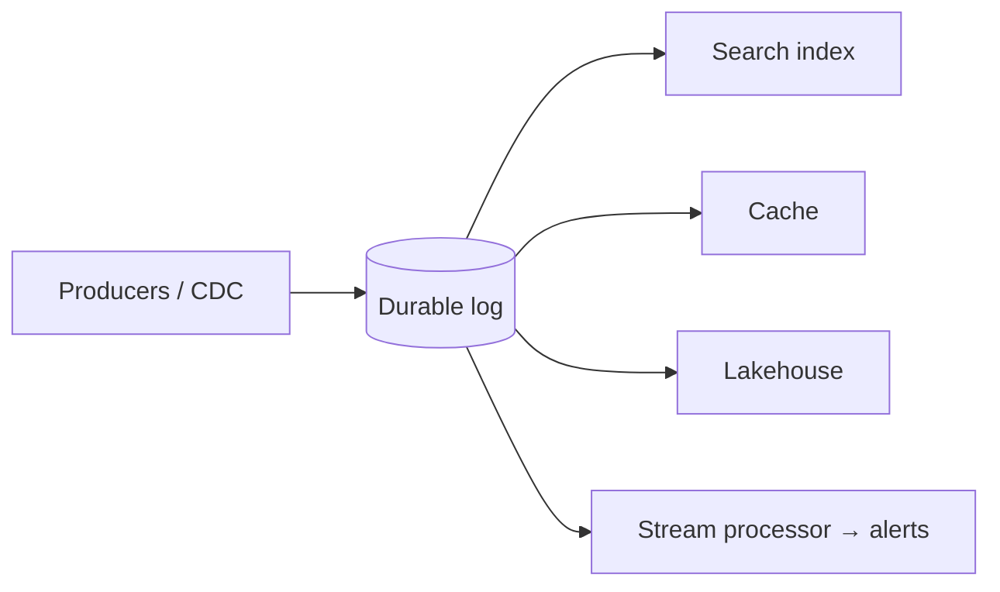
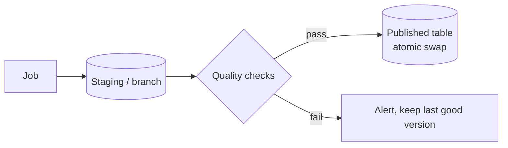

# Data System Design Patterns: The Catalogue

Strong system design answers are built from **named patterns**. Saying "I'd use the transactional outbox here to avoid the dual-write problem" communicates a whole design (and its trade-offs) in one sentence. This catalogue groups the patterns that matter most for data systems, with when to use each and what it costs.

---

## 1. Data movement and integration

### Log-centric architecture (the log as the backbone)
**What:** every change is an event appended to a durable, ordered, replayable log (Kafka). Databases, caches, indexes and the lakehouse are **materialised views** of the log.
**When:** many consumers need the same changes; you need replay and decoupling.
**Trade-off:** eventual consistency; operating the log becomes critical infrastructure.

### Change data capture (CDC)
**What:** read the database's transaction log to emit row changes in commit order.
**When:** replicate OLTP data to analytics or other services without changing application code.
**Trade-off:** couples consumers to internal schemas; operational care (replication slots, snapshots, schema changes).

### Transactional outbox
**What:** write business data and an event row to an `outbox` table **in the same transaction**; a relay or CDC publishes outbox rows.
**When:** a service must update its DB *and* publish an event reliably (avoiding dual writes).
**Trade-off:** an extra table and relay; events are published with a small delay.

### Claim check
**What:** put large payloads (files, images, big JSON) in object storage and send only a **reference** through the message bus.
**When:** messages would exceed broker limits or bloat the log.
**Trade-off:** consumers need storage access; lifecycle management of the referenced objects.

### Competing consumers
**What:** multiple consumer instances share a queue/partition set; each message is processed by one consumer.
**When:** scale out processing throughput.
**Trade-off:** ordering only within partitions; rebalancing pauses.

### Fan-out / fan-in
**What:** split work into parallel tasks (per partition, per tenant, per file) and combine results.
**When:** embarrassingly parallel workloads (backfills, per-customer jobs).
**Trade-off:** the fan-in step must handle partial failures and stragglers.

---

## 2. Consistency and correctness

### Idempotent receiver
**What:** processing the same message twice has the same effect as once (dedup on an ID, upsert by key, versioned writes).
**When:** always with at-least-once delivery, which is almost everywhere.
**Trade-off:** dedup state or keyed writes are required.

### Effectively-once via atomic offset + output commits
**What:** commit consumed offsets and produced output together (Kafka transactions, Flink two-phase commit, Delta batch-id tracking).
**When:** aggregations or transformations where duplicates would corrupt results.
**Trade-off:** latency tied to checkpoint/commit intervals; sink support required.

### Saga
**What:** a long business process as a sequence of local transactions, each with a **compensating action** for rollback.
**When:** consistency across services without distributed transactions.
**Trade-off:** intermediate states are visible; compensation logic must be designed and tested.

### Write-audit-publish (WAP)
**What:** write output to a staging location (branch, staging table), run quality checks, then publish atomically.
**When:** consumer-facing tables where bad data is costly.
**Trade-off:** extra storage and latency; requires atomic swap (table formats, branches, views).

### Version-aware upsert (last-writer-wins by version)
**What:** apply an update only if `incoming.version > current.version` (LSN, sequence, updated_at).
**When:** out-of-order or replayed updates.
**Trade-off:** requires a reliable version from the source.

---

## 3. Read/write separation and derived data

### CQRS (command–query responsibility segregation)
**What:** separate write models (normalised, transactional) from read models (denormalised, query-optimised), kept in sync via events.
**When:** read and write workloads have very different shapes (an OLTP order system vs a dashboard).
**Trade-off:** eventual consistency between models; more moving parts.

### Materialised view / pre-aggregation
**What:** precompute query results (aggregates, joins) and maintain them incrementally.
**When:** repeated expensive queries, dashboards, serving APIs.
**Trade-off:** staleness and maintenance cost; must be rebuildable.

### Event sourcing
**What:** the append-only event log *is* the source of truth; current state is derived by replay (with snapshots).
**When:** auditability, temporal queries ("state as of last Tuesday"), domains like ledgers.
**Trade-off:** complexity; evolving old event schemas; rebuild times.

### Lambda vs Kappa
**What:** Lambda runs a batch layer (accurate) and a speed layer (fast) and merges them; Kappa uses streaming only and reprocesses by replaying the log.
**When:** Kappa when one engine can handle both; Lambda-like hybrids when batch is needed for correctness or cost.
**Trade-off:** Lambda risks logic drift between two codebases; Kappa needs long log retention and a powerful stream processor.

---

## 4. Scaling and partitioning

### Partitioning strategies

| Strategy | How | Good for | Risk |
|---|---|---|---|
| Hash partitioning | `hash(key) % N` | Even spread for point lookups | Range scans need fan-out; resharding moves data (use consistent hashing) |
| Range partitioning | Key ranges per shard | Range scans (time, IDs) | Hot ranges (monotonic keys) |
| Composite / hierarchical | `(tenant, date)` | Multi-tenant + time queries | Skew per tenant |
| Directory-based | A lookup service maps keys to shards | Flexible rebalancing | The directory becomes critical |
| Consistent hashing with virtual nodes | Ring positions per node | Elastic clusters, caches | Hot keys still need special handling |

### Salting / write sharding
**What:** spread a hot key across N sub-keys and merge on read or in a second aggregation.
**When:** hot partitions in Kafka, DynamoDB, Spark aggregations.
**Trade-off:** fan-out on read; weaker per-key ordering. See [hot keys](/interview-prep/learn/system-design/05-hot-keys/).

### Two-phase (local + global) aggregation
**What:** pre-aggregate locally (per task, per salt), then combine globally.
**When:** skewed aggregations, high-volume counters.
**Trade-off:** only for decomposable aggregates (or mergeable sketches).

### Probabilistic data structures (sketches)
**What:** HyperLogLog (distinct counts), Count-Min Sketch (frequencies, heavy hitters), Bloom filters (membership), t-digest/KLL (quantiles).
**When:** huge cardinalities where approximate answers with bounded error are acceptable; they merge across partitions and time windows.
**Trade-off:** approximation; explain error bounds to stakeholders.

---

## 5. Resilience

### Dead-letter queue (DLQ)
**What:** route records that fail permanently to a side channel with context for later repair and replay.
**When:** any pipeline where a poison record must not block the stream.
**Trade-off:** someone must own and drain the DLQ.

### Retry with exponential backoff and jitter
**What:** retry transient failures with growing, randomised delays.
**When:** network calls, throttling.
**Trade-off:** latency; dangerous without idempotency.

### Circuit breaker
**What:** stop calling a failing dependency for a while after repeated failures; fail fast or use a fallback.
**When:** enrichment lookups and external APIs inside pipelines.
**Trade-off:** degraded output while open (flag it).

### Bulkhead
**What:** isolate resources (thread pools, clusters, queues) per workload or tenant so one failure doesn't sink everything.
**When:** multi-tenant platforms, critical vs best-effort pipelines.
**Trade-off:** lower utilisation; capacity planning per compartment.

### Backpressure and load shedding
**What:** slow producers when consumers can't keep up; drop low-priority work under overload.
**When:** streaming systems and ingestion APIs.
**Trade-off:** latency growth or controlled data loss (never for critical data).

---

## 6. Caching patterns

| Pattern | How | Use | Risk |
|---|---|---|---|
| Cache-aside | App reads cache, on miss reads DB and fills the cache | General read acceleration | Stale data; stampede on hot misses |
| Read-through | The cache loads from the DB itself | Simpler app code | Cache layer complexity |
| Write-through | Writes go to the cache and DB synchronously | Read-after-write consistency | Write latency |
| Write-behind | Writes go to the cache and are flushed to the DB asynchronously | Write-heavy bursts | Data loss on cache failure |
| Refresh-ahead | Refresh hot keys before expiry | Hot keys | Wasted refreshes |

Always add TTL jitter and request coalescing for hot keys.

---

## 7. Choosing patterns in an interview

1. **State the problem the pattern solves** ("we can't update Postgres and Kafka atomically").
2. **Name the pattern and how it works** ("transactional outbox: the event is written in the same transaction and relayed by CDC").
3. **State the trade-off you accept** ("events are delayed by about a second, and we operate a CDC connector").
4. **Mention the operational detail** that makes it real ("we monitor outbox lag and replication slot size").

That four-step habit turns a list of boxes into a senior-level design.

---

## Interview questions

What is the dual-write problem and how do you solve it?

When a service writes to two systems (e.g. its database and Kafka) without a shared transaction, a crash or failure between the writes leaves them inconsistent. Solve it by writing once to the system of record and deriving the other: the transactional outbox (an event row in the same DB transaction, relayed by CDC) or CDC directly from the database log, with idempotent consumers downstream.

CQRS vs event sourcing: are they the same thing?

No. CQRS separates write and read models (kept in sync via events); event sourcing makes the event log the source of truth. They're often combined (an event-sourced write side feeding CQRS read models), but CQRS works fine with a normal database plus CDC, and event sourcing doesn't require separate read models.

When would you use a sketch instead of an exact computation?

When exact answers are expensive (huge cardinality distinct counts, top-k over unbounded streams, membership tests over billions of keys) and a bounded error is acceptable, e.g. dashboards of unique visitors with ±1% error via HyperLogLog. Sketches merge across partitions and time windows, enabling rollups. Billing or finance usually requires exact computation instead.

Explain write-audit-publish and how you'd implement it on a lakehouse.

Compute outputs into a staging location (a staging table, Iceberg/Nessie branch, or Delta table version not yet exposed), run quality checks (counts, uniqueness, reconciliation), and publish atomically only if they pass (swap partitions with `replaceWhere`, merge the branch, or repoint a view). If checks fail, consumers keep seeing the last good version and the team is alerted.

