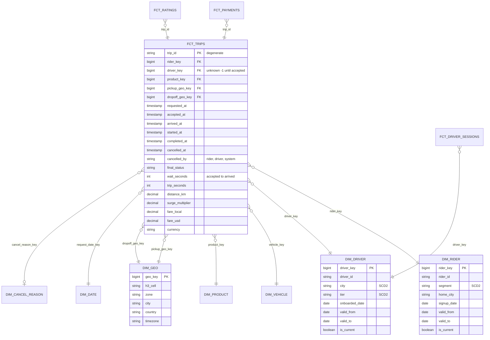

# Model a Ride-Hailing Marketplace

## Prompt

"Design the data model for our ride-hailing analytics. Leadership wants to understand marketplace health: trips, revenue, cancellations, driver supply and ratings."

## Business questions (get these first)

1. Completed trips, gross bookings and take rate by city by day/week.
2. Cancellation rate by who cancelled (rider/driver), city and hour of day.
3. Average time from request → accept → pickup → drop-off (where is the funnel slow?).
4. Driver supply hours and utilisation (time on trip / time online) per city.
5. Average rating given to drivers by riders; rating distribution by driver tenure.
6. Revenue by rider's **segment at the time of the trip** (riders move between segments).

## Clarifying questions

| Question | Assumed answer |
|---|---|
| Trip lifecycle states? | requested → accepted → arrived → started → completed / cancelled |
| Multiple products? | UberX, Comfort, XL, Pool (pool = multiple riders per trip!) |
| Currency? | Many; report in local and USD |
| Volume? | 20 M trips/day |
| Do drivers change vehicle/city? | Yes, occasionally; history matters for analysis |

## Business processes → fact tables

| Process | Fact table | Type | Grain |
|---|---|---|---|
| Trip lifecycle | `fct_trips` | **Accumulating snapshot** | One row per trip request |
| Payments | `fct_payments` | Transaction | One row per payment event (charge, refund, tip, adjustment) |
| Driver online sessions | `fct_driver_sessions` | Transaction (interval) | One row per driver online session |
| Ratings | `fct_ratings` | Transaction | One row per rating given (rider→driver or driver→rider) |
| Supply snapshot | `fct_city_supply_hourly` | Periodic snapshot | One row per city × hour |

### Bus matrix

| Fact \ Dimension | date/time | rider | driver | vehicle | city/geo | product | cancel reason |
|---|---|---|---|---|---|---|---|
| fct_trips | ✅ (×5 roles) | ✅ | ✅ | ✅ | ✅ (pickup, dropoff) | ✅ | ✅ |
| fct_payments | ✅ | ✅ | ✅ | | ✅ | ✅ | |
| fct_driver_sessions | ✅ | | ✅ | ✅ | ✅ | | |
| fct_ratings | ✅ | ✅ | ✅ | | ✅ | ✅ | |
| fct_city_supply_hourly | ✅ | | | | ✅ | ✅ | |

## ERD



## Key design decisions

1. **Trips as an accumulating snapshot.** One row per request, updated as milestones arrive (MERGE by `trip_id`). Durations between milestones are precomputed facts → question 3 becomes trivial. Cancelled trips stay in the same table (status + `cancelled_by`), so cancellation rate = cancelled / requested with no join.
2. **Role-playing dimensions:** `dim_geo` as pickup and drop-off; `dim_date`/time for each milestone (store timestamps in UTC **and** the city's local date key, since hour-of-day analysis must use local time).
3. **Driver unknown until accepted:** `driver_key = -1` ("Unassigned") for requests never accepted, so no NULL FKs.
4. **Payments separate from trips.** Different grain (tips, refunds and adjustments arrive days later). Gross bookings come from trips; *net* revenue from payments. Don't put refunds on the trip row.
5. **SCD2 on rider segment and driver city/tier** to answer question 6 "as it was". Fact rows store the version key resolved at request time.
6. **Pool trips:** multiple riders per vehicle trip. Either grain = rider-trip (one row per rider request, with a `shared_trip_id` degenerate dimension) or a bridge. Rider-trip grain keeps revenue additive per rider.
7. **Utilisation** = trip seconds / online seconds per driver per day: needs `fct_driver_sessions` (interval facts) and trip intervals. Compute in a derived daily driver fact.

## Sample queries against the model

```sql
-- Q2: cancellation rate by who cancelled, city, local hour
SELECT g.city, EXTRACT(HOUR FROM t.requested_at_local) AS hr,
       AVG(CASE WHEN t.final_status = 'cancelled' AND t.cancelled_by = 'rider'  THEN 1.0 ELSE 0 END) AS rider_cancel_rate,
       AVG(CASE WHEN t.final_status = 'cancelled' AND t.cancelled_by = 'driver' THEN 1.0 ELSE 0 END) AS driver_cancel_rate
FROM fct_trips t JOIN dim_geo g ON t.pickup_geo_key = g.geo_key
WHERE t.request_date_key BETWEEN 20261001 AND 20261031
GROUP BY 1, 2;

-- Q6: completed revenue by rider segment at trip time (SCD2 version key stored on the fact)
SELECT r.segment, SUM(t.fare_usd) AS revenue_usd
FROM fct_trips t JOIN dim_rider r ON t.rider_key = r.rider_key
WHERE t.final_status = 'completed'
GROUP BY r.segment;
```

## Trade-offs

| Decision | Alternative | Why this one |
|---|---|---|
| Accumulating snapshot for trips | Event-level `fct_trip_events` (one row per state change) | Funnel/duration analysis is the main use; keep the event fact too in silver for debugging and rare state transitions |
| Payments separate | Revenue columns on trips | Different grain and late adjustments; reconciliation with finance |
| Local + UTC time | UTC only | Hour-of-day behaviour is local; daily reports are by local day |

## Follow-up questions

<details><summary>How do you handle a trip whose fare is adjusted 3 days later?</summary>

The adjustment lands in `fct_payments` as a new row (event date = adjustment date) linked by trip_id. Trip-level reports of "final fare" use a derived column refreshed by MERGE or a view summing payments per trip. Financial reports use payment dates. Never silently rewrite historic revenue without an audit trail.
</details>

<details><summary>Where do surge pricing analyses get their data?</summary>

Surge multiplier at request time is a fact on the trip; supply/demand context per city × hour (or H3 cell × 5 min) lives in `fct_city_supply_hourly`, joined by geo and time bucket. For ML, a feature table at cell × minute grain.
</details>

<details><summary>How would you partition fct_trips physically?</summary>

By request date (local or UTC; pick one and document it), clustered by city/geo. Accumulating-snapshot updates touch recent partitions only (trips complete within hours), so MERGE stays cheap if the MERGE condition includes a date range.
</details>

---

## Rubric

- [ ] Collected business questions before drawing tables
- [ ] Identified multiple business processes with distinct grains
- [ ] Used an accumulating snapshot for the trip lifecycle
- [ ] Role-playing geo and date dimensions; local vs UTC time
- [ ] Separated payments (late adjustments) from trips
- [ ] SCD2 for attributes needing history; unknown member keys
- [ ] Validated the model by writing queries for the questions
