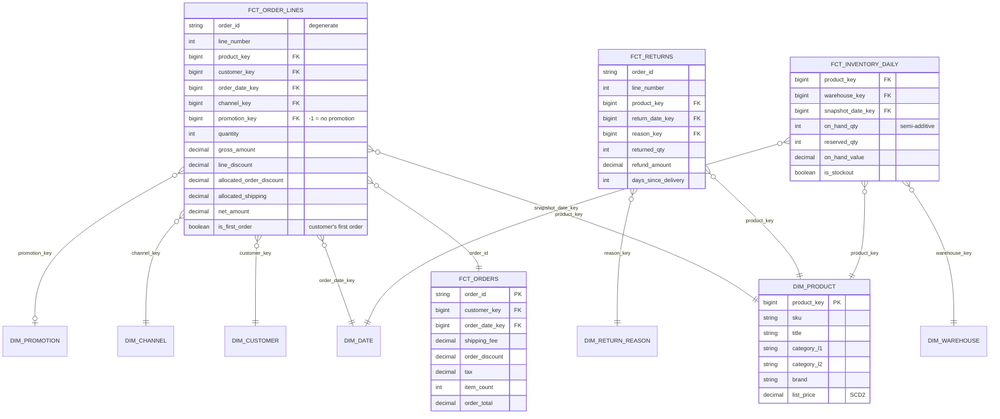

# Model E-Commerce Orders, Returns and Inventory

## Prompt

"We're an online retailer. Model our data so analysts can answer sales, returns and stock questions."

## Business questions

1. Net revenue (after returns and discounts) by category, brand and week.
2. Return rate by product category and reason; days from delivery to return.
3. Average order value (AOV) and items per order by channel (web/app).
4. Stock-out days per product per warehouse; inventory value at month end.
5. Revenue from first-time vs repeat customers.
6. Promotion effectiveness: sales uplift of promoted products vs non-promoted.

## Processes and grains

| Fact | Type | Grain |
|---|---|---|
| `fct_order_lines` | Transaction | One row per **order line** (product within an order) |
| `fct_orders` | Transaction | One row per order (order-level charges: shipping, order discounts, taxes) |
| `fct_returns` | Transaction | One row per returned order line (partial quantities allowed) |
| `fct_inventory_daily` | Periodic snapshot | One row per product × warehouse × day |
| `fct_promotion_coverage` | Factless | One row per product × promotion × day it was active |

## ERD



## Key design decisions

1. **Line grain for sales**, the most atomic level at which products exist. Order-level charges (shipping, order-wide coupons) live in `fct_orders` **and** are **allocated** to lines (by line gross amount) so category-level net revenue reconciles. Document the allocation rule.
2. **Returns as their own fact** linked by `(order_id, line_number)`: different date (return date), partial quantities, reasons. Net revenue = sales − refunds, computed per period by the respective dates (or by original order date for cohort-style return rates; offer both).
3. **Inventory is a periodic snapshot**: `on_hand_qty` is **semi-additive**: sum across products/warehouses, but across time use month-end or average. Stock-out days = COUNT of rows with `is_stockout`.
4. **Factless promotion coverage** enables "promoted products that didn't sell" (anti-join) and fair uplift comparisons.
5. **First-time vs repeat:** `is_first_order` computed at load time (customer's first order id) is cheaper than a window over all history for every query.
6. **Product hierarchy** flattened into `dim_product` (category_l1/l2/l3) rather than snowflaked.

## Sample queries

```sql
-- Q1 net revenue by category by ISO week (sales minus refunds, each by its own date)
WITH sales AS (
  SELECT d.iso_year_week, p.category_l1, SUM(f.net_amount) AS sales
  FROM fct_order_lines f JOIN dim_date d ON f.order_date_key = d.date_key
  JOIN dim_product p ON f.product_key = p.product_key GROUP BY 1, 2
), refunds AS (
  SELECT d.iso_year_week, p.category_l1, SUM(r.refund_amount) AS refunds
  FROM fct_returns r JOIN dim_date d ON r.return_date_key = d.date_key
  JOIN dim_product p ON r.product_key = p.product_key GROUP BY 1, 2
)
SELECT s.iso_year_week, s.category_l1, s.sales - COALESCE(r.refunds, 0) AS net_revenue
FROM sales s LEFT JOIN refunds r USING (iso_year_week, category_l1);

-- Q4 inventory value at month end (semi-additive: pick the last day, don't sum days)
SELECT d.year_month, SUM(i.on_hand_value) AS month_end_inventory_value
FROM fct_inventory_daily i JOIN dim_date d ON i.snapshot_date_key = d.date_key
WHERE d.is_month_end
GROUP BY d.year_month;
```

## Follow-up questions

<details><summary>AOV computed from fct_order_lines gives a different number than from fct_orders. Why?</summary>

Averaging over lines instead of orders (AOV must divide by distinct orders), or including/excluding allocated shipping and taxes differently. AOV should come from the order-grain fact (or COUNT DISTINCT order_id over lines). Define the metric once in the semantic layer.
</details>

<details><summary>Prices change. How do you report revenue at list price vs actual?</summary>

Store the actual transaction amounts on the fact (never recompute from current list price). Keep list price history as SCD2 on the product (or a price history table) and capture `list_price_at_order` on the line if "discount vs list" analysis matters.
</details>

<details><summary>How would you model marketplace (third-party) sellers?</summary>

Add `dim_seller` (SCD2: tier, country) to the line fact (each line has one seller); commission/fees as facts on the line or a separate seller-fees fact; seller payouts as their own transaction fact with payout dates.
</details>

---

## Rubric

- [ ] Line-level grain with a separate order-grain fact
- [ ] Allocation of order-level charges explained
- [ ] Returns as a separate fact with partial quantities and reasons
- [ ] Inventory as periodic snapshot; semi-additivity handled
- [ ] Factless coverage table for promotions
- [ ] Metric definitions (AOV, net revenue) unambiguous
