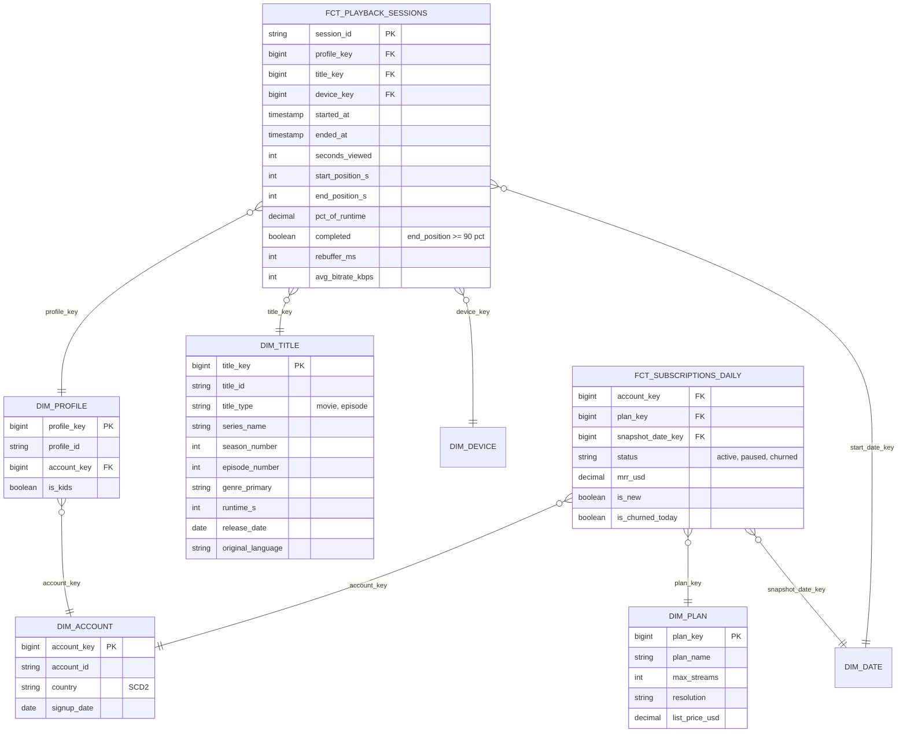

# Model a Video Streaming Platform

## Prompt

"Model viewing and subscription data so we can measure engagement, content performance and subscriber retention."

## Business questions

1. Hours viewed per title / season / genre per week, by country.
2. Completion rate per title (viewers who watched ≥ 90% of an episode/movie).
3. Daily/monthly active viewers and average viewing hours per subscriber.
4. Subscriber retention and churn by plan and signup cohort; impact of plan changes.
5. Which titles drive new signups (first title watched after signup)?
6. Playback quality: rebuffering ratio by device and ISP.

## Raw data

Player heartbeats every 30–60 s (`profile_id, title_id, position_s, ts, device, bitrate, buffering_ms`), subscription events from billing, catalogue from the content system.

## Processes and grains

| Fact | Type | Grain |
|---|---|---|
| `fct_playback_sessions` | Transaction (derived) | One row per **playback session** (profile × title × continuous viewing, built from heartbeats) |
| `fct_viewing_daily` | Periodic snapshot / aggregate | One row per profile × title × day |
| `fct_subscription_events` | Transaction | One row per subscription event (start, plan change, pause, cancel, renew) |
| `fct_subscriptions_daily` | Periodic snapshot | One row per subscription × day (status, plan, MRR), the basis for retention |
| `fct_qoe_sessions` | Transaction | Quality-of-experience per playback session (can merge into playback sessions) |

## ERD



## Key design decisions

1. **Heartbeats → sessions in silver.** Raw heartbeats (billions/day) are too granular for analysts. Sessionize: group consecutive heartbeats of a profile on a title, with a gap > 5 min starting a new session. Keep heartbeats in bronze/silver for QoE deep dives.
2. **Title hierarchy flattened** (series → season → episode) in `dim_title`, with `title_type`; movies have NULL season/episode. Reporting by series aggregates episodes.
3. **Completion** is defined at the session or profile-title level. Rewatching and skipping intros complicate it, so define it explicitly: "max end position ≥ 90% of runtime within 7 days of first play" → computed in `fct_viewing_daily`/a profile-title fact.
4. **Profile vs account:** viewing is per profile; billing per account. Keep both dimensions; aggregate engagement to account for retention models.
5. **Subscriptions daily snapshot** makes retention/churn/MRR queries simple (status per day), derived from the subscription event fact. Plan as SCD via the snapshot (plan_key per day).
6. **Country** is SCD2 on account (licensing differs by country, so "hours viewed in country X" must use the country at viewing time).

## Sample queries

```sql
-- Q2 completion rate per title (profile-title level, last 30 days)
WITH pt AS (
  SELECT profile_key, title_key, MAX(end_position_s) AS max_pos
  FROM fct_playback_sessions WHERE start_date_key >= 20260901 GROUP BY 1, 2
)
SELECT t.title_id, t.series_name, AVG(CASE WHEN pt.max_pos >= 0.9 * t.runtime_s THEN 1.0 ELSE 0 END) AS completion_rate
FROM pt JOIN dim_title t USING (title_key)
GROUP BY 1, 2 HAVING COUNT(*) >= 1000;

-- Q4 monthly churn rate by plan
SELECT d.year_month, p.plan_name,
       SUM(CASE WHEN s.is_churned_today THEN 1 ELSE 0 END) * 1.0
       / COUNT(DISTINCT CASE WHEN d.is_month_start AND s.status = 'active' THEN s.account_key END) AS churn_rate
FROM fct_subscriptions_daily s JOIN dim_date d ON s.snapshot_date_key = d.date_key
JOIN dim_plan p USING (plan_key)
GROUP BY 1, 2;
```

## Follow-up questions

<details><summary>Shared accounts: 4 people use one profile. Does that break your model?</summary>

Profile-level metrics become household-level. The model can't fix behaviour, but device_key and concurrent streams per profile help detect it; recommendation/ML can segment sessions by device. Document the limitation.
</details>

<details><summary>How would you attribute signups to titles?</summary>

For each new account, find the first playback session after signup (ROW_NUMBER over sessions by started_at) → "first title watched". Store it on an account-level fact (`fct_account_milestones`: signup, first play, first title, churn) for easy analysis.
</details>

---

## Rubric

- [ ] Turned raw heartbeats into a session fact with a clear rule
- [ ] Title hierarchy design (series/season/episode)
- [ ] Explicit completion metric definition
- [ ] Profile vs account distinction
- [ ] Subscription daily snapshot for retention and MRR
- [ ] Country history for licensing analyses
