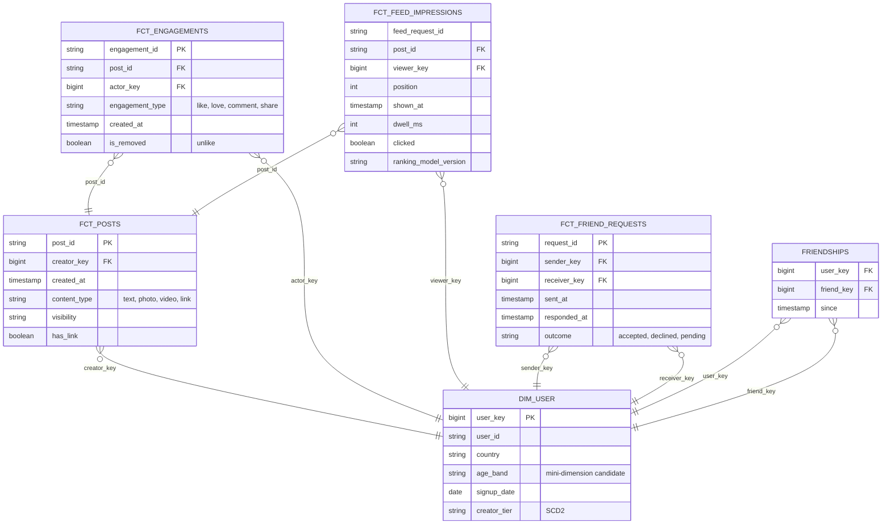

# Model a Social Network

## Prompt

"Design tables to analyse content creation, engagement and the friend graph on our social app."

## Business questions

1. Daily posts, reactions, comments and shares by content type and country.
2. Engagement rate of posts = engagements / impressions, by content type and creator size.
3. Friend requests sent/accepted per day; acceptance rate; time to accept.
4. Number of friends per user (distribution); % of users with ≥ 10 friends ("activation").
5. Feed: impressions per user per day, click-through by ranking position.
6. Mutual friends between two users; friend-of-friend recommendations input.

## Processes and grains

| Fact | Type | Grain |
|---|---|---|
| `fct_posts` | Transaction | One row per post (creation) |
| `fct_engagements` | Transaction | One row per engagement event (reaction, comment, share) on a post |
| `fct_feed_impressions` | Transaction | One row per post shown to a user in a feed request (with position) |
| `fct_friend_requests` | Accumulating snapshot | One row per request (sent_at, accepted_at/declined_at) |
| `friendships` (edge table) | Current-state bridge | One row per **directed** edge (user_id, friend_id) for each accepted friendship → two rows per friendship |
| `fct_user_daily` | Periodic snapshot | One row per user per day (active flag, friend_count, posts, engagements) |

## ERD



## Key design decisions

1. **Symmetric relationships stored as two directed edges.** `(A, B)` and `(B, A)` make "friends of user X" a simple `WHERE user_key = X` and friend counts a `GROUP BY user_key`, with no `OR` conditions. Cost: 2× rows. The alternative (one row with `user_low < user_high`) halves storage but complicates every query.
2. **Friend requests as an accumulating snapshot**: sent → responded, with time-to-accept as a derived fact. The friendship edge table is the **current state**; keep history via `friendship_events` (created/removed) if unfriending analysis matters.
3. **Engagements** are events that can be undone (unlike). Keep `is_removed` or a separate removal event; metrics must define whether "likes" means net or gross.
4. **Engagement rate** needs impressions: store numerator and denominator facts, compute the ratio after aggregation. Never average per-post rates without weighting.
5. **Feed impressions** are the largest table (tens of billions/day). Partition by date, cluster by viewer; consider sampling or daily aggregates (`fct_post_daily` with impressions/engagements per post per day) for most analysis.
6. **Creator size** for Q2 = follower/friend count bucket **at post time**: SCD2 `creator_tier` or snapshot the count on the post row.

## Sample queries

```sql
-- Q4 friend count distribution (directed edges make this a single GROUP BY)
SELECT friend_bucket, COUNT(*) AS users FROM (
  SELECT u.user_key,
         CASE WHEN COUNT(f.friend_key) = 0 THEN '0' WHEN COUNT(f.friend_key) < 10 THEN '1-9'
              WHEN COUNT(f.friend_key) < 100 THEN '10-99' ELSE '100+' END AS friend_bucket
  FROM dim_user u LEFT JOIN friendships f ON f.user_key = u.user_key
  GROUP BY u.user_key
) GROUP BY friend_bucket;

-- Q6 mutual friends of users 1 and 2
SELECT a.friend_key FROM friendships a JOIN friendships b ON a.friend_key = b.friend_key
WHERE a.user_key = 1 AND b.user_key = 2;
```

## Follow-up questions

<details><summary>Friend-of-friend recommendations for 2B users: can SQL do it?</summary>

A self-join of the edge table (2-hop) explodes: average degree 300 → 90k candidates per user. Feasible in Spark with pruning (cap high-degree nodes, sample), but typically done with graph processing (GraphX/GraphFrames, Pregel-style) or dedicated graph/ML systems, producing a `candidate_recommendations` table.
</details>

<details><summary>How would you model followers (asymmetric) vs friends (symmetric)?</summary>

Followers are naturally directed: one row per (follower, followee). Friends are symmetric: two directed rows or one canonical row. Many platforms store both in one edge table with `edge_type`.
</details>

---

## Rubric

- [ ] Separate facts for posts, engagements, impressions with clear grains
- [ ] Symmetric friendship modelling choice explained
- [ ] Friend request lifecycle (accumulating snapshot)
- [ ] Engagement rate computed from additive components
- [ ] Handling of undo events (unlike, unfriend)
- [ ] Scale considerations for impressions and graph queries
