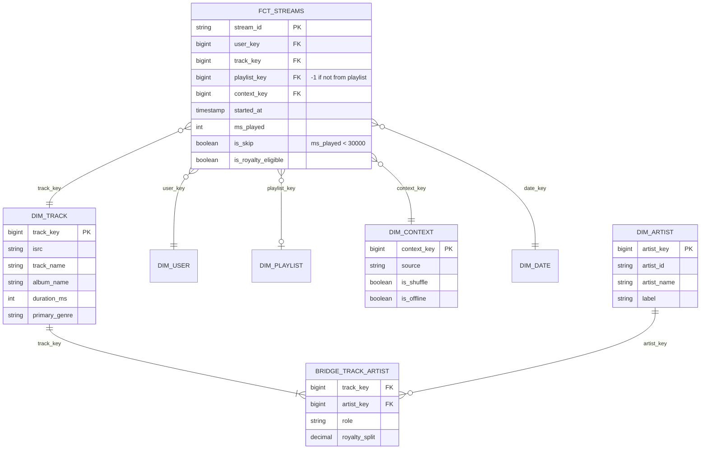

# Model Music Streaming with Multi-Artist Tracks

## Prompt

"Model streaming data to report plays per artist, power the 'Wrapped' year-in-review, and calculate royalties."

## Business questions

1. Streams and unique listeners per artist per day/country.
2. Royalty payout per artist per month, given that one track can have several artists with contractual splits.
3. Top tracks per playlist; playlist contribution to streams ("streams from editorial playlists").
4. Per-user yearly summary: top artists, top genres, minutes listened.
5. Skip rate per track (stream < 30 s).

## Processes and grains

| Fact | Grain |
|---|---|
| `fct_streams` | One row per stream (play) event |
| `fct_user_artist_daily` | One row per user × artist × day (aggregate, for Wrapped & listener counts) |
| `fct_royalty_monthly` | One row per artist × track × month × country (payout calculation output) |

| Dimension / bridge | Notes |
|---|---|
| `dim_track` | track, album, duration, release date, ISRC |
| `dim_artist` | artist attributes |
| `bridge_track_artist` | track_key, artist_key, role (primary/featured), **royalty_split** (sums to 1 per track) |
| `dim_playlist` | editorial/user/algorithmic, owner |
| `dim_user` | country (SCD2), subscription type (free/premium, SCD2) |
| `dim_context` | junk dimension: source (search, playlist, album, radio), shuffle flag, offline flag |

## ERD



## Key design decisions

1. **Bridge table for track ↔ artist** (many-to-many). Joining streams through the bridge produces one row **per artist per stream**:
   - **Streams per artist** ("streams involving this artist") = COUNT after the bridge join. Correct per artist, but **not additive across artists** (a duet counts for both).
   - **Royalties** must be additive → multiply by `royalty_split` so each stream's value is split exactly once.
2. **Junk dimension for playback context** (source × shuffle × offline): keeps the giant fact narrow.
3. **Unique listeners** are non-additive across days, so you can't sum daily uniques into monthly. Build monthly uniques from `fct_user_artist_daily` with COUNT DISTINCT over the month, or HLL sketches per day that union.
4. **Royalty eligibility** (≥ 30 s, not fraudulent) flagged at load; royalty facts are monthly, immutable once paid, with adjustments as new rows.
5. **User SCD2** (country, free/premium) because royalty rates differ by country and tier at stream time.

## Sample queries

```sql
-- Q2 royalty pool allocation: each eligible stream's value split across artists by contract
SELECT a.artist_name, d.year_month,
       SUM(b.royalty_split * r.per_stream_rate_usd) AS payout_usd
FROM fct_streams s
JOIN bridge_track_artist b ON b.track_key = s.track_key
JOIN dim_artist a ON a.artist_key = b.artist_key
JOIN dim_user u ON u.user_key = s.user_key
JOIN royalty_rates r ON r.country = u.country AND r.tier = u.subscription_type AND r.year_month = s.year_month
JOIN dim_date d ON d.date_key = s.date_key
WHERE s.is_royalty_eligible
GROUP BY 1, 2;

-- Sanity check: allocated payouts across artists must equal total pool (no double counting)
```

## Follow-up questions

<details><summary>Show "top artists" in a user's Wrapped. Are featured artists counted?</summary>

Product decision. Typically count streams per artist through the bridge (featured counts too) or restrict to role = primary. Implement as a parameter in the aggregation; document it. For minutes listened per artist, allocate ms_played by split or count full minutes for each artist (non-additive), and state which.
</details>

<details><summary>Artist splits change over time (a contract renegotiation). Impact?</summary>

Make the bridge effective-dated (SCD2 on the bridge: valid_from/valid_to) and join on stream date. Closed royalty months stay immutable; changes apply going forward or via explicit adjustment rows.
</details>

---

## Rubric

- [ ] Bridge table for many-to-many with allocation factor
- [ ] Explained double counting and additive vs non-additive per-artist metrics
- [ ] Junk dimension for low-cardinality context flags
- [ ] Unique listeners handled as non-additive (distinct/HLL)
- [ ] SCD2 attributes affecting royalty rates
- [ ] Immutable monthly royalty facts with adjustments
