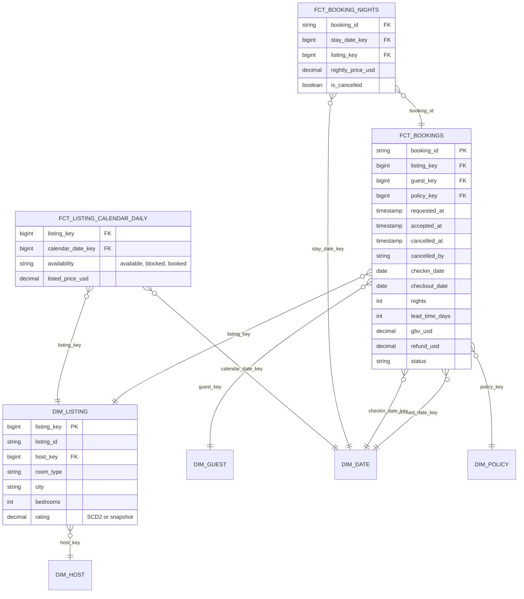

# Model Accommodation Bookings and Availability

## Prompt

"Model bookings so we can track revenue, occupancy, cancellations and the booking funnel for hosts and the business."

## Business questions

1. Gross booking value (GBV) and nights booked by booking date vs by stay date.
2. Occupancy rate per listing / city per month = booked nights / available nights.
3. Average lead time (booking date → check-in) and length of stay by market.
4. Cancellation rate and refunds by cancellation policy.
5. Average daily rate (ADR) by listing type and season.
6. Host response time and acceptance rate (booking requests).

## The grain trap

A booking of 5 nights from Aug 10 to Aug 15 has **two** natural time perspectives:
- **Booking date**: when revenue was "won" (sales view).
- **Stay dates**: when nights are consumed (operations, occupancy, revenue recognition).

One table can't serve both at the right grain. Hence two facts:

| Fact | Type | Grain |
|---|---|---|
| `fct_bookings` | Accumulating snapshot | One row per booking (request → accepted → paid → checked-in → completed / cancelled) |
| `fct_booking_nights` | Transaction (exploded) | One row per **booked night** (booking × stay date) with nightly price |
| `fct_listing_calendar_daily` | Periodic snapshot | One row per listing × calendar date × snapshot date (or latest): available / blocked / booked, listed price |

## ERD



## Key design decisions

1. **Explode bookings into nights** for occupancy and ADR: `occupancy = booked nights / available nights` needs both numerator and denominator at night × listing grain. Nightly price varies (weekends, cleaning fee allocation → define).
2. **Calendar availability snapshot** provides the denominator (available nights), including nights the host blocked. Occupancy without it is meaningless.
3. **Accumulating snapshot for bookings** gives funnel timing (request → accept), lead time, and status. Cancellations update the row (cancelled_at, refund) and flag the nights (`is_cancelled`), while keeping history of the original booking for cancellation analysis.
4. **Two date roles** on bookings (booked date, check-in date) via role-playing `dim_date`.
5. **Revenue recognition** (finance) typically by stay date (nights) after check-in; GBV reported by booking date. Both available.

## Sample queries

```sql
-- Q2 occupancy per city per month
SELECT l.city, d.year_month,
       SUM(CASE WHEN c.availability = 'booked' THEN 1 ELSE 0 END) * 1.0
     / NULLIF(SUM(CASE WHEN c.availability IN ('booked', 'available') THEN 1 ELSE 0 END), 0) AS occupancy
FROM fct_listing_calendar_daily c
JOIN dim_listing l USING (listing_key)
JOIN dim_date d ON d.date_key = c.calendar_date_key
GROUP BY 1, 2;

-- Q5 ADR by room type and month (stay-date perspective, non-cancelled nights)
SELECT l.room_type, d.year_month, AVG(n.nightly_price_usd) AS adr
FROM fct_booking_nights n JOIN dim_listing l USING (listing_key)
JOIN dim_date d ON d.date_key = n.stay_date_key
WHERE NOT n.is_cancelled
GROUP BY 1, 2;
```

## Follow-up questions

<details><summary>The calendar snapshot for all listings × 365 future days × every day is huge. Optimise?</summary>

Store only changes (SCD2-style intervals per listing: availability/price valid_from/valid_to), or keep the daily snapshot only for the next N days and the actual outcome for past dates. For occupancy you need the final state per past date, not every intermediate snapshot.
</details>

<details><summary>How do you report "bookings on the books" for next month as of today vs as of the same day last year (pace report)?</summary>

Pace needs history of when nights were booked: from `fct_booking_nights` filter `booked_date <= as_of_date` and stay date in the target month, excluding bookings cancelled before as_of. The accumulating snapshot's timestamps make this possible; a current-state-only model can't do it.
</details>

---

## Rubric

- [ ] Identified booking-date vs stay-date perspectives
- [ ] Nightly grain fact for occupancy/ADR
- [ ] Availability snapshot for the occupancy denominator
- [ ] Accumulating snapshot for booking lifecycle and cancellations
- [ ] Role-playing dates; revenue recognition discussion
