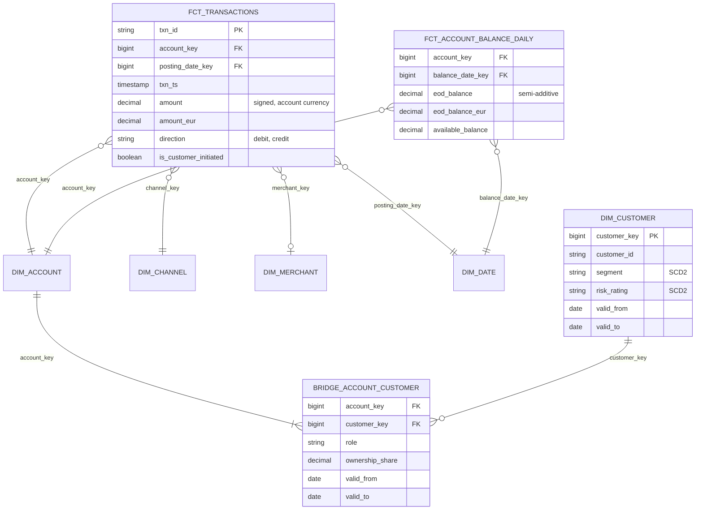

# Model Bank Accounts, Transactions and Balances

## Prompt

"Design the analytical model for retail banking: accounts, transactions, balances and customers, supporting both analytics and regulatory reporting."

## Business questions

1. Daily and month-end balances per product type, branch, customer segment.
2. Average daily balance (ADB) per account per month (interest and fee calculations).
3. Transaction volumes and values by channel (card, transfer, ATM) and merchant category.
4. Number of customers by segment **as of** any past date (regulatory "as-of" reporting).
5. Joint accounts: total deposits per customer without double counting.
6. Dormant accounts: no customer-initiated transaction in 12 months.

## Processes and grains

| Fact | Type | Grain |
|---|---|---|
| `fct_transactions` | Transaction | One row per posted transaction (debit/credit) |
| `fct_account_balance_daily` | Periodic snapshot | One row per account per day (end-of-day balance) |
| `fct_account_events` | Transaction | Open, close, freeze, product change |

| Dimension / bridge | Notes |
|---|---|
| `dim_account` | product type, currency, branch, open/close dates (SCD2 for product changes) |
| `dim_customer` | segment, risk rating, KYC status (SCD2) |
| `bridge_account_customer` | account_key, customer_key, role (primary/joint), **ownership_share** |
| `dim_merchant`, `dim_channel`, `dim_date` | |

## ERD



## Key design decisions

1. **Balances as a daily periodic snapshot.** Reconstructing balances from transactions on every query is expensive and error-prone (backdated postings, fees, interest). The snapshot is also what regulators expect. Balances are **semi-additive**: SUM across accounts, but across days use end-of-period or average.
2. **Average daily balance** = AVG(eod_balance) over the month's days, which requires a row for **every** day (carry forward balances on days without transactions).
3. **Joint accounts via a bridge** with `ownership_share`. "Total deposits per customer" multiplies by the share; "customers with exposure to account X" counts distinct customers. Effective-dated bridge (owners change).
4. **SCD2 on customers** for as-of reporting (segment, risk rating at a date). Regulatory reports must be reproducible: store report snapshots or use effective dating, not "current" values.
5. **Signed amounts** with explicit direction; multi-currency with original and reporting currency (FX rate as of posting date).
6. **Backdated transactions** (value date ≠ posting date) need both dates; balances by value date may need restatement, so keep a restatement policy.

## Sample queries

```sql
-- Q2 average daily balance per account for September
SELECT account_key, AVG(eod_balance) AS adb
FROM fct_account_balance_daily
WHERE balance_date_key BETWEEN 20260901 AND 20260930
GROUP BY account_key;

-- Q5 deposits per customer at month end, joint accounts split by ownership share
SELECT b.customer_key, SUM(f.eod_balance_eur * b.ownership_share) AS deposits_eur
FROM fct_account_balance_daily f
JOIN bridge_account_customer b
  ON b.account_key = f.account_key AND DATE '2026-09-30' >= b.valid_from AND DATE '2026-09-30' < b.valid_to
WHERE f.balance_date_key = 20260930
GROUP BY b.customer_key;
```

## Follow-up questions

<details><summary>A 10M-account bank × 365 days × 10 years: is the daily snapshot too big?</summary>

36.5 B rows, but narrow, highly compressible (balances change slowly) and partitioned by date: very manageable in a lakehouse. Alternatives: store balance change intervals (SCD2-style: balance valid_from/valid_to) and expand on demand; or keep daily for recent years and monthly snapshots for older history.
</details>

<details><summary>How do you guarantee the balance snapshot reconciles with transactions?</summary>

Daily check: `eod_balance(d) = eod_balance(d-1) + SUM(transactions posted on d)` per account; differences go to an exceptions table. Also reconcile totals with the core banking general ledger.
</details>

---

## Rubric

- [ ] Periodic balance snapshot; semi-additivity explained
- [ ] ADB calculation with dense daily rows
- [ ] Bridge with ownership share for joint accounts
- [ ] SCD2 / effective dating for as-of regulatory reporting
- [ ] Multi-currency and value vs posting dates
- [ ] Reconciliation between transactions and balances
