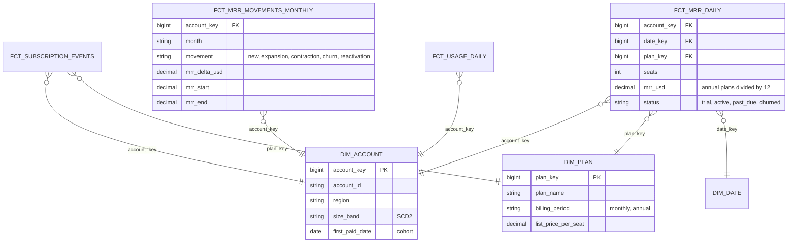

# Model SaaS Subscriptions and MRR

## Prompt

"Finance and growth teams want trustworthy MRR, churn and expansion metrics. Our billing system emits subscription events."

## Business questions

1. MRR and ARR per day/month, by plan, region, customer size.
2. MRR movements per month: new, expansion, contraction, churned, reactivated.
3. Logo churn rate and net revenue retention (NRR) by signup cohort.
4. Seats purchased vs seats used (product usage) per account.
5. Trial → paid conversion rate and time to convert.

## Processes and grains

| Fact | Type | Grain |
|---|---|---|
| `fct_subscription_events` | Transaction | One row per billing event (trial_start, subscribe, upgrade, downgrade, seat change, cancel, reactivate) |
| `fct_mrr_daily` | Periodic snapshot | One row per account × day with MRR (normalised to monthly), plan, seats, status |
| `fct_mrr_movements_monthly` | Derived transaction | One row per account × month × movement type with MRR delta |
| `fct_usage_daily` | Periodic snapshot | One row per account × day: active seats, key feature usage |

## ERD



## Key design decisions

1. **MRR is derived, never typed in.** Normalise every subscription to a monthly amount (annual ÷ 12, net of discounts, excluding one-off fees/taxes) in the daily snapshot. Document the definition with finance.
2. **Daily snapshot** makes "MRR on any date" trivial and is the base for movements.
3. **Movements by comparing month-start vs month-end MRR per account:**

| Start MRR | End MRR | Movement |
|---|---|---|
| 0, never paid before | > 0 | new |
| 0, paid before | > 0 | reactivation |
| > 0 | > start | expansion |
| > 0 | 0 < end < start | contraction |
| > 0 | 0 | churn |

Identity check: `MRR_end = MRR_start + new + expansion + reactivation − contraction − churn` must reconcile exactly. Build it as a DQ test.
4. **Cohorts** by `first_paid_date` (on the account) → NRR = MRR of cohort in month N / MRR in month 0 (includes expansion; can exceed 100%).
5. **Usage joined at account × day** for seat utilisation and churn-risk features.

## Sample queries

```sql
-- Q2 monthly MRR movements (from daily snapshot, month-start vs month-end)
WITH m AS (
  SELECT account_key, d.year_month,
         MAX(CASE WHEN d.is_month_start THEN mrr_usd END) AS mrr_start,
         MAX(CASE WHEN d.is_month_end   THEN mrr_usd END) AS mrr_end
  FROM fct_mrr_daily f JOIN dim_date d USING (date_key)
  GROUP BY 1, 2
)
SELECT year_month,
       SUM(CASE WHEN COALESCE(mrr_start,0) = 0 AND mrr_end > 0 THEN mrr_end END) AS new_or_reactivated,
       SUM(CASE WHEN mrr_start > 0 AND mrr_end > mrr_start THEN mrr_end - mrr_start END) AS expansion,
       SUM(CASE WHEN mrr_start > 0 AND mrr_end > 0 AND mrr_end < mrr_start THEN mrr_start - mrr_end END) AS contraction,
       SUM(CASE WHEN mrr_start > 0 AND COALESCE(mrr_end,0) = 0 THEN mrr_start END) AS churned
FROM m GROUP BY year_month;
```

## Follow-up questions

<details><summary>A customer downgrades mid-month and upgrades again before month end. What does the month-start vs month-end method show?</summary>

Only the net change (possibly nothing). That's usually desired for reporting; if you need gross intra-month movements, compute movements from the event fact instead (each event's MRR delta), which is more complex but complete.
</details>

<details><summary>How do you treat past_due accounts?</summary>

Policy decision agreed with finance: e.g. keep MRR while in dunning for up to N days, then churn retroactively at the failure date (which restates recent months) or at the decision date (no restatement). Model the status explicitly so either view is possible.
</details>

---

## Rubric

- [ ] MRR normalisation rules made explicit
- [ ] Daily MRR snapshot as the core fact
- [ ] Movement classification and reconciliation identity
- [ ] Cohort-based NRR and logo churn
- [ ] Usage data integration
