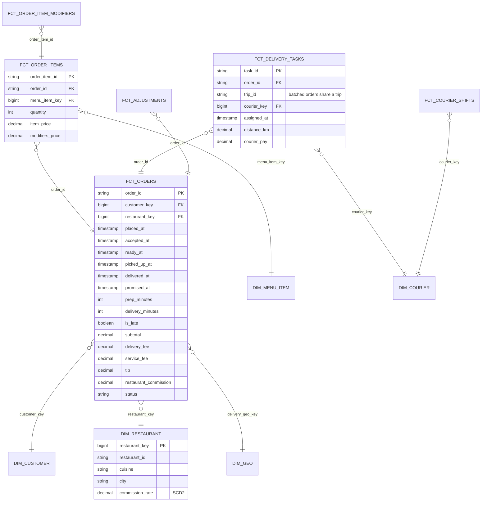

# Model a Food Delivery Order Lifecycle

## Prompt

"Model our delivery marketplace for operations and finance: customers, restaurants and couriers."

## Business questions

1. Orders, GOV (gross order value), and take rate by city, restaurant, cuisine.
2. Delivery time breakdown: order placed → restaurant accepted → food ready → courier picked up → delivered; late delivery rate vs promised ETA.
3. Restaurant prep time vs estimate; item-level popularity, including modifiers (extra cheese).
4. Courier utilisation and earnings per hour; deliveries per shift; batching (multiple orders per trip).
5. Refunds/credits by reason (missing item, late, cold food) and who pays (restaurant vs platform).

## Facts and grains

| Fact | Type | Grain |
|---|---|---|
| `fct_orders` | Accumulating snapshot | One row per order with all milestone timestamps and ETA |
| `fct_order_items` | Transaction | One row per item in an order |
| `fct_order_item_modifiers` | Transaction | One row per modifier on an item (child of items) |
| `fct_delivery_tasks` | Transaction | One row per courier task (pickup + drop-off) for an order, so batched trips appear as multiple tasks with one `trip_id` |
| `fct_courier_shifts` | Transaction | One row per courier shift (online/offline, active time, earnings) |
| `fct_adjustments` | Transaction | One row per refund/credit, with reason and liable party |

## ERD



## Key design decisions

1. **Order lifecycle as an accumulating snapshot** with milestone timestamps and derived durations → delivery-time breakdown and late rate are column math.
2. **Items and modifiers as child facts** (header–line–sub-line). Item revenue is additive at item level; order-level fees stay on the order (don't repeat on items).
3. **Delivery tasks separate from orders** because batching means one courier trip serves several orders and one order can be re-assigned (multiple tasks). Courier pay lives on tasks, not orders.
4. **Shifts** give the denominator for utilisation (active minutes / online minutes) and earnings per hour.
5. **Adjustments as their own fact** with liable party: refunds often happen days later and finance needs them by adjustment date.
6. **Commission rate SCD2** on restaurant, but the **commission amount is stored on the order** at order time (never recompute from the current rate).

## Sample query

```sql
-- Q2 average milestone durations and late rate per city (last 7 days)
SELECT g.city,
       AVG((julianday(accepted_at)  - julianday(placed_at))   * 1440) AS min_to_accept,
       AVG((julianday(ready_at)     - julianday(accepted_at)) * 1440) AS min_prep,
       AVG((julianday(picked_up_at) - julianday(ready_at))    * 1440) AS min_wait_for_courier,
       AVG((julianday(delivered_at) - julianday(picked_up_at))* 1440) AS min_on_road,
       AVG(CASE WHEN is_late THEN 1.0 ELSE 0 END)                       AS late_rate
FROM fct_orders o JOIN dim_geo g ON o.delivery_geo_key = g.geo_key
WHERE o.status = 'delivered' AND o.placed_at >= DATE('now', '-7 days')
GROUP BY g.city;
```

## Follow-up questions

<details><summary>How do you allocate a batched trip's courier pay to orders for unit economics?</summary>

Allocation rule (by distance share, equal split, or marginal distance), applied in a derived `fct_order_unit_economics` table so contribution margin per order sums back to the total pay. Document the rule; finance must agree.
</details>

<details><summary>What's the restaurant's "prep time vs estimate" if the restaurant never marks food ready?</summary>

`ready_at` is missing or unreliable: use courier pickup as a proxy with a flag (`ready_at_source = 'courier_pickup'`), or wait-time at restaurant from courier GPS. Track the data quality rate of milestone completeness per restaurant.
</details>

---

## Rubric

- [ ] Accumulating snapshot with milestone durations and ETA
- [ ] Header/line/sub-line facts for orders, items, modifiers
- [ ] Separate delivery tasks for batching and reassignment
- [ ] Shifts for utilisation denominators
- [ ] Adjustments and commission stored at transaction time
