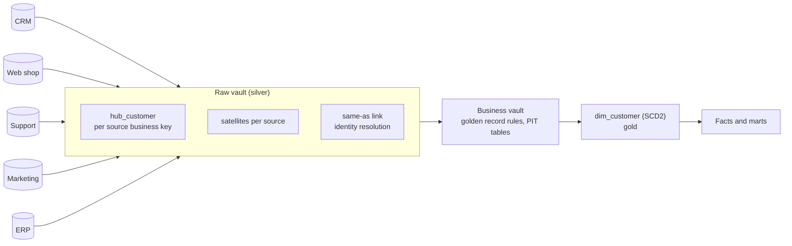
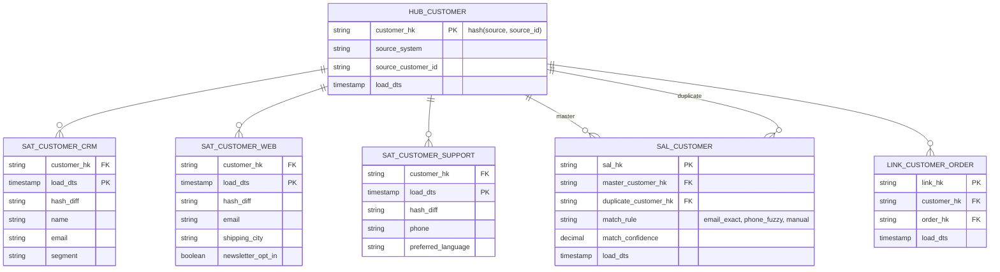

# Model a Customer 360 from Many Sources

## Prompt

"We have customer data in a CRM, the web shop, the support tool, a marketing platform and a legacy ERP, each with its own IDs and partly conflicting attributes. Build an integrated customer model with full history and auditability."

## Requirements

1. One **golden customer** record with best-known attributes (survivorship rules).
2. Ability to show what **each source** said about a customer at any point in time (audit).
3. New sources added without remodeling existing tables.
4. Analytics: customer lifetime value, interactions across channels, segments.
5. GDPR: delete a person across all sources.

## Architecture



## Raw vault model



## Key design decisions

1. **Hub keyed by (source, source id) hashes.** IDs from different systems never collide, and loads run in parallel without lookups.
2. **Satellite per source** (and per rate of change). Each source's view is preserved with full history (insert on `hash_diff` change) → requirement 2 (audit) for free.
3. **Identity resolution as data, not code:** a **same-as link** (SAL) maps duplicate hub keys to a master key with the rule and confidence used. Matching rules (deterministic email/phone, probabilistic name+address, manual stewardship) can change and be re-run without losing history.
4. **Survivorship rules** in the business vault build the golden record: e.g. email from CRM if present else web; city from the most recently updated source; consent = most restrictive across sources. Rules are versioned.
5. **PIT (point-in-time) tables** pre-compute, per master customer per day, which satellite row was valid. They make joins across 5 satellites fast for building the SCD2 `dim_customer`.
6. **Gold = Kimball**: `dim_customer` (SCD2 on golden attributes) + facts (orders, tickets, campaign touches) keyed by the master surrogate key.
7. **GDPR:** the hub + SAL give all source keys for a person; deletion/anonymisation applies to every satellite of every linked hub key, and to downstream dims and facts (see the [GDPR platform design](/interview-prep/practice/system-design/gdpr-deletion-platform/)).

## Sample logic: golden email with survivorship

```sql
WITH latest AS (
  SELECT sal.master_customer_hk, 'crm' AS src, s.email, s.load_dts,
         ROW_NUMBER() OVER (PARTITION BY sal.master_customer_hk ORDER BY s.load_dts DESC) AS rn
  FROM sal_customer sal JOIN sat_customer_crm s ON s.customer_hk = sal.duplicate_customer_hk
  WHERE s.email IS NOT NULL
  UNION ALL
  SELECT sal.master_customer_hk, 'web', s.email, s.load_dts,
         ROW_NUMBER() OVER (PARTITION BY sal.master_customer_hk ORDER BY s.load_dts DESC)
  FROM sal_customer sal JOIN sat_customer_web s ON s.customer_hk = sal.duplicate_customer_hk
  WHERE s.email IS NOT NULL
)
SELECT master_customer_hk,
       COALESCE(MAX(CASE WHEN src = 'crm' AND rn = 1 THEN email END),
                MAX(CASE WHEN src = 'web' AND rn = 1 THEN email END)) AS golden_email   -- CRM wins
FROM latest GROUP BY master_customer_hk;
```

## Trade-offs

| Choice | Alternative | Reasoning |
|---|---|---|
| Data Vault raw layer | Conformed silver entities directly | 5+ volatile sources + audit needs justify the vault; with 2 stable sources it's overhead |
| SAL for identity | Overwrite IDs in place | Matching rules change; SAL keeps decisions explainable and reversible |
| PIT tables | Join satellites at query time | Performance for dimension builds |

## Follow-up questions

<details><summary>A match rule was wrong and merged two different people. How do you fix it?</summary>

Mark the SAL rows as invalid (insert a new SAL record with end-dating, since it's insert-only), re-run survivorship for affected masters, rebuild their dim_customer versions, and re-key affected facts (or, if facts use source-level keys plus a mapping, just refresh the mapping). Audit trail shows when and why.
</details>

<details><summary>How would you serve the golden record operationally (to the CRM, in real time)?</summary>

Publish golden-record changes as events (CDC from the gold table / outbox) to Kafka, and reverse-ETL to operational systems; or expose an API backed by a low-latency store. The analytical model stays the system of record for analytics; an MDM tool may own operational mastering.
</details>

---

## Rubric

- [ ] Source-level hub keys to avoid ID collisions
- [ ] Per-source satellites for full auditable history
- [ ] Identity resolution modelled as a link with rules and confidence
- [ ] Survivorship rules for the golden record
- [ ] PIT tables and a Kimball consumption layer
- [ ] GDPR deletion path across linked keys
