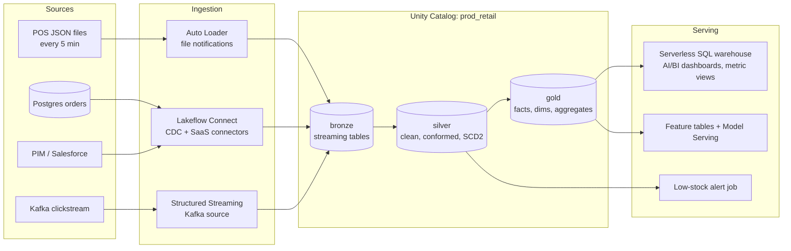

# Design an End-to-End Databricks Lakehouse for a Retailer

**Difficulty:** Hard · **Topics:** Databricks platform design · **Time:** 45 minutes

## Scenario

A retailer with 1,200 stores and an e-commerce site is moving to Databricks. Sources:

- **POS transactions:** stores upload JSON files every 5 minutes to cloud storage (≈ 40 GB/day, schema changes a few times a year).
- **E-commerce orders:** a Postgres OLTP database (≈ 2M orders/day, updates to order status).
- **Product catalog and promotions:** in a SaaS PIM tool and Salesforce.
- **Clickstream:** Kafka, ≈ 300M events/day.

Consumers: finance (daily revenue by store, must reconcile with the ERP, ready by 06:00), merchandising dashboards (hourly freshness), a demand-forecasting ML team, and a near-real-time "low stock" alert. GDPR applies to customer data.

## Your task

Design the platform on Databricks. Cover ingestion, the medallion pipelines, Unity Catalog layout and security, orchestration and CI/CD, serving, cost and operations. Name concrete Databricks features and justify them.

## Hints

Hint 1

Each source has a natural Databricks ingestion path: files → Auto Loader, Postgres → CDC (Lakeflow Connect or Debezium), SaaS → managed connectors, Kafka → Structured Streaming.

Hint 2

Think about which consumers need finalised, reconciled data (finance) versus fresh, approximate data (merchandising, alerts), and design the gold layer and SLAs accordingly.

## Solution

### Architecture

### Ingestion
- **POS files:** Auto Loader with file notification mode (many small files), `schemaEvolutionMode=addNewColumns` plus the rescued data column, into a bronze streaming table in a Declarative Pipeline.
- **Postgres orders:** CDC via Lakeflow Connect's database connector (or Debezium → Kafka if already standard), landing change records in bronze with operation type and log sequence.
- **PIM/Salesforce:** Lakeflow Connect managed connectors (incremental sync), with no custom API code.
- **Clickstream:** Structured Streaming from Kafka into bronze (raw payload + Kafka metadata), with `maxOffsetsPerTrigger` to control batch size.

### Pipelines (Lakeflow Declarative Pipelines)
- **Silver:**
  - POS: parse, deduplicate on (`store_id`, `receipt_id`, `line_no`), conform store/product keys; **expectations** (`expect_or_drop` for negative quantities with a quarantine table, `expect_or_fail` for missing store_id).
  - Orders: **AUTO CDC** with `sequence_by = lsn` into `silver.orders` (SCD1 current state) and `silver.order_status_history` (SCD2).
  - Products/promotions: AUTO CDC SCD2 for price and attribute history (needed for point-in-time revenue and forecasting features).
  - Clickstream: sessionized events with watermarks; customer identifiers pseudonymised.
- **Gold:**
  - `fct_sales_daily` (store × product × day), a materialized view finalised after the late-file window (POS uploads can be delayed hours when stores are offline).
  - Hourly merchandising aggregates as materialized views with incremental refresh.
  - `dim_store` and `dim_product` (SCD2).
  - Inventory position table for alerts.
- **Finance reconciliation:** a gold check compares daily revenue per store with the ERP control totals; `expect_or_fail` on the publish step, so finance never sees unreconciled numbers (write-audit-publish).

### Unity Catalog layout and security
- Catalogs `dev_retail`, `test_retail`, `prod_retail` (workspace-bound); schemas `bronze`, `silver`, `gold`, `features`, `quarantine`; managed tables with predictive optimisation and liquid clustering (`fct_sales_daily` clustered by `sale_date, store_id`).
- Groups from the IdP via SCIM: `finance-analysts` (SELECT on gold finance tables), `merch-analysts`, `ds-forecasting` (SELECT on gold + features, write on their sandbox schema), pipelines as service principals with MODIFY on their schemas.
- **PII:** governed tags on customer columns; ABAC/column masks so only `customer-care` sees emails and phone numbers; a row filter restricting regional managers to their region. GDPR deletion runs via a job that deletes by customer key across lineage-identified tables, purges deletion vectors and VACUUMs.
- Audit and lineage from system tables for access reviews.

### Orchestration, CI/CD and operations
- A **Lakeflow Job** per domain:
  1. a pipeline update (triggered every 15 minutes for POS/orders; continuous for clickstream if needed);
  2. reconciliation and publish tasks;
  3. dashboard refresh;
  4. **table-update triggers** for downstream jobs.

  Retries on tasks, **repair runs** for recovery, duration alerts.
- Everything defined in **Databricks Asset Bundles**: PR checks (unit tests, `bundle validate`), staging deploy with integration tests, prod deploy as a service principal. Terraform for workspaces, catalogs and grants.
- Monitoring: pipeline event logs (expectation metrics), system tables for job SLAs and cost, Lakehouse Monitoring on key gold tables (drift in sales by store).

### Serving
- **Serverless SQL warehouse** for dashboards (AI/BI dashboards or Power BI), **metric views** for governed definitions of revenue and margin, materialized views for heavy aggregates.
- **ML:** feature tables in Unity Catalog with point-in-time lookups for forecasting (price history from SCD2, promotions, weather); MLflow models registered in UC; batch inference as a job writing forecasts to gold.
- **Low-stock alert:** a streaming job over silver inventory movements with a threshold per store/product, writing alerts to a table and notifying via webhook; Lakebase or a KV store if an app needs millisecond lookups.

### Cost controls
- Serverless pipelines and SQL warehouses (no idle compute; auto-stop) and jobs compute instead of all-purpose for any classic workloads.
- Cluster policies for data science clusters (instance types, auto-termination, tags).
- Incremental processing everywhere (no full refreshes), liquid clustering and predictive optimisation to reduce scanned data.
- A budget per domain from `system.billing.usage` with alerts.

### Trade-offs to mention
- Declarative pipelines vs hand-written Structured Streaming + MERGE: much less code and built-in quality/CDC, but less low-level control.
- Lakeflow Connect vs Debezium/Kafka for CDC: managed simplicity vs reuse of existing streaming infrastructure and multi-consumer fan-out.
- Finalisation window for POS: later finance publication vs fewer restatements.

## What interviewers look for

- The right ingestion feature per source, with schema evolution and CDC handled explicitly.
- Medallion layers with data quality gates and **reconciliation for finance**.
- A Unity Catalog layout with environment isolation, group-based grants and PII protection.
- Production practices: Asset Bundles, CI/CD, data-aware triggers, repair runs, monitoring.
- Different SLAs per consumer, and cost awareness (serverless, policies, incremental processing).
