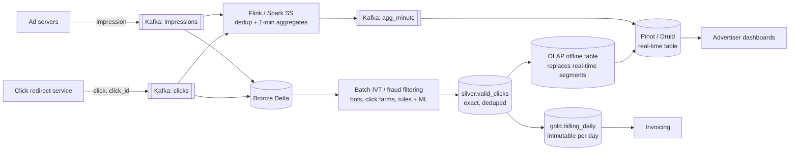
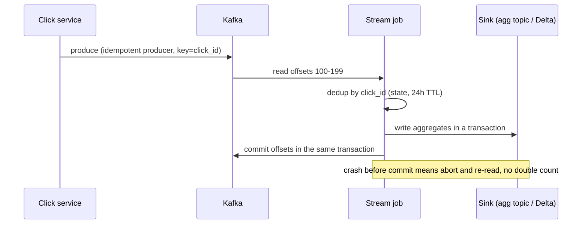

# Design an Ad Click and Impression Aggregation System

## Problem

An ads platform serves impressions and records clicks. Advertisers need near-real-time dashboards of impressions, clicks, CTR and spend per campaign. Finance bills advertisers daily based on **valid** clicks. Design the aggregation system.

---

## Clarifying questions

| Question | Assumed answer |
|---|---|
| Volume? | 10 B impressions/day, 1 B clicks/day, 5× peak |
| Dashboard freshness? | ≤ 1 minute, approximate OK |
| Billing? | Daily, **exact**, auditable, after click-fraud filtering |
| Late events? | Up to 24 h (mobile SDK batching) |
| Query patterns? | Per campaign / ad / day / hour / minute, by country, device; last 90 days interactive |
| Number of campaigns? | ~1 M active ads, 100k advertisers |

## 1. Requirements

- **Real-time:** per-minute counts per ad (impressions, clicks, spend), sub-second queries by advertisers (thousands of concurrent users).
- **Billing:** exactly-once counting, invalid-traffic (IVT) filtering, immutable daily invoices, reconciliation.
- **History:** 2+ years for analysis.

## 2. Estimates

```
Impressions 10B/day → 100k/s avg, 500k/s peak; clicks 1B/day → 10k/s avg, 50k/s peak
~300 B/event Avro → ~165 MB/s peak → Kafka 128+ partitions
Raw storage: 11B × 300 B ≈ 3.3 TB/day → ~0.5 TB/day Parquet → 2 years ≈ 365 TB
Aggregates: 1M ads × 1,440 minutes = 1.44B minute-rows/day worst case;
            realistically ~100M (sparse) → OLAP store with rollups to hour/day after 7 days
```

## 3. Architecture

Requirements diverge (fast/approximate vs slow/exact), so this is one of the rare places where a **Lambda-style split is justified**, but with shared code.



The OLAP store's **hybrid table** (Pinot real-time + offline segments) lets the batch-corrected numbers **replace** the streaming numbers for completed days, so advertisers converge to billing-grade numbers.

## 4. Data model

```sql
-- click event
click_id STRING (UUID generated by redirect service), impression_id STRING, ad_id, campaign_id,
advertiser_id, user_id_hash, ip_hash, user_agent, country, device, click_ts, received_ts, cost_micros

-- real-time aggregate (grain: ad × minute × country × device)
minute_ts, ad_id, campaign_id, country, device, impressions BIGINT, clicks BIGINT, spend_micros BIGINT

-- billing (grain: advertiser × campaign × day), immutable once closed
bill_date, advertiser_id, campaign_id, valid_clicks, invalid_clicks, amount_micros, run_id, closed_at
```

Money in **integer micros** (never floats).

## 5. Deep dives

### 5.1 Exactly-once counting



- **Source of duplicates:** client retries, redirect service retries, at-least-once delivery. Every click gets a `click_id` at the redirect service; dedup by it.
- **Streaming:** dedup state keyed by click_id with TTL = max lateness; Flink two-phase commit sink or Kafka transactions for agg output.
- **Billing:** batch dedup over the whole day (`ROW_NUMBER() OVER (PARTITION BY click_id ...)`) is the source of truth, independent of streaming.

### 5.2 Hot campaigns (skew)

A Super Bowl campaign can be 5% of all traffic. Keyed aggregation by `ad_id` overloads one task.
- **Two-stage aggregation:** stage 1 keyed by `(ad_id, salt = hash(click_id) % 16)` → partial counts per minute; stage 2 keyed by `ad_id` merges 16 partials. Counts are additive, so this is exact.
- Or partition Kafka by `click_id` (uniform) and aggregate with partial pre-aggregation in each task before the shuffle.

### 5.3 Late data

- Streaming windows: event time with a 1-minute watermark for freshness; late clicks still land in bronze.
- Real-time OLAP table accepts **upserts** per (ad, minute) or late segments; the nightly batch job recomputes the full day (including events up to 24 h late), and the **offline segment replaces** the real-time segment for that day.
- Billing for day D closes at D+1 26:00 (after the 24 h lateness window) and is then **immutable**; anything later becomes an **adjustment line** on the next invoice, never a rewrite of a closed invoice.

### 5.4 Invalid traffic filtering

- Real-time: lightweight rules (blocklisted IPs, known bots by UA) to keep dashboards sane.
- Batch: heavier detection (click bursts per IP/device, CTR anomalies per publisher, ML model), possibly using the full day's context. That's another reason billing is batch.
- Output: `is_valid` + `invalid_reason` per click; advertisers see both valid and filtered counts (transparency).

### 5.5 Reconciliation

Daily job compares: streaming totals vs batch totals per campaign (expect small diffs from late data/IVT), batch clicks vs click-service logs, billing totals vs invoices. Alert on diffs above thresholds.

## 6. Trade-offs

| Decision | Choice | Alternative |
|---|---|---|
| Two paths | Streaming (approx) + batch (exact) with shared dedup logic | Pure Kappa: possible, but heavy IVT and 24h lateness push billing to batch anyway |
| Serving | Pinot/Druid hybrid tables | ClickHouse (great, simpler ops for some); BigQuery/Delta SQL too slow/costly for thousands of advertiser QPS |
| Dedup state | Keyed state with TTL | Bloom filter (smaller, false positives drop legit clicks, bad for billing) |
| Money type | integer micros | decimal; floats are never OK |

## 7. Failure modes

| Failure | Handling |
|---|---|
| Stream job down 30 min | Dashboards stale (show "data delayed" banner); billing unaffected (batch from bronze) |
| Duplicate click storm from buggy SDK | click_id dedup; volume anomaly alert |
| Batch IVT job fails | Billing close delayed; SLA alert; rerun idempotently (overwrite day partition) |
| OLAP node loss | Replicated segments; rebuild from Kafka/deep store |

## 8. What separates a senior answer

- Recognises the **two different correctness requirements** and justifies separate paths.
- **click_id-based dedup** and idempotent/transactional sinks, spelled out.
- **Closed, immutable billing periods** plus adjustments: real finance-system thinking.
- Handles **hot campaigns** with two-stage aggregation.
- Money as integers, reconciliation between paths.

## 9. Follow-up questions

<details><summary>How would you show "unique users reached" per campaign over arbitrary date ranges?</summary>

Store HLL sketches per (campaign, day) in the OLAP store or a Delta table; union sketches over the selected range at query time. Exact uniques over arbitrary ranges would require scanning raw data. Approximate (±1–2%) is standard for reach.
</details>

<details><summary>An advertiser disputes yesterday's bill. How do you answer?</summary>

Billing rows carry run_id and link to the exact silver.valid_clicks snapshot (Delta version/time travel). Pull click-level evidence: valid vs invalid with reasons, timestamps, dedup decisions. Because billing tables are immutable and versioned, you can reproduce exactly what was billed.
</details>

<details><summary>Why not just count clicks directly in Postgres?</summary>

50k writes/s peak with hot rows (counter contention on popular ads), plus 1B rows/day of raw data, is well beyond a single OLTP database. You also lose replay and fan-out. Fine for a startup with 100 clicks/s, not here.
</details>

---

## Self-assessment rubric

- [ ] Identified differing correctness needs (dashboard vs billing)
- [ ] Estimated throughput and aggregate cardinality
- [ ] Dedup with a unique click id; idempotent/transactional writes
- [ ] Skew handling for hot campaigns
- [ ] Late data policy and closed billing periods
- [ ] Fraud / invalid traffic filtering placement
- [ ] Serving store choice for high-concurrency advertiser queries
- [ ] Reconciliation between paths
