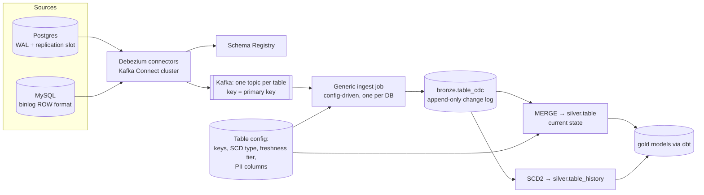

# Design a CDC Pipeline from 200 OLTP Tables into a Lakehouse


## Problem

The company runs its business on several Postgres and MySQL databases (~200 tables, the largest 3 TB). Analytics currently runs nightly `SELECT *` dumps that take 6 hours and load the production DBs. Design a replacement that delivers fresh, historised data to the lakehouse.

---

## Clarifying questions

| Question | Assumed answer |
|---|---|
| Freshness needed? | ≤ 15 min for most tables, ≤ 1 min for orders/payments |
| Change volume? | ~50 M row changes/day overall, bursts during batch jobs in the source (10× for 1 h) |
| History needed? | Yes: point-in-time ("what was the customer's tier on date X?") |
| Deletes? | Hard deletes happen in sources; must be reflected; GDPR deletes must propagate |
| Schema changes? | Weekly app deploys add columns; occasional renames |
| Can we change the source DBs? | We can enable logical replication / binlog; no app code changes |

## 1. Requirements

Low source impact; capture inserts/updates/**deletes**; current-state tables (SCD1) and history (SCD2); handle schema evolution; replay/backfill; monitoring of lag per table; onboarding a new table is config, not code.

## 2. Estimates

```
50M changes/day ≈ 600/s avg, 6k/s burst × ~1 KB = 6 MB/s → small for Kafka
Initial snapshot: ~10 TB total across DBs → incremental snapshots, throttled, over days
Silver MERGE cadence: 1–5 min micro-batches; history tables grow ~50M rows/day
```

## 3. Architecture



## 4. Data model

```sql
-- bronze change log: one row per change event (never updated)
bronze.orders_cdc (
  op STRING,                -- c, u, d, r (snapshot)
  pk STRING,                -- serialized primary key
  after STRUCT<...>, before STRUCT<...>,
  lsn BIGINT, tx_id BIGINT, source_ts TIMESTAMP,
  _kafka_offset BIGINT, _ingested_at TIMESTAMP
) PARTITIONED/CLUSTERED BY (ingest_date)

-- silver current state (SCD1): mirrors source + metadata
silver.orders (... source columns ..., _lsn BIGINT, _updated_at TIMESTAMP, _is_deleted BOOLEAN)

-- silver history (SCD2)
silver.orders_history (... columns ..., valid_from TIMESTAMP, valid_to TIMESTAMP, is_current BOOLEAN, _lsn BIGINT)
```

## 5. Deep dives

### 5.1 Config-driven generic pipeline

Writing 200 pipelines by hand doesn't scale. One parameterised job per database reads all its topics, with per-table config:

```yaml
- table: public.orders
  primary_key: [order_id]
  scd: [1, 2]                 # current + history
  freshness_tier: 1min
  sequence_by: lsn
  track_history_columns: [status, amount, shipping_address_id]   # SCD2 only on meaningful columns
  pii: [customer_email]
  soft_delete: true
```

Onboarding a table = PR to config + connector table include list. CI validates the config (keys exist, etc.).

### 5.2 Applying changes correctly

```sql
MERGE INTO silver.orders t
USING (
  SELECT after.*, op, lsn FROM batch_changes
  QUALIFY ROW_NUMBER() OVER (PARTITION BY pk ORDER BY lsn DESC) = 1
) s
ON t.order_id = s.order_id
WHEN MATCHED AND s.lsn <= t._lsn THEN UPDATE SET t._lsn = t._lsn   -- stale event, no-op (or filter out beforehand)
WHEN MATCHED AND s.op = 'd'      THEN UPDATE SET _is_deleted = true, _lsn = s.lsn, _updated_at = current_timestamp()
WHEN MATCHED                     THEN UPDATE SET *
WHEN NOT MATCHED AND s.op != 'd' THEN INSERT *;
```

- **Order by LSN**, never by timestamp.
- **Multiple changes per key in one micro-batch:** keep only the latest for SCD1; for SCD2 *every* change in order matters (next section).
- **Soft vs hard delete:** keep `_is_deleted` in silver for auditability; gold views filter it out. GDPR deletes are hard deletes handled by the deletion pipeline.

### 5.3 SCD2 from a change stream

```sql
-- 1) Within the micro-batch, give every change a validity interval (per key, in LSN order)
WITH ordered AS (
  SELECT pk, after.*, op, lsn,
         source_ts                                                   AS valid_from,
         LEAD(source_ts) OVER (PARTITION BY pk ORDER BY lsn)         AS next_ts
  FROM batch_changes
)
SELECT *,
       COALESCE(next_ts, TIMESTAMP '9999-12-31')                     AS valid_to,
       next_ts IS NULL                                               AS is_current
FROM ordered
WHERE op != 'd';     -- a delete creates no new version; it only closes the previous one (step 2)

-- 2) Close the currently open row in silver.orders_history for each pk in the batch:
--    valid_to = MIN(source_ts) of that pk's changes in this batch, is_current = false
-- 3) Insert the rows from step 1.
-- Skip changes where the hash of tracked columns equals the previous version's hash (no-op updates).
```

In Databricks this whole section is `AUTO CDC ... SEQUENCE BY lsn STORED AS SCD TYPE 2 TRACK HISTORY ON (status, amount)`. Know both the declarative and the hand-written version.

### 5.4 Initial load and backfill

- Debezium **incremental snapshots** (chunked by PK, interleaved with streaming changes, no long table locks), throttled to protect the source.
- Snapshot rows arrive as `op='r'`; MERGE treats them like inserts/updates; idempotency on `(pk, lsn)` makes overlap with streaming changes safe.
- For the 3 TB table, alternatively bulk-export from a **read replica** to Parquet, load to silver, then start CDC from the recorded LSN.

### 5.5 Schema evolution

| Source change | Handling |
|---|---|
| Add column | Registry accepts (backward compatible); ingest uses `mergeSchema`; silver gets new nullable column automatically |
| Drop column | Keep column in silver (nulls going forward); alert consumers |
| Rename | Appears as drop + add → detect via config/schema diff alerts; map explicitly |
| Type change | Widening OK; narrowing/incompatible → quarantine + alert, manual migration |

### 5.6 Monitoring

Per table: replication slot lag (bytes) at source, connector status, Kafka consumer lag, `now() − max(source_ts)` in silver (freshness by tier), row count reconciliation vs source (daily `COUNT(*)` on a replica), MERGE duration, quarantine counts.

## 6. Trade-offs

| Decision | Choice | Alternative |
|---|---|---|
| Capture method | Log-based (Debezium) | Managed (Fivetran/DMS/Datastream): less ops, more cost and less control; query-based misses deletes |
| Kafka in the middle | Yes | Direct connector → Delta (e.g. Debezium Server, managed CDC): fewer parts, but loses replay and fan-out |
| One job per DB vs per table | Per DB (multiplexed) | Per table: isolation but 200 clusters; middle ground: per freshness tier |
| History | SCD2 in silver for selected tables + Delta CDF for others | Snapshot tables daily: simpler but coarse and storage-heavy |

## 7. Failure modes

| Failure | Handling |
|---|---|
| Connector down → WAL accumulates on source | Alert on slot lag; `max_slot_wal_keep_size`; runbook; worst case drop slot + re-snapshot |
| Poison message (unparseable) | DLQ topic per connector, alert |
| MERGE conflicts (concurrent writers) | Single writer per table; or partition-aware merges |
| Source failover to a new primary | Debezium resumes on new primary (slot must exist there: logical replication failover slots / re-snapshot) |
| Rogue backfill in source updates 100M rows | Burst absorbed by Kafka; silver lag temporarily; autoscale ingest |

## 8. What separates a senior answer

- **Config-driven** design for 200 tables instead of 200 bespoke pipelines.
- Correct **ordering by LSN**, multi-change-per-batch handling, deletes.
- **Source safety**: replication slot lag can take down production.
- Initial snapshot strategy without hammering production.
- Schema evolution policy per change type.

## 9. Follow-up questions

<details><summary>How do you keep foreign-key consistency across tables in silver (orders without customers)?</summary>

CDC streams per table are independent, so momentary inconsistency is normal. Options: tolerate it in silver and handle in gold (late-arriving dimension → placeholder/"unknown" member, fixed on next run), process related tables in the same micro-batch with tx_id awareness for strict needs, or build gold on a slight delay (e.g. watermark of 5 minutes) so related changes have landed.
</details>

<details><summary>How would you answer "what did this order look like last Tuesday 10:00"?</summary>

Query silver.orders_history: `WHERE order_id = X AND valid_from <= ts AND ts < valid_to`. Or Delta time travel on silver.orders if within retention (but SCD2 is the durable, intentional history; time travel is for recovery).
</details>

<details><summary>Fivetran vs self-managed Debezium?</summary>

Managed: fast to start, connectors maintained, no Kafka ops; costs scale with rows (expensive at high volume), less control over latency/format. Debezium: cheaper at scale, flexible, Kafka fan-out, but you own operations (Connect cluster, upgrades, slot management). Many companies start managed and move hot/high-volume sources to self-managed.
</details>

---

## Self-assessment rubric

- [ ] Explained why log-based CDC over full dumps / updated_at
- [ ] Bronze change log + silver current + history layers
- [ ] MERGE logic with LSN ordering and deletes
- [ ] SCD2 derivation from changes
- [ ] Initial snapshot / backfill strategy with source protection
- [ ] Schema evolution handling
- [ ] Config-driven onboarding at 200-table scale
- [ ] Monitoring: slot lag, consumer lag, freshness, reconciliation
