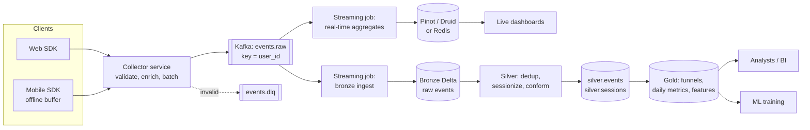
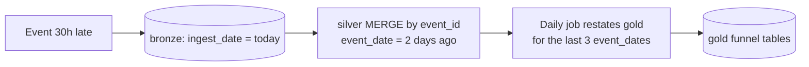

# Design a Real-Time Clickstream Analytics Platform

> **Try it first.** Set a 45-minute timer, draw on paper, talk out loud. Then compare with the reference answer below.

## Problem

An e-commerce company wants to track every user interaction on web and mobile (page views, searches, product clicks, add-to-cart, checkout) to:
1. Power live dashboards: active users per minute, trending products (last 15 min), conversion funnel.
2. Give analysts SQL access to full history.
3. Provide sessionized data for ML (recommendations) and product analytics.

---

## Clarifying questions (and the answers we'll assume)

| Question | Assumed answer |
|---|---|
| Event volume? | 500 M events/day, 3× peak during sales |
| Dashboard freshness? | < 1 minute |
| Exactness? | Dashboards may be approximate (±1%); analyst tables exact & deduplicated |
| Late events? | Mobile can buffer offline: up to 48 h late |
| Retention? | Raw 2 years queryable, aggregated forever |
| PII? | user_id, IP, device ids, all subject to GDPR deletion |
| Consumers? | Internal dashboards (~200 users), analysts (SQL), ML pipelines |

## 1. Requirements

**Functional:** collect events from web/iOS/Android; real-time metrics; sessionized history; funnel analytics; self-serve SQL.
**Non-functional:** < 1 min dashboard freshness; no data loss; dedup for analytics; GDPR deletion within 30 days; cost-conscious.

## 2. Estimates

```
500M/day ÷ 10⁵ ≈ 5k/s avg → 15k/s peak
1 KB JSON → 15 MB/s peak (≈ 4 MB/s Avro)
Kafka: 24–48 partitions (parallelism + growth), RF=3, 7-day retention ≈ 9 TB disk
Lake: 500 GB/day raw → ~70 GB/day Parquet → 2 yrs ≈ 50 TB (~$1.2k/month storage)
```
Conclusion: medium scale. Kafka + Spark Structured Streaming + Delta is enough. **Don't over-engineer.**

## 3. High-level architecture



**Walk one event:** user taps "add to cart" → SDK assigns `event_id` (UUID) + `client_ts` → collector adds `server_ts`, geo from IP (then drops raw IP), validates schema → Kafka partition by `user_id` → (a) real-time job updates per-minute counters in the OLAP store, (b) ingest job appends to bronze → silver job dedups by `event_id`, assigns `session_id` → gold funnel tables.

## 4. Data model

**Event (Avro, schema registry):**
```json
{ "event_id": "uuid", "event_type": "add_to_cart", "schema_version": 3,
  "user_id": "u_123", "anonymous_id": "a_987", "session_hint": "s_55",
  "client_ts": "2026-10-01T10:15:02.123Z", "server_ts": "2026-10-01T10:15:03.010Z",
  "platform": "ios", "app_version": "8.2.1", "page": "/p/shoes-42",
  "product_id": "p_42", "properties": {"price": "59.90", "currency": "EUR"},
  "geo": {"country": "DE", "city": "Berlin"} }
```

| Table | Grain | Key columns | Layout |
|---|---|---|---|
| `bronze.events` | 1 row per received event (may have dupes) | + `_kafka_partition, _kafka_offset, _ingested_at` | partition by `ingest_date` |
| `silver.events` | 1 row per unique `event_id` | event_date, user_id, session_id | cluster by (event_date, user_id) |
| `silver.sessions` | 1 row per session | session_id, user_id, start, end, n_events, converted | cluster by (session_date) |
| `gold.funnel_daily` | day × platform × country × step | users_at_step | small |
| `rt.metrics_minute` (OLAP) | minute × dimension | active_users (HLL), events | TTL 7 days |

## 5. Deep dives

### 5.1 Real-time aggregates

```python
events = (spark.readStream.format("kafka").option("subscribe", "events.raw")
          .option("maxOffsetsPerTrigger", 2_000_000).load()
          .select(from_avro("value", schema).alias("e")).select("e.*")
          .withColumn("event_time", col("client_ts").cast("timestamp")))

active = (events.withWatermark("event_time", "5 minutes")
          .groupBy(window("event_time", "1 minute"), "platform", "country")
          .agg(approx_count_distinct("user_id").alias("active_users"),
               count("*").alias("events")))

trending = (events.filter("event_type in ('product_click','add_to_cart')")
            .withWatermark("event_time", "5 minutes")
            .groupBy(window("event_time", "15 minutes", "1 minute"), "product_id")
            .agg(count("*").alias("interactions")))
```

- **Watermark 5 min** keeps state small; events later than that are excluded from *real-time* numbers but still land in bronze → corrected in batch.
- **Sliding window 15 min / 1 min slide** = each event updates 15 windows. Fine at this scale; at higher scale, compute per-minute counts and sum the last 15 at query time in the OLAP store (cheaper).
- **Serving store:** Pinot/Druid ingest directly from an aggregates Kafka topic and handle "top-N products in the last 15 minutes" with sub-second queries. Redis is fine if the dashboard only needs a handful of precomputed keys.

### 5.2 Deduplication and sessionization (silver)

Duplicates come from SDK retries and at-least-once delivery. Dedup on `event_id`:

```python
(spark.readStream.table("bronze.events")
   .withWatermark("event_time", "48 hours")              # max lateness we accept in streaming
   .dropDuplicatesWithinWatermark(["event_id"])
   .writeStream.foreachBatch(merge_events)               # MERGE ... WHEN NOT MATCHED INSERT (catches older dupes)
   .option("checkpointLocation", "/chk/silver_events").start())
```

Sessionization (30-min inactivity gap) is a classic gaps-and-islands problem. In batch SQL:

```sql
WITH ordered AS (
  SELECT *, LAG(event_time) OVER (PARTITION BY user_id ORDER BY event_time) AS prev_time
  FROM silver.events WHERE event_date BETWEEN :d - 1 AND :d
), flagged AS (
  SELECT *, CASE WHEN prev_time IS NULL
                  OR event_time > prev_time + INTERVAL 30 MINUTES THEN 1 ELSE 0 END AS new_session
  FROM ordered
)
SELECT *, user_id || '-' || SUM(new_session) OVER (PARTITION BY user_id ORDER BY event_time) AS session_id
FROM flagged;
```

In streaming: Spark `session_window(event_time, "30 minutes")` or `transformWithState` for custom logic. **Decision:** batch (hourly) sessionization is enough for analysts/ML; real-time session metrics aren't a requirement. Say this explicitly.

### 5.3 Late data and restatement



Partition bronze by **ingestion date** (writes never touch old partitions), model silver/gold by **event date**, and re-compute the trailing 3 days of gold daily. Dashboards mark the last 48 h as preliminary.

### 5.4 Collector & schema governance

- Collector validates against the registry; unknown event types/fields → DLQ with reason, alert if DLQ rate > 0.5%.
- Event **tracking plan** (which events, properties, owners) versioned in git; SDK codegen from schemas avoids typos (`addToCart` vs `add_to_cart`).
- Raw IP used for geo then dropped; user identifiers pseudonymised in silver for most consumers.

## 6. Trade-offs

| Decision | Chosen | Alternative | Why |
|---|---|---|---|
| Buffer | Kafka | Kinesis / Pub/Sub | Replay, fan-out, ecosystem; managed alternatives fine if cloud-native |
| Partition key | `user_id` | round-robin | Per-user ordering for sessionization; risk: bots/hot users → monitor, filter bots |
| Stream engine | Spark SS | Flink | Seconds latency suffices, unified with batch/Delta; Flink if sub-second |
| Real-time store | Pinot/Druid | Redis, query Delta directly | Sub-second slice-and-dice + top-N; Delta SQL would be seconds and costly at high concurrency |
| Distinct users | HLL | exact sets | State size; exact numbers come from batch |
| Sessionization | hourly batch | streaming session windows | No real-time requirement; simpler, cheaper |

## 7. Failure modes

| Failure | Detection | Handling |
|---|---|---|
| Collector overload on flash sale | p99 latency, 5xx | Autoscale, SDK retries with backoff, client-side buffering |
| Streaming job crash | Lag alert | Restart from checkpoint; idempotent sinks |
| Bad SDK release sends malformed events | DLQ rate spike, volume per app_version | Reject at collector, alert app team, fix + replay DLQ |
| Bot traffic inflates metrics | Anomaly on events/user | Bot filtering rules in silver; flag in real-time path |
| Duplicates | Uniqueness check on silver | Dedup by event_id (stream + MERGE) |

## 8. Scaling 10× (5 B events/day)

Kafka partitions 128+, tiered storage; pre-aggregate at the collector or in a first streaming stage (per-minute partials) before the OLAP store; Pinot real-time tables with star-tree index; compaction/liquid clustering on silver; consider Flink for the real-time tier if state grows; cost: move bronze older than 90 days to cold storage.

## 9. What separates a senior answer

- States that this is **medium scale** and avoids a 15-component design.
- Separates **approximate real-time** from **exact batch** and explains reconciliation.
- Partitions bronze by ingestion date and models by event date, which handles late data.
- Talks about **event governance** (tracking plan, schema registry, SDK codegen), which is where clickstream projects actually fail.
- Mentions **bots, PII and GDPR**.

## 10. Follow-up questions

<details><summary>How would you compute "users who viewed a product then purchased within 1 hour" in real time?</summary>

Keyed stateful processing by user_id: store recent product views in state with a 1h TTL/timer; on purchase, check for a matching view and emit. In Spark: `transformWithState`/`flatMapGroupsWithState`; in Flink: keyed process function with timers, or CEP pattern. In batch: self-join on user with time bounds.
</details>

<details><summary>Kafka partition 7 has 10× the lag of others. Why?</summary>

Hot key: a bot or a load-test account keyed to that partition, or a misbehaving client sending a flood. Check top keys on that partition. Mitigate: filter/rate-limit bots at the collector, salt the key for the aggregation path, or re-key by `event_id` for paths that don't need per-user order.
</details>

<details><summary>How do you support GDPR deletion here?</summary>

Deletion request table → daily batch DELETE from silver/gold by user_id (and anonymous_id links), deletion vectors + purge + VACUUM within the retention SLA; bronze either crypto-shredded (per-user key for PII fields) or limited retention; OLAP store has short TTL (7 days) so it ages out; ML feature tables rebuilt.
</details>

<details><summary>Why not have clients write straight to Kafka?</summary>

Security (no broker credentials on devices), validation, enrichment, rate limiting, batching/compression, and protocol (HTTP from browsers/mobile). The collector is a thin, horizontally scalable, stateless layer.
</details>

---

## Self-assessment rubric

- [ ] Asked about freshness, volume, lateness, exactness, PII before designing
- [ ] Estimated rate & storage and drew a conclusion from the numbers
- [ ] Clear diagram with real-time and batch paths, technologies justified
- [ ] Event schema includes event_id, client/server timestamps, schema version
- [ ] Explained dedup strategy (event_id, watermark + MERGE)
- [ ] Handled late data (watermarks + restatement, ingest vs event date)
- [ ] Explained sessionization logic
- [ ] Chose a serving store with reasons
- [ ] Covered failure modes and monitoring (lag, DLQ rate, volume)
- [ ] Mentioned governance: tracking plan, PII, GDPR
