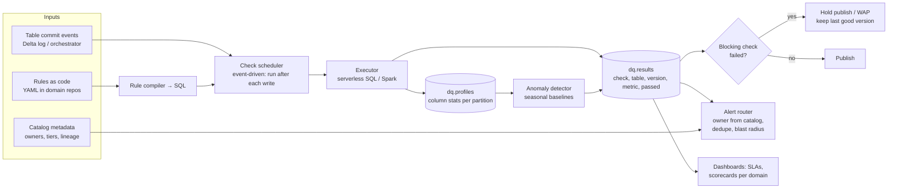

# Design a Data Quality and Observability Platform

## Problem

The company has 3,000 tables across many domains. Incidents ("the dashboard was wrong for 3 days and nobody noticed") are frequent. Design a platform that lets every team define checks, detects anomalies automatically, prevents bad data from reaching consumers, and routes alerts to owners.

---

## Clarifying questions

| Question | Assumed answer |
|---|---|
| Stack? | Lakehouse (Delta) + dbt + Airflow/Workflows; some Kafka streams |
| Who defines rules? | Table owners; platform provides defaults |
| Blocking? | Critical tables must block publishing on failure |
| Scale of checks? | ~3,000 tables × ~10 checks → 30k checks/day, some hourly |
| Existing tooling? | dbt tests on some models; no central view |

## 1. Requirements

- Default checks for every table without configuration (freshness, volume, schema drift).
- Declarative custom rules (YAML/SQL) versioned in git.
- Severity levels: warn / quarantine / block.
- Anomaly detection with seasonality.
- Results stored as data: trends, SLA reports, scorecards.
- Alert routing via ownership metadata; blast radius via lineage.
- Low compute cost (don't full-scan 200 TB tables hourly).

## 2. Architecture



## 3. Deep dives

### 3.1 Rule specification

```yaml
table: gold.finance.daily_revenue
tier: 1                         # tier drives defaults: tier-1 = blocking + paging
owner: team-finance-data
checks:
  - freshness: {max_delay: 2h, column: updated_at}
  - row_count_anomaly: {sensitivity: medium}
  - unique: [revenue_date, country]
  - not_null: [revenue_date, country, revenue_eur]
  - sql: "SELECT COUNT(*) FROM {table} WHERE revenue_eur < 0"
    expect: 0
    severity: block
  - reconcile:
      against: "SELECT SUM(amount) FROM silver.payments WHERE date = {date}"
      metric: "SUM(revenue_eur)"
      tolerance_pct: 0.5
      severity: block
```

The compiler turns each rule into SQL scoped to **the partition/version just written** (incremental), not the whole table.

### 3.2 Event-driven execution

Checks run **right after a write commits** (orchestrator hook, Delta commit listener, dbt post-hook), on the new data only (Delta CDF or partition filter). Freshness checks are the exception: they run on a schedule because the failure mode is "nothing happened".

### 3.3 Anomaly detection

- Metrics per table/partition: row count, null %, distinct count, min/max/mean per numeric column, category distribution.
- Baseline: same weekday over the last 4–8 weeks (seasonality), robust stats (median/MAD) or simple forecasting (Prophet/ETS) per metric.
- Alert if outside band for N consecutive runs; feedback buttons ("expected: holiday") tune sensitivity.
- Start conservative: noisy alerts kill adoption faster than missing ones.

### 3.4 Write-Audit-Publish integration

For tier-1 tables, pipelines write to a staging table/branch, the platform runs blocking checks, and only then is the data swapped/merged into the production table. Consumers never see failed data; they see the last good version plus a freshness warning.

### 3.5 Alert routing and blast radius

Alert = table, check, observed vs expected, sample failing rows (masked), owner, **downstream impact from lineage** ("affects 3 dashboards incl. Exec Revenue, 2 ML models"), runbook link. Deduplicate: one incident per root table, not 40 alerts for every downstream table.

## 4. Trade-offs

| Decision | Choice | Alternative |
|---|---|---|
| Build vs buy | Thin platform on open tools (dbt tests, Great Expectations/Soda, Lakehouse Monitoring) + custom results store | Vendor (Monte Carlo, Bigeye): fastest, cost per table |
| Rules location | In domain repos, next to pipeline code | Central repo (bottleneck) |
| Execution | Incremental, event-driven | Full scans on cron (cost, latency) |
| Anomaly model | Seasonal robust baselines | Complex ML (hard to explain, tune) |

## 5. What separates a senior answer

- **Defaults for every table** + tiering, which is how you get coverage without asking 50 teams to write YAML.
- **Incremental, event-driven** checks for cost and latency.
- **WAP gating** for critical tables.
- **Results as data** → SLAs, scorecards, trend analysis.
- **Alert quality**: lineage-based dedup, ownership routing, low noise.

## 6. Follow-up questions

<details><summary>How do you get teams to actually adopt it?</summary>

Zero-config defaults that catch real incidents in week one; dbt test results ingested automatically (meet them where they are); domain scorecards visible to leadership; tier-1 policy (must have owner + blocking checks); templates and office hours; measure and publicise incidents caught.
</details>

<details><summary>How would you check quality on a Kafka stream?</summary>

Schema validation at the registry; a lightweight streaming job computing per-minute metrics (volume, null rates, invalid enum counts, lateness distribution) into the same results store; anomaly detection on those series; DLQ rate monitoring. Blocking happens via quarantine routing rather than WAP.
</details>

---

## Self-assessment rubric

- [ ] Default checks + tiering for coverage at scale
- [ ] Declarative rules with severity levels
- [ ] Incremental / event-driven execution
- [ ] Seasonal anomaly detection
- [ ] WAP / blocking for critical tables
- [ ] Results store, SLA reporting
- [ ] Ownership routing, lineage blast radius, alert dedup
